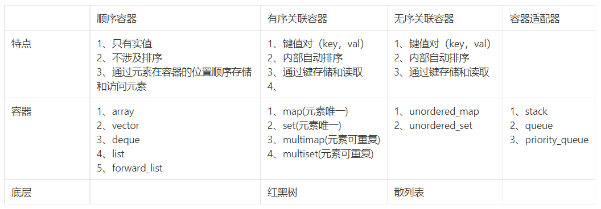

# STL 
## Containers

### 概述

1. **array:**  
（1）名称和迭代器：数组、顺序  
（2）数据结构：连续存储的固定大小数组  
（3）迭代器失效：固定长度，不会失效  
（4）插入：不支持插入   
（5）删除：不支持删除   
（6）查找算法：O(1)   
（7）特点：类似于数组，固定长度，不担心越界，但内容在栈上，属于定长容器。   
（8）适用场景：需要固定大小且不担心越界的情况。 

2. **string:**  
（1）名称和迭代器：字符串、顺序、随机访问  
（2）数据结构：字符序列  
（3）迭代器失效：插入操作失效，删除不会失效  
（4）插入：尾端O(1)，非尾端O(N-P)  
（5）删除：尾端O(1)，非尾端O(N-P)  
（6）查找算法：O(1)  
（7）特点：支持随机访问，但插入和删除操作可能导致迭代器失效。  
（8）适用场景：需要字符串处理和随机访问，但不频繁插入和删除。 

3. **vector:**  
（1）名称和迭代器：向量、顺序、随机访问  
（2）数据结构：连续存储的数组  
（3）迭代器失效：插入和删除都会失效  

4. **string:**  
（1）名称和迭代器：字符串、顺序、随机访问  
（2）数据结构：字符序列  
（3）迭代器失效：插入操作失效，删除不会失效  
（4）插入：尾端O(1)，非尾端O(N-P)  
（5）删除：尾端O(1)，非尾端O(N-P)  
（6）查找算法：O(1)  
（7）特点：支持随机访问，但插入和删除操作可能导致迭代器失效。  
（8）适用场景：需要字符串处理和随机访问，但不频繁插入和删除。   

5. **stack:**  
（1）名称和迭代器：栈（容器适配器）  
（2）数据结构：栈  
（3）迭代器失效：不支持迭代器  
（4）插入：只能尾端入，O(1)  
（5）删除：只能尾端删除，O(1)  
（6）查找算法：不支持  
（7）特点：实现FILO（先进后出）操作，底层容器可以是list、vector或deque。  
（8）适用场景：需要实现栈数据结构的需求。  

6. **map:**  
（1）名称和迭代器：映射/多重映射(有序关联）双向  
（2）数据结构：红黑树  
（3）迭代器失效：删除时只是被删除节点的迭代器失效，但迭代器返回void，所以需要保存删除前迭代器位置。  
（4）插入：O(logN)  
（5）删除：O(logN)  
（6）查找算法：O(logN)  
（7）特点：用于将键有序关联到值，支持有序关联，键唯一。  
（8）适用场景：需要键有序关联到值，查找/删除/插入性能一样的情况。  

7. **multimap:**  
（1）名称和迭代器：映射/多重映射(有序关联）双向  
（2）数据结构：红黑树  
（3）迭代器失效：删除时只是被删除节点的迭代器失效，但迭代器返回void，所以需要保存删除前迭代器位置。  
（4）插入：O(logN)  
（5）删除：O(logN)  
（6）查找算法：O(logN)  
（7）特点：用于将键有序关联到值，支持有序关联，键可以不唯一。  
（8）适用场景：需要键有序关联到值，查找/删除/插入性能一样的情况。  

8. **set:**  
（1）名称和迭代器：集合/多重集合（有序关联）双向  
（2）数据结构：红黑树  
（3）迭代器失效：删除时只是被删除节点的迭代器失效，但迭代器返回void，所以需要保存删除前迭代器位置。  
（4）插入：O(logN)  
（5）删除：O(logN)  
（6）查找算法：O(logN)  
（7）特点：用于存储有序唯一元素，键和值相等。  
（8）适用场景：需要有序唯一元素的情况。  

9. **multiset:**  
（1）名称和迭代器：集合/多重集合（有序关联）双向  
（2）数据结构：红黑树  
（3）迭代器失效：删除时只是被删除节点的迭代器失效，但迭代器返回void，所以需要保存删除前迭代器位置。  
（4）插入：O(logN)  
（5）删除：O(logN)  
（6）查找算法：O(logN)  
（7）特点：用于存储有序多重元素，键和值相等。  
（8）适用场景：需要有序多重元素的情况。  

10. **unordered_map:**  
（1）名称和迭代器：无序集合（无序关联/哈希表）单向  
（2）数据结构：哈希表  
（3）迭代器失效：插入和删除失效，最差情况下为O(N)。  
（4）插入：平均O(1)，最差O(N)  
（5）删除：平均O(1)，最差O(N)   
（6）查找算法：平均O(1)，最差O(N)  
（7）特点：用于不需要元素有序排列，但需要快速查找、插入和删除的情况。  
（8）适用场景：无序关联容器，平均情况下性能良好。  

11. **unordered_set:**  
（1）名称和迭代器：无序映射（无序关联/哈希表）单向  
（2）数据结构：哈希表  
（3）迭代器失效：插入和删除失效，最差情况下为O(N)。  
（4）插入：平均O(1)，最差O(N)  
（5）删除：平均O(1)，最差O(N)  
（6）查找算法：平均O(1)，最差O(N)  
（7）特点：用于不需要元素有序排列，但需要快速查找、插入和删除的情况。  
（8）适用场景：无序关联容器，平均情况下性能良好。  

12. **deque:**  
（1）名称和迭代器：双向队列、顺序、随机访问  
（2）数据结构：连续或分段连续存储的数组  
（3）迭代器失效：插入失效，删除头和尾元素，指向被删除节点迭代器失效，删除中间元素会使所有迭代器失效  
（4）插入：首尾端O(1)，非首尾端O(min(p, N-P))  
（5）删除：首尾端O(1)，非首尾端O(min(p, N-P))  
（6）查找算法：O(1)  
（7）特点：高效支持首尾端的插入和删除操作，但在非首尾端操作效率较低。  
（8）适用场景：首尾端操作频繁的需求。  

13. **list:**  
（1）名称和迭代器：列表容器、顺序、双向  
（2）数据结构：双向环状链表  
（3）迭代器失效：被删除节点自身失效，插入不失效  
（4）插入：O(1)  
（5）删除：O(1)  
（6）查找算法：O(N)  
（7）特点：适用于频繁插入和删除，但不需要快速查找的场景。  
（8）适用场景：需要频繁插入和删除操作，不需要快速查找的情况。  

14. **forward_list:**  
（1）名称和迭代器：前向列表、顺序、单向  
（2）数据结构：单向链表  
（3）迭代器失效：被删除节点自身失效，插入不失效  
（4）插入：O(1)  
（5）删除：O(1)  
（6）查找算法：O(N)  
（7）特点：类似于list，但只支持向前迭代。  
（8）适用场景：需要list的优势，但只要向前迭代的情况。  

15. **queue:**  
（1）名称和迭代器：队列（容器适配器）  
（2）数据结构：队列  
（3）迭代器失效：不支持迭代器  
（4）插入：只能尾端入，O(1)  
（5）删除：只能首端删除，O(1)  
（6）查找算法：不支持  
（7）特点：实现FIFO（先进先出）操作，底层容器可以是list或deque。  
（8）适用场景：需要实现队列数据结构的需求。  

16. **priority_queue:**  
（1）名称和迭代器：优先、队列（容器适配器）  
（2）数据结构：队列  
（3）迭代器失效：不支持迭代器   
（4）插入：只能尾端入，O(logN)  
（5）删除：只能首端删除，O(logN)  
（6）查找算法：不支持  
（7）特点：实现优先级队列，底层容器可以是vector或deque。  
（8）适用场景：需要实现优先级队列的需求。      