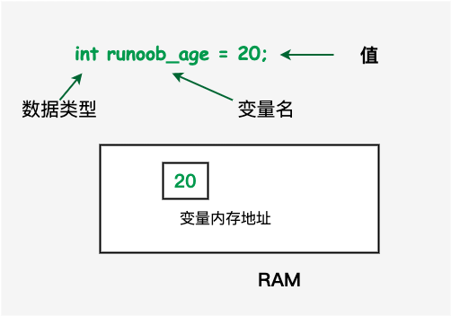
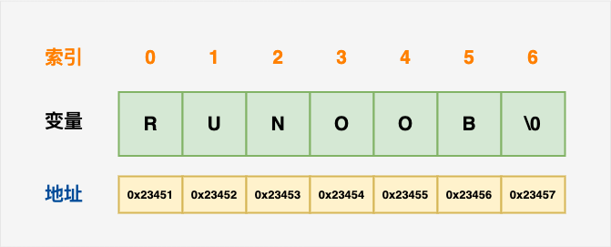

# 基础知识


## 程序结构、编译 & 执行
### 程序结构
```cpp
#include <iostream>
using namespace std;
 
// main() 是程序开始执行的地方
 
int main()
{
   cout << "Hello World"; // 输出 Hello World
   return 0;
}
```
### 编译、执行
```bash
$ g++ hello.cpp
$ ./a.out
$ Hello World

```
## 数据类型、变量类型


:width:`250px`

### 内置类型
1、bool: 布尔类型，存储值 true 或 false，占用 1 个字节。

2、char: 字符类型，用于存储 ASCII 字符，通常占用 1 个字节。

3、int: 整数类型，通常用于存储普通整数，通常占用 4 个字节。

4、float: 单精度浮点值，用于存储单精度浮点数。单精度的格式为 1 位符号，8 位指数，23 位小数，通常占用 4 个字节。

5、double: 双精度浮点值，用于存储双精度浮点数。双精度的格式为 1 位符号，11 位指数，52 位小数，通常占用 8 个字节。

6、void: 表示类型的缺失。

7、wchar_t: 宽字符类型，用于存储更大范围的字符，通常占用 2 个或 4 个字节。

**完整版如下：**
 \begin{tabular}{|l|l|l|}
 \hline
 类型 & 范围 & 字节大小 \\
 \hline
 char & -128 到 127 或者 0 到 255 & 1 个字节 \\
 \hline
 unsigned char & 0 到 255 & 1 个字节 \\
 \hline
 signed char & -128 到 127 & 1 个字节 \\
 \hline
 int & -2147483648 到 2147483647 & 4 个字节 \\
 \hline
 unsigned int & 0 到 4294967295 & 4 个字节 \\
 \hline
 signed int & -2147483648 到 2147483647 & 4 个字节 \\
 \hline
 short int & -32768 到 32767 & 2 个字节 \\
 \hline
 unsigned short int & 0 到 65,535 & 2 个字节 \\
 \hline
 signed short int & -32768 到 32767 & 2 个字节 \\
 \hline
 long int & -9,223,372,036,854,775,808 到 9,223,372,036,854,775,807 & 8 个字节 \\
 \hline
 signed long int & -9,223,372,036,854,775,808 到 9,223,372,036,854,775,807 & 8 个字节 \\
 \hline
 unsigned long & 0 到 18,446,744,073,709,551,615 & 8 个字节 \\
 \hline
 float & +/- 3.4e +/- 38 (~7 个数字) & 4 个字节 \\
 \hline
 double & +/- 1.7e +/- 308 (~15 个数字) & 8 个字节 \\
 \hline
 long double & 可提供18-19位有效数字 & 16 个字节 \\
 \hline
 wchar\_t & 1 个宽字符 & 2 或 4 个字节 \\
 \hline
\end{tabular}

C++ 也允许定义各种其他类型的变量，比如**枚举、指针、数组、引用、数据结构、类**等等。

1. 整数类型（Integer Types）：
  - `int`：用于表示整数，通常占用4个字节。
```
int number = 10;
```
   - `short`：用于表示短整数，通常占用2个字节。
```
short count = 5;
```
   - `long`：用于表示长整数，通常占用4个字节。  

```
long population = 1000000;
```
   - `long long`：用于表示更长的整数，通常占用8个字节。

```
long long distance = 1000000000;
```

2. 浮点类型（Floating-Point Types）：
   - `float`：用于表示单精度浮点数，通常占用4个字节。
    ```
    float pi = 3.14f;
    ```
   - `double`：用于表示双精度浮点数，通常占用8个字节。
    ```
    double gravity = 9.8;
    ```
   - `long double`：用于表示更高精度的浮点数，占用字节数可以根据实现而变化。
    ```
    long double temperature = 37.5;
    ```
3. 字符类型（Character Types）：
   - `char`：用于表示字符，通常占用1个字节。
    ```
    char letter = 'A';
    ```
   - `wchar_t`：用于表示宽字符，通常占用2或4个字节。     
    ```
    wchar_t chineseCharacter = L'中';
    ```
   - `char16_t`：用于表示16位Unicode字符，占用2个字节。
    ```
    char16_t emoji = u'😊';
    ```
   - `char32_t`：用于表示32位Unicode字符，占用4个字节。
    ```
    char32_t emoji = U'😊';
    ```
4. 布尔类型（Boolean Type）：
   - `bool`：用于表示布尔值，只能取`true`或`false`。
    ```
    bool isTrue = true;
    ```
5. 枚举类型（Enumeration Types）：
   - `enum`：用于定义一组命名的整数常量。
    ```
    enum Color { RED, GREEN, BLUE };
    Color selectedColor = GREEN;
    ```
6. 指针类型（Pointer Types）：
   - `type*`：用于表示指向类型为`type`的对象的指针。
    ```
    int* ptr = nullptr;
    ```
7. 数组类型（Array Types）：
   - `type[]`或`type[size]`：用于表示具有相同类型的元素组成的数组。
    ```
    int numbers[] = {1, 2, 3, 4, 5};
    ```
8. 结构体类型（Structure Types）：
   - `struct`：用于定义包含多个不同类型成员的结构。
    ```
    struct Person {
        std::string name;
        int age;
    };
    Person john;
    john.name = "John Doe";
    john.age = 25;
    ```
9. 类类型（Class Types）：
   - `class`：用于定义具有属性和方法的自定义类型。
    ```
    class Rectangle {
    private:
        int width;
        int height;
    public:
        Rectangle(int w, int h) : width(w), height(h) {}
        int getArea() {
            return width * height;
        }
    };
    Rectangle rect(5, 10);
    int area = rect.getArea();
    ```
10. 共用体类型（Union Types）：
    - `union`：用于定义一种特殊的数据类型，它可以在相同的内存位置存储不同的数据类型。
    ```
    union Data {
        int intValue;
        float floatValue;
        char charValue;
    };
    Data data;
    data.intValue = 10;
    int value = data.intValue;
    ```

## 数组

### 一维数组声明和初始化：


:width:`250px`

```cpp
double balance[10];//声明
double balance[5] = {1000.0, 2.0, 3.4, 7.0, 50.0};//初始化
double balance[] = {1000.0, 2.0, 3.4, 7.0, 50.0};//初始化
balance[4] = 50.0;//修改
```

### 多维数组


:width:`250px`

```cpp
int a[3][4] = {  
 {0, 1, 2, 3} ,   /*  初始化索引号为 0 的行 */
 {4, 5, 6, 7} ,   /*  初始化索引号为 1 的行 */
 {8, 9, 10, 11}   /*  初始化索引号为 2 的行 */
};//初始化
int a[3][4] = {0,1,2,3,4,5,6,7,8,9,10,11};//初始化
int val = a[2][3];//第 3 行第 4 个元素
```

## 字符串

### 定义

```cpp
char site[7] = {'R', 'U', 'N', 'O', 'O', 'B', '\0'};
char site[10]="RUNOOB";
char site[] = "RUNOOB";////系统计算大小为7

```



:width:`250px`

### 常用函数

| 1    | **strcpy(s1, s2);** 复制字符串 s2 到字符串 s1。              |
| ---- | ------------------------------------------------------------ |
| 2    | **strcat(s1, s2);** 连接字符串 s2 到字符串 s1 的末尾。连接字符串也可以用 **+** 号，例如: `string str1 = "runoob"; string str2 = "google"; string str = str1 + str2;` |
| 3    | **strlen(s1);** 返回字符串 s1 的长度。                       |
| 4    | **strcmp(s1, s2);** 如果 s1 和 s2 是相同的，则返回 0；如果 s1<s2 则返回值小于 0；如果 s1>s2 则返回值大于 0。 |
| 5    | **strchr(s1, ch);** 返回一个指针，指向字符串 s1 中字符 ch 的第一次出现的位置。 |
| 6    | **strstr(s1, s2);** 返回一个指针，指向字符串 s1 中字符串 s2 的第一次出现的位置。 |

字符数组取长度符号对比：

- sizeof(b)/sizeof(b[0]) 这样会计算包括'\0'的长度
- strlen() 只会计算真实数据的长度 所以  长度为 sizeof（）-1

### String 类

支持上述所有的操作，另外还增加了其他更多的功能。

```cpp
#include <iostream>
#include <string>
using namespace std;
int main ()
{
   string str1 = "runoob";
   string str2 = "google";
   string str3;
   int  len ;
   // 复制 str1 到 str3
   str3 = str1;
   cout << "str3 : " << str3 << endl;
   // 连接 str1 和 str2
   str3 = str1 + str2;
   cout << "str1 + str2 : " << str3 << endl;
   // 连接后，str3 的总长度
   len = str3.size();
   cout << "str3.size() :  " << len << endl;
 
   return 0;
}
```

## 数据结构

### 结构体

为了访问结构的成员，我们使用**成员访问运算符（.）**。成员访问运算符是结构变量名称和我们要访问的结构成员之间的一个句号。

```cpp
#include <iostream>
#include <cstring>
 
using namespace std;
 
// 声明一个结构体类型 Books 
struct Books
{
   char  title[50];
   char  author[50];
   char  subject[100];
   int   book_id;
};
 
int main( )
{
   Books Book1;        // 定义结构体类型 Books 的变量 Book1
   Books Book2;        // 定义结构体类型 Books 的变量 Book2
   // Book1 详述
   strcpy( Book1.title, "C++ 教程");
   strcpy( Book1.author, "Runoob"); 
   strcpy( Book1.subject, "编程语言");
   Book1.book_id = 12345;
 
   // 输出 Book1 信息
   cout << "第一本书标题 : " << Book1.title <<endl;
   cout << "第一本书作者 : " << Book1.author <<endl;
   cout << "第一本书类目 : " << Book1.subject <<endl;
   cout << "第一本书 ID : " << Book1.book_id <<endl;
   return 0;
}
```

### typedef 关键字

为创建的类型取一个"别名"

```cpp
typedef struct Books
{
   char  title[50];
   char  author[50];
   char  subject[100];
   int   book_id;
}Books;

```

现在，可以直接使用 *Books* 来定义 *Books* 类型的变量，而不需要使用 struct 关键字。下面是实例：

```cpp
Books Book1, Book2;
```

可以使用 **typedef** 关键字来定义非结构类型，如下所示：

```cpp
typedef long int *pint32;
 
pint32 x, y, z;
```

x, y 和 z 都是指向长整型 long int 的指针。

## 指针

### 定义

```cpp
type *var-name;
int    *ip;    /* 一个整型的指针 */
double *dp;    /* 一个 double 型的指针 */
int  *ptr = NULL;//Null 指针,ptr 的值是 0
```

### 运算

使用指针代替数组，因为变量指针可以递增，而数组不能递增，因为数组是一个常量指针。同样地，对指针进行递减运算，即把值减去其数据类型的字节数。

指针可以用关系运算符进行比较，如 ==、< 和 >。如果 p1 和 p2 指向两个相关的变量，比如同一个数组中的不同元素，则可对 p1 和 p2 进行大小比较。

```cpp
#include <iostream>
 
using namespace std;
const int MAX = 3;
 
int main ()
{
   int  var[MAX] = {10, 100, 200};
   int  *ptr;
   // 指针中的数组地址
   ptr = var;
   for (int i = 0; i < MAX; i++)
   {
      cout << "Address of var[" << i << "] = ";
      cout << ptr << endl;
 
      cout << "Value of var[" << i << "] = ";
      cout << *ptr << endl;
      // 移动到下一个位置
      ptr++;
   }
   
   // 指针中最后一个元素的地址
   ptr = &var[MAX-1];
   for (int i = MAX; i > 0; i--)
   {
      cout << "Address of var[" << i << "] = ";
      cout << ptr << endl;
 
      cout << "Value of var[" << i << "] = ";
      cout << *ptr << endl;
 
      // 移动到下一个位置
      ptr--;
   }
   
   
   // 指针中第一个元素的地址
   ptr = var;
   int i = 0;
   while ( ptr <= &var[MAX - 1] )
   {
      cout << "Address of var[" << i << "] = ";
      cout << ptr << endl;
 
      cout << "Value of var[" << i << "] = ";
      cout << *ptr << endl;
 
      // 指向上一个位置
      ptr++;
      i++;
   }
   return 0;
}
   
```


### 指针数组

可能有一种情况，我们想要让**数组存储**指向 int 或 char 或其他数据类型的**指针**。下面是一个指向整数的指针数组的声明：

```
int *ptr[MAX];
```

在这里，把 **ptr** 声明为一个数组，由 MAX 个整数指针组成。因此，ptr 中的每个元素，都是一个指向 int 值的指针。下面的实例用到了三个整数，它们将存储在一个指针数组中。

```cpp
#include <iostream>
 
using namespace std;
const int MAX = 3;
 
int main ()
{
   int  var[MAX] = {10, 100, 200};
   int *ptr[MAX];
 
   for (int i = 0; i < MAX; i++)
   {
      ptr[i] = &var[i]; // 赋值为整数的地址
   }
   for (int i = 0; i < MAX; i++)
   {
      cout << "Value of var[" << i << "] = ";
      cout << *ptr[i] << endl;
   }
   return 0;
}
```

也可以用一个指向字符的指针数组来存储一个字符串列表。

```cpp
#include <iostream>
 
using namespace std;
const int MAX = 4;
 
int main ()
{
 const char *names[MAX] = {
                   "Zara Ali",
                   "Hina Ali",
                   "Nuha Ali",
                   "Sara Ali",
   };
 
   for (int i = 0; i < MAX; i++)
   {
      cout << "Value of names[" << i << "] = ";
      cout << names[i] << endl;
   }
   return 0;
}
```

### 数组指针
数组指针是一个指针，它指向一个数组。下面是一个示例代码，演示如何声明和使用数组指针：
```cpp
#include <iostream>

using namespace std;
const int MAX = 3;

int main ()
{
    int var[MAX] = {10, 100, 200};
    int (*ptr)[MAX]; // 声明一个指向包含MAX个整数的数组的指针

    ptr = &var; // 将指针指向数组var

    for (int i = 0; i < MAX; i++)
    {
        cout << "Value of var[" << i << "] = ";
        cout << (*ptr)[i] << endl; // 使用指针访问数组元素
    }
    return 0;
}
```

在这个示例中，我们声明了一个指向包含MAX个整数的数组的指针 `int (*ptr)[MAX];`，然后将它指向了数组 `var`。接下来，我们使用指针 `ptr` 来访问数组 `var` 中的元素。

这就是数组指针的基本用法。需要注意的是，要使用 `(*ptr)[i]` 的方式来访问数组元素，因为 `ptr` 是一个指向数组的指针。

### 指针数组vs数组指针

1. 数组指针：

   - 数组指针是一个指向数组的指针变量。

   - 它实际上是一个指针，该指针指向一个数组的首元素。

   - 可以使用数组指针来访问数组中的元素。

   - 示例：

```cpp
codeint arr[5] = {1, 2, 3, 4, 5};
int (*ptr)[5]; // 声明一个指向包含5个整数的数组的指针
ptr = &arr;    // 将指针指向数组arr
```

```cpp
//指向：数组为10个int型的元素,int (*p)[10],相当于 int p[][10]二维数组就是数组指针
a+i == p+i       
a[i] == p[i] == *(a+i) == *(p+i)
a[i][j] == p[i][j] == *(a[i]+j) == *(p[i]+j) == *(*(a+i)+j) == *(*(p+i)+j)
```

2. 指针数组：

   - 指针数组是一个数组，其元素都是指针变量。

   - 它实际上是一个数组，每个元素都指向不同的对象，例如不同的整数数组或字符串。

   - 用于处理多个指向不同对象的指针。

   - 示例：

```cpp
codeint arr1[3] = {1, 2, 3};
int arr2[4] = {4, 5, 6, 7};
int arr3[2] = {8, 9};
int* ptrArr[3]; // 声明一个包含3个整型指针的数组
ptrArr[0] = arr1; // 第一个元素指向arr1
ptrArr[1] = arr2; // 第二个元素指向arr2
ptrArr[2] = arr3; // 第三个元素指向arr3
```

```
//指向：10个int 型的指针,int  *p[10]== int *(p[10])  因为[ ]的优先级大于 * 所以p和[ ]结合
int a[10] = { 1,2,3,4,5,6,7,8,9 };
int* p[10];//指针数组  含有 10个 int型指针
p[0] = &a[0]; //p[0]指向a[0]的地址
p[1] = &a[1]; //p[1]指向a[1]的地址
cout << *(p[0]) << endl;//输出a[0]的值
cout << *(p[0] + 1) << endl;//输出a[2]的值
cout << *(p[1]) << endl;//输出a[2]的值
//存储一个字符串列表
const char *p[4] = { "aaaa","bbbb","cccc","dddd" };
for (int i = 0; i < 4; i++)
{
cout << p[i] << endl;//输出字符串
    cout<<*(p[i])<< endl;//输出单个字符
}
```

### 指针常量 vs 常量指针

```cpp
const int *p  ，int const *p2   指向常量的指针  （的值不能变，指向可以变）
int *const p3    指针常量  （值能变，指向不可以变）（&的本质）

判别方法：看const 位于 * 的位置
const *  左边  常量指针
const  右边  指针常量
```

```cpp
//const int *p：int const *p2 ：（指向常量的指针）
    int a[10] = { 0 };
	int b[10] = { 1 * 10 };
	const int *p = a;
	cout << *p << endl;
	*p = 20;  // *p值不能改变(报错)
	a[0] = 2; //数组可以修改
	p = b;   // 指向可以改变
	int const* p = a;
	*p = 20;//常量指针 值不能改变(报错)
	p = b; //常量指针 指向可以改变
	a[0] = 2; //数组可以修改
	
//int *const p2 ：（ 指针常量 ）
	int a[10] = { 0 };
	int b[10] = { 1 * 10 };
	int * const p = a;
	cout << *p << endl;
	*p = 20;//指针常量 值可以改变
    a[0] = 30;//数组的值可以修改
	p = b; //指针常量 指向不可以改变（报错）
```


### 指针 vs 数组

指针和数组是密切相关的。事实上，指针和数组在很多情况下是可以互换的。对于一维数组和指针：

1. 数组名是数组的首地址
2. 数组名是一个常指针 不可修改
3. 可以对指针操作来访问元素

数组地址表示方法：

1. 用数组名： a==&a[0]   a+1==&a[1]   a+2==&a[2]
2. 用取地址符：&a[0]  &a[1]

例如，一个指向数组开头的指针，可以通过使用指针的算术运算或数组索引来访问数组。

```cpp
#include <iostream>
using namespace std;
const int MAX = 3;
int main ()
{
   int  var[MAX] = {10, 100, 200};
   int  *ptr;
   // 指针中的数组地址
   ptr = var;
   for (int i = 0; i < MAX; i++)
   {
      cout << "var[" << i << "]的内存地址为 ";
      cout << ptr << endl;
      cout << "var[" << i << "] 的值为 ";
      cout << *ptr << endl;
      // 移动到下一个位置
      ptr++;
   }
   return 0;
}
```

然而，指针和数组并不是完全互换的。把指针运算符 * 应用到 var 上是完全可以的，但修改 var 的值是非法的。这是因为 var 是一个指向数组开头的常量，不能作为左值。

```cpp
#include <iostream> 
using namespace std;
const int MAX = 3;
int main ()
{
   int  var[MAX] = {10, 100, 200};
   for (int i = 0; i < MAX; i++)
   {
      *var = i;    // 这是正确的语法
      var++;       // 这是不正确的
   }
   return 0;
}
```

由于一个数组名对应一个指针常量，只要不改变数组的值，仍然可以用指针形式的表达式。只要不更改var这个变量，就是正常的。

```cpp
*(var + 2) = 500;
```


### 指针 vs 引用

引用很容易与指针混淆，它们之间有三个主要的不同：

- 不存在空引用。引用必须连接到一块合法的内存。
- 一旦引用被初始化为一个对象，就不能被指向到另一个对象。指针可以在任何时候指向到另一个对象。
- 引用必须在创建时被初始化。指针可以在任何时间被初始化。

引用通常用于函数参数列表和函数返回值。主要有两种用途：

1、把引用作为参数：引用作为参数传给函数，这比传一般的参数更安全。

2、把引用作为返回值：通过使用引用来替代指针，会使 C++ 程序更容易阅读和维护。C++ 函数可以返回一个引用，方式与返回一个指针类似。当返回一个引用时，要注意被引用的对象不能超出作用域。所以返回一个对局部变量的引用是不合法的，但是，可以返回一个对静态变量的引用。

```cpp
int& func() {
   int q;
   //! return q; // 在编译时发生错误
   static int x;
   return x;     // 安全，x 在函数作用域外依然是有效的
}
```

### 指向数组的指针

**runoobAarray** 是一个指向 &runoobAarray[0] 的指针，即数组 runoobAarray 的第一个元素的地址，使用数组名作为常量指针是合法的，反之亦然。因此，*(runoobAarray + 4) 是一种访问 runoobAarray[4] 数据的合法方式。

```cpp
// 带有 5 个元素的双精度浮点型数组
double runoobAarray[5] = {1000.0, 2.0, 3.4, 17.0, 50.0};
double *p;
p = runoobAarray;
// result:
使用指针的数组值 
*(p + 0) : 1000
*(p + 1) : 2
*(p + 2) : 3.4
*(p + 3) : 17
*(p + 4) : 50
使用 runoobAarray 作为地址的数组值 
*(runoobAarray + 0) : 1000
*(runoobAarray + 1) : 2
*(runoobAarray + 2) : 3.4
*(runoobAarray + 3) : 17
*(runoobAarray + 4) : 50
```

## 指向结构的指针

定义指向结构的指针，方式与定义指向其他类型变量的指针相似。在上述定义的指针变量中存储结构变量的地址。为了查找结构变量的地址，请把 & 运算符放在结构名称的前面。为了使用指向该结构的指针访问结构的成员，您必须使用 -> 运算符。下面是一个示例：

```cpp
#include <iostream>
#include <cstring>
 
using namespace std;
void printBook( struct Books *book );
 
struct Books
{
   char  title[50];
   char  author[50];
   char  subject[100];
   int   book_id;
};
 
int main( )
{
   Books Book1;        // 定义结构体类型 Books 的变量 Book1
   Books Book2;        // 定义结构体类型 Books 的变量 Book2
 
    // Book1 详述
   strcpy( Book1.title, "C++ 教程");
   strcpy( Book1.author, "Runoob"); 
   strcpy( Book1.subject, "编程语言");
   Book1.book_id = 12345;
   
   // 通过传 Book1 的地址来输出 Book1 信息
   printBook( &Book1 );
 
   return 0;
}
// 该函数以结构指针作为参数
void printBook( struct Books *book )
{
   cout << "书标题  : " << book->title <<endl;
   cout << "书作者 : " << book->author <<endl;
   cout << "书类目 : " << book->subject <<endl;
   cout << "书 ID : " << book->book_id <<endl;
}
```


## 变量作用域

一般来说有三个地方可以定义变量：

- 在函数或一个代码块内部声明的变量，称为**局部变量**。
- 在函数参数的定义中声明的变量，称为**形式参数**。
- 在所有函数外部声明的变量，称为**全局变量**。

作用域是程序的一个区域，变量的作用域可以分为以下几种：

- **局部作用域**：在函数内部声明的变量具有局部作用域，它们只能在函数内部访问。局部变量在函数每次被调用时被创建，在函数执行完后被销毁。
- **全局作用域**：在所有函数和代码块之外声明的变量具有全局作用域，它们可以被程序中的任何函数访问。全局变量在程序开始时被创建，在程序结束时被销毁。
- **块作用域**：在代码块内部声明的变量具有块作用域，它们只能在代码块内部访问。块作用域变量在代码块每次被执行时被创建，在代码块执行完后被销毁。
- **类作用域**：在类内部声明的变量具有类作用域，它们可以被类的所有成员函数访问。类作用域变量的生命周期与类的生命周期相同。

**注意：**如果在内部作用域中声明的变量与外部作用域中的变量同名，则内部作用域中的变量将覆盖外部作用域中的变量。

当局部变量被定义时，系统不会对其初始化，您必须自行对其初始化。定义全局变量时，系统会自动初始化为下列值：

| 数据类型 | 初始化默认值 |
| :------- | :----------- |
| int      | 0            |
| char     | '\0'         |
| float    | 0            |
| double   | 0            |
| pointer  | NULL         |

## 修饰符、限定符

修饰符 **signed、unsigned、long 和 short** 可应用于整型，**signed** 和 **unsigned** 可应用于字符型，**long** 可应用于双精度型。

这些修饰符也可以组合使用，修饰符 **signed** 和 **unsigned** 也可以作为 **long** 或 **short** 修饰符的前缀。例如：**unsigned long int**。

C++ 允许使用速记符号来声明**无符号短整数**或**无符号长整数**。您可以不写 int，只写单词 **unsigned、short** 或 **long**，**int** 是隐含的。

### const 实例

**const** 定义常量，表示该变量的值不能被修改。

```cpp
const int NUM = 10; // 定义常量 NUM，其值不可修改
const int* ptr = &NUM; // 定义指向常量的指针，指针所指的值不可修改
int const* ptr2 = &NUM; // 和上面一行等价
```

### volatile 实例

修饰符 **volatile** 告诉该变量的值可能会被程序以外的因素改变，如硬件或其他线程。

```cpp
volatile int num = 20; // 定义变量 num，其值可能会在未知的时间被改变
```

### mutable 实例

表示类中的成员变量可以在 const 成员函数中被修改。

```cpp
class Example {
public:
    int get_value() const {
        return value_; // const 关键字表示该成员函数不会修改对象中的数据成员
    }
    void set_value(int value) const {
        value_ = value; // mutable 关键字允许在 const 成员函数中修改成员变量
    }
private:
    mutable int value_;
};
```

### static 实例

 用于定义静态变量，表示该变量的作用域仅限于当前文件或当前函数内，不会被其他文件或函数访问。

```cpp
void example_function() {
    static int count = 0; // static 关键字使变量 count 存储在程序生命周期内都存在
    count++;
}
```

## 程序流向

### while，do while

```cpp
while(condition)
{
   statement(s);
}
do
{
   statement(s);
}while( condition );
```

### for

```cpp
for ( init; condition; increment )
{
   statement(s);
}
```

### break，continue，goto


:width:`250px`


:width:`250px`


:width:`250px`

### if

```cpp
if(boolean_expression)
{
   // 如果布尔表达式为真将执行的语句
}
else
{
   // 如果布尔表达式为假将执行的语句
}

switch(expression){// expression 必须是一个整型或枚举类型，或者是一个 class 类型，其中 class 有一个单一的转换函数将其转换为整型或枚举类型
    case constant-expression  :
       statement(s);
       break; // 可选的
    case constant-expression  :
       statement(s);
       break; // 可选的
  
    // 您可以有任意数量的 case 语句
    default : // 可选的
       statement(s);
}//如果 case 语句不包含 break，控制流将会 继续 后续的 case，直到遇到 break 为止
```

## 函数

### 传值调用

该方法把参数的实际值赋值给函数的形式参数。在这种情况下，修改函数内的形式参数对实际参数没有影响。

### 指针调用

该方法把参数的地址赋值给形式参数。在函数内，该地址用于访问调用中要用到的实际参数。这意味着，修改形式参数会影响实际参数。

### 引用调用

该方法把参数的引用赋值给形式参数。在函数内，该引用用于访问调用中要用到的实际参数。这意味着，修改形式参数会影响实际参数。

```cpp
#include <iostream>
using namespace std;
// 函数声明
void swap(int x, int y);
void swap(int *x, int *y);
void swap(int &x, int &y);

int main ()
{
   // 局部变量声明
   int a = 100;
   int b = 200;
   
   // 调用函数来交换值，传值调用
   swap(a, b);
   cout << "交换后，a 的值：" << a << endl;
   cout << "交换后，b 的值：" << b << endl;
   
   //指针调用
   swap(&a, &b);
   cout << "交换后，a 的值：" << a << endl;
   cout << "交换后，b 的值：" << b << endl;
   
   //引用调用 
   swap(a, b);
   cout << "交换后，a 的值：" << a << endl;
   cout << "交换后，b 的值：" << b << endl;
   
   return 0;
}
// 函数定义，传值调用
void swap(int x, int y)
{
   int temp;
   temp = x; /* 保存 x 的值 */
   x = y;    /* 把 y 赋值给 x */
   y = temp; /* 把 x 赋值给 y */ 
   return;
}
// 函数定义，指针调用
void swap(int *x, int *y)
{
   int temp;
   temp = *x;    /* 保存地址 x 的值 */
   *x = *y;        /* 把 y 赋值给 x */
   *y = temp;    /* 把 x 赋值给 y */
  
   return;
}
// 函数定义，引用调用
void swap(int &x, int &y)
{
   int temp;
   temp = x; /* 保存地址 x 的值 */
   x = y;    /* 把 y 赋值给 x */
   y = temp; /* 把 x 赋值给 y  */
  
   return;
}
```

### 传递数组给函数

就函数而言，数组的长度是无关紧要的，因为 C++ 不会对形式参数执行边界检查。

```cpp
//形式参数是一个指针：
void myFunction(int *param)
{
}
//形式参数是一个已定义大小的数组：
void myFunction(int param[10])
{
}
//形式参数是一个未定义大小的数组：
void myFunction(int param[])
{
}
```

```cpp
#include <iostream>
using namespace std;
// 函数声明
double getAverage(int arr[], int size);
int main ()
{
   // 带有 5 个元素的整型数组
   int balance[5] = {1000, 2, 3, 17, 50};
   double avg;
   // 传递一个指向数组的指针作为参数
   avg = getAverage( balance, 5 ) ;
   // 输出返回值
   cout << "平均值是：" << avg << endl;  
   return 0;
}
double getAverage(int arr[], int size)
{
  int    i, sum = 0;       
  double avg;          
  for (i = 0; i < size; ++i)
  {
    sum += arr[i];
   }
  avg = double(sum) / size;
  return avg;
}
```

### 从函数返回数组

C++ 不允许返回一个完整的数组作为函数的参数。但是，您可以通过指定不带索引的数组名来返回一个指向数组的指针。

如果您想要从函数返回一个一维数组，您必须声明一个返回指针的函数。

**注意：**你不能简单地返回指向局部数组的指针，因为当函数结束时，局部数组将被销毁，指向它的指针将变得无效。

C++ 不支持在函数外返回局部变量的地址，除非定义局部变量为 **static** 变量。

为了避免以上情况，你可以使用静态数组或者动态分配数组。

使用静态数组需要在函数内部创建一个静态数组，并将其地址返回，例如：

```cpp
int* myFunction()
{
   static int myArray[3] = {1, 2, 3};
   return myArray;
}
```

声明了一个名为 createArray 的函数，它接受一个整数参数 size，并返回一个由整数填充的整数数组。我们使用 new 运算符在堆上动态分配了一个数组，并在函数内部填充了数组。最后，函数返回了指向数组的指针。

在 main 函数中，我们调用了 createArray 函数，并将返回的数组指针存储在 myArray 中。然后我们遍历了数组并打印了每个元素的值。最后，我们使用 delete[] 运算符释放了 myArray 所占用的内存，以避免内存泄漏。

```cpp
#include <iostream>
using namespace std;

int* createArray(int size) {
    int* arr = new int[size];
    for (int i = 0; i < size; i++) {
        arr[i] = i + 1;
    }
    return arr;
}

int main() {
    int* myArray = createArray(5);
    for (int i = 0; i < 5; i++) {
        cout << myArray[i] << " ";
    }
    cout << endl;
    delete[] myArray; // 释放内存
    return 0;
}
```

**注意：**当使用动态分配数组时，调用函数的代码负责释放返回的数组。这是因为在函数内部分配的数组在函数结束时不会自动释放。

## 时间和日期

C++ 标准库没有提供所谓的日期类型。C++ 继承了 C 语言用于日期和时间操作的结构和函数。为了使用日期和时间相关的函数和结构，需要在 C++ 程序中引用 <ctime> 头文件。

有四个与时间相关的类型：**clock_t、time_t、size_t** 和 **tm**。类型 clock_t、size_t 和 time_t 能够把系统时间和日期表示为某种整数。

结构类型 **tm** 把日期和时间以 C 结构的形式保存，tm 结构的定义如下：

```cpp
struct tm {
  int tm_sec;   // 秒，正常范围从 0 到 59，但允许至 61
  int tm_min;   // 分，范围从 0 到 59
  int tm_hour;  // 小时，范围从 0 到 23
  int tm_mday;  // 一月中的第几天，范围从 1 到 31
  int tm_mon;   // 月，范围从 0 到 11
  int tm_year;  // 自 1900 年起的年数
  int tm_wday;  // 一周中的第几天，范围从 0 到 6，从星期日算起
  int tm_yday;  // 一年中的第几天，范围从 0 到 365，从 1 月 1 日算起
  int tm_isdst; // 夏令时
};
```

### 获取当前系统的日期和时间

```cpp
#include <iostream>
#include <ctime>
 
using namespace std;
 
int main( )
{
   // 基于当前系统的当前日期/时间
   time_t now = time(0);
   
   // 把 now 转换为字符串形式
   char* dt = ctime(&now);
 
   cout << "本地日期和时间：" << dt << endl;
 
   // 把 now 转换为 tm 结构
   tm *gmtm = gmtime(&now);
   dt = asctime(gmtm);
   cout << "UTC 日期和时间："<< dt << endl;
}
//本地日期和时间：Sat Jan  8 20:07:41 2011
//UTC 日期和时间：Sun Jan  9 03:07:41 2011
```

### 使用结构 tm 格式化时间

**tm** 结构在 C/C++ 中处理日期和时间相关的操作时，显得尤为重要。tm 结构以 C 结构的形式保存日期和时间。大多数与时间相关的函数都使用了 tm 结构。下面的实例使用了 tm 结构和各种与日期和时间相关的函数。

```c++
#include <iostream>
#include <ctime>
using namespace std;
int main( )
{
   // 基于当前系统的当前日期/时间
   time_t now = time(0);
   cout << "1970 到目前经过秒数:" << now << endl;
   tm *ltm = localtime(&now);
 
   // 输出 tm 结构的各个组成部分
   cout << "年: "<< 1900 + ltm->tm_year << endl;
   cout << "月: "<< 1 + ltm->tm_mon<< endl;
   cout << "日: "<<  ltm->tm_mday << endl;
   cout << "时间: "<< ltm->tm_hour << ":";
   cout << ltm->tm_min << ":";
   cout << ltm->tm_sec << endl;
}
/*1970 到目前时间:1503564157
年: 2017
月: 8
日: 24
时间: 16:42:37*/
```

### 获取程序运行时间

```cpp
#include <chrono>
 
// 记录起始时间
auto start = std::chrono::high_resolution_clock::now();
 
// Place your code to be tested here
 
// 记录终止时间
auto end = std::chrono::high_resolution_clock::now();
 
// 计算运行时间
std::chrono::duration<double, std::milli> duration = end - start;
double elapsed_ms = duration.count();
std::cout << "程序段运行时间: " << elapsed_ms << " ms" << std::endl;
```

### 常用函数

1、time_t time(time_t *time); - 该函数返回系统的当前日历时间，自 1970 年 1 月 1 日以来经过的秒数。如果系统没有时间，则返回 -1。

2、char *ctime(const time_t *time); - 该函数返回一个表示当地时间的字符串指针，字符串形式为 day month year hours:minutes:seconds year\n\0。

3、struct tm *localtime(const time_t *time); - 该函数返回一个指向表示本地时间的 tm 结构的指针。

4、clock_t clock(void); - 该函数返回程序执行起始时（一般为程序的开头），处理器时钟所使用的时间。如果时间不可用，则返回 -1。

5、char * asctime ( const struct tm * time ); - 该函数返回一个指向字符串的指针，字符串包含了 time 所指向结构中存储的信息，返回形式为 day month date hours:minutes:seconds year\n\0。

6、struct tm *gmtime(const time_t *time); - 该函数返回一个指向 time 的指针，time 为 tm 结构，用协调世界时（UTC），也被称为格林尼治标准时间（GMT）表示。

7、time_t mktime(struct tm *time); - 该函数返回日历时间，相当于 time 所指向结构中存储的时间。

8、double difftime ( time_t time2, time_t time1 ); - 该函数返回 time1 和 time2 之间相差的秒数。

9、size_t strftime(); - 该函数可用于格式化日期和时间为指定的格式。

## 文件操作
### 基本操作
C++ 中常见的文件操作包括文件的创建、打开、读取、写入和关闭等。下面是一些常见的文件操作示例：

1、创建文件：使用 ofstream 类的构造函数创建文件，并指定文件名作为参数。例如：
```cpp
#include <fstream>
using namespace std;

int main() {
    ofstream file("example.txt");
    if (file.is_open()) {
        file << "This is a new file.";
        file.close();
    }
    return 0;
}
```

2、打开文件：使用 ifstream 或 fstream 类的构造函数打开文件，并指定文件名和打开模式作为参数。例如：
```cpp
#include <fstream>
using namespace std;

int main() {
    ifstream file("example.txt");
    if (file.is_open()) {
        // 文件打开成功，可以进行读取操作
        file.close();
    }
    return 0;
}
```

3、读取文件：使用 ifstream 类的成员函数 getline() 或 >> 运算符来读取文件内容。例如：
```cpp
#include <fstream>
#include <iostream>
using namespace std;

int main() {
    ifstream file("example.txt");
    if (file.is_open()) {
        string line;
        while (getline(file, line)) {
            cout << line << endl;
        }
        file.close();
    }
    return 0;
}
```

4、写入文件：使用 ofstream 类的成员函数 << 运算符来写入文件内容。例如：
```cpp
#include <fstream>
using namespace std;

int main() {
    ofstream file("example.txt");
    if (file.is_open()) {
        file << "This is a new line." << endl;
        file.close();
    }
    return 0;
}
```

5、关闭文件：使用 close() 成员函数关闭文件。例如：

```cpp
#include <fstream>
using namespace std;

int main() {
    ofstream file("example.txt");
    if (file.is_open()) {
        file << "This is a new line.";
        file.close();
    }
    return 0;
}
```

### 递归文件
定义了一个 readFilesRecursive 函数来递归地读取指定目录下的所有文件，并将文件路径存储在一个向量中。然后，在 main 函数中，我们调用 readFilesRecursive 函数来读取目录 "path/to/directory" 下的所有文件，并将文件路径存储在 files 向量中。最后，我们遍历 files 向量，并打印出所有文件的路径。

```cpp
#include <iostream>
#include <vector>
#include <string>
#include <dirent.h>
#include <sys/stat.h>
void readFilesRecursive(const std::string &directory, std::vector<std::string> &files_vector)
{
    DIR *dir;
    struct dirent *entry;
    struct stat fileStat;
    dir = opendir(directory.c_str());
    if (dir == nullptr)
    {
        std::cerr << "Failed to open directory: " << directory << std::endl;
        return;
    }
    while ((entry = readdir(dir)) != nullptr)
    {
        std::string entryName = entry->d_name;
        std::string fullPath = directory + "/" + entryName;
        if (entryName != "." && entryName != "..")
        {
            if (stat(fullPath.c_str(), &fileStat) == 0)
            {
                if (S_ISDIR(fileStat.st_mode))
                {
                    // 如果是子目录，递归读取
                    readFilesRecursive(fullPath, files_vector);
                }
                else
                {
                    // 如果是文件，将文件路径添加到向量中
                    files_vector.push_back(fullPath);
                }
            }
            else
            {
                std::cerr << "Failed to get file stat for: " << fullPath << std::endl;
            }
        }
    }
    closedir(dir);
}

int main()
{
    std::string directory = "path/to/directory";
    std::vector<std::string> files;
    readFilesRecursive(directory, files);
     // 打印所有文件路径
    for (const auto &file : files)
    {
        std::cout << file << std::endl;
    }
    return 0;
}
```
