# cpp基础精讲

## C++输出数据

数据是信息的载体，写程序的目的就是为了处理数据。

### 数据的分类

数据有数字、字符和字符串三种类型。

- 数字：直接书写，如：100、18.52、0、9；

- 字符：用半角的单引号包含的一个符号，如：'A'、'Z'、'0'、'9'、'~'、'+'，汉字和全角的标点符号不是字符；

- 字符串：用半角的双引号包含的多个符号，如："Hello World"、"我是一只傻鸟"、"西施"、"100"、"X"。

### 输出数据

- std::cout可以输出各种类型的数据；

- <<操作符可以拼接多个数据项；

- std::endl也可以用于换行；

- using namespace std;指定缺省的命名空间。

### 示例

```cpp
#include <iostream>

// 指定缺省的命名空间。
using namespace std;

int main()
{
    // 用多个数据项输出超女信息，姓名：西施；年龄：25；体重：48.5；性别：X
    // std::cout << "姓名：西施；年龄：25；体重：48.5；性别：X\n";
    cout << "姓名：" << "西施" << "；年龄：" << 25 << "；体重：" << 48.5 
                     << "；性别：" << 'X' << endl;
}
```

## 程序的注释

在程序中添加的说明文字，对代码的流程或功能加以解释，方便自己和其他的程序员阅读和理解代码。

编译器在编译源代码的时候，会忽略注释。

### 单行注释

用两根反斜线打头，一般放在代码的上方，或者一行语句的末尾。

注意：字符串内容中的两根反斜线是内容的一部分，不是注释。

### 多行注释

从/*开始，到*/结束，把一些内容夹住。

注意：a）字符串内容中的/*和*/是内容的一部分，不是注释；b）/*和*/可以出现在一行代码的中间。

### 注释的注释

单行注释可以注释多行注释，多行注释也可以注释单行注释，但是，不建议使用。

### 示例

```cpp
// 包含头文件。
#include <iostream>

using namespace std;        // 指定缺省的命名空间。

// main函数，程序从这里开始执行，每个程序只能有一个main函数。
int main()
{
    // 在控制台输出一首诗。
    cout << "\n\n                        我是一只傻傻鸟\n";
    cout << "                   生活美好如鲜花，不懂享受是傻瓜；\n";
    cout << "                   傻呀傻呀傻呀傻，不如小鸟和乌鸦。\n";
    cout << "                   芳草地啊美如画，谁要不去是傻瓜；\n";
    cout << "                   我是一只傻傻鸟，独在枯枝丫上趴。\n";

    cout << "姓名：" << "西施" << /*"；年龄：" << 25 << */"；体重：" << 48.5 << "。" << endl;

    /*
     std::cout         向控制台输出内容的指令，只能小写，不能用大写。
     <<              输出的运算符。
     ""               字符串内容的边界符，半角。
     Hello World!     输出字符串的内容，可以是中文、英文和任意符号，半角的双引号除外。
     \n               输出一个换行。
     ;                 C++语句结束的标志，半角。
     */
}
```

## 使用变量

变量是内存变量的简称，用于存放数据。

### 声明变量

变量在使用之前要先声明。

语法：数据类型 变量名

C++常用的数据类型有五种：整数（int）、浮点数（float和double）、字符（char）、字符串（string）和布尔（bool）。

变量在声明的时候可以赋初始值。

语法：数据类型 变量名=值

### 变量的赋值

语法：变量名=值

### 示例

```cpp
#include <iostream>         // 包含头文件。

using namespace std;        // 指定缺省的命名空间。

// main函数，程序从这里开始执行，每个程序只能有一个main函数。
int main()
{
    // 整数（int）、浮点数（float和double）、字符（char）、字符串（string）和布尔（bool）。
    // 超女基本信息：姓名、年龄、体重、性别、颜值。
    // 声明变量，存放超女基本信息的数据项。
    string name = "西施";         // 姓名。
    int age = 25;                 // 年龄。
    double weight = 48.6;        // 体重（kg）。
    char sex = 'X';                // 性别：X-女；Y-男。
    bool yz = false;               // 颜值：true-漂亮；false-不漂亮。

    cout << "姓名：" << name << "，年龄：" << age << "，体重：" << weight 
         << "，性别：" << sex << "，颜值：" << yz << endl;

    name = "冰冰";           // 字符串有双引号包含。
    age = 23;                // 整数直接书写。
    weight = 50.5;           // 浮点数直接书写。
    sex = 'X';                // 字符用单引号包含。
    yz = true;                // 布尔型取值只能是true和false，或1和0。

    cout << "姓名：" << name << "，年龄：" << age << "，体重：" << weight
         << "，性别：" << sex << "，颜值：" << yz << endl;
}
```

注意，布尔型变量输出的时候，如果值是true，将显示1，false显示0。

## 使用常量

常量是程序中固定不变的数据。

### 宏常量

一般在main函数的上面声明，用大写命名。

语法：#define 常量名 值

### const修饰的变量

在程序的任何地方都可以声明。

语法：const 数据类型 常量名=值

### 常量的特点

程序中不允许改变常量的值，否则编译的时候会报错。

### 示例

```cpp
#include <iostream>         // 包含头文件。

#define MONTHS 12               // 一年中的月份数。
#define PI              3.14159    // 圆周率。

using namespace std;        // 指定缺省的命名空间。

// main函数，程序从这里开始执行，每个程序只能有一个main函数。
int main()
{
	const int days = 7;          // 一个星期中的天数。

	cout << "一年有" << MONTHS << "个月。" << endl;
	cout << "圆周率的值是：" << PI << endl;

	cout << "一个星期有" << days << "天。\n";
}
```

## 标识符的命名

### C++命名规则

C++规定给标识符（变量、常量、函数、结构体、类等）命名时，必须遵守以下规则。

- 在名称中只能使用字母字符、数字和下划线；

- 名称的第一个字符不能是数字；

- 名称区分大写字符与小写字符；

- 不能将C++关键字用作名称；

- 以下划线和大写字母打头的名称被保留给编译器及其使用的资源使用，如果违反了这一规则，会导致行为的不确定性。

- C++对名称的长度没有限制，但有些平台可能有长度限制（64字符）。

**C++提倡有一定含义的名称（望名知义）。**

### C++关键字

[关键字](https://baike.baidu.com/item/关键字/7105697)也叫[保留字](https://baike.baidu.com/item/保留字/7674788)，是C++预先保留的标识符。

每个C++关键字都有特殊的含义，用于声明[类型](https://baike.baidu.com/item/类型/5799843)、[对象](https://baike.baidu.com/item/对象/17158)、[函数](https://baike.baidu.com/item/函数/301912)、[命名空间](https://baike.baidu.com/item/命名空间/2887476)等，程序中不能声明与关键字同名的[标识符](https://baike.baidu.com/item/标识符/7105638)。

| asm        | do           | if               | return      | typedef  |
| ---------- | ------------ | ---------------- | ----------- | -------- |
| auto       | double       | inline           | short       | typeid   |
| bool       | dynamic_cast | int              | signed      | typename |
| break      | else         | long             | sizeof      | union    |
| case       | enum         | mutable          | static      | unsigned |
| catch      | explicit     | namespace        | static_cast | using    |
| char       | export       | new              | struct      | virtual  |
| class      | extern       | operator         | switch      | void     |
| const      | false        | private          | template    | volatile |
| const_cast | float        | protected        | this        | wchar_t  |
| continue   | for          | public           | throw       | while    |
| default    | friend       | register         | true        |          |
| delete     | goto         | reinterpret_cast | try         |          |

### 输入数据

程序输入数据的方式有多种。

- 从控制台的界面中输入（网页、PC桌面程序、APP程序）；

- 从文件中读取；

- 从数据库中读取；

- 从网络中读取。

### 用std::cin输入数据

语法：std::cin>>变量名;

注意：

- a）布尔型变量的值在计算机内部用1（true）和0（false）存储；b）程序中可以书写true和false，也可以书写1和0，其它值将强制转换成1；c）用cin输入时可以填1和0，其它值也强制转换成1；d）用cout输出时只显示1和0，不显示true和false。

- 如果输入的数据与变量的数据类型不匹配，会导致行为的不确定性。

### 示例

```cpp
#include <iostream>         // 包含头文件。

using namespace std;        // 指定缺省的命名空间。

// main函数，程序从这里开始执行，每个程序只能有一个main函数。
int main()
{
    string name;          // 姓名。
    cout << "请输入超女的姓名：";
    cin >> name;
    cout << "输入的超女姓名是：" << name << endl;

    int age;               // 年龄。
    cout << "请输入超女的年龄：";
    cin >> age;
    cout << "输入的超女年龄是：" << age << endl;

    double weight;        // 体重（kg）。
    cout << "请输入超女的体重（kg）：";
    cin >> weight;
    cout << "输入的超女体重是：" << weight << endl;

    char sex;              // 性别：X-女；Y-男。
    cout << "请输入超女的性别（X-女；Y-男）：";
    cin >> sex;
    cout << "输入的超女性别是：" << sex << endl;

    bool yz;               // 颜值：true-漂亮；false-不漂亮。
    cout << "请问输入超女的颜值（1-漂亮；0-不漂亮）：";
    cin >> yz;
    cout << "输入的超女颜值是：" << yz << endl;
}
```

## 算术运算

| **运算符** | **描述**                 |
| ---------- | ------------------------ |
| **+**      | 两个数相加。             |
| **-**      | 一个数减另一个数。       |
| *****      | 两个数相乘。             |
| **/**      | 分子除以分母。           |
| **%**      | 取模运算，整除后的余数。 |

注意：

- 整数进行除法运算时，如果分母为0，程序将异常退出；

- 浮点数进行除法运算时，如果分母为0.0，将得到inf（infinite，无穷大）；

- 两个整数进行除法运算时，将舍去小数部分，得到一个整数；

- 整数与浮点数进行除法运算时，得到的结果是浮点数；

- 进行除法运算时，在整数前面加(float)或(double)可以将整数转换为float或double类型；

- 取模运算只能用于整数（分母也不能为0）。

## 自增和自减

| **运算符**   | **描述**                            |
| ------------ | ----------------------------------- |
| **++变量名** | 先把变量的值加1，然后再执行表达式。 |
| **变量名++** | 先执行表达式，再把变量的值加1。     |
| **--变量名** | 先把变量的值减1，然后再执行表达式。 |
| **变量名--** | 先执行表达式，再把变量的减1。       |

## 赋值运算

### 赋值运算

| **运算符** | **示例**                        | **描述**                                                     |
| ---------- | ------------------------------- | ------------------------------------------------------------ |
| **=**      | c = a + b; 将把a + b的值赋给c。 | 把右边操作数的值赋给左边操作数。                             |
| **+=**     | c += a; 相当于 c = c + a;       | 加且赋值运算符，把右边操作数加上左边操作数的结果赋值给左边操作数。 |
| **-=**     | c -= a; 相当于 c = c - a;       | 减且赋值运算符，把左边操作数减去右边操作数的结果赋值给左边操作数。 |
| ***=**     | c *= a; 相当于 c = c * a;       | 乘且赋值运算符，把右边操作数乘以左边操作数的结果赋值给左边操作数。 |
| **/=**     | c /= a; 相当于 c = c / a;       | 除且赋值运算符，把左边操作数除以右边操作数的结果赋值给左边操作数。 |
| **%=**     | c %= a; 相当于 c = c % a;       | 求余数且赋值运算符，求两个操作数的模赋值给左边操作数，浮点数不适用取余数。 |

注意：

- 字符串（string）只能使用等号（=）赋值，不能使用其它的赋值运算符；

- 浮点数不能使用%=运算符；

- 等号（=）赋值运算符可以连续使用；
- 如果赋值运算符两边操作数的数据类型不同，C++将自动转换数据类型，可能会损失精度，也可能超出取值范围，如果转换不成功，编译时会报错。

### 示例

```
#include <iostream>         // 包含头文件。
using namespace std;        // 指定缺省的命名空间。
// main函数，程序从这里开始执行，每个程序只能有一个main函数。
int main()
{
    int a = 10;
    int c = 20;

    // c += a;                       // c=c+a;
    // c -= a;                        // c=c-a;
    // c *= a;                        // c = c * a;
    // c /= a;                        // c = c / a;
    //c %= a;                       // c = c % a;
    // cout << "c=" << c << endl;

    a = c = 30;
    cout << "a=" << a<<endl;
    cout << "c=" << c << endl;
}
```

## C++11初始化赋值

### C++和C++11初始化赋值

- 把值写在小括号中，等于号可以省略（C++标准）

```
int a=(15); // 声明变量a，初始化值为15。
int b(20);  // 声明变量b，初始化值为20。
```

- 值写在花括号中，等于号也可以省略（C++11标准），统一初始化列表。

```
int a={15}; // 声明变量a，初始化值为15。
int b{20};  // 声明变量b，初始化值为20。
```

注意：在Linux平台下，编译需要加-std=c++11参数。

### 示例

```
#include <iostream>         // 包含头文件。

using namespace std;        // 指定缺省的命名空间。

// main函数，程序从这里开始执行，每个程序只能有一个main函数。
int main()
{
    int a = 10;
    int b = (10);
    int c(10);
    int e = {10};
    int f{ 10 };

    cout << "a=" << a << endl;
    cout << "b=" << b << endl;
    cout << "c=" << c << endl;
    cout << "e=" << e << endl;
    cout << "f=" << f << endl;
}
```

## 关系运算

用于比较两个表达式的值，运算的结果为1-true和0-false。

### 关系运算

| **关系** | **数学的表示** | **C++****的表示** |
| -------- | -------------- | ----------------- |
| 等于     | =              | ==                |
| 不等于   | ≠              | !=                |
| 小于     | <              | <                 |
| 小于等于 | ≤              | <=                |
| 大于     | >              | >                 |
| 大于等于 | ≥              | >=                |

注意：

- 关系运算符的两边可以是数值，也可以是表达式；

- 用std::cout输出关系运算表达式时，关系表达式要加括号；

- 关系运算也适用于字符串（string），字符串常用的关系运算是==和!=，其它的基本上不用。

### 示例

```
#include <iostream>         // 包含头文件。

using namespace std;        // 指定缺省的命名空间。

// main函数，程序从这里开始执行，每个程序只能有一个main函数。
int main()
{
    int a = 7;
    int b = 7;
    bool result;

    result = a <= b-3;            // a和b先做比较（关系）运算，然后再赋值给result。

    cout << "result=" << result << endl;    // 关系运算表达式需要括号，算术运算表达式可以不用括号。

    string str1 = "西施";
    string str2 = "西瓜";
    cout << (str1 ==> str2) << endl;
}
```

## 逻辑运算

### 逻辑运算

根据给定的逻辑因子（表达式或值）返回一个新的逻辑因子。

| **运算符** | **术语**     | **示例** | **结果**                                                   |
| ---------- | ------------ | -------- | ---------------------------------------------------------- |
| &&         | 逻辑与       | a&&b;    | 如果a和b都为真，则结果为真，否则为假。                     |
| \|\|       | 逻辑或       | a\|\|b;  | 如果a和b中有一个为真，则结果为真，二者都为假时，结果为假。 |
| !          | 逻辑非（反） | !a;      | 如果a为假，则!a为真； 如果a为真，则!a为假。                |

注意：

- 逻辑运算符的两边可以是数值，也可以是表达式；

- 用std::cout输出逻辑运算表达式时，逻辑表达式要加括号；

- 在实际开发中，逻辑运算的多重组合是重点。

```
#include <iostream>         // 包含头文件。

using namespace std;        // 指定缺省的命名空间。

// main函数，程序从这里开始执行，每个程序只能有一个main函数。
int main()
{
    bool a = false;
    bool b = true;
    // bool c = a && b;   // 如果a和b都为真，则结果为真，否则为假。
    // bool c = a || b;      // 如果a和b中有一个为真，则结果为真，二者都为假时，结果为假。
    bool c = !a;          // 如果a为假，则!a为真； 如果a为真，则!a为假。

    // cout << "c=" << c << endl;
    // cout << "a&&b=" << (a && b) << endl;
    // cout << "a||b=" << (a || b) << endl;
    cout << "!a=" << c << endl;
}

///////////////////////////////////////////////////////////////////////////

#include <iostream>         // 包含头文件。

using namespace std;        // 指定缺省的命名空间。

// main函数，程序从这里开始执行，每个程序只能有一个main函数。
int main()
{
    // 超女必须满足四个条件：年龄25岁以下，身高165以上、体重50公重以下，颜值要漂亮。
    int age = 23;
    int height = 168;
    double weight = 48.8;
    bool yz = true;

    cout << "result="<<(age<25&&height>165&&weight<50&&yz==true) << endl;
}
```

## 逗号运算

### 逗号运算

把一行语句中的多个表达式连接起来，程序将从左到右执行表达式。

语法：表达式一,表达式二,……,表达式n;

逗号运算常用于声明多个变量。

```
int a,b;      // 声明变量a和b。
int a=10,b=20;  // 声明变量a和b并初始化。
```

也可以用于其它语句中，但是，逗号运算符是所有运算符中级别最低的，以下两个表达式的效果是不同的。

```
int a,b; 
b=a=2,a*2; 
b=(a=2,a*2);
```

### 示例

```
#include <iostream>         // 包含头文件。
using namespace std;        // 指定缺省的命名空间。

// main函数，程序从这里开始执行，每个程序只能有一个main函数。
int main()
{
    /*int a =10, b=20;
    cout << "a=" << a << endl;
    cout << "b=" << b << endl;*/
    int a, b;
    //b = a = 2, a * 2;
    b = (a = 2, a * 2);
    cout << "a=" << a << endl;
    cout << "b=" << b << endl;
}
```

# 运算的优先级

## 1）运算的优先级

一个表达式可以包含多个运算符，运算符的优先级决定了表达式各部分的执行顺序。

例如，按照运算规则， *的优先级比+高，所以的b * c将先执行：

```
a + b * c;
```

如果想让a + b先执行，则必须使用括号：

```
(a + b) * c;
```

如果一个表达式中操作符的优先级相同，那么它们的**结合律**（associativity）决定了它们的执行顺序（从左到右或从右到左）。例如，算术运算的组合方式是从左到右，赋值运算则是从右到左。如下：

| **表达式** | **结合律** | **组合方式** |
| ---------- | ---------- | ------------ |
| **a/b%c**  | 从左到右   | (a/b)%c      |
| **a=b=c**  | 从右到左   | a=(b=c)      |

下表是全部运算符的优先级和结合律：

| **优先级** | **运算符**       | **名称或含义**            | **使用形式**               | **结合方向** |
| ---------- | ---------------- | ------------------------- | -------------------------- | ------------ |
| 1          | []               | 下标                      | 地址[表达式]               | 左到右       |
| ()         | 圆括号           | （表达式）/函数名(形参表) |                            |              |
| .          | 成员选择（对象） | 对象.成员名               |                            |              |
| ->         | 成员选择（指针） | 对象指针->成员名          |                            |              |
| 2          | -                | 负号运算符                | -表达式                    | 右到左       |
| (类型)     | 强制类型转换     | (数据类型)表达式          |                            |              |
| ++         | 前置自增运算符   | ++变量名                  |                            |              |
| ++         | 后置自增运算符   | 变量名++                  |                            |              |
| --         | 前置自减运算符   | --变量名                  |                            |              |
| --         | 后置自减运算符   | 变量名--                  |                            |              |
| *          | 取值运算符       | *指针变量                 |                            |              |
| &          | 取地址运算符     | &变量名                   |                            |              |
| !          | 逻辑非运算符     | !表达式                   |                            |              |
| ~          | 按位取反运算符   | ~表达式                   |                            |              |
| sizeof     | 长度运算符       | sizeof(表达式)            |                            |              |
| 3          | /                | 除                        | 表达式/表达式              | 左到右       |
| *          | 乘               | 表达式*表达式             |                            |              |
| %          | 余数（取模）     | 整型表达式/整型表达式     |                            |              |
| 4          | +                | 加                        | 表达式+表达式              | 左到右       |
| -          | 减               | 表达式-表达式             |                            |              |
| 5          | <<               | 左移                      | 变量                       | 左到右       |
| >>         | 右移             | 变量>>表达式              |                            |              |
| 6          | >                | 大于                      | 表达式>表达式              | 左到右       |
| >=         | 大于等于         | 表达式>=表达式            |                            |              |
| <          | 小于             | 表达式                    |                            |              |
| <=         | 小于等于         | 表达式                    |                            |              |
| 7          | ==               | 等于                      | 表达式==表达式             | 左到右       |
| !=         | 不等于           | 表达式!= 表达式           |                            |              |
| 8          | &                | 按位与                    | 表达式&表达式              | 左到右       |
| 9          | ^                | 按位异或                  | 表达式^表达式              | 左到右       |
| 10         | \|               | 按位或                    | 表达式\|表达式             | 左到右       |
| 11         | &&               | 逻辑与                    | 表达式&&表达式             | 左到右       |
| 12         | \|\|             | 逻辑或                    | 表达式\|\|表达式           | 左到右       |
| 13         | ?:               | 条件运算符                | 表达式1?  表达式2: 表达式3 | 右到左       |
| 14         | =                | 赋值运算符                | 变量=表达式                | 右到左       |
| /=         | 除后赋值         | 变量/=表达式              |                            |              |
| *=         | 乘后赋值         | 变量*=表达式              |                            |              |
| %=         | 取模后赋值       | 变量%=表达式              |                            |              |
| +=         | 加后赋值         | 变量+=表达式              |                            |              |
| -=         | 减后赋值         | 变量-=表达式              |                            |              |
| <<=        | 左移后赋值       | 变量                      |                            |              |
| >>=        | 右移后赋值       | 变量>>=表达式             |                            |              |
| &=         | 按位与后赋值     | 变量&=表达式              |                            |              |
| ^=         | 按位异或后赋值   | 变量^=表达式              |                            |              |
| \|=        | 按位或后赋值     | 变量\|=表达式             |                            |              |
| 15         | ,                | 逗号运算符                | 表达式,表达式,…            | 左到右       |

注意：

- 如果不确定运算符的优先级，可以加括号；

- 多用括号，让代码的可读性更好。

### 示例

```
#include <iostream>         // 包含头文件。
using namespace std;        // 指定缺省的命名空间。

// main函数，程序从这里开始执行，每个程序只能有一个main函数。
int main()
{
    int a, b, c;

    c = 10;                             // 赋值表达式的值为赋值符号右边的值。
    cout << "(c = 10)=" << (c = 10) << endl;

    a = b = c = 10;               // 赋值运算的结合律是从右到左。
}

///////////////////////////////////////////////////////////////////
#include <iostream>         // 包含头文件。
using namespace std;        // 指定缺省的命名空间。

// main函数，程序从这里开始执行，每个程序只能有一个main函数。
int main()
{
	int a, b, c, d;

	a = 4, b = 2, c = 5;

	d = a * (b / c);                       // 算术运算的结合律是从左到右。

	cout << "d=" << d << endl;
}
```

## if语句的基本结构

语法：

```
if (表达式)
{
    // 表达式为真时执行的语句。
}
else
{
    // 表达式为假时执行的语句。
}
```

注意：

- if (表达式)之间的空格可以不写。

- 表达式必须使用括号。

- 表达式可以是具体的值。

- 表达式一般是关系运算和逻辑运算表达式，也可以是赋值运算或其它的表达式。

- **不要把if（变量名==值）写成if（变量名=值）。**

- 整个if语句可以没有else分支。

- if或else分支花括号内的代码如果只有一行，花括号可以不写；如果一行也没有，花括号一定要写；如果有多行，花括号一定要写，**如果不写，除了第一行，其它的代码将不是if语句的一部分。**

- **if (表达式)和else后不能加分号，因为分号表示空语句。**（C++用分号作为一条语句结束的标志。如果在C++程序中不小心多写了一个分号，那么该分号会被当成一条空语句。）

### 示例

```
#include <iostream>         // 包含头文件。
using namespace std;        // 指定缺省的命名空间。

int main()
{
	// C++用分号作为一条语句结束的标志。
	// 如果在C++程序中不小心多写了一个分号，那么该分号也许会被视作一个空语句。
	
	// 判断超女的颜值，如果漂亮，在控制台输出“晋级下一轮”，否则输出“冲关失败”。
	// 1）声明一个bool型变量，用于存放超女的颜值数据。
	bool yz;

	// 2）显示输入超女颜值的提示信息。
	cout << "请输入超女的颜值（1-漂亮；0-不漂亮）：";

	// 3）输入超女的颜值数据，存放在变量中。
	cin >> yz;

	// 4）用if语句判断超女的颜值，如果漂亮，显示“晋级下一轮”，否则显示“冲关失败”。
	if (yz == true)
	{
		cout << "小姐姐很漂亮哟！" << endl;
		cout << "恭喜您，晋级下一轮！" << endl;
	}
	else
	{
		cout << "对不起，冲关失败！" << endl;
		cout << "推荐一个美容院，......" << endl;
	}
}
```

## 嵌套使用if语句

### 嵌套使用if语句

if语句可以嵌套使用，实现多级（层）的条件判断（最多127层）。

语法：

```
if (表达式一)
{ 
    if (表达式二) 
    {
        // 表达式二为真时执行的语句。
    }
	else
	{
	    // 表达式二为假时执行的语句。
    }
}
else
{
    // 表达式一为假时执行的语句。
}
```

### 示例

```
#include <iostream>         // 包含头文件。
using namespace std;        // 指定缺省的命名空间。

int main()
{
	// 超女选秀：1）性别（X-女，Y-男）；2）颜值（1-漂亮，0-不漂亮）；3）身材（1-火辣，2-丰满，3-苗条）。

	// 声明三个变量，存放超女的性别、颜值和身材数据。
	char sex;        // 性别（X-女，Y-男）。
	bool yz;         // 颜值（1-漂亮，0-不漂亮）。
	int    sc;         // 身材（1-火辣，2-丰满，3-苗条）。

	// 显示“请输入超女的性别（X-女，Y-男）：”的提示文字。
	cout << "请输入超女的性别（X-女，Y-男）：";

	// 输入超女的性别，存放在变量中。
	cin >> sex;

	// 判断超女的性别，如果是女，流程继续，否则程序结束。
	if (sex == 'X')
	{
		// 显示“请输入超女的颜值（1-漂亮，0-不漂亮）：”的提示文字。
		cout << "请输入超女的颜值（1-漂亮，0-不漂亮）：";

		// 输入超女的颜值，存放在变量中。
		cin >> yz;

		// 判断超女的颜值，如果是漂亮，流程继续，否则程序结束。
		if (yz == true)     // 漂亮。
		{
			// 显示“请输入超女的身材（1-火辣，2-丰满，3-苗条）：”的提示文字。
			cout << "请输入超女的身材（1-火辣，2-丰满，3-苗条）：";

			// 输入超女的身材，存放在变量中。
			cin >> sc;

			// 判断超女的身材，如果是火辣，显示“晋级成功”，如果是丰满，显示“待定”，程序结束。
			if (sc == 1)        // 1-火辣。
			{
				cout << "晋级成功！" << endl;
			}
			else
			{
				if (sc == 2)    // 2-丰满
				{
					cout << "待定！" << endl;
				}
			}
		}
	}
}
```

## 嵌套if语句的坑

嵌套使用if语句时候，会出现if与else的配对问题。

C++编译器处理该问题的原则是：else总是与前面最近if 配对。

如果要改变这种配对关系，可以使用花括号来确定新的配对关系。

```
if (sex == 'X')
		if (yz == true)
			cout << "sex==X,yz==true\n";
		else
			cout << "sex==Y,yz==true or false\n";
```

以上代码中的else与第二个if配对，如果想让它与第一个if配对，代码如下：

```
if (sex == 'X')
	{
		if (yz == true)
			cout << "sex==X,yz==true\n";
	}
	else
		cout << "sex==Y,yz==true or false\n";
```

## 多条件的if语句

### 多条件的if语句

```
if (表达式一)
{ 
    // 表达式一为真时执行的语句。
}
else if (表达式二)
{
    // 表达式二为真时执行的语句。
}
else if (表达式三)
{
    // 表达式三为真时执行的语句。
}
……
else if (表达式n)
{
    // 表达式n为真时执行的语句。
}
else
{
    // 全部表达式都不为真时执行的语句。
}
```

注意：

- 多条件的if语句本质上是嵌套的if语句。

- 最多只能有127个条件分支。

- 最后一个else可以没有。

### 示例

```
#include <iostream>         // 包含头文件。
using namespace std;        // 指定缺省的命名空间。

int main()
{
	// 超女的身材：1-火辣；2-丰满；3-苗条；4-强壮；5-肥胖；>5-未知 。
	
	// 声明存放超女身材数据的变量。
	int sc;
	
	// 显示“请输入身材的代码（1-火辣；2-丰满；3-苗条；4-强壮；5-肥胖；>5-未知）：”的提示文字。
	cout << "请输入身材的代码（1-火辣；2-丰满；3-苗条；4-强壮；5-肥胖；其它表示未知）：";

	// 输入超女身材的代码，存放在变量中。
	cin >> sc;

	// 用多条件的if语句，判断身材代码，显示身材的中文描述。
	if (sc == 1)     cout << "火辣!\n";
	else if (sc == 2) cout << "丰满!\n";
	else if (sc == 3) cout << "苗条!\n";
	else if (sc == 4) cout << "强壮!\n";
	else if (sc == 5) cout << "肥胖!\n";
	else			 cout << "未知!\n";
```

## if语句中的逻辑表达式

采用括号、对齐、空格、换行有助于更清晰的表达复杂的逻辑表达式。

```
#include <iostream>         // 包含头文件。
using namespace std;        // 指定缺省的命名空间。

int main()
{
	// 超女的数据：年龄（16-50岁），身高（150cm-190cm），身材（火辣；丰满；苗条）
	//	颜值（漂亮；一般；歪瓜裂枣）。
	// 晋级的标准：年龄25-30岁，身高165cm-175cm，身材火辣，颜值漂亮或者一般。
	
	// 已准备好的超女数据。
	int age = 28;
	int height = 170;
	string sc = "火辣";
	string yz = "漂亮";

	if (  (age > 25       && age < 30      ) &&        // 年龄
		  (height > 165 && height < 175    ) &&        // 身高
		  (sc == "火辣"                      ) &&        // 身材
		  (yz == "漂亮"  ||     yz == "一般"  )  )         // 颜值
	{
		cout << "晋级成功！\n";
	}
}
```

## 三目运算

三目运算也叫条件运算或三元运算，可以实现简单if语句的功能，但是书写更简洁。

 语法： 表达式一 ? 表达式二 : 表达式三

先计算表达式一的值，如果为真，整个表达式的结果为表达式二的值，如果为假，整个表达式的结果为表达式三的值。

```
 int a,b,c;
  a=7;
  b=6;
  c=(a>b)?a:b;
```

等同于:

```
 if (a>b) c=a;
  else c=b;
```

三目运算表达式可以嵌套使用，但是，过于复杂的三目运算表达式不方便理解。

比如判断year是不是闰年，是则返回1，不是返回0。

```
 int year;
  year=(year%100==0)?(year%400==0?1:0):(year%4==0?1:0)
```

①  普通年能被4整除且不能被100整除的为闰年。

②  世纪年能被400整除的是闰年。

③  对于数值很大的年份，这年如果能整除3200，并且能整除172800则是闰年。如172800年是闰年，86400年不是闰年。

## switch语句

switch也是一种选择结构的语句，可以代替简单的多条件的if语句。

```
switch (表达式)
{
    case 值一: 
       语句一; 
       break;
    case 值二: 
       语句二; 
       break;
    ......
    case 值n: 
       语句n; 
       break;
    default: 
       上述条件都不满足时执行的语句; 
}
```

注意：

- case后面必须是整数和字符，或者是结果为整数和字符的表达式，但不能使用变量。

- default不是必须的，当没有default时，如果全部的case匹配失败，那么就什么都不执行。

- 每个分支不要漏写break;语句。

## while循环语句

```
while (表达式)
{
    语句块
}
```

先计算表达式的值，如果为真就执行语句块，执行完语句块后，回到循环首部再次计算表达式的值，如果为真又执行一次语句块……，这个过程会一直重复，直到表达式的值为假时不再执行语句块。

注意：

- 如果表达式的值永远为真，那么将进入死循环，所以在循环中应该有改变表达式的值的方法。

- 如果循环体中的语句块只有一行代码，大括号可以不书写。
-  有疑问先放一边，在以后的课程中，会介绍循环的各种使用方法。

```
#include <iostream>         // 包含头文件。
using namespace std;        // 指定缺省的命名空间。

int main()
{
	// 有十个超女，编号是1-10，在控制台输出这十个超女的编号。
	int no = 1;           // 超女的编号。

	while (no <= 10)
	{
		cout << "这是第" << no++ << "名超女的编号。\n";
	}
}
```

## 循环的跳转

break和continue两个关键字用于控制循环体中代码的执行流程。

break跳出（中止）当前循环语句。

continue回到当前循环语句的首部。

```
#include <iostream>         // 包含头文件。
using namespace std;        // 指定缺省的命名空间。

int main()
{
	// break跳出（中止）当前循环语句，continue回到当前循环语句的首部。
	// 程序运行后一直工作，逐个输入超女的数据，判断是否晋级，如果到了休息时间，就把程序停下来。
	// 超女选秀的流程：1）如果漂亮，直接晋级；2）不漂亮也行，身材火辣的也可以晋级。
	bool once = true;      // 是否为第一次执行循环。

	while (true)
	{
		if (once == false)
		{
			// a）显示“是否继续下一名超女选秀（1-继续，0-结束）：”的提示文字。
			cout << "是否继续下一名超女选秀（1-继续，0-结束）：";
			// b）输入是否继续的决定，存放在变量中。
			bool exist; cin >> exist;
			// c）判断输入的决定，如果是结束，流程跳出循环。
			if (exist == false) break;
		}
		
		once = false;     // 表示循环已经被执行过。

		// 1）显示“请输入超女的颜值（1-漂亮，0-不漂亮）：”的提示文字。
		cout << "请输入超女的颜值（1-漂亮，0-不漂亮）：";
		// 2）输入超女的颜值，存放在变量中。
		bool yz; cin >> yz;
		// 3）判断超女的颜值，如果漂亮，显示“晋级成功”，流程跳转到循环的首部。
		if (yz == true)
		{
			cout << "晋级成功\n";  continue;
		}

		// 4）显示“请输入超女的身材（1-火辣，0-不辣）：”的提示文字。
		cout << "请输入超女的身材（1-火辣，0-不辣）：";
		// 5）输入超女的身材，存放在变量中。
		bool sc; cin >> sc;
		// 6）判断超女的身材，如果火辣，显示“晋级成功”。
		if (sc == true) cout << "晋级成功\n";
	}
}
```

## for循环语句

```
for (语句一 ; 表达式 ; 语句二)
{
    语句块
}
```

1）循环开始的时候，先执行语句一，在整个循环过程中语句一只会被执行一次。

2）计算表达式的值，如果为真，就执行一次循环体中的语句块。

3）执行完语句块后，执行一次语句二。

4）重复第2）步和第3），直到表达式的值不为真才结束for循环。

注意：

- 不要纠结for循环与while循环的区别，它们本质上没有区别。

- for循环一般需要一个相当于计数器的变量，在语句一中对它进行初始化，在语句二中进行计数操作。

- 在for循环的语句一中，可以声明计数器变量。
-  在for循环中，语句一、表达式和语句二都可以为空，for (;;)等同于while (true)。
-  continue和break两个关键字也可以用在for循环体中。

```
#include <iostream>         // 包含头文件。
using namespace std;        // 指定缺省的命名空间。

int main()
{
	// 有十个超女，编号是1-10，在控制台输出这十个超女的编号。

	for (int no = 1; no <= 10; no++)
	{
		cout << "这是第" << no << "名超女的编号。\n";
	}
}
```

## 嵌套使用循环

```
#include <iostream>         // 包含头文件。
using namespace std;        // 指定缺省的命名空间。

int main()
{
	// 超女分4个小组，每个小组有3名超女，在控制台显示每个超女的小组编号和组内编号。
	// 用一个循环，显示4个小组的信息。
	//for (int ii=1; ii<=4; ii++)
	//{
	//	// 再用一个循环，显示一组中3名超女的信息。
	//	for (int jj = 1; jj <= 3; jj++)
	//	{
	//		cout << "这是第" <<ii<<"个小组的第" << jj << "名超女。\n";
	//	}
	//}

	// 在控制台输出九九乘法表。
	for (int ii=1; ii<=9; ii++)
	{
		for (int jj = 1; jj <= ii; jj++)
		{
			cout << ii << "*" <<  jj << "=" << ii*jj <<" ";
		}

		cout << endl;
	}
}
```

## do…while循环语句

语法：

```
do
{
  语句块
} while (表达式);
```

功能与while语句类似，不同的是：

- 进入循环时，先执行一次语句块，再计算表达式的值。

- 循环的首部书写在循环的尾部，(表达式)后面还有一个分号。

## goto语句

goto语句也称为无条件转移语句。

goto的语法：goto 语句标号;

语句标号的语法：语句标号:

如果在程序中使用了goto，程序的流程将跳转到语句标号的位置，并执行它后面的代码。

其中语句标号是按[标识符](https://baike.baidu.com/item/标识符/7105638)规定书写的符号，放在某一语句行的前面，可以独占一行，标号后加[半角冒号](https://baike.baidu.com/item/半角冒号/1090543)。

语句标号用于标识语句的位置，与goto语句配合使用。

在实际开发中，goto语句容易造成程序流程的混乱，不方便理解，调试也更麻烦，不建议使用。

## 函数的声明和定义

在复杂的程序中，如果全部的代码都写在main函数中，main函数体将非常庞大臃肿。

把任务分工到其它的函数中，main函数只负责程序的核心流程，具体的任务由其它函数完成。

这种思想就是模块化编程。

声明和定义函数的语法：

```
返回值的数据类型 函数名(参数一的数据类型 参数一, 参数二的数据类型 参数二,……)
{
    实现函数功能的代码。
    return 返回值;
}
```

函数的声明：让编译器知道函数的存在，包括返回值的数据类型、函数名和参数列表。

函数的定义：函数的实现过程。

注意：

 函数的声明和定义可以书写在一起，也可以分开，如果书写在一起，一般放在main函数的上面，如果分开，一般在main函数的上面声明，在main函数的下面定义。

- 如果函数的声明和定义分开书写，函数的声明后面一定要有分号，函数的定义后面一定不能写分号。

- 在同一个程序中，函数只需要声明和定义一次，也可以多次声明，但只能定义一次。

- 函数的声明必须和函数的定义一致（返回值的数据类型、函数名和参数列表），如果函数名和参数列表不同，表示它们不是同一个函数。

- return语句返回值的数据类型必须与函数的声明一致。

- 在函数体中，return语句可以多次使用。

- 如果函数的重点是实现功能，不关心返回值，返回值的数据类型填void，return语句后面就空着。

- 函数可以没有任何参数。

- 函数名是标识符，必须满足标识符的命名规则。

- 在函数的声明和函数的定义中，参数命名可以不同，但是没必要这么书写。

```
#include <iostream>         // 包含头文件。
using namespace std;        // 指定缺省的命名空间。

// 写一个函数，给它两个整数，让它比较两个整数的大小，返回较大的那个整数。
int max(int a, int b);     // 函数声明后面的分号不能少。
// 写一个函数，给它一个字符串，让它在控制台显示出来。
void print(string str);   
// 写一个函数，在控制台输出九九乘法表。
void printmt();

int main()
{
	
}

int max(int a, int b)      // 函数定义后面不能加分号。
{
	if (a > b) return a;
	
	return b;
}

void print(string str)
{
	cout << str << endl;

	return;
}

void printmt()
{
	// 在控制台输出九九乘法表。
	for (int ii = 1; ii <= 9; ii++)
	{
		for (int jj = 1; jj <= ii; jj++)
		{
			cout << ii << "*" << jj << "=" << ii * jj << " ";
		}

		cout << endl;
	}

	return;
}
```

## 函数的调用

语法：函数名(参数一,参数二,……)

注意：

- 声明函数的代码必须放在调用之前，定义函数的代码可以放在调用之后。

- 调用函数的时候，参数列表必须与函数的声明一致（参数的个数、书写的顺序和数据类型）。

- 不管在什么地方，都不能调用main函数，但是，在普通函数中，可以调用其它的普通函数。

- 调用函数的代码可以独占一条语句，也可以用于表达式（赋值运算、算术运算、关系运算、函数的参数）。

- 如果函数用于表达式中，返回值的数据类型要匹配（否则可能会被隐式转换或编译错误）。

- 如果函数有返回值，可以不关心它，忽略它。

```
#include <iostream>         // 包含头文件。
using namespace std;        // 指定缺省的命名空间。

// 写一个函数，给它两个整数，让它比较两个整数的大小，返回较大的那个整数。
int max(int a, int b);     // 函数声明后面的分号不能少。
// 写一个函数，给它两个参数：no-超女编号，str-表白的内容。
void print(int no,string str);   
// 写一个函数，在控制台输出九九乘法表。
void printmt();

int main()
{
	cout << "max(5,8)=" << max(5,8) << endl;

	print(8, "请借给我五分钱吧。");

	printmt();
}

int max(int a, int b)      // 函数定义后面不能加分号。
{
	if (a > b) return a;
	
	return b;
}

void print(int no, string str)
{
	cout << "亲爱的"<<no<<"号："<<str << endl;

	return;
}

void printmt()
{
	// 在控制台输出九九乘法表。
	for (int ii = 1; ii <= 9; ii++)
	{
		for (int jj = 1; jj <= ii; jj++)
		{
			cout << ii << "*" << jj << "=" << ii * jj << " ";
		}

		cout << endl;
	}

	return;
}
```

## 变量的作用域

作用域是指程序中变量存在（或生效）的区域，超过该区域变量就不能被访问。

变量分全局变量和局部变量两种，全局变量在整个程序中都可以访问，局部变量只能在函数或语句块的内部才能访问。

C++中定义变量的场景主要有五种：

1）在全部函数外面定义的是全局变量。

2）在头文件中定义的是全局变量。

3）在函数和语句块内部定义的是局部变量。

4）函数的参数是该函数的局部变量。

5）函数内部用static修饰的是静态局部变量。

### 全局变量

在整个程序生命周期内都是有效的，在定义位置之后的任意函数中都能访问。

全局变量在主程序退出时由系统收回内存空间。

### 局部变量

在函数或语句块内部的语句使用，在函数或语句块外部是不可用的。

局部变量在函数返回或语句块结束时由系统收回内存空间。

### 静态局部变量

用static修饰的局部变量生命周期和程序相同，并且只会被初始化一次。

其作用域为局部，当定义它的函数或语句块结束时，其作用域随之结束。

当程序想要使用全局变量的时候应该先考虑使用static（考虑到数据安全性）。

### 注意事项

- 全局变量和静态局部变量自动初始化为0。

- 局部变量不会自动初始化，其值是不确定的，程序中应该有初始化局部变量的代码，否则编译可能会报错（不同的编译器不一样）。

- 局部变量和全局变量的名称可以相同，在某函数或语句块内部，如果局部变量名与全局变量名相同，就会屏蔽全局变量而使用局部变量，如果想使用全局变量，可以在变量名前加两个冒号（::）。

- for循环初始化语句中定义的变量的作用域是for语句块。

## 函数参数的传递

调用函数的时候，调用者把数值赋给了函数的参数。

**实参：**调用者程序中书写的在函数名括号中的参数，可以是常量、变量和表达式。

**形参：**函数的参数列表。

在函数定义的代码中，修改形参的值，会不会影响实参。

```
#include <iostream>         // 包含头文件。
using namespace std;        // 指定缺省的命名空间。

// 调用函数的时候，调用者把数值赋给了函数的参数。
// 实参：调用者程序中书写的在函数名括号中的参数，可以是常量、变量和表达式。
// 形参：函数的参数列表。
// 在函数定义的代码中，修改形参的值，会不会影响实参？

void func(int no, string str);    // 向超女表白的函数。 

int main()
{
	int bh = 3;      // 超女的编号。
	string message = "我是一只傻傻鸟。";          // 向超女表白的内容。

	// func(bh, message);            // 调用向超女表白的函数。
	// func(7, "小姐姐好漂亮哟。");            // 调用向超女表白的函数。
	{
		int no=7;
		string str= "小姐姐好漂亮哟。";
		no = 5; str = "我有一只小小鸟。";
		cout << "亲爱的" << no << "号：" << str << endl;
	}

	cout << "亲爱的" << bh << "号：" << message << endl;
}

void func(int no, string str)    // 向超女表白的函数。 
{
	no = 5; str = "我有一只小小鸟。";
	cout << "亲爱的" << no << "号：" << str << endl;
}
```

## 函数分文件编写

**头文件（\*.h）**：需要包含的头文件，声明全局变量，函数的声明，数据结构和类的声明等。

**源文件（\*.cpp）**：函数的定义、类的定义。

主程序：main函数，程序的核心流程，需要用#include "头文件名"把头文件包含进来。

编译：

Windows是集成开发环境，不需要写编译指令。

在Linux系统下，把全部的源文件一起编译，如：g++ -o demo demo.cpp tools.cpp girls.cpp

```
/*demo01.cpp*/
#include "tools.h"         // 包含头文件tools.h，min和max函数在里面。
#include "girls.h"          // 包含头文件girls.h，print函数在里面。

int main()
{
	cout << "max(5,8)=" << max(5, 8) << endl;
	cout << "min(5,8)=" << min(5, 8) << endl;
	print(3, "我是一只傻傻鸟。");
}

/*girls.cpp*/
#include "girls.h"

void print(int no, string str)   // 表白神器。
{
	cout << "亲爱的" << no << "号：" << str << endl;
}

/*tools.cpp*/
#include "tools.h"

int max(int a, int b)    // 比较两个数的大小，返回较大者。
{
	return a > b ? a : b;
}

int min(int a, int b)    // 比较两个数的大小，返回较小者。
{
	return a < b ? a : b;
}

/*girls.h*/
#pragma once

#include <iostream>         // 包含头文件。
using namespace std;        // 指定缺省的命名空间。

void print(int no, string str);   // 表白神器。

/*toolss.h*/
#pragma once

#include <iostream>         // 包含头文件。
using namespace std;        // 指定缺省的命名空间。

int max(int a, int b);    // 比较两个数的大小，返回较大者。
int min(int a, int b);    // 比较两个数的大小，返回较小者。
```

## 递归函数

一个函数可以调用另一个函数，作为特例，如果函数调用了自己，就像故事中提到了同样的故事一样，我们把函数在运行时调用自己的情况叫做递归。

递归函数中一定要有递归终止的条件，否则是死递归。

```
#include <iostream>         // 包含头文件。
using namespace std;        // 指定缺省的命名空间。

int f(int x)                            // 递归函数。
{
	if (x == 0) return 0;        // 递归终止的条件。

	return x + f(x - 1);          // 在函数体中调用了自己。
}

int main()
{
	cout << "f(100)=" << f(100) << endl;
	// 100+99+98+....+1+0          
	// 嵌套的调用函数  进入函数的过程是递去  函数返回的过程是归来

	// 计算从1加到100的和。
	int sum = 0;         //  存放累加的值。
	for (int ii = 1; ii <= 100; ii++)
		sum = sum + ii;

	cout << "sum=" << sum << endl;
}
```

## sizeof运算符

sizeof运算符用于求数据类型或变量占用的内存空间。

用于数据类型：sizeof(数据类型)

用于变量：sizeof(变量名) 或 sizeof 变量名

注意：

- 在32位和64位操作系统中，同一种数据类型占用的内存空间可能不一样。

- 字符串（string）不是C++的基本数据类型，用sizeof求它占用内存的大小没有意义。

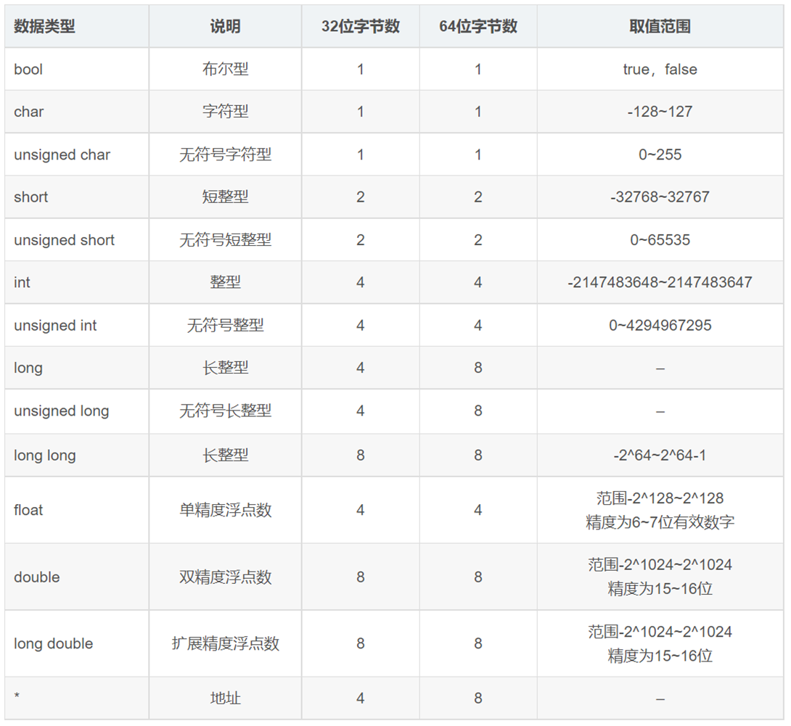

```
#include <iostream>         // 包含头文件。
using namespace std;        // 指定缺省的命名空间。

int main()
{
	// 用于数据类型：sizeof(数据类型)
	// 用于变量：sizeof(变量名) 或 sizeof 变量名
	// C++常用的数据类型：整数（int）、浮点数（float和double）、字符（char）和布尔（bool）。
	cout << "sizeof(int)=" << sizeof(int) << endl;
	cout << "sizeof(float)=" << sizeof(float) << endl;
	cout << "sizeof(double)=" << sizeof(double) << endl;
	cout << "sizeof(char)=" << sizeof(char) << endl;
	cout << "sizeof(bool)=" << sizeof(bool) << endl;

	int i; cout << "sizeof(int)=" << sizeof i << endl;
	float f; cout << "sizeof(float)=" << sizeof f << endl;
	double d; cout << "sizeof(double)=" << sizeof d << endl;
	char c; cout << "sizeof(char)=" << sizeof c << endl;
	bool b; cout << "sizeof(bool)=" << sizeof b << endl;
}
```

## 整型的基本概念

C++用int关键字来声明整型变量（int 是 integer 的简写）。

在声明整型变量的时候，可以在int关键字之前加signed、unsigned、short和long四种修饰符。

**signed**：有符号的，可以表示正数和负数。

**unsigned**：无符号的，只能表示正数，例如超女的身高和体重等。

**short**：短的，取值范围小，占用内存少。

**long**：长的，取值范围大，占用内存多。

| 类型简写       | 类型全称           | 长度  | 取值范围                                   |
| -------------- | ------------------ | ----- | ------------------------------------------ |
| short          | signed short int   | 2字节 | -32768~32767                               |
| unsigned short | unsigned short int | 2字节 | 0~65535                                    |
| int            | signed int         | 4字节 | -2147483648~2147483647                     |
| unsigned       | unsigned int       | 4字节 | 0~4294967295                               |
| long           | signed long int    | 8字节 | -9223372036854775808~  9223372036854775807 |
| unsigned long  | unsigned long int  | 8字节 | 0~18446744073709551615                     |

注意：

- 整数的取值范围与计算机操作系统和C++语言编译器有关，没有一个固定的数值，我们可以根据它占用的内存大小来推断它的取值范围。

一个位的取值是 0 1 1=21-1

两个位的取值是 00 01 10 11 3=22-1

三个位的取值是 000 001 …… 111 7=23-1

a）一个字节有8个位，表示的数据的取值范围是28-1，即255。

b）如果占用的内存是两个字节，无符号型取值范围是28ⅹ28-1。

c）如果占用的内存是四个字节，无符号型取值范围是28ⅹ28ⅹ28ⅹ28-1。

d）如果占用的内存是八个字节，无符号型取值范围是28ⅹ28ⅹ28ⅹ28ⅹ28ⅹ28ⅹ28ⅹ28-1。

e）如果是有符号，取值范围减半，因为符号占一个位。

f）计算机用最高位1位来表达符号（0-正数，1-负数），unsigned修饰过的正整数不需要符号位，在表达正整数的时候比signed修饰的正整数取值大一倍。

- 给整型变量赋值不能超出它的取值范围，否则能产生不可预后的后果。
-  在实际开发中，为了防止超出取值范围，应该保证有足够的空间。

## 整数的书写

整数默认是十进制，一个表示十进制的数字不需要任何特殊的格式。

### 二进制

二进制由 0 和 1 两个数字组成，书写时必须以0b或0B（不区分大小写）开头。

以下是合法的二进制：

```
int a = 0b101;      // 换算成十进制为 5
int b = -0b110010;  // 换算成十进制为 -50
int c = 0B100001;   // 换算成十进制为 33
```

以下是非法的二进制：

```
int m = 101010;  // 无前缀 0B，相当于十进制
int n = 0B410;    // 4不是有效的二进制数字
```

注意，C++标准并不支持上面的二进制写法，只是有些编译器自己进行了扩展，才支持二进制数字。换句话说，并不是所有的编译器都支持二进制数字，只有一部分编译器支持，并且跟编译器的版本有关系。

### 八进制

八进制由 0~7 八个数字组成，书写时必须以0开头（注意是数字 0，不是字母 o）。

以下是合法的八进制数：

```
int a = 015;      // 换算成十进制为 13
int b = -0101;    // 换算成十进制为 -65
int c = 0177777;  // 换算成十进制为 65535
```

以下是非法的八进制：

```
int m = 256; // 无前缀 0，相当于十进制
int n = 03A2; // A不是有效的八进制数字
```

### 十六进制

十六进制由数字 0~9、字母 A~F 或 a~f（不区分大小写）组成，书写时必须以0x或0X（不区分大小写）开头。

以下是合法的十六进制：

```
int a = 0X2A;  // 换算成十进制为 42
int b = -0XA0; // 换算成十进制为 -160
int c = 0xffff;  // 换算成十进制为 65535
```

以下是非法的十六进制：

```
int m = 5A;  // 没有前缀 0X，是一个无效数字
int n = 0X3H; // H不是有效的十六进制数字
```

### 需要注意的坑

**在C++中，不要在十进制数前面加0，会被编译器当成八进制。**

**还有，不要随便删掉别人程序中整数前面的0，它不是多余的。**


## C++11的long long类型

```
在VS中，long是4字节，32位。      -2147483648~2147483647
在Linux中，long是8字节，64位。   -9223372036854775808~9223372036854775807
C++11标准增了long long类型的整数，至少64位，且至少与long一样长。
在VS中，long long是8字节，64位。 -9223372036854775808~9223372036854775807
在Linux中，long和long long类型都是8字节，64位。
```

### 浮点型（实数型）

C++浮点型分三种：float（单精度）、double（双精度）、long double（扩展精度）。

三者的区别是表示有效数字的范围不同。

| 数据类型    | 占用空间     | 有效数字范围            |
| ----------- | ------------ | ----------------------- |
| float       | 4字节        | 7位有效数字      8位    |
| double      | 8字节        | 15～16位有效数字   17位 |
| long double | 不少于double | 不低于double      17位  |

注意：

- 在VS和Linux中，long double占用的内存空间分别是8和16字节。

- 有效数字包括了小数点前面和后面的数字。

- C++缺省显示6位有效数字，如果要显示更多的有效数字，可以用printf()函数。

- 浮点数的存储方法和整数不一样，比较复杂，如无必要，不用研究。（百度“为什么浮点数的小数位很多”、“为什么浮点数不精确”）

- 在实际开发中，用整数代替浮点数，整数的运算更快，精度更高。9223372036854775807

```
#include <stdio.h>           // 使用printf函数需要包含这个头文件。
#include <iostream>         // 包含头文件。
using namespace std;        // 指定缺省的命名空间。

int main()
{
    // float 7位有效数字；double 15～16位有效数字；long double	不低于double
    float aa = 1234.45f;    cout << "aa=" << aa << endl;
    double bb = 12345123056789.45;    cout << "bb=" << bb << endl;
    long double cc = 12345126789.459;    cout << "cc=" << cc << endl;

    printf("aa=%lf\n", aa);
    printf("bb=%lf\n", bb);
    printf("cc=%lf\n", cc);
}
```

## 字符型的基本概念

字符型（char）占用的内存空间是1个字节，书写用单引号包含。

在内存中，不存放字符本身，而是存放与它对应的编码，即ASCII码。

ASCII（American Standard Code for Information Interchange，美国信息交换标准代码）是现今最通用的单字节编码方案，包含了33个控制字符（具有特殊含义无法显示的字符）和95个可显示字符。

```
'X' -> 88 01011000  'a'->97  01100001  '3'->51  00110011
```

### ASCII 控制字符 

| 十进制 | 符号     | 中文解释   | 十进制 | 符号 | 中文解释     |
| ------ | -------- | ---------- | ------ | ---- | ------------ |
| **0**  | **NULL** | **空字符** | 16     | DLE  | 数据链路转义 |
| 1      | SOH      | 标题开始   | 17     | DC1  | 设备控制 1   |
| 2      | STX      | 正文开始   | 18     | DC2  | 设备控制 2   |
| 3      | ETX      | 正文结束   | 19     | DC3  | 设备控制 3   |
| 4      | EOT      | 传输结束   | 20     | DC4  | 设备控制 4   |
| 5      | ENQ      | 询问       | 21     | NAK  | 拒绝接收     |
| 6      | ACK      | 收到通知   | 22     | SYN  | 同步空闲     |
| 7      | BEL      | 铃         | 23     | ETB  | 传输块结束   |
| 8      | BS       | 退格       | 24     | CAN  | 取消         |
| 9      | HT       | 水平制表符 | 25     | EM   | 介质中断     |
| **10** | **LF**   | **换行键** | 26     | SUB  | 替换         |
| 11     | VT       | 垂直制表符 | 27     | ESC  | 换码符       |
| 12     | FF       | 换页键     | 28     | FS   | 文件分隔符   |
| **13** | **CR**   | **回车键** | 29     | GS   | 组分隔符     |
| 14     | SO       | 移出       | 30     | RS   | 记录分离符   |
| **15** | **SI**   | **移入**   | **31** | **US** | **单元分隔符** |
| 32     |      | 空格         | 80     | P    | 大写字母 P |
| 33     | !    | 感叹号       | 81     | Q    | 大写字母 Q |
| 34     | "    | 双引号       | 82     | R    | 大写字母 R |
| 35     | #    | 井号         | 83     | S    | 大写字母 S |
| 36     | $    | 美元符       | 84     | T    | 大写字母 T |
| 37     | %    | 百分号       | 85     | U    | 大写字母 U |
| 38     | &    | 与           | 86     | V    | 大写字母 V |
| 39     | '    | 单引号       | 87     | W    | 大写字母 W |
| 40     | (    | 左括号       | 88     | X    | 大写字母 X |
| 41     | )    | 右括号       | 89     | Y    | 大写字母 Y |
| 42     | *    | 星号         | 90     | Z    | 大写字母 Z |
| 43     | +    | 加号         | 91     | [    | 左中括号   |
| 44     | ,    | 逗号         | 92     | \    | 斜线       |
| 45     | -    | 减号         | 93     | ]    | 右中括号   |
| 46     | .    | 句点或小数点 | 94     | ^    | 音调符号   |
| 47     | /    | 反斜线       | 95     | _    | 下划线     |
| 48     | 0    | 数字0的符号  | 96     | `    | 重音符     |
| 49     | 1    | 数字1的符号  | 97     | a    | 小写字母 a |
| 50     | 2    | 数字2的符号  | 98     | b    | 小写字母 b |
| 51     | 3    | 数字3的符号  | 99     | c    | 小写字母 c |
| 52     | 4    | 数字4的符号  | 100    | d    | 小写字母 d |
| 53     | 5    | 数字5的符号  | 101    | e    | 小写字母 e |
| 54     | 6    | 数字6的符号  | 102    | f    | 小写字母 f |
| 55     | 7    | 数字7的符号  | 103    | g    | 小写字母 g |
| 56     | 8    | 数字8的符号  | 104    | h    | 小写字母 h |
| 57     | 9    | 数字9的符号  | 105    | i    | 小写字母 i |
| 58     | :    | 冒号         | 106    | j    | 小写字母 j |
| 59     | ;    | 分号         | 107    | k    | 小写字母 k |
| 60     | <    | 小于         | 108    | l    | 小写字母 l |
| 61     | =    | 等号         | 109    | m    | 小写字母 m |
| 62     | >    | 大于         | 110    | n    | 小写字母 n |
| 63     | ?    | 问号         | 111    | o    | 小写字母 o |
| 64     | @    | 电子邮件符号 | 112    | p    | 小写字母 p |
| 65     | A    | 大写字母 A   | 113    | q    | 小写字母 q |
| 66     | B    | 大写字母 B   | 114    | r    | 小写字母 r |
| 67     | C    | 大写字母 C   | 115    | s    | 小写字母 s |
| 68     | D    | 大写字母 D   | 116    | t    | 小写字母 t |
| 69     | E    | 大写字母 E   | 117    | u    | 小写字母 u |
| 70     | F    | 大写字母 F   | 118    | v    | 小写字母 v |
| 71     | G    | 大写字母 G   | 119    | w    | 小写字母 w |
| 72     | H    | 大写字母 H   | 120    | x    | 小写字母 x |
| 73     | I    | 大写字母 I   | 121    | y    | 小写字母 y |
| 74     | J    | 大写字母 J   | 122    | z    | 小写字母 z |
| 75     | K    | 大写字母 K   | 123    | {    | 左大括号   |
| 76     | L    | 大写字母 L   | 124    | \|   | 竖线       |
| 77     | M    | 大写字母 M   | 125    | }    | 右大括号   |
| 78     | N    | 大写字母 N   | 126    | ~    | 波浪号     |
| 79     | O    | 大写字母 O   | 127    |      | 删除       |

a）32是空格。

b）48～57是0到9十个阿拉伯数字；

c）65～90是26个大写英文字母；

d）97～122号是26个小写英文字母；

e）其余的是一些标点符号、运算符号等；

f）第127个字符表示的是键盘上的删除键。

### 字符的本质

a）字符的本质是整数，取值范围是0～127。

b）在书写的时候可以用单引号包含，也可以用整数。

c）如果书写的时候用单引号包含，程序执行的时候，将把符号解释为对应的整数。

d）显示的时候，把整数解释为对应的符号，也可以直接显示整数。

d）可以与整数进行任何运算，运算的时候，书写方式可以用字符，也可以用整数。

e）C++为什么没有提供1字节的整型？

f）字符型也可以用unsigned修饰，意义何在？

```
#include <iostream>         // 包含头文件。
using namespace std;        // 指定缺省的命名空间。

int main()
{
    // 字符型（char）占用的内存空间是1个字节，书写用单引号包含。
    int a = 'X';
    cout << "a=" << a << endl;
    cout << "sizeof(a)=" << sizeof(a) << endl;
    // 1234567   00000000 00010010  11010110  10000111
    // 'X' -> 88   'a'->97   '3'->51
}
```

## 转义字符

在C++程序中，使用转义字符的原因有两个：

- 控制字符没有符号，无法书写，只能用其它的符号代替。

- 某些符号已被C++征用，语义冲突，只能用其它的符号代替。

| ASCII码值 | 转义字符 | 含义                                      |
| --------- | -------- | ----------------------------------------- |
| **0**     | **\0**   | **空，给字符型变量赋值时可以直接书写0。** |
| **10**    | **\n**   | **换行(LF) ，将当前位置移到下一行开头。** |
| **13**    | **\r**   | **回车(CR) ，将当前位置移到本行开头**     |
| **9**     | **\t**   | **水平制表(HT) （跳到下一个TAB位置）**    |
| **92**    | **\\**   | **斜线**                                  |
| **34**    | **\"**   | **双引号，书写字符时不必转义。**          |
| **39**    | **\'**   | **单引号，书写字符串中不必转义。**        |
| 7         | \a       | 警报                                      |
| 8         | \b       | 退格(BS) ，将当前位置移到前一列           |
| 12        | \f       | 换页(FF)，将当前位置移到下页开头          |
| 11        | \v       | 垂直制表(VT)                              |

```
#include <iostream>         // 包含头文件。
using namespace std;        // 指定缺省的命名空间。

int main()
{
    // 字符型（char）占用的内存空间是1个字节，书写用单引号包含。
    char a = '\'';
    cout << "a=" << a << endl;

    // 换行符 ASCII值是10  书写用\n
    cout << "我是一'只傻傻鸟！\n";

    // 水平制表符用于对齐输出的内容。
    cout << "1\t西施\n";
    cout << "100\t西瓜\n";
    cout << "10000\t冰冰\n";
}
```

## C++11的原始字面量

原始字面量（值）可以直接表示字符串的实际含义，不需要转义和连接。

语法：

```
R"(字符串的内容)"
R"xxx(字符串的内容)xxx"
```

```
#include <iostream>         // 包含头文件。
using namespace std;        // 指定缺省的命名空间。

int main()
{
    // 使用转义的方法
    string path = "C:\\Program Files\\Microsoft OneDrive\\tail\\nation";
    cout << "path is " << path << endl;

    // 使用C++11原始字面量
    string path1 = R"abcd(C:\Program Files\Microsoft OneDrive\tail\nation)abcd";
    cout << "path1 is " << path1 << endl;

    string str = R"(
        <no>0001</no>
        <name>西施</name>
        <sc>火树银花</sc>
        <yz>沉鱼</yz>
        <age>23</age>
        <weight>48.5</weight>
        <height>170</height>)";
    cout << str << endl;
}
```

## 字符串型

C++风格字符串：string 变量名="字符串的内容" ;

C风格字符串：char 变量名[]="字符串的内容" ;

C风格字符串的本质是字符数组，C++风格字符串的本质是类，它封装了C风格字符串。

- C++风格字符串的常用操作：

- 赋值：变量名="字符串的内容" ;

- 拼接：变量名=变量名+"字符串的内容一"+"字符串的内容一"+......+"字符串的内容n" ;

如果字符串的内容都是常量，不要写加号（+），如果内容很长，可以分成多行书写。

- 比较：支持==、!=、>和<关系运算符，常用的是==和!=。

```
#include <iostream>         // 包含头文件。
using namespace std;        // 指定缺省的命名空间。

int main()
{
	string str="西施";                  // 声明字符串变量并初始化。

	str = "美女西施";                    // 对字符串变量重新赋值。

	cout << "请输入超女姓名：";         // 输出提示文字内容。
	cin >> str;                                       // 从控制台输入数据，保存在变量str中。 
	
	if (str == "冰冰")  cout << "我喜欢\n";           // 用==可以判断两个字符串是否相同。

	if (str != "冰冰") cout << "我不玩了\n";          // 用!=可以判断两个字符串是否不相同。

	str = "姓名：" + str + "，这是我现女友。";     // 用+可以拼接多个字符串。

	// 如果字符串的内容都是常量，不要写加号（+），如果内容很长，可以分成多行书写。
	str = "超女姓名：" 
		"幂幂" 
		"，这是我的前女友。";
    
	cout << str << endl;
}
```

## 布尔型

在C和C++中，关系运算和逻辑运算的结果有两种：真和假。

C语言用0表示假，非0表示真。

为了提高代码的可读性，C++新增了 bool 类型，占用1字节的内存，用true表示真，false表示假。

bool类型本质上是1字节的整数（unsigned char），取值只有1和0。

在程序中，书写的时候可以用true和false，编译器把它们解释为1和0。

如果对bool型变量赋非0的值，将转换成1。

用cin输入和cout输出的时候，仍是1和0，不会被解释为true和false。

```
#include <iostream>         // 包含头文件。
using namespace std;        // 指定缺省的命名空间。

int main()
{
	bool b = 1;

	cout << "b+b=" << b+b << endl;       // 将显示2。
	
	// 如果对bool型变量赋非0的值，将转换成1。
	b = 30;
	cout << "b=" << b << endl;                 // 将显示1。

	// 找到布尔变量b的内存，把里面的数据强制为8。
	char* c = (char *) & b; 
	*c = 8;
	cout << "b=" << b << endl;                 // 将显示8。
}
```

## 数据类型的转换

计算机进行运算时，要求各操作数的类型具有相同的大小和存储方式。

在实际开发中，不同类型的数据进行混合运算是基本需求。

**自动类型转换：**某些类型的转换编译器可以隐式的进行，不需程序员干预。

**强制类型转换：**有些类型的转换需要程序员显式指定。

### 自动类型转换

不同数据类型的差别在于取值范围和精度，数据的取值范围越大，精度越高。

整型从低到高：

char -> short -> int -> long -> long long

浮点型从低到高：

float -> double -> long double

自动类型转换的规则如下：

- 如果一个表达式中出现了不同类型操作数的混合运算，较低类型将自动向较高类型转换。

- 当表达式中含有浮点型操作数时，所有操作数都将转换为浮点型。

- 赋值运算的右值类型与左值类型不一致时，将右值类型提升/降低为左值类型。

- 赋值运算右值超出了左值类型的表示范围，把该右值截断后赋给左值，所得结果可能毫无意义。

### 强制类型转换

为了让程序设计更灵活，转换的目的更清晰，C++提供了强制类型转换的方法，也称之为显式转换。

强制类型转换的语法：(目标类型)表达式或目标类型(表达式)

注意：

- 如果使用强制转换，表示程序员已有明确的目的。

- 如果转换的行为不符合理，后果由程序员承担。

- 如果采用了强制类型转换，编译的告警信息将不再出现。

- 类型转换运算符的优先级比较高，如果没把握就加括号。

```
#include <iostream>         // 包含头文件。
using namespace std;        // 指定缺省的命名空间。

int main()
{
	char a = 30;
	int    b = 102400;
	long long c = 15000000000001;

	// 如果一个表达式中出现了不同类型操作数的混合运算，较低类型将自动向较高类型转换。
	cout << "a+b+c=" << a + b + c << endl;

	// 当表达式中含有浮点型操作数时，所有操作数都将转换为浮点型。
	cout << "8/5=" << ((double)8) / 5 << endl;

	// 赋值运算的右值类型与左值类型不一致时，将右值类型提升/降低为左值类型。
	// 赋值运算右值超出了左值类型的表示范围，把该右值截断后赋给左值，所得结果可能毫无意义。
	int d = (int)23.59;        // 降低了精度。
	cout << "d=" << d << endl;

	unsigned int e = (unsigned int)4294967295+10;       // 值被截断，从高位截断
	cout << "e=" << e << endl;
	// 4294967295         11111111111111111111111111111111
	// 4294967296 000100000000000000000000000000000000
	// 4294967297 000100000000000000000000000000000001
}
```

## 数据类型的别名typedef

创建数据类型的别名有两个目的：

- 为名称复杂的类型创建别名，方便书写和记忆。

- 创建与平台无关的数据类型，提高程序的兼容性。

语法：typedef 原数据类型名 别名;

C++11还可以用using关键字创建数据类型的别名。

语法：using 别名=原数据类型名;

```
#include <iostream>         // 包含头文件。
using namespace std;        // 指定缺省的命名空间。

int main()
{
	// 1）为名称复杂的类型创建别名，方便书写和记忆。
	// 2）创建与平台无关的数据类型，提高程序的兼容性。
	// 在VS中，short是两个字节，int是四个字节，long也是四个字节，long long是八个字节。
	typedef short         int16_t;    // 16位的整数。
	typedef int             int32_t;    // 32位的整数。
	typedef long long int64_t;    // 64位的整数。
	// 在Linux中，short是两个字节，int是四个字节，long也是八个字节，long long也是八个字节。
	typedef short         int16_t;    // 16位的整数。
	typedef int             int32_t;    // 32位的整数。
	typedef long          int64_t;    // 64位的整数。

	// 在程序源代码中，只使用别名int16_t、int32_t、int64_t，不使用原名。
}
```

## 指针的基本概念

### 变量的地址

变量是内存变量的简称，在C++中，每定义一个变量，系统就会给变量分配一块内存，内存是有地址的。

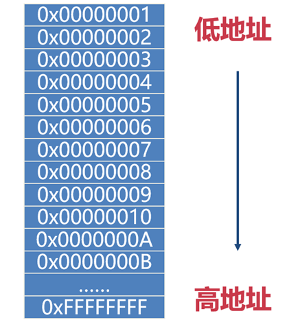

C++用运算符&获取变量在内存中的起始地址。

语法：&变量名

### 指针变量

指针变量简称指针，它是一种特殊的变量，专用于存放变量在内存中的**起始地址**。

语法：数据类型 *变量名;

数据类型必须是合法的C++数据类型（int、char、double或其它自定义的数据类型）。

星号*与乘法中使用的星号是相同的，但是，在这个场景中，星号用于表示这个变量是指针。

### 对指针赋值

不管是整型、浮点型、字符型，还是其它的数据类型的变量，它的地址都是一个十六进制数。我们用整型指针存放整数型变量的地址；用字符型指针存放字符型变量的地址；用浮点型指针存放浮点型变量的地址，用自定义数据类型指针存放自定义数据类型变量的地址。

语法：指针=&变量名;

注意

- 对指针的赋值操作也通俗的被称为“指向某变量”，被指向的变量的数据类型称为“基类型”。

- 如果指针的数据类型与基类型不符，编译会出现警告。但是，可以强制转换它们的类型。

### 指针占用的内存

指针也是变量，是变量就要占用内存空间。

在64位的操作系统中，不管是什么类型的指针，占用的内存都是8字节。

### 使用指针

声明指针变量后，在没有赋值之前，里面是乱七八糟的值，这时候不能使用指针。

指针存放变量的地址，因此，指针名表示的是地址（就像变量名可以表示变量的值一样）

运算符被称为**间接值**或**解除引用（解引用）**运算符，将它用于指针，可以得到该地址的内存中存储的值，*也是乘法符号，C++根据上下文来确定所指的是乘法还是解引用。

**变量和指向变量的指针就像同一枚硬币的两面。**

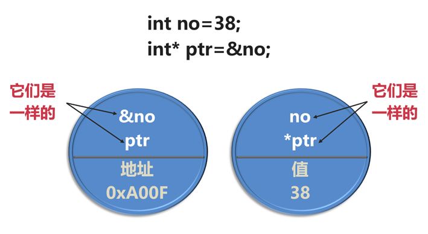


程序在存储数据的时候，必须跟踪三种基本属性：

- 数据存储在哪里；

- 数据是什么类型；

- 数据的值是多少。

用两种策略可以达到以上目的：

声明一个普通变量，声明时指出数据类型和变量名（符号名），系统在内部跟踪该内存单元。

声明一个指针变量，存储的值是地址，而不是值本身，程序直接访问该内存单元。

## 指针用于函数的参数

如果把函数的形参声明为指针，调用的时候把实参的地址传进去，形参中存放的是实参的地址，在函数中通过解引用的方法直接操作内存中的数据，可以修改实数的值，这种方法被通俗的称为**地址传递**或**传地址**。

**值传递**：函数的形参是普通变量。

传地址的意义如下：

- 可以在函数中修改实参的值。

- 减少内存拷贝，提升性能。

```
#include <iostream>         // 包含头文件。
using namespace std;        // 指定缺省的命名空间。

// 调用函数的时候，调用者把数值赋给了函数的参数。
// 实参：调用者程序中书写的在函数名括号中的参数。
// 形参：函数的参数列表。
void func(int *no, string *str)    // 向先生表白的函数。 
{
	cout << "亲爱的" << *no << "号：" << *str << endl;
	*no = 8;
	*str = "我有一只小小鸟。";
}

// 写一个函数，从3名先生的身高数据中，选出最高的和最矮的。
void func1(int a, int b, int c, int* max, int* min)
{
	*max = a > b ? a : b;               // 取a和b中的大者。
	*min = a < b ? a : b;                // 取a和b中的小者。
	*max = *max > c ? *max : c;   // 取*max和c中的大者。
	*min = *min < c  ? *min : c;    // 取*min和c中的大者。
}

int main()
{
	int bh = 3;      // 编号。
	string message = "我是一只小猪。";          // 内容。

	func(&bh, &message);            // 调用向先生表白的函数。
	/*{
		int *no = &bh;          
		string *str = &message; 

		cout << "亲爱的" << *no << "号：" << *str << endl;
		*no = 8;
		*str = "我有一只小小鸟。";
	}*/

	cout << "亲爱的" << bh << "号：" << message << endl;

	// 从3名先生的身高数据中，选出最高的和最矮的。
	int a = 180, b = 170, c = 175, m, n;
	func1(a, b, c, &m, &n);
	cout << "m=" << m << ",n=" << n << endl;
}

```

## 用const修饰指针

### 常量指针

语法：const 数据类型 *变量名;

不能通过解引用的方法修改内存地址中的值（用原始的变量名是可以修改的）。

注意：

- 指向的变量（对象）可以改变（之前是指向变量a的，后来可以改为指向变量b）。

- 一般用于修饰函数的形参，表示不希望在函数里修改内存地址中的值。

- 如果用于形参，虽然指向的对象可以改变，但这么做没有任何意义。

- 如果形参的值不需要改变，建议加上const修饰，程序可读性更好。

### 指针常量

语法：数据类型 * const 变量名;

指向的变量（对象）不可改变。

注意：

- 在定义的同时必须初始化，否则没有意义。

- 可以通过解引用的方法修改内存地址中的值。

- C++编译器把指针常量做了一些特别的处理，改头换面之后，有一个新的名字，叫引用。

### 常指针常量

语法：const 数据类型 * const 变量名;

指向的变量（对象）不可改变，不能通过解引用的方法修改内存地址中的值。叫常引用。

常量指针：指针指向可以改，指针指向的值不可以更改。

指针常量：指针指向不可以改，指针指向的值可以更改。

常指针常量：指针指向不可以改，指针指向的值不可以更改。

**记忆秘诀：\*表示指针，指针在前先读指针；指针在前指针就不允许改变。**

常量指针：const 数据类型 *变量名

指针常量：数据类型 * const 变量名

```
#include <iostream>         // 包含头文件。
using namespace std;        // 指定缺省的命名空间。

void func(const int *no, const string *str)    // 向先生表白的函数。 
{
	// *no = 8;
	// *str = "我有一只小小鸟。";
	cout << "亲爱的" << *no << "号：" << *str << endl;
}
int main()
{
	int a = 3, b = 8;
	// 常量指针的语法：const 数据类型* 变量名;
	// 不能通过解引用的方法修改内存地址中的值（用原始的变量名是可以修改的）。
	/*const int* p = &a;
	a = 13;
	cout << "a=" << a << ",*p=" << *p << endl;
	p = &b;
	cout << "b=" << b << ",*p=" << *p << endl;*/
	// 指针常量语法：数据类型* const 变量名;
	// 指向的变量（对象）不可改变；在定义的同时必须初始化；可以通过解引用的方法修改内存地址中的值。
	int* const p=&a;
	*p = 13;
	cout << "a=" << a << ",*p=" << *p << endl;

	//int bh = 3;      // 先生的编号。
	//string message = "我是一只小猪。";          // 向先生表白的内容。
	//
	//func(&bh, &message);            // 调用向先生表白的函数。

	//cout << "亲爱的" << bh << "号：" << message << endl;
}
```

## void关键字 

在C++中，void表示为**无类型**，主要有三个用途：

1）函数的返回值用void，表示函数没有返回值。

```
void func(int a,int b){
  // 函数体代码。
  return;
}
```

2）函数的参数填void，表示函数不需要参数（或者让参数列表空着）。

```
int func(void){
  // 函数体代码。
  return 0;
}
```

3）函数的形参用void \*，表示接受任意数据类型的指针。

注意：

- 不能用void声明变量，它不能代表一个真实的变量，但是，用void *可以。

- 不能对void *指针直接解引用（需要转换成其它类型的指针）。

- 把其它类型的指针赋值给void*指针不需要转换。

- 把void *指针赋值给把其它类型的指针需要转换。    

```
#include <iostream>         // 包含头文件。
using namespace std;        // 指定缺省的命名空间。
// 只关心地址本身，不关心里面的内容，用void *可以存放任意类型的地址。
// 显示变量的十六进制地址的函数：varname-变量名，p-变量的地址。
void func(string varname, void* p)
{
	cout << varname<< "的地址是：" << p << endl;
	cout << varname << "的值是：" << *(char *)p << endl;
}
int main()
{
	int    a=89;
	char b='X';
	cout << "a的地址是：" <<  & a << endl;
	cout << "b的地址是：" <<  & b << endl;
	func("a", &a);
	func("b", & b);
}
```

## C++内存模型

在 C++ 中，程序运行时，内存主要分成四个区，分别是**栈、堆、数据段**和**代码段**。

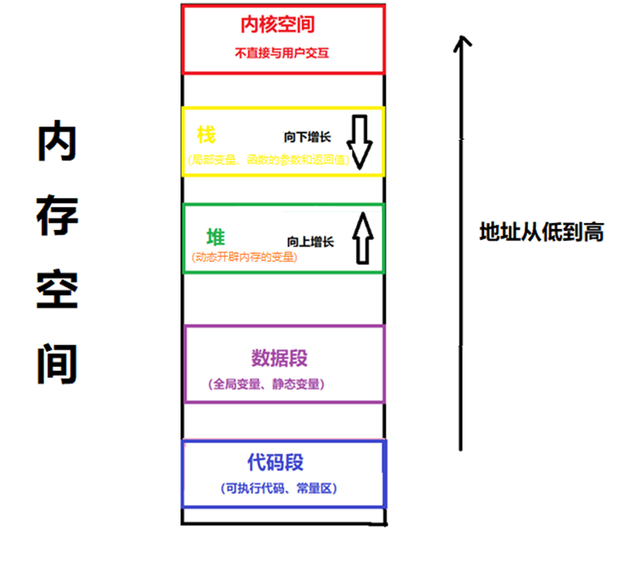

**栈：**存储局部变量、函数参数和返回值。

**堆：**存储动态开辟内存的变量。

**数据段：**存储全局变量和静态变量。

**代码段：**存储可执行程序的代码和常量（例如字符常量），此存储区不可修改。

**栈和堆的主要区别：**

**1****）管理方式不同：栈是系统自动管理的，在出作用域时，将自动被释放；堆需手动释放，若程序中不释放，程序结束时由操作系统回收。**

**2****）空间大小不同：堆内存的大小受限于物理内存空间；而栈就小得可怜，一般只有8M（可以修改系统参数)。**

3）分配方式不同：堆是动态分配；栈有静态分配和动态分配（都是自动释放）。

4）分配效率不同：栈是系统提供的数据结构，计算机在底层提供了对栈的支持，进栈和出栈有专门的指令，效率比较高；堆是由C++函数库提供的。

5）是否产生碎片：对于栈来说，进栈和出栈都有着严格的顺序（先进后出），不会产生碎片；而堆频繁的分配和释放，会造成内存空间的不连续，容易产生碎片，太多的碎片会导致性能的下降。

6）增长方向不同：栈向下增长，以降序分配内存地址；堆向上增长，以升序分配内存地址。

## 动态分配内存new和delete

使用堆区的内存有四个步骤：

1）声明一个指针；

2）用new运算符向系统申请一块内存，让指针指向这块内存；

3）通过对指针解引用的方法，像使用变量一样使用这块内存；

4）如果这块内存不用了，用delete运算符释放它。

申请内存的语法：new 数据类型(初始值);  // C++11支持{}

如果申请成功，返回一个地址；如果申请失败，返回一个空地址（暂时不考虑失败的情况）。

​    释放内存的语法：delete 地址;

释放内存不会失败（还钱不会失败）。

注意：

- 动态分配出来的内存没有变量名，只能通过指向它的指针来操作内存中的数据。

- **如果动态分配的内存不用了，必须用delete释放它，否则有可能用尽系统的内存。**

- 动态分配的内存生命周期与程序相同，程序退出时，如果没有释放，系统将自动回收。

- 就算指针的作用域已失效，所指向的内存也不会释放。

- 用指针跟踪已分配的内存时，不能跟丢。

```
#include <iostream>         // 包含头文件。
using namespace std;        // 指定缺省的命名空间。

int main()
{
	// 1）声明一个指针；
	// 2）用new运算符向系统申请一块内存，让指针指向这块内存；
	// 3）通过对指针解引用的方法，像使用变量一样使用这块内存；
	// 4）如果这块内存不用了，用delete运算符释放它。
	// 申请内存的语法：new 数据类型(初始值);   // C++11支持{}
	// 释放内存的语法：delete 地址;
	int* p = new int(5);
	cout << "*p=" << *p << endl;
	*p = 8;
	cout << "*p=" << *p << endl;
	delete p;

	/*	for (int ii = 1; ii > 0; ii++)
	{
		int* p = new int[100000];     // 一次申请100000个整数，这个语法以后再讲。
		cout << "ii="<<ii<<",p=" << p << endl;
	}/*
}
```

## 二级指针

**指针**是**指针变量**的简称，也是**变量**，是**变量**就有**地址**。

**指针**用于存放**普通变量**的**地址**。

**二级指针**用于存放**指针变量**的**地址**。

声明二级指针的语法：数据类型** 指针名;

使用指针有两个目的：1）传递地址；2）存放动态分配的内存的地址。

在函数中，如果传递普通变量的地址，形参用指针；**传递指针的地址，形参用二级指针。**

把普通变量的地址传入函数后可以在函数中修改变量的值；**把指针的地址传入函数后可以在函数中指针的值。**

```
#include <iostream>         // 包含头文件。
using namespace std;        // 指定缺省的命名空间。

void func(int **pp)
{
	*pp = new int(3);
	cout << "pp=" << pp << ",*pp=" << *pp << endl;
}

int main()
{
	/*int ii = 8;               cout << "ii=" << ii << ",ii的地址是：" << &ii << endl;
	int* pii = &ii;        cout << "pii=" << pii << ",pii的地址是：" << &pii << ",*pii=" << *pii << endl;
	int** ppii = &pii;  cout << "ppii=" << ppii << ",ppii的地址是：" << &ppii << ",*ppii=" << *ppii << endl;
	cout << "**ppii=" << **ppii << endl;*/

	int* p=0;
	func(&p);
	/*{
		int** pp = &p;
		*pp = new int(3);
		cout << "pp=" << pp << ",*pp=" << *pp << endl;
	}*/

	cout << "p=" << p << ",*p=" << *p << endl;
}
```

## 空指针

在C和C++中，用0或NULL都可以表示空指针。

声明指针后，在赋值之前，让它指向空，表示没有指向任何地址。

### 使用空指针的后果

**如果对空指针解引用，程序会崩溃。**

**如果对空指针使用delete运算符，系统将忽略该操作，不会出现异常。所以，内存被释放后，也应该把指针指向空。**

**在函数中，应该有判断形参是否为空指针的代码，目的是保证程序的健壮性。**

为什么空指针访问会出现异常？

NULL指针分配的分区：其范围是从 0x00000000到0x0000FFFF。这段空间是空闲的，对于空闲的空间而言，没有相应的物理存储器与之相对应，所以对这段空间来说，任何读写操作都是会引起异常的。空指针是程序无论在何时都没有物理存储器与之对应的地址。为了保障“无论何时”这个条件，需要人为划分一个空指针的区域，固有上面NULL指针分区。

### C++11的nullptr

用0和NULL表示空指针会产生歧义，C++11建议用nullptr表示空指针，也就是(void *)0。

NULL在C++中就是0，这是因为在C++中void* 类型是不允许隐式转换成其他类型的，所以之前C++中用0来代表空指针，但是在重载整形的情况下，会出现上述的问题。所以，C++11加入了nullptr，可以保证在任何情况下都代表空指针，而不会出现上述的情况，因此，建议用nullptr替代NULL吧，而NULL就当做0使用。

**注意：在Linux平台下，如果使用nullptr，编译需要加-std=c++11参数。**

```
#include <iostream>         // 包含头文件。
using namespace std;        // 指定缺省的命名空间。

void func(int* no, string* str)    // 向先生表白的函数。 
{
	if ((no == 0) || (str == 0)) return;  

	cout << "亲爱的" << *no << "号：" << *str << endl;
}

int main()
{
	// int bh = 3;      // 先生的编号。
	// string message = "我是一只小猪。";          // 向先生表白的内容。
	int* bh = 0;   //  new int(3);
	string* message = 0; //  new string("我是一只小猪。");
	
	func(bh,message);            // 调用向先生表白的函数。

	delete bh; delete message;
}
```

## 野指针

野指针就是指针指向的不是一个有效（合法）的地址。

在程序中，如果访问野指针，**可能**会造成程序的崩溃。

出现野指针的情况主要有三种：

1）指针在定义的时候，如果没有进行初始化，它的值是不确定的（乱指一气）。

2）如果用指针指向了动态分配的内存，内存被释放后，指针不会置空，但是，指向的地址已失效。

3）指针指向的变量已超越变量的作用域（变量的内存空间已被系统回收），让指针指向了函数的局部变量，或者把函数的局部变量的地址作为返回值赋给了指针。

规避方法：

1）指针在定义的时候，如果没地方指，就初始化为nullptr。

2）动态分配的内存被释放后，将其置为nullptr。

3）函数不要返回局部变量的地址。

注意：野指针的危害比空指针要大很多，在程序中，如果访问野指针，**可能**会造成程序的崩溃。是可能，不是一定，程序的表现是**不稳定**，增加了调试程序的难度。

## 函数指针

函数的二进制代码存放在内存四区中的代码段，函数的地址是它在内存中的起始地址。如果把函数的地址作为参数传递给函数，就可以在函数中灵活的调用其它函数。

使用函数指针的三个步骤：

a）声明函数指针；

b）让函数指针指向函数的地址；

c）通过函数指针调用函数。

### 声明函数指针

声明普通指针时，必须提供指针的类型。同样，声明函数指针时，也必须提供函数类型，函数的类型是指**返回值**和**参数列表**（函数名和形参名不是）

假设函数的原型是：

```
int func1(int bh,string str);
int func2(int no,string message);
int func3(int id,string info);
bool func4(int id,string info);
bool func5(int id);
```

则函数指针的声明是：

```
int  (*pfa)(int,string);
bool (*pfb)(int,string);
bool (*pfc)(int);
```

pfa、pfb、pfc是函数指针名，必须用括号，否则就成了返回指针的函数。

### 函数指针的赋值

函数名就是函数的地址。

函数指针的赋值：函数指针名=函数名;

### 函数指针的调用

```
(*函数指针名)(实参);
函数指针名(实参);
```

```
#include <iostream>         // 包含头文件。
using namespace std;        // 指定缺省的命名空间。

void func(int no, string str)
{
	cout << "亲爱的" << no << "号：" << str << endl;
}

int main()
{
	int bh = 3;                                                 // 先生的编号。
	string message = "我是一只小猪。";    // 向先生表白的内容。

	func(bh, message);

	void (*pfunc)(int, string);           // 声明表白函数的函数指针。
	pfunc = func;                              // 对函数指针赋值，语法是函数指针名=函数名。
	pfunc(bh, message);                  // 用函数指针名调用函数。 C++
	(*pfunc)(bh, message);              // 用函数指针名调用函数。 C语言
}
```

```
#include <iostream>         // 包含头文件。
using namespace std;        // 指定缺省的命名空间。
void zs(int a)         // 张三的个性化表白函数。
{
	cout  <<"a=" << a << "我要先翻三个跟斗再表白。\n";   // 个性化表白的代码。
}
void ls(int a)         // 李四的个性化表白函数。
{
	cout << "a=" << a << "我有一只小小鸟。\n";   // 个性化表白的代码。
}
void show(void (*pf)(int),int b)
{
	cout << "表白之前的准备工作已完成。\n";       // 表白之前的准备工作。
	pf(b);                                                                     // 用函数指针名调用个性化表白函数。
	cout << "表白之后的收尾工作已完成。\n";       // 表白之后的收尾工作。
}

int main()
{
	show(zs, 3);          // 张三要表白。
	show(ls, 4);          // 李四要表白。
}
```

## 一维数组的基本概念

数组是一组数据类型相同的变量，可以存放一组数据。

### 创建数组

声明数组的语法：数据类型 数组名[数组长度];

注意：数组长度必须是整数，可以是常量，也可以是**变量和表达式**。

C90规定必须用常量表达式指明数组的大小，C99允许使用整型非常量表达式。经测试，在VS中可以用用整型非常量表达式，不能用变量；但是，Linux中还可以用变量。

### 数组的使用

可以通过下标访问数组中元素，数组下标从0开始。

数组中每个元素的特征和使用方法与单个变量完全相同。

语法：数组名[数组下标]

注意：

- 数组下标也必须是整数，可以是常量，也可以是**变量**。

- 合法的数组下标取值是：**0~(数组长度-1)**。

### 数组占用内存的情况

数组在内存中占用的空间是连续的。

用sizeof(数组名)可以得到整个数组占用内存空间的大小（只适用于C++基本数据类型）。

### 数组的初始化

声明的时候初始化：

```
数据类型 数组名[数组长度] = { 值1，值2，值3, ...... , 值n};
数据类型 数组名[ ] = { 值1，值2，值3, ...... , 值n};
数据类型 数组名[数组长度] = { 0 };  // 把全部的元素初始化为0。
数据类型 数组名[数组长度] = { };    // 把全部的元素初始化为0。
```

注意：如果{}内不足数组长度个数据，剩余数据用0补全，但是，不建议这么用，你可能在数组中漏了某个值。如果想把数组中全部的元素初始化为0，可以在{}内只填一个0或什么也不填。C++11标准可以不写等于号。

### 清空数组

用memset()函数可以把数组中全部的元素清零。（只适用于C++基本数据类型）

```
函数原型：void *memset(void *s, int c, size_t n);
```

注意，在Linux下，使用memcpy()函数需要包含头文件#include <string.h>

### 复制数组

用memcpy()函数可以把数组中全部的元素复制到另一个相同大小的数组。（只适用于C++基本数据类型）

```
函数原型：void *memcpy(void *dest, const void *src, size_t n);
```

注意，在Linux下，使用memcpy()函数需要包含头文件#include <string.h>

```
#include <iostream>         // 包含头文件。
using namespace std;        // 指定缺省的命名空间。

int main()
{
	int bh[] = {3, 6, 1,6,7,4,3,5,6,7,8,322,2,3,9};               // 先生编号。
	string name[3];    // 先生姓名。
	
	for (int ii = 0; ii < sizeof(bh)/sizeof(int); ii++)
	{
		cout << "bh["<<ii<<"]=" << bh[ii] << endl;
	}

	int bh1[sizeof(bh) / sizeof(int)];   // 数组长度必须是整数，可以是常量，也可以是变量和表达式。

	memcpy(bh1, bh, sizeof(bh));      // 把数组bh中的内容复制到bh1。    

	for (int ii = 0; ii < sizeof(bh1) / sizeof(int); ii++)
	{
		cout << "bh1[" << ii << "]=" << bh1[ii] << endl;
	}
}
```

## 一维数组和指针

### 指针的算术

将一个整型变量加1后，其值将增加1。

但是，将指针变量（地址的值）加1后，增加的量等于它指向的数据类型的字节数。

### 数组的地址

a）数组在内存中占用的空间是连续的。

b）C++将数组名解释为数组第0个元素的地址。

c）数组第0个元素的地址和数组首地址的取值是相同的。

d）数组第n个元素的地址是：数组首地址+n

e）C++编译器把  数组名[下标] **解释为**  *(数组首地址+下标)

### 数组的本质

数组是占用连续空间的一块内存，数组名被解释为数组第0个元素的地址。C++操作这块内存有两种方法：数组解释法和指针表示法，它们是等价的。

### 数组名不一定会被解释为地址

在多数情况下，C++将数组名解释为数组的第0个元素的地址，但是，将sizeof运算符用于数据名时，将返回整个数组占用内存空间的字节数。

可以修改指针的值，但数组名是常量，不可修改。

```
#include <iostream>         // 包含头文件。
using namespace std;        // 指定缺省的命名空间。

int main()
{
	char a;      cout << "sizeof(char)=" << sizeof(char) << endl;            // 1字节
	short b;    cout << "sizeof(short)=" << sizeof(short) << endl;         // 2字节
	int c;         cout << "sizeof(int)=" << sizeof(int) << endl;                  // 4字节
	double d; cout << "sizeof(double)=" << sizeof(double) << endl;   // 8字节
		
	cout << "a的地址是：" << (void *)& a << endl;
	cout << "a的地址+1是：" << (void*)( & a + 1) << endl;

	cout << "b的地址是：" << (void*)&b << endl;
	cout << "b的地址+1是：" << (void*)(&b + 1) << endl;

	cout << "c的地址是：" << (void*)&c << endl;
	cout << "c的地址+1是：" << (void*)(&c + 1) << endl;

	cout << "d的地址是：" << (void*)&d << endl;
	cout << "d的地址+1是：" << (void*)(&d + 1) << endl;
}
```

```
#include <iostream>         // 包含头文件。
using namespace std;        // 指定缺省的命名空间。

int main()
{
	double a[5];

	cout << "a的值是：" << (long long) a << endl;
	cout << "&a的值是：" << (long long)&a << endl;

	cout << "a[0]的地址是：" << (long long) &a[0] << endl;
	cout << "a[1]的地址是：" << (long long) &a[1] << endl;
	cout << "a[2]的地址是：" << (long long) &a[2] << endl;
	cout << "a[3]的地址是：" << (long long) &a[3] << endl;
	cout << "a[4]的地址是：" << (long long) &a[4] << endl;

	double* p = a;
	cout << "p的值是：" << (long long)p << endl;
	cout << "p+0的值是：" << (long long)(p+  0) << endl;
	cout << "p+1的值是：" << (long long)(p + 1) << endl;
	cout << "p+2的值是：" << (long long)(p + 2) << endl;
	cout << "p+3的值是：" << (long long)(p + 3) << endl;
	cout << "p+4的值是：" << (long long)(p + 4) << endl;
}
```

```
#include <iostream>         // 包含头文件。
using namespace std;        // 指定缺省的命名空间。

int main()
{
	int a[5] = { 3 , 6 , 5 , 8 , 9 };

	// 用数组表示法操作数组。
	cout << "a[0]的值是：" << a[0] << endl;
	cout << "a[1]的值是：" << a[1] << endl;
	cout << "a[2]的值是：" << a[2] << endl;
	cout << "a[3]的值是：" << a[3] << endl;
	cout << "a[4]的值是：" << a[4] << endl;

	// 用指针表示法操作数组。
	int* p = a;
	cout << "*(p+0)的值是：" << *(p+  0) << endl;
	cout << "*(p+1)的值是：" << *(p + 1) << endl;
	cout << "*(p+2)的值是：" << *(p + 2) << endl;
	cout << "*(p+3)的值是：" << *(p + 3) << endl;
	cout << "*(p+4)的值是：" << *(p + 4) << endl;
}
```

### 一维数组用于函数的参数

### 指针的数组表示

在C++内部，用指针来处理数组。

C++编译器把  数组名[下标] **解释为**  *(数组首地址+下标)

C++编译器把  地址[下标] **解释为**  *(地址+下标)

### 一维数组用于函数的参数

一维数组用于函数的参数时，只能传数组的地址，并且必须把数组长度也传进去，除非数组中有最后一个元素的标志。

书写方法有两种： 

```
void func(int* arr, int len);
void func(int arr[], int len);
```

注意：

在函数中，可以用数组表示法，也可以用指针表示法。

在函数中，不要对指针名用sizeof运算符，它不是数组名。

其中用int *arr 替换了int arr []。这证明这两个函数头都是正确的，因为在 C++中，当(且仅当)用于函数头或函数原型中，int \*arr 和 int arr [ ]的含义才是相同的。它们都意味着arr是一个int 指针。然而，数组表示法 (int arr[ ])提醒用户，arr 不仅指向int，还指向int数组的第一个int。当指针指向数组的第一个元素时，本书使用数组表示法；而当指针指向一个独立的值时，使用指针表示法。别忘了，在其他的上下文中，int\* arr和int arr[ ]的含义并不相同。例如，不能在函数体中使用int tip[]来声明指针。

```
#include <iostream>         // 包含头文件。
using namespace std;        // 指定缺省的命名空间。

int main()
{
	char a[20];             // 这是一个长度为20的字符型数组。

	int* p = (int *)a;        // 让整型指针p指向数组a的内存。

	for (int ii = 0; ii < 6; ii++)
	{
		p[ii] = ii + 300;     // 用数组表示法操作指针。
	}

	for (int ii = 0; ii < 6; ii++)
	{
		cout << "*(p+" << ii << ")的值是：" << *(p + ii) << endl;    // 地址[下标]  解释为  *(地址+下标)。
	}
}
```

```
#include <iostream>         // 包含头文件。
using namespace std;        // 指定缺省的命名空间。

// void func(int *arr,int len)
void func(int arr[],int len)
{
	for (int ii = 0; ii < len; ii++)
	{
		cout << "arr[" << ii << "]的值是：" << arr[ii] << endl;              // 用数组表示法操作指针。
		cout << "*(arr+" << ii << ")的值是：" << *(arr + ii) << endl;   // 地址[下标]  解释为  *(地址+下标)。
	}
}

int main()
{
	int a[] = {2,8,4,6,7,1,9};
	
	func(a, sizeof(a) / sizeof(int));
}
```

### 用new动态创建一维数组

普通数组在栈上分配内存，栈很小；如果需要存放更多的元素，必须在堆上分配内存。

动态创建一维数组的语法：数据类型 *指针=new 数据类型[数组长度];

释放一维数组的语法：delete [] 指针;

注意：

- 动态创建的数组没有数组名，不能用sizeof运算符。

- 可以用数组表示法和指针表示法两种方式使用动态创建的数组。

- 必须使用delete[]来释放动态数组的内存（不能只用delete）。

- 不要用delete[]来释放不是new[]分配的内存。

- 不要用delete[]释放同一个内存块两次（否则等同于操作野指针）。

- 对空指针用delete[]是安全的（释放内存后，应该把指针置空nullptr）。

- 声明普通数组的时候，数组长度可以用变量，相当于在栈上动态创建数组，并且不需要释放。

- 如果内存不足，调用new会产生异常，导致程序中止；如果在new关键字后面加(std::nothrow)选项，则返回nullptr，不会产生异常。

- 为什么用delete[]释放数组的时候，不需要指定数组的大小？因为系统会自动跟踪已分配数组的内存。

```
#include <iostream>         // 包含头文件。
using namespace std;        // 指定缺省的命名空间。

int main()
{
	int *arr=new int[8];          // 创建8个元素的整型数组。

	for (int ii = 0; ii < 8; ii++)
	{
		arr[ii] = 100 + ii;                                                                  // 数组表示法。
		cout << "arr[" << ii << "]=" << *(arr + ii) << endl;        // 指针表示法。
	}
	delete[]arr;
}
```

## 一维数组的排序qsort

qsort()函数用于对各种数据类型的数组进行排序。

函数的原型：

```
void qsort(void *base, size_t nmemb, size_t size, int (*compar)(const void *, const void *));
```

第一个参数：数组的起始地址。

第二个参数：数组元素的个数（数组长度）。

第三个参数：数组元素的大小（sizeof(数组的数据类型)）。

第四个参数：回调函数的地址。

回调函数决定了排序的顺序，声明如下：

```
int compar(const void *p1, const void *p2);
```

1）如果函数的返回值< 0 ，那么p1所指向元素会被排在p2所指向元素的前面。

2）如果函数的返回值==0，那么p1所指向元素与p2所指向元素的顺序不确定。

3）如果函数的返回值> 0 ，那么p1所指向元素会被排在p2所指向元素的后面。

```
void qsort(void *base, size_t nmemb, size_t size, int (*compar)(const void *, const void *));
```

qsort()函数的其它细节：

- 形参中的地址用void是为了支持任意数据类型，在回调函数中必须具体化。

- 为什么需要第三个形参size_t size？

- size_t是C标准库中定义的，在64位系统中是8字节无符号整型（unsigned long long）。

typedef unsigned long long size_t

- 排序的需求除了升序和降序，还有很多不可预知的情况，只能用回调函数。

```
#include <iostream>         // 包含头文件。
using namespace std;        // 指定缺省的命名空间。

int compasc(const void* p1, const void* p2)         // 升序的回调函数。
{
	return *((int*)p1) - *((int*)p2);
}

int compdesc(const void* p1, const void* p2)       // 降序的回调函数。
{
	return *((int*)p2) - *((int*)p1);
}
```

```
int main()
{
	int a[8] = { 4,2,7,5,8,6,1,3 };

	qsort(a,sizeof(a)/sizeof(int),sizeof(int),compasc);                   // 对数组a进行升序排序。

	for (int ii = 0; ii < 8; ii++)
	{
		cout << "a[" << ii << "]=" << a[ii] << endl;
	}

	qsort(a, sizeof(a) / sizeof(int), sizeof(int), compdesc);            // 对数组a进行降序排序。

	for (int ii = 0; ii < 8; ii++)
	{
		cout << "a[" << ii << "]=" << a[ii] << endl;
	}
}
```

## 一维数组的查找-二分查找

```
#include <iostream>         // 包含头文件。
using namespace std;        // 指定缺省的命名空间。

// 在arr中查找key，成功返回key在arr中的数组下标，失败返回-1。
int search(int arr[], int len, int key)
{
	int low = 0, high = len-1,mid;          // 初始化：low=0，high=数组长度-1。

	while (low <= high)
	{
		mid = (low + high) / 2;     // 计算mid指针的位置。

		if (arr[mid] == key) return mid;         // 查找成功。     
		else if (arr[mid] > key) high = mid - 1;  // 继续在前半区查找。
		else low = mid + 1;                    // 继续在后半区查找。
	
	}

	return -1; // 查找失败。
}

int main()
{
	int a[10] = { 7,9,12,16,21,25,30,35,41,48 };    // 必须是已排好序的数组。

	if (search(a, 10, 30) >= 0) cout << "在数组a中查找30成功。\n";
	else cout << "在数组a中查找30失败。\n";
}
```

## C风格的字符串

C语言约定：如果字符型（char）数组的末尾包含了空字符\0（也就是0），那么该数组中的内容就是一个字符串。  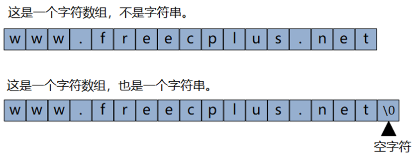              

因为字符串需要用0结尾，所以在声明字符数组的时候，要预留多一个字节用来存放0。

```
char name[21];  // 声明一个最多存放20个英文字符或十个中文的字符串。
```

### 初始化方法

```
char name[11];                 // 可以存放10个字符，没有初始化，里面是垃圾值。
char name[11] = "hello";         // 初始内容为hello，系统会自动添加0。
char name[]   = { "hello" };      // 初始内容为hello，系统会自动添加0，数组长度是6。
char name[11] = { "hello" };      // 初始内容为hello，系统会自动添加0。
char name[11]   { "hello" };      // 初始内容为hello，系统会自动添加0。C++11标准。
char name[11] = { 0 };          // 把全部的元素初始化为0。
```

### 清空字符串

```
memset(name,0,sizeof(name));   // 把全部的元素置为0。
name[0]=0;       // 不规范，有隐患，不推荐。
```

### 字符串复制或赋值strcpy()

```
char *strcpy(char* dest, const char* src);
```

功 能: 将参数src字符串拷贝至参数dest所指的地址。

返回值: 返回参数dest的字符串起始地址。

复制完字符串后，会在dest后追加0。

**如果参数dest所指的内存空间不够大，会导致数组的越界。**

### 字符串复制或赋值strncpy()

```
char * strncpy(char* dest,const char* src, const size_t n);
```

功能：把src前n个字符的内容复制到dest中。

返回值：dest字符串起始地址。

如果src字符串长度小于n，则拷贝完字符串后，在dest后追加0，直到n个。

**如果src的长度大于等于n，就截取src的前n个字符，不会在dest后追加0。**

**如果参数dest所指的内存空间不够大，会导致数组的越界。**

### 获取字符串的长度strlen()

```
 size_t  strlen( const char*  str);
```

功能：计算字符串的有效长度，不包含0。

返回值：返回字符串的字符数。

strlen()函数计算的是字符串的实际长度，遇到0结束。

### 字符串拼接strcat(）

```
char *strcat(char* dest,const char* src);
```

功能：将src字符串拼接到dest所指的字符串尾部。

返回值：返回dest字符串起始地址。

dest最后原有的结尾字符0会被覆盖掉，并在连接后的字符串的尾部再增加一个0。

**如果参数dest所指的内存空间不够大，会导致数组的越界。**

### 字符串拼接strncat()

```
char *strcat(char* dest,const char* src);
```

功能：将src字符串拼接到dest所指的字符串尾部。

返回值：返回dest字符串起始地址。

dest最后原有的结尾字符0会被覆盖掉，并在连接后的字符串的尾部再增加一个0。

**如果参数dest所指的内存空间不够大，会导致数组的越界。**

### 字符串拼接strncat()

```
char *strncat (char* dest,const char* src, const size_t n);
```

功能：将src字符串的前n个字符拼接到dest所指的字符串尾部。

返回值：返回dest字符串的起始地址。

如果n大于等于字符串src的长度，那么将src全部追加到dest的尾部，如果n小于字符串src的长度，只追加src的前n个字符。

strncat会将dest字符串最后的0覆盖掉，字符追加完成后，再追加0。

**如果参数dest所指的内存空间不够大，会导致数组的越界。**

### 字符串比较strcmp()和strncmp()

```
int strcmp(const char *str1, const char *str2 );
```

功能：比较str1和str2的大小。

返回值：相等返回0，str1大于str2返回1，str1小于str2返回-1；

```
int strncmp(const char *str1,const char *str2 ,const size_t n);
```

功能：比较str1和str2前n个字符的大小。

返回值：相等返回0，str1大于str2返回1，str1小于str2返回-1；

两个字符串比较的方法是比较字符的ASCII码的大小，从两个字符串的第一个字符开始，如果分不出大小，就比较第二个字符，如果全部的字符都分不出大小，就返回0，表示两个字符串相等。

在实际开发中，程序员一般只关心字符串是否相等，不关心哪个字符串更大或更小。

### 查找字符strchr()和strrchr()

```
const char *strchr(const char *s, int c);
```

返回在字符串s中第一次出现c的位置，如果找不到，返回0。

```
const char *strrchr(const char *s, int c);
```

返回在字符串s中最后一次出现c的位置，如果找不到，返回0。

### 查找字符串strstr()

```
char *strstr(const char* str,const char* substr);
```

功能：检索子串在字符串中首次出现的位置。

返回值：返回字符串str中第一次出现子串substr的地址；如果没有检索到子串，则返回0。

### 用于string的表达式

可以把C风格的字符串用于包含了string类型的赋值拼接等表达式中。

### 注意事项

a）字符串的结尾标志是0，按照约定，在处理字符串的时候，会从起始位置开始搜索0，一直找下去，找到为止（不会判断数组是否越界）。

b）结尾标志0后面的都是垃圾内容。

c）**字符串在每次使用前都要初始化**，减少入坑的可能，**是每次，不是第一次**。

d）不要在子函数中对字符指针用sizeof运算，所以，不能在子函数中对传入的字符串进行初始化，除非字符串的长度也作为参数传入到了子函数中。

e）在VS中，如果要使用C标准的字符串操作函数，要在源代码文件的**最上面**加:

```
#define _CRT_SECURE_NO_WARNINGS
```

```
#define _CRT_SECURE_NO_WARNINGS
#include <iostream>         // 包含头文件。
using namespace std;        // 指定缺省的命名空间。

int main()
{
	char name[11];

	memset(name, 0, sizeof(name));
	// name[0] = 0;
	// strcpy(name, "hello");
	strncpy(name, "hello", 3);

	cout << "name=" << name << endl;

	cout << "name[0]=" << (int)name[0] << endl;
	cout << "name[1]=" << (int)name[1] << endl;
	cout << "name[2]=" << (int)name[2] << endl;
	cout << "name[3]=" << (int)name[3] << endl;
	cout << "name[4]=" << (int)name[4] << endl;
	cout << "name[5]=" << (int)name[5] << endl;
	cout << "name[6]=" << (int)name[6] << endl;
	cout << "name[7]=" << (int)name[7] << endl;
	cout << "name[8]=" << (int)name[8] << endl;
	cout << "name[9]=" << (int)name[9] << endl;
	cout << "name[10]=" << (int)name[10] << endl;
}
```

## 二维数组

一维数组的数学概念是线性表，二维数组的数学概念是矩阵。

### 创建二维数组

声明二维数组的语法：数据类型 数组名[行数][列数];

注意：数组长度必须是整数，可以是常量，也可以是**变量和表达式**。

C90规定必须用常量表达式指明数组的大小，C99允许使用整型非常量表达式。经测试，在VS中可以用用整型非常量表达式，不能用变量；但是，Linux中还可以用变量。

### 二维数组的使用

可以通过行下标和列下标访问二维数组中元素，下标从0开始。

二维数组中每个元素的特征和使用方法与单个变量完全相同。

语法：数组名[行下标][列下标]

注意：

- 二维数组下标也必须是整数，可以是常量，也可以是**变量**。

- 合法的行下标取值是：**0~(行数-1)**。

- 合法的列下标取值是：**0~(列数-1)**。

### 二维数组占用内存的情况

用sizeof(数组名)可以得到整个二维数组占用内存空间的大小（只适用于C++基本数据类型）。

二维数组在内存中占用的空间是连续的。

### 二维数组的初始化

声明的时候初始化：

```
数据类型 数组名[行数][列数] = { {数据1，数据2 } ，{数据3，数据4 },...... };
数据类型 数组名[行数][列数] = { 数据1，数据2，数据3，数据4, ......};
数据类型 数组名[ ][列数] = { 数据1，数据2，数据3，数据4,......};
数据类型 数组名[行数][列数] = { 0 };  // 把全部的元素初始化为0。
数据类型 数组名[行数][列数] = { };    // 把全部的元素初始化为0。
```

注意：如果{}内不足数组长度个数据，剩余数据用0补全，但是，不建议这么用，你可能在数组中漏了某个值。如果想把数组中全部的元素初始化为0，可以在{}内只填一个0或什么也不填。C++11标准可以不写等于号。

### 清空二维数组

用memset()函数可以把二维数组中全部的元素清零。（只适用于C++基本数据类型）

```
函数原型：void *memset(void *s, int c, size_t n);
```

注意，在Linux下，使用memcpy()函数需要包含头文件#include <string.h>

### 复制二维数组

用memcpy()函数可以把二维数组中全部的元素复制到另一个相同大小的**数组（没说多少维）**。（只适用于C++基本数据类型）

```
函数原型：void *memcpy(void *dest, const void *src, size_t n);
```

注意，在Linux下，使用memcpy()函数需要包含头文件#include <string.h>

```
#include <iostream>         // 包含头文件。
using namespace std;        // 指定缺省的命名空间。

int main()
{
	// int bh[2][3] = { {11,12,13},{21,22,23} };                              // 声明一个两行三列的二维数组，存放先生的编号。
	// int bh[2][3] = { 11,12,13,21,22,23 };
	int bh[][3] = { 11,12,13,21,22,23 };

	/*bh[0][0] = 11;		bh[0][1] = 12;    bh[0][2] = 13;
	bh[1][0] = 21; 	bh[1][1] = 22;    bh[1][2] = 23;*/
	
	/*cout << "bh[0][0] = " << bh[0][0] << "  bh[0][1] = " << bh[0][1] << "  bh[0][2] = " << bh[0][2] << endl;
	cout << "bh[1][0] = " << bh[1][0] << "  bh[1][1] = " << bh[1][1] << "  bh[1][2] = " << bh[1][2] << endl;*/

	for (int ii = 0; ii < 2; ii++)                 // 第一层循环表示行数，循环继续的条件是计数器小于行数。
	{
		for (int jj = 0; jj < 3; jj++)              // 第二层循环表示列数，循环继续的条件是计数器小于列数。
		{
			cout << "&bh["<<ii<<"]["<<jj<<"] = " << (long long) & bh[ii][jj] << "  ";          // 处理二维数组的每个元素。
		}
		cout << endl;          // 每处理一行数据后，输出一个换行。
	}

	int* p = (int *)bh;

	for (int ii = 0; ii < 6; ii++)
	{
		cout << "p[" << ii << "]=" << p[ii] << endl;     // 一维数组的数组表示法。
	}
}
```


## 二维数组用于函数的参数

````
int* p;      // 整型指针。
int* p[3];   // 一维整型指针数组，元素是3个整型指针（p[0]、p[1]、p[2]）。
int* p();    // 函数p的返回值类型是整型的地址。
int (*p)(int ,int);   // p是函数指针，函数的返回值是整型。
````

### 行指针（数组指针）

```
声明行指针的语法：数据类型 (*行指针名)[行的大小];  // 行的大小即数组长度。
int (*p1)[3];  // p1是行指针，用于指向数组长度为3的int型数组。
int (*p2)[5];  // p2行指针，用于指向数组长度为5的int型数组。
double (*p3)[5];  // p3是行指针，用于指向数组长度为5的double型数组。
```

（1）一维数组名被解释为数组第0个元素的地址。

（2）对一维数组名取地址得到的是数组的地址，是行地址。

### 二维数组名是行指针

```c++
int bh[2][3] = {{11,12,13}，{21,22,23}}
```

bh 是二维数组名，该数组有 2 两元素，每一个元素本身又是一个数组长度为 3 的整型数组

bh 被解释为数组长度为 3 的整型数组类型的行地址。

如果存放 bh 的值，要用数组长度为 3 的整型数组类型的行指针。
```
int (*p)[3]=bh;
```

### 三维数组

```
int bh[4][2][3]
```

bh 是三维数组名，该数组有4两元素，每一个元素本身又是一个2行3 列的二维数组。

bh 被解释为2行3列的二维数组类型的二维地址。

如果存放 bh 的值，要用2 行3 列的二维数组类型的行指针。

```
int (*p)[2][3]=bh;
```

### 把二维数组传递给函数

如果要把 bh传给函数，函数的声明如下:

```
void func(int (*p)[3],int len)
void func(int p[][3],int len)
```

## 结构体的基本概念

结构体是用户自定义的类型，可以将多种数据的表示合并到一起，描述一个完整的对象。使用结构体有两个步骤:

### 定义结构体描述(类型)：

定义结构体描述的语法:
```
struct 结构体名{
成员一的数据类型 成员名;
成员二的数据类型 成员名二;
成员三的数据类型 成员名三;
成员n的数据类型 成员名 n;
}
```

注意：

- 结构以名是标识符。
- 结构体的成员可以是任意数据类型。
- 定义结构体描述的代码可以放在程序的任何地方，一般放在 main 函数的上面或头文件中。
- 结构体成员可以用C++的类(如 string)，但是不提倡。
- 在C++中，结构体中可以有函数，但是不提倡。
- 在C++11中，定义结构体的时候可以指定初始值。

### 创建结构体变量。

```
struct 结构体名 结构体变量名
```

也可以为结构体成员赋初始值。
```
struct 结构体名 结构体变量名={成员一的值成员二的值, .....，成员n 的值)
```

C++11 可以不写等于号。如果大括号内未包含任何东西或只写一个0，全部的成员都将被设置为 0
```
struct 结构体名 结构体变量名={0);
```

注意：

- c++中，struct关键字可以不写
- 可以在定义结构体的时候创建结构体变量。

### 使用结构体。

在c++程序中，使用成员运算符（.）来访问结构体中的每个成员。结构体中的每个成员具备普通变量的全部特征。

语法：结构体变量名.结构体成员名

### 占用内存的大小

- 用sizeof运算符可以得到整个结构体占用内存的大小。注意:整个结构体占用内存的大小不一定等于全部成员占用内存之和。
- 内存对齐：#pragma pack(字节数）
- 合理使用内存对齐规则，某些节省内存的做法可能毫无意义。

### 清空结构体

- 创建的结构体变量如果没有初始化，成员中有垃圾值。

- 用memset()函数可以把结构体中的全部成员清零。（只适用于c++基本的数据类型）

```
void *memset(void *dst,int val,size_t size);
```

- bzero()函数也可以用于清空结构体。

```
void * bzero(void *dst,size_t size);
```

### 复制结构体

- 用memcpy()函数可以把结构体中的全部的元素复制到另一个相同类型的结构体。（只适用于c++基本的数据类型）
- 也可以直接用等号（只适用于c++基本的数据类型）

## 结构体指针

结构体是一种自定义的数据类型，用结构体可以创建结构体变量。

### 基本语法

在C++中，用不同类型的指针存放不同类型变量的地址，这一规则也适用于结构体。如下：

```
struct st_girl girl; // 声明结构体变量 girl。
struct st_girl *pst=&girl; // 声明结构体指针，指向结构体变量 girls。
```


通过结构体指针访问结构体成员有两种方法:

```
(*指针名).成员变量名 //(*pst).name 和(*pst).age
指针名->成员变量名   //pst->name和pst->age
```

在第一种写法中，圆点的优先级高于\*,（\*指针名)两边的括号不能少。如果去掉括号写成\*指针名.成员变量名，那么相当于*(指针名.成员变量名)意义就完全不一样了。
在第二种写法中，->是一个新的运算符。上面的两种写法是等效的，程序员通常采用第二种写法，更直观。

- 与数组不一样，结构体变量名没有被解释位地址。

### 用于函数的参数

- 如果要把结构体传递给函数，实参取结构体的地址，函数的形参用结构体指针
- 如果不希望在函数中修改结构体的值，可以对形参加 const 约束。

### 用于动态分配内存

用结构体指针指向动态分配的内存的地址。

```
st_girl* stgirl = new st_girl;
memset(stgirl, 0, sizeof(st_girl));
```

## 结构体数组

- 结构体可以被定义成数组变量，本质上与其它类型的数组变量没有区别。
- 声明结构体数组的语法：struct 结构体类型 数组名[数组长度]
- 初始化结构体数组，要结合使用初始化数组的规则和初始化结构体的规则。

```
struct st_girl girls[2]={{"西施",26,43.8,'X',true),{"西瓜",25,52.8,'Y',false}};
```

- 使用结构体数组可以用数组表示法，也可以用指针表示法。

## 结构体嵌入数组和结构体

```
struct st_girl{
	char name[21];
	int score[2][3]={11,12,13,21,22,23};
	int age;
	double weight;
	char sex;
	bool yz;
};
void func(st_girl* pst){
	for(int ii=0;ii<2;ii++){
		for(int jj=0;jj<3;jj++)
			cout<<"pst->score["<<ii<<"]["<<jj<<"]="<<pst->score[ii][jj]<<endl;
	}
}
int main(){
	st_girl girl;
	func(&girl);
}
```

```
struct st_pet{
	char name[21];
	char type[21];
}
struct st_girl{
	char name[21];
	int age;
	double weight;
	char sex;
	bool yz;
	struct st_pet pet;
};
int main(){
	st_girl girl={"西施",26,43.8,'X',true,{"bb","yy"}};
	girl={"西瓜" ,26,43.8,'X',true,{"bb","yt"}};//c++11标准语法
	girl.pet={"ss","gg"};//c++11标准语法
}
```

## 结构体中的指针

如果结构体中的指针指向的是动态分配的内存地址:

- 对结构体用sizeof 运算可能没有意义。
- 对结构体用memset()函数可能会造成内存泄露。

## 简单链表

如果结构体中有一个本结构体的指针，它就是链表。

```
#include <iostream>         // 包含头文件。
using namespace std;        // 指定缺省的命名空间。

struct st_girl     // 女孩单链表。
{
	int      no;                      // 女孩编号。
	string name;                 // 女孩姓名。
	struct st_girl* next;      // 下一个女孩节点的地址，如果本节点是最后一条记录，填nullptr。
};

int main()
{
	st_girl *head = nullptr, *tail = nullptr, *tmp = nullptr;    // head头指针、tail尾指针、tmp临时指针。

	tmp=new st_girl({ 1, "西施", nullptr });      // 分配第一个节点。
	head = tail = tmp;

	tmp = new st_girl({ 6, "冰冰", nullptr });      // 分配第二个节点。
	tail->next = tmp;     // 把上一个节点的next指针指向新节点。
	tail = tmp;                 // 移动尾指针，让尾指针指向刚分配出来的新节点。

	tmp = new st_girl({ 3, "幂幂", nullptr });      // 分配第三个节点。
	tail->next = tmp;     // 把上一个节点的next指针指向新节点。
	tail = tmp;                 // 移动尾指针，让尾指针指向刚分配出来的新节点。

	// 遍历链表。
	tmp = head;             // 从头节点开始。
	while (tmp != nullptr)
	{
		cout << "no=" << tmp->no << "name=" << tmp->name << "tmp->next=" << tmp->next << endl;
		tmp = tmp->next;   // 顺着next指向往后面找。
	}
	
	// 释放链表。
	while (head != nullptr)
	{
		tmp = head;               // 让临时节点指向头节点。
		head = head->next;  // 头节点后移。
		delete tmp;                 // 删除临时节点。
	}
}
```

## 共同体

共同体（共用体、联合体）是一种数据格式，它能存储不同的数据类型，但是，在同一时间只能存储其中的一种类型。声明共同体的语法：

```
union 共同体名
{
成员一的数据类型  成员名一;
成员二的数据类型  成员名二;
成员三的数据类型  成员名三;
......
成员n的数据类型  成员名n;
};
```

注意：

- 共同体占用内存的大小是它最大的成员占用内存的大小（内存对齐）。

- 全部的成员使用同一块内存。

- 共同体中的值为最后被赋值的那个成员的值。

- 匿名共同体没有名字，可以在定义的时候创建匿名共同体变量（VS和Linux有差别），也可以嵌入结构体中。

应用场景：

- 当数据项使用两种或更多种格式（但不会同时使用）时，可节省空间（嵌入式系统）。

- 用于回调函数的参数（相当于支持多种数据类型）。

```
#define  _CRT_SECURE_NO_WARNINGS
#include <iostream>         // 包含头文件。
using namespace std;        // 指定缺省的命名空间。

union          // 声明共同体udata。
{
	int        a;
	double b;
	char     c[25];
} data;

int main()
{
	// udata data;     // 定义共同体变量。

	cout << "sizeof(data)=" << sizeof(data) << endl;

	cout << "data.a的地址是：" << (void*)&data.a << endl;
	cout << "data.b的地址是：" << (void*)&data.b << endl;
	cout << "data.c的地址是：" << (void*)&data.c << endl;
	
	data.a = 3;
	data.b = 8.8;
	strcpy(data.c, "我是一只小猪。");
	cout << "data.a=" << data.a << endl;
	cout << "data.b=" << data.b << endl;
	cout << "data.c=" << data.c << endl;
}
```

```
#define  _CRT_SECURE_NO_WARNINGS
#include <iostream>         // 包含头文件。
using namespace std;        // 指定缺省的命名空间。

struct st_girl       // 声明女孩结构体。
{
	int no;             // 女孩编号。
	union              // 声明匿名共同体。
	{
		int        a;
		double b;
		char     c[21];
	};
};

int main()
{
	struct st_girl girl;

	cout << "girl.a的地址是：" << (void*) &girl.a << endl;
	cout << "girl.b的地址是：" << (void*) &girl.b << endl;
	cout << "girl.c的地址是：" << (void*) &girl.c << endl;

	girl.a = 3;
	girl.b = 8.8;
	strcpy(girl.c, "我是一只傻傻鸟。");
	cout << "girl.a=" << girl.a << endl;
	cout << "girl.b=" << girl.b << endl;
	cout << "girl.c=" << girl.c << endl;
}
```

## 枚举

枚举的语法：

```
enum 枚举名 { 枚举量1 , 枚举量2 , 枚举量3, ......, 枚举量n };
```

```
enum colors { red , yellow , blue };
```

这条语句完成了两项工作：

- 让colors成了一种新的枚举类型的名称，可以用它创建枚举变量。

- 将red、yellow、blue作为符号常量，默认值是整数的0、1、2。

注意：

- 用枚举创建的变量取值只能在枚举量范围之内。

- 枚举的作用域与变量的作用域相同。

- 可以显式的设置枚举量的值（必须是整数）。

```
enum colors {red=1,yellow=2,blue=3};
```

-  可以只显式的指定某些枚举量的值（枚举量的值可以重复）。
- 可以将整数强制转换成枚举量，语法：枚举类型(整数)

```
#include <iostream>         // 包含头文件。
using namespace std;        // 指定缺省的命名空间。

int main()
{
	enum colors { red=0, yellow=1, blue=2, other=3 };    // 创建枚举类型colors。

	colors cc = yellow;           // 创建枚举变量，并赋初始值。
	//colors cc = colors(1);           // 创建枚举变量，并赋初始值。
	
	cout << "red=" << red << ",yellow=" << yellow << ",blue=" << blue << ",other=" << other << endl;

	switch (cc)
	{
		case red:			cout << "红色。\n"; break;
		case yellow:	cout << "黄色。\n"; break;
		case blue:		cout << "蓝色。\n"; break;
		default:			cout << "未知。\n"; 
	}
}
```

## 引用的基本概念

引用变量是C++新增的复合类型。

引用是已定义的变量的别名。

引用的主要用途是用作函数的形参和返回值。

声明/创建引用的语法：数据类型 &引用名=原变量名;

注意：

- 引用的数据类型要与原变量名的数据类型相同。

- 引用名和原变量名可以互换，它们值和内存单元是相同的。

- 必须在声明引用的时候初始化，初始化后不可改变。

- C和C++用&符号来指示/取变量的地址，C++给&符号赋予了另一种含义。

```c++
#include <iostream>         // 包含头文件。
using namespace std;        // 指定缺省的命名空间。

int main()
{
	// 声明 / 创建引用的语法：数据类型 & 引用名 = 原变量名;
	int a = 3;          // 声明普通的整型变量。
	int& ra = a;      // 创建引用ra，ra是a的别名。
	
	cout << " a的地址是：" << &a  << "， a的值是：" <<  a  << endl;
	cout << "ra的地址是：" << &ra << "，ra的值是：" << ra << endl;
	
	ra = 5;    

	cout << " a的地址是：" << &a << "， a的值是：" << a << endl;
	cout << "ra的地址是：" << &ra << "，ra的值是：" << ra << endl;
}
```

## 引用的本质

引用是指针常量的伪装。

​		引用是编译器提供的一个有用且安全的工具，去除了指针的一些缺点，禁止了部分不安全的操作。

 		变量是什么？变量就是一个在程序执行过程中可以改变的量。换一个角度，变量是一块内存区域的名字，它代表了这块内存区域，当我们对变量进行修改的时候，会引起内存区域中内容的改变。

​		在计算机看来，内存区域根本就不存在什么名字，它仅有的标志就是它的地址，因此我们若想修改一块内存区域的内容，只有知道他的地址才能实现。

​		所谓的变量只不过是编译器给我们进行的一种抽象，让我们不必去了解更多的细节，降低我们的思维跨度而已。

​		程序员拥有引用，但编译器仅拥有指针（地址）。

- 引用的底层机制实际上是和指针一样的。不要相信有别名，不要认为引用可以节省一个指针的空间，因为这一切不会发生，编译器还是会把引用解释为指针。

- 引用和指针本质上没有区别。

```c++
#include <iostream>         // 包含头文件。
using namespace std;        // 指定缺省的命名空间。

int main()
{
	// 声明 / 创建引用的语法：数据类型 & 引用名 = 原变量名;
	// 语法：数据类型 * const 变量名;
	int a = 3;                         // 声明普通的整型变量。
	int& ra = a;                    // 创建引用ra，ra是a的别名。               把int&替换成int* const   把a替换成&a
	int* const rb = &a;        // 声明指针常量rb，让它指向变量a。
	
	cout << " a的地址是：" << &a  << "，  a的值是：" <<  a  << endl;
	cout << "ra的地址是：" << &ra << "， ra的值是：" << ra << endl;     // 把&ra替换成ra，把ra替换成*ra
	cout << "rb的值是  ：" << rb << "，*rb的值是：" << *rb << endl;
	
	ra = 5;    

	cout << " a的地址是：" << &a << "，  a的值是：" << a << endl;
	cout << "ra的地址是：" << &ra << "， ra的值是：" << ra << endl;
	cout << "rb的值是  ：" << rb << "，*rb的值是：" << *rb << endl;
}
```

## 引用用于函数的参数

把函数的形参声明为引用，调用函数的时候，形参将成为实参的别名。

这种方法也叫按引用传递或传引用。（传值、传地址、传引用只是说法不同，其实都是传值。）

引用的本质是指针，传递的是变量的地址，在函数中，修改形参会影响实参。

1）传引用的代码更简洁。

2）传引用不必使用二级指针。

3）引用的属性和特别之处。

```c++
#include <iostream>         // 包含头文件。
using namespace std;        // 指定缺省的命名空间。

void func1(int no, string str)    // 传值。
{
	no = 8; 
	str = "我有一只小小鸟。";
	cout << "亲爱的" << no << "号：" << str << endl;
}

void func2(int* no, string* str)    // 传地址。
{
	*no = 8;
	*str = "我有一只小小鸟。";
	cout << "亲爱的" << *no << "号：" << *str << endl;
}

void func3(int &no, string &str)    // 传引用。
{
	no = 8;
	str = "我有一只小小鸟。";
	cout << "亲爱的" << no << "号：" << str << endl;
}

int main()
{
	int bh = 3;      // 女孩的编号。
	string message = "我是一只傻傻鸟。";          // 向女孩表白的内容。

	//func1(bh, message);                  // 传值。
	//func2(&bh, &message);            // 传地址。
	func3(bh, message);                  // 传引用。
	
	cout << "亲爱的" << bh << "号：" << message << endl;
}


#include <iostream>         // 包含头文件。
using namespace std;        // 指定缺省的命名空间。

struct st_girl      // 定义女孩结构体。
{
	int no;            // 女孩编号。
	string str;      // 表白内容。
};

void func1(st_girl girl)    // 传值。
{
	girl.no = 8;
	girl.str = "我有一只小小鸟。";
	cout << "亲爱的" << girl.no << "号：" << girl.str << endl;
}

void func2(st_girl *girl)    // 传地址。
{
	girl->no = 8;
	girl->str = "我有一只小小鸟。";
	cout << "亲爱的" << girl->no << "号：" << girl->str << endl;
}

void func3(st_girl & girl)    // 传引用。
{
	girl.no = 8;
	girl.str = "我有一只小小鸟。";
	cout << "亲爱的" << girl.no << "号：" << girl.str << endl;
}

int main()
{
	st_girl girl = { 3,"我是一只傻傻鸟。" };

	func1(girl);                  // 传值。
	//func2(&girl);            // 传地址。
	//func3(girl);                  // 传引用。
	
	cout << "亲爱的" << girl.no << "号：" << girl.str << endl;
}


#include <iostream>         // 包含头文件。
using namespace std;        // 指定缺省的命名空间。

void func1(int** p)      // 传地址，实参是指针的地址，形参是二级指针。
{
	*p = new int(3);       // p是二级指针，存放指针的地址。
	cout << "func1内存的地址是：" << *p << "，内存中的值是：" << **p << endl;
}

void func2(int*& p)     // 传引用，实参是指针，形参是指针的别名。
{
	p = new int(3);         // p是指针的别名。
	cout << "func2内存的地址是：" << p << "，内存中的值是：" << *p << endl;
}

int main()
{
	int* p = nullptr;    // 存放在子函数中动态分配内存的地址。

	func1(&p);      // 传地址，实参填指针p的地址。
	//func2(p);      // 传引用，实参填指针p。

	cout << "main 内存的地址是：" << p << "，内存中的值是：" << *p << endl;

	delete p;
}
```

## 引用的形参和const

如果引用的数据对象类型不匹配，当引用为const时，C++将创建临时变量，让引用指向临时变量。

什么时候将创建临时变量呢？

- 引用是const。

- 数据对象的类型是正确的，但不是左值。

- 数据对象的类型不正确，但可以转换为正确的类型。

结论：如果函数的实参不是左值或与const引用形参的类型不匹配，那么C++将创建正确类型的匿名变量，将实参的值传递给匿名变量，并让形参来引用该变量。

**将引用形参声明为const的理由有三个：**

- 使用const可以避免无意中修改数据的编程错误。

- 使用const使函数能够处理const和非const实参，否则将只能接受非const实参。

- 使用const，函数能正确生成并使用临时变量。

**左值是可以被引用的数据对象，可以通过地址访问它们，例如：变量、数组元素、结构体成员、引用和解引用的指针。**

**非左值包括字面常量（用双引号包含的字符串除外）和包含多项的表达式。**

```
#include <iostream>         // 包含头文件。
using namespace std;        // 指定缺省的命名空间。

void func1(int no, string str)    // 传值。
{
	cout << "亲爱的" << no << "号：" << str << endl;
}

void func2(const int* no,const string* str)    // 传地址。
{
	cout << "亲爱的" << *no << "号：" << *str << endl;
}

void func3(const int& no, const string& str)    // 传引用。
{
	cout << "亲爱的" << no << "号：" << str << endl;
}

int main()
{
	//int bh = 3;      // 女孩的编号。
	//string message = "我是一只傻傻鸟。";          // 向女孩表白的内容。
	//
	func1(8, "我是一只小小鸟。");
	// func2(8, "我是一只小小鸟。");
	func3('X', "我是一只小小鸟。");
	////func1(bh, message);                  // 传值。
	////func2(&bh, &message);            // 传地址。
	////func3(bh, message);                  // 传引用。

	//cout << "亲爱的" << bh << "号：" << message << endl;
}
```

## 引用用于函数的返回值

传统的函数返回机制与值传递类似。

函数的返回值被拷贝到一个临时位置（寄存器或栈），然后调用者程序再使用这个值。

```
double m=sqrt(36);   // sqrt()是求平方根函数。
```

sqrt(36)的返回值6被拷贝到临时的位置，然后赋值给m。

```
cout << sqrt(25);
```

sqrt(25)的返回值5被拷贝到临时的位置，然后传递给cout。

如果返回的是一个结构体，将把整个结构体拷贝到临时的位置。

如果返回引用不会拷贝内存。

语法：

```
返回值的数据类型& 函数名(形参列表);
```

注意：

- 如果返回局部变量的引用，其本质是野指针，后果不可预知。

- 可以返回函数的引用形参、类的成员、全局变量、静态变量。

- 返回引用的**函数是**被引用的变量的**别名**，将const用于引用的返回类型。

```c++
#include <iostream>         // 包含头文件。
using namespace std;        // 指定缺省的命名空间。

const int &func2(int &ra)    // 返回的是引用。
{
	ra++;
	cout << "ra的地址是：" << &ra << "，ra=" << ra << endl;
	return ra;
}

int main()
{
	int a = 3;
	const int& b = func2(a);      // 返回的是引用。

	cout << " a的地址是：" << &a << "， a=" << a << endl;
	cout << " b的地址是：" << &b << "， b=" << b << endl;

	// func2(a) = 10;             // 返回引有的函数是被引用的变量的别名。

	// cout << " a的地址是：" << &a << "， a=" << a << endl;
	// cout << " b的地址是：" << &b << "， b=" << b << endl;
}
```

## 各种形参的使用场景

传值、传地址和传引用的指导原则《C++ Primer Plus》

**1**）如果不需要在函数中修改实参

- 如果实参很小，如C++内置的数据类型或小型结构体，则按值传递。

- 如果实参是数组，则使用const指针，因为这是唯一的选择（没有为数组建立引用的说法）。

- 如果实参是较大的结构，则使用const指针或const引用。

- 如果实参是类，则使用const引用，传递类的标准方式是按引用传递（类设计的语义经常要求使用引用）。

**2**）如果需要在函数中修改实参

- 如果实参是内置数据类型，则使用指针。只要看到func(&x)的调用，表示函数将修改x。

- 如果实参是数组，则只能使用指针。

- 如果实参是结构体，则使用指针或引用。

- 如果实参是类，则使用引用。

当然，这只是一些指导原则，很可能有充分的理由做出其他的选择。

例如：对于基本类型，cin使用引用，因此可以使用cin>>a，而不是cin>>&a。

## 函数的默认参数

默认参数是指调用函数的时候，如果不书写实参，那么将使用的一个缺省值。

语法：返回值 函数名(数据类型 参数=值, 数据类型 参数=值,……);

注意：

- 如果函数的声明和定义是分开书写的，在函数声明中书写默认参数，函数的定义中不能书写默认参数。

- 函数必须从右到左设置默认参数。也就是说，如果要为某个参数设置默认值，则必须为它后面所有的参数设置默认值。

调用函数的时候，如果指定了某个参数的值，那么该参数前面所有的参数都必须指定。

```c++
#include <iostream>         // 包含头文件。
using namespace std;        // 指定缺省的命名空间。

void func(int bh,const string &name="西施", const string& message="我喜欢你。")    // 向女孩表白的函数。
{
	cout << "亲爱的"<<name<<"（"<<bh<<")：" << message << endl;
}

int main()
{
	func(3,"冰冰","我是一只傻傻鸟。"); 
	func(5);
}
```

## 函数重载

函数重载（函数多态）是指设计一系列同名函数，让它们完成相同（似）的工作。

C++允许定义名称相同的函数，条件是它们的特征（形参的个数、数据类型和排列顺序）不同。

```
#1	int func(short a  ,string b);
#2	int func(int a    ,string b);
#3	int func(double a,string b);
#4	int func(int a    ,string b, int len);
#5	int func(string b , int a);
```

调用重载函数的时候，在代码中我们用相同的函数名，但是，后面的实参不一样，编译器根据实参与重载函数的形参进行匹配，然后决定调用具体的函数，如果匹配失败，编译器将视为错误。

在实际开发中，视需求重载各种数据类型，不要重载功能不同的函数。

注意：

- 使用重载函数时，如果数据类型不匹配，C++尝试使用类型转换与形参进行匹配，如果转换后有多个函数能匹配上，编译将报错。

- 引用可以作为函数重载的条件，但是，调用重载函数的时候，如果实参是变量，编译器将形参类型的本身和类型引用视为同一特征。

- 如果重载函数有默认参数，调用函数时，可能导致匹配失败。

- const不能作为函数重载的特征。

- 返回值的数据类型不同不能作为函数重载的特征。

- C++的名称修饰：编译时，对每个函数名进行加密，替换成不同名的函数。

```
void MyFunctionFoo(int,float);
void MyFunctionFoo(long,float);
?MyFunctionFoo@@YAXH(int,float);
#void MyFunctionFoo^$@(long,float);
```

```
#include <iostream>         // 包含头文件。
using namespace std;

void myswap(int& a, int& b)     // 交换两个整型变量的值。
{
	int tmp = a; a = b; b = tmp;
}

void myswap(string& a, string& b)     // 交换两个字符串变量的值。
{
	string tmp = a; a = b; b = tmp;
}

int main()
{
	int a = 3, b = 5;
	myswap(a, b);
	cout << "a=" << a << ",b=" << b << endl;

	string c = "西施", d = "西瓜";
	myswap(c, d);
	cout << "c=" << c << ",d=" << d << endl;
}
```

## 内联函数

C++将内联函数的代码组合到程序中，可以提高程序运行的速度。

语法：在函数声明和定义前加上关键字inline。

通常的做法是将函数声明和定义写在一起。

注意：

- 内联函数节省时间，但消耗内存。

- 如果函数过大，编译器可能不将其作为内联函数。

-  内联函数不能递归。

```c++
#include <iostream>         // 包含头文件。
using namespace std;

inline void show(const short bh, const string message)   // 表白函数。
{
	cout << "亲爱的" << bh << "号：" << message << endl;
}

int main()
{
	//show(3, "我是一只傻傻鸟。");
	{
		int bh = 3;
		string message = "我是一只傻傻鸟。";
		cout << "亲爱的" << bh << "号：" << message << endl;
	}
	// show(8, "我有一只小小鸟。");
	{
		int bh = 8;
		string message = "我有一只小小鸟。";
		cout << "亲爱的" << bh << "号：" << message << endl;
	}
	// show(5, "我是一只小小鸟。");
	{
		int bh = 5;
		string message = "我是一只小小鸟。";
		cout << "亲爱的" << bh << "号：" << message << endl;
	}
}
```

## 从结构体到类

对面向对象编程来说，一切都是对象，对象用类来描述。

类把对象的数据和操作数据的方法作为一个整体考虑。

定义类的语法：

```
class 类名
{
public:
成员一的数据类型  成员名一;
成员二的数据类型  成员名二;
成员三的数据类型  成员名三;
......
成员n的数据类型  成员名n;
};
```

注意：

- 类的成员可以是变量，也可以是函数。

- 类的成员变量也叫属性。

- 类的成员函数也叫方法/行为，类的成员函数可以定义在类的外面。

- 用类定义一个类的变量叫创建（或实例化）一个对象。

- 对象的成员变量和成员函数的作用域和生命周期与对象的作用域和生命周期相同。

```
#include <iostream>         // 包含头文件。
using namespace std;        // 指定缺省的命名空间。

struct st_girl                 // 女孩基本信息结构体st_girl，存放了女孩全部的数据项。
{
    string    name;          // 姓名。
    int         age;             // 年龄。
    int         height;        // 身高（cm）。
    double weight;        // 体重（kg）。
    char      sex='X';       // 性别：X-女；Y-男。
    int         yz;               // 颜值：1-漂亮；2-一般；3-歪瓜裂枣。
    string    special;       // 特长。
    string    memo;        // 备注。
};

void setvalue(st_girl& girl, string name, int age, int height, double weight,
    char sex, int yz, string special, string memo)
{
    girl.name = name;
    girl.age = age;
    girl.height = height;
    girl.weight = weight;
    girl.sex = sex;
    girl.yz = yz;
    girl.special = special;
    girl.memo = memo;
}

void show(const st_girl& girl)
{
    cout << "姓名：" << girl.name << "，年龄：" << girl.age << "，身高：" << girl.height
        << "，体重：" << girl.weight << "，性别：" << girl.sex << "，颜值：" << girl.yz
        << "，特长：" << girl.special << "，备注：" << girl.memo << endl;
}

int main()
{
    st_girl girl;

    setvalue(girl, "西施", 26, 170, 50.5, 'X', 1, "唱歌、跳舞、洗衣服。", "春秋第一美女，四大美女之一。");
    
    show(girl);
}


#include <iostream>         // 包含头文件。
using namespace std;        // 指定缺省的命名空间。

struct st_girl                 // 女孩基本信息结构体st_girl，存放了女孩全部的数据项。
{
    string    name;          // 姓名。
    int         age;             // 年龄。
    void setvalue(string name1, int age1)    // 设置成员变量的值。
    {
        name = name1;     age = age1;
    }
    void show()    // 显示女孩的自我介绍。
    {
        cout << "姓名：" << name << "，年龄：" << age << endl;
    }
};

int main()
{
    st_girl girl;     // 创建结构体变量。
    girl.setvalue("西施", 26);     // 设置成员变量的值。
    girl.show();    // 显示女孩的自我介绍。
}
```

```c++
#include <iostream>         // 包含头文件。
using namespace std;        // 指定缺省的命名空间。

class CGirl                 // 女孩类CGirl。
{
public:
    string    name;          // 姓名。
    int         age;             // 年龄。
    void setvalue(string name1, int age1);    // 设置成员变量的值。
    void show()    // 显示女孩的自我介绍。
    {
        cout << "姓名：" << name << "，年龄：" << age << endl;
    }
};

void CGirl::setvalue(string name1, int age1)    // 设置成员变量的值。
{
    name = name1;     age = age1;
}

int main()
{
    CGirl girl;       // 创建女孩对象。
    girl.setvalue("西施", 26);     // 设置成员变量的值。
    girl.show();    // 显示女孩的自我介绍。
}
```

## 类的访问权限

类的成员有三种访问权限：public、private和protected，分别表示公有的、私有的和受保护的。

在类的内部（类的成员函数中），无论成员被声明为 public还是private，都可以访问。

在类的外部（定义类的代码之外），只能访问public成员，不能访问 private、protected成员。

在一个类体的定义中，private 和 public 可以出现多次。

结构体的成员缺省为public，类的成员缺省为private。

private的意义在于隐藏类的数据和实现，把需要向外暴露的成员声明为public。

## 简单使用类

编程思想和方法的改变，披着C++外衣的C程序员。

1）类的成员函数可以直接访问该类其它的成员函数（可以递归）。

2）类的成员函数可以重载，可以使用默认参数。

3）类指针的用法与结构体指针用法相同。

4）类的成员可以是任意数据类型（类中枚举）。

5）可以为类的成员指定缺省值（C++11标准）。

6）类可以创建对象数组，就像结构体数组一样。

7）对象可以作为实参传递给函数，一般传引用。

8）可以用new动态创建对象，用delete释放对象。

9）在类的外部，一般不直接访问（读和写）对象的成员，而是用成员函数。数据隐藏是面向对象编程的思想之一。

10）对象一般不用memset()清空成员变量，可以写一个专用于清空成员变量的成员函数。

11）对类和对象用sizeof运算意义不大，一般不用。

12）用结构体描述纯粹的数据，用类描述对象。

13）在类的声明中定义的函数都将自动成为内联函数；在类的声明之外定义的函数如果使用了inline限定符，也是内联函数。

14）为了区分类的成员变量和成员函数的形参，把成员变量名加m_前缀或_后缀，如m_name或name_。

15）类的分文件编写。

## 构造函数和析构函数

**构造函数：**在创建对象时，自动的进行初始化工作。

**析构函数：**在销毁对象前，自动的完成清理工作。

**1**）构造函数

语法：类名(){......}

- 访问权限必须是public。

- 函数名必须与类名相同。

- 没有返回值，不写void。

- 可以有参数，可以重载，可以有默认参数。

- 创建对象时只会自动调用一次，不能手工调用。

**2**）析构函数

语法：~类名(){......}

- 访问权限必须是public。

- 函数名必须在类名前加~。

- 没有返回值，也不写void。

- 没有参数，不能重载。

- 销毁对象前只会自动调用一次，但是可以手工调用。

注意：

1） 如果没有提供构造/析构函数，编译器将提供空实现的构造/析构函数。

2） 如果提供了构造/析构函数，编译器将不提供空实现的构造/析构函数。

3） 创建对象的时候，如果重载了构造函数，编译器根据实参匹配相应的构造函数。没有参数的构造函数也叫默认构造函数。

4） 创建对象的时候不要在对象名后面加空的圆括号，编译器误认为是声明函数。（如果没有构造函数、构造函数没有参数、构造函数的参数都有默认参数）

**5）** **在构造函数名后面加括号和参数不是调用构造函数，是创建匿名对象。**

6） 接受一个参数的构造函数允许使用赋值语法将对象初始化为一个值（可能会导致问题，不推荐）。

```
CGirl girl =10;
```

7） 以下两行代码有本质的区别：

```
CGirl girl = CGirl("西施"20);  // 显式创建对象。
CGirl girl;                   // 创建对象。
girl = CGirl("西施"20);        // 创建匿名对象，然后给现有的对象赋值。
```

8） 用new/delete创建/销毁对象时，也会调用构造/析构函数。

9） 不建议在构造/析构函数中写太多的代码，可以调用成员函数。

10） 除了初始化，不建议让构造函数做太多工作（只能成功不会失败）。

11） C++11支持使用统一初始化列表。

```
CGirl girl = {"西施"20};
CGirl girl  {"西施"20};
CGirl* girl = new CGirl{ "西施"20 };
```

12 ) 如果类的成员也是类，创建对象的时候，先构造成员类；销毁对象的时候，先析构自身，再析构成员类。

```c++
#include <iostream>         // 包含头文件。
using namespace std;        // 指定缺省的命名空间。

class CGirl                 // 女孩类CGirl。
{
public:
    string    m_name;                                  // 姓名属性。
    int         m_age;                                     // 年龄属性。
    char      m_memo[301];                        // 备注。
    CGirl()                                        // 没有参数的构造函数。  
    {
        initdata();
        cout << "调用了CGirl()构造函数。\n";
    }
    CGirl(string name)                   // 一个参数（姓名）的构造函数。
    {
        initdata();
        cout << "调用了CGirl(name)构造函数。\n";
        m_name = name;
    }
    CGirl(int age)                           // 一个参数（年龄）的构造函数。
    {
        initdata();
        cout << "调用了CGirl(age)构造函数。\n";
        m_age = age;
    }
    CGirl(string name, int age)      // 两个参数的构造函数。
    {
        initdata();
        cout << "调用了CGirl(name,age)构造函数。\n";
        m_name = name; m_age = age;
    }
    void initdata()
    {
        m_name.clear(); m_age = 0; memset(m_memo, 0, sizeof(m_memo));
    }
    ~CGirl()                                     // 析构函数。  
    {
        cout << "调用了~CGirl()\n";
    }
    void show()                               // 女孩自我介绍的方法。
    {  cout << "姓名：" << m_name << "，年龄：" << m_age << "，备注：" << m_memo<< endl; }
};

int main()
{
    // CGirl girl;                     // 创建女孩对象，不设置任何初始值。
    // CGirl girl("西施");        // 创建女孩对象，为成员姓名设置初始值。
    // CGirl girl("西施",8);     // 创建女孩对象，为成员姓名和年龄设置初始值。
    // CGirl girl=CGirl();                   // 创建女孩对象，不设置任何初始值。
    // CGirl girl=CGirl("西施");        // 创建女孩对象，为成员姓名设置初始值。
    // CGirl girl=CGirl("西施",8);     // 创建女孩对象，为成员姓名和年龄设置初始值。
    // CGirl girl = 8;                         // 使用赋值语法初始化对象。
    // CGirl *girl=new CGirl;                   // 创建女孩对象，不设置任何初始值。
    // CGirl *girl=new CGirl("西施");        // 创建女孩对象，为成员姓名设置初始值。
    CGirl *girl=new CGirl("西施",8);     // 创建女孩对象，为成员姓名和年龄设置初始值。
    
    girl->show();    // 显示女孩的自我介绍。
    delete girl;
}
```

## 拷贝构造函数

用一个已存在的对象创建新的对象，不会调用（普通）构造函数，而是调用拷贝构造函数。

如果类中没有定义拷贝构造函数，编译器将提供一个拷贝构造函数，它的功能是把已存在对象的成员变量赋值给新对象的成员变量。

用一个已存在的对象创建新的对象语法：

```
类名 新对象名(已存在的对象名);
类名 新对象名=已存在的对象名;
```

拷贝构造函数的语法：

```
类名(const 类名& 对象名){......}
```

注意：

- 访问权限必须是public。

- 函数名必须与类名相同。

- 没有返回值，不写void。

- 如果类中定义了拷贝构造函数，编译器将不提供默认的拷贝构造函数。

- 以值传递的方式调用函数时，如果实参为对象，会调用拷贝构造函数。

- **函数以值的方式返回对象时，可能会调用拷贝构造函数（VS会调用，Linux不会，g++编译器做了优化）。**

拷贝构造函数可以重载，可以有默认参数。

```
类名(......,const 类名& 对象名,......){......}
```

- 如果类中重载了拷贝构造函数却没有定义默认的拷贝构造函数，编译器也会提供默认的拷贝构造函数。

```
#include <iostream>         // 包含头文件。
using namespace std;        // 指定缺省的命名空间。

class CGirl                 // 超女类CGirl。
{
public:
    string    m_name;                                  // 姓名属性。
    int         m_age;                                     // 年龄属性。
    
    // 没有参数的普通构造函数。  
    CGirl() { m_name.clear(); m_age = 0;  cout << "调用了CGirl()构造函数。\n"; }

    // 没有重载的拷贝构造函数（默认拷贝构造函数）。  
    CGirl(const CGirl &gg) { m_name="漂亮的"+gg.m_name; m_age = gg.m_age-1;  cout << "调用了CGirl(const CGirl &gg)拷贝构造函数。\n"; }

    // 重载的拷贝构造函数。  
    CGirl(const CGirl& gg,int ii) { m_name = "漂亮的" + gg.m_name; m_age = gg.m_age - ii;  cout << "调用了CGirl(const CGirl &gg,int ii)拷贝构造函数。\n"; }

    // 析构函数。  
    ~CGirl() { cout << "调用了~CGirl()\n"; }

    // 超女自我介绍的方法，显示姓名和年龄。
    void show() { cout << "姓名：" << m_name << "，年龄：" << m_age << endl; }
};

int main()
{
    CGirl g1;
    g1.m_name = "西施"; g1.m_age = 23;
    CGirl g2(g1,3);
    g2.show();
}
```

```
#include <iostream>         // 包含头文件。
using namespace std;        // 指定缺省的命名空间。

class CGirl                 // 超女类CGirl。
{
public:
    string    m_name;                                  // 姓名属性。
    int         m_age;                                     // 年龄属性。
    int*       m_ptr;                                       // 指针成员，计划使用堆内存。

    // 没有参数的普通构造函数。  
    CGirl() { m_name.clear(); m_age = 0;  m_ptr = nullptr;  cout << "调用了CGirl()构造函数。\n"; }

    // 没有重载的拷贝构造函数（默认拷贝构造函数）。  
    CGirl(const CGirl& gg) 
    { 
        m_name = gg.m_name; m_age = gg.m_age;  
        m_ptr = new int;         // 分配内存。
        // *m_ptr = *gg.m_ptr;   // 拷贝数据。
        memcpy(m_ptr, gg.m_ptr, sizeof(int));   // 拷贝数据。
        cout << "调用了CGirl(const CGirl &gg)拷贝构造函数。\n"; 
    }

    // 析构函数。  
    ~CGirl() { delete m_ptr; m_ptr = nullptr; cout << "调用了~CGirl()\n";  }

    // 超女自我介绍的方法，显示姓名和年龄。
    void show() { cout << "姓名：" << m_name << "，年龄：" << m_age << "，m_ptr="<< m_ptr<<"，*m_ptr="<<*m_ptr<<endl; }
};

int main()
{
    CGirl g1;
    g1.m_name = "西施"; g1.m_age = 23; g1.m_ptr = new int(3);
    g1.show();

    CGirl g2(g1);  *g2.m_ptr = 8;
    g1.show();
    g2.show();
}
```

## 初始化列表

构造函数的执行可以分成两个阶段：初始化阶段和计算阶段（初始化阶段先于计算阶段）。

- 初始化阶段：全部的成员都会在初始化阶段初始化。

- 计算阶段：一般是指用于执行构造函数体内的赋值操作。

构造函数除了参数列表和函数体之外，还可以有初始化列表。

初始化列表的语法：

```
类名(形参列表):成员一(值一), 成员二(值二),..., 成员n(值n)
{......}
```

注意：

1）如果成员已经在初始化列表中，则不应该在构造函数中再次赋值。

2）初始化列表的括号中可以是具体的值，也可以是构造函数的形参名，还可以是表达式。

**3****）初始化列表与赋值有本质的区别，如果成员是类，使用初始化列表调用的是成员类的拷贝构造函数，而赋值则是先创建成员类的对象（将调用成员类的普通构造函数），然后再赋值。**

4）如果成员是类，初始化列表对性能略有提升。

**5****）如果成员是常量和引用，必须使用初始列表，因为常量和引用只能在定义的时候初始化。**

6）如果成员是没有默认构造函数的类，则必须使用初始化列表。

7）拷贝构造函数也可以有初始化列表。

8）类的成员变量可以不出现在初始化列表中。

9）构造函数的形参先于成员变量初始化。

```
#include <iostream>         // 包含头文件。
using namespace std;        // 指定缺省的命名空间。

class CBoy                // 男朋友类。
{
public:
    string m_xm;                      // 男朋友的姓名。
    CBoy()                                 // 没有参数的普通构造函数，默认构造函数。  
    { m_xm.clear();  cout << "调用了CBoy()构造函数。\n"; }
    CBoy(string xm)                 // 有一个参数的普通构造函数。  
    { m_xm = xm;  cout << "调用了CBoy(string xm)构造函数。\n"; }
    CBoy(const CBoy& bb)     // 默认拷贝构造函数。  
    { m_xm = bb.m_xm;  cout << "调用了CBoy(const CBoy &bb)拷贝构造函数。\n"; }
};

class CGirl                 // 超女类CGirl。
{
public:
    string    m_name;                     // 姓名属性。
    const int         m_age;                         // 年龄属性。
    CBoy&     m_boy;                         // 男朋友的信息。
    //CGirl()                                       // 没有参数的普通构造函数，默认构造函数。  
    //{  
    //    cout << "调用了CGirl()构造函数。\n"; 
    //}
    //CGirl(string name, int age,CBoy &boy)     // 三个参数的普通构造函数。
    //{
    //    m_name = name; m_age = age; m_boy.m_xm = boy.m_xm;
    //    cout << "调用了CGirl(name,age,boy)构造函数。\n";
    //}
    CGirl(string name, int age, CBoy& boy) :m_name(name), m_age(age),m_boy(boy)      // 三个参数的普通构造函数。
    {
        cout << "调用了CGirl(name,age,boy)构造函数。\n";
    }
    // 超女自我介绍的方法，显示姓名、年龄、男朋友。
    void show() { cout << "姓名：" << m_name << "，年龄：" << m_age << "，男朋友：" << m_boy.m_xm << endl; }
};

int main()
{
    CBoy boy("子都");

    CGirl g1("冰冰",18,boy);
    
    g1.show();
}
```

## const修饰成员函数

在类的成员函数后面加const关键字，表示在成员函数中保证不会修改调用对象的成员变量。

注意：

1）mutable可以突破const的限制，被mutable修饰的成员变量，将永远处于可变的状态，在const修饰的函数中，mutable成员也可以被修改。

2）非const成员函数可以调用const成员函数和非const成员函数。

3）const成员函数不能调用非const成员函数。

4）非const对象可以调用const修饰的成员函数和非const修饰的成员函数。

5）const对象只能调用const修饰的成员函数，不能调用非cosnt修饰的成员函数。

这里出现了令人纠结的三个问题：

1、为什么要保护类的成员变量不被修改？

2、为什么用const保护了成员变量，还要再定义一个mutable关键字来突破const的封锁线？

3、到底有没有必要使用const和mutable这两个关键字？

​		保护类的成员变量不在成员函数中被修改，是为了保证模型的逻辑正确，通过用const关键字来避免在函数中错误的修改了类对象的状态。并且在所有使用该成员函数的地方都可以更准确的预测到使用该成员函数的带来的影响。而mutable则是为了能突破const的封锁线，让类的一些次要的或者是辅助性的成员变量随时可以被更改。没有使用const和mutable关键字当然没有错，const和mutable 关键字只是给了建模工具更多的设计约束和设计灵活性，而且程序员也可以把更多的逻辑检查问题交给编译器和建模工具去做，从而减轻程序员的负担。

```
#include <iostream>         // 包含头文件。
using namespace std;        // 指定缺省的命名空间。

class CGirl                 // 超女类CGirl。
{
public:
    mutable string    m_name;                     // 姓名属性。
    int         m_age;                         // 年龄属性。

    // 两个参数的普通构造函数。
    CGirl(const string &name, int age) 
    { m_name = name; m_age = age;  cout << "调用了CGirl(name,age)构造函数。\n"; }
    
    // 超女自我介绍的方法，显示姓名、年龄。
    void show1() const
    { 
        m_name="西施show1";
        cout << "姓名：" << m_name << "，年龄：" << m_age << endl; 
    }
    void show2() const
    {
        m_name = "西施show2";
        cout << "姓名：" << m_name << "，年龄：" << m_age << endl;
    }
    void show3() 
    {
        m_name = "西施show3";
        cout << "姓名：" << m_name << "，年龄：" << m_age << endl;
    }
    void show4() 
    {
        m_name = "西施show4";
        cout << "姓名：" << m_name << "，年龄：" << m_age << endl;
    }
};

int main()
{
    const CGirl g1("冰冰",18);
    
    g1.show1();
}
```

## this指针

如果类的成员函数中涉及多个对象，在这种情况下需要使用this指针。

this指针存放了对象的地址，它被作为隐藏参数传递给了成员函数，指向调用成员函数的对象（调用者对象）。

每个成员函数（包括构造函数和析构函数）都有一个this指针，可以用它访问调用者对象的成员。（可以解决成员变量名与函数形参名相同的问题）

*this可以表示对象。

如果在成员函数的括号后面使用const，那么将不能通过this指针修改成员变量。

```
#include <iostream>         // 包含头文件。
using namespace std;        // 指定缺省的命名空间。

class CGirl                 // 超女类CGirl。
{
public:
    string    m_name;                    // 姓名属性。
    int         m_yz;                          // 颜值：1-沉鱼落雁；2-漂亮；3-一般；4-歪瓜裂枣。

    // 两个参数的普通构造函数。
    CGirl(const string &name, int yz)  { m_name = name; m_yz = yz;  }
    
    // 超女自我介绍的方法。
    void show() const  { cout << "我是：" << m_name << "，最漂亮的超女。"<< endl; }

    // 超女颜值pk的方法。
    const CGirl& pk(const CGirl& g) const
    {
        if (g.m_yz < m_yz) return g;
        return *this;
    }
};
int main()
{
    // 比较五个超女的颜值，然后由更漂亮的超女作自我介绍。
    CGirl g1("西施",5), g2("西瓜",3), g3("冰冰", 4), g4("幂幂", 5), g5("金莲", 2);
    const CGirl& g = g1.pk(g2).pk(g3).pk(g4).pk(g5);
    g.show();
}
```

## 静态成员

类的静态成员包括静态成员变量和静态成员函数。

用静态成员可以变量实现多个对象之间的数据共享，比全局变量更安全性。

用 static 关键字把类的成员变量声明为静态，表示它在程序中（不仅是对象）是共享的。

静态成员变量不会在创建对象的时候初始化，必须在程序的全局区用代码清晰的初始化（用范围解析运算符 ::）。

静态成员使用类名加范围解析运算符 :: 就可以访问，不需要创建对象。

**如果把类的成员声明为静态的，就可以把它与类的对象独立开来（静态成员不属于对象）。**

静态成员变量在程序中只有一份（生命周期与程序运行期相同，存放在静态存储区的），不论是否创建了类的对象，也不论创建了多少个类的对象。

在静态成员函数中，只能访问静态成员，不能访问非静态成员。

静态成员函数中没有this指针。

在非静态成员函数中，可以访问静态成员。

**私有静态成员在类外无法访问。**

const静态成员变量可以在定义类的时候初始化。

```
#include <iostream>         // 包含头文件。
using namespace std;        // 指定缺省的命名空间。

class CGirl                 // 超女类CGirl。
{
    static int m_age;                        // 年龄属性。
public:
    string      m_name;                    // 姓名属性。

    // 两个参数的普通构造函数。
    CGirl(const string& name, int age) { m_name = name; m_age = age; }
    // 显示超女的姓名。
    void showname()  { cout << "姓名：" << m_name << endl; }
    // 显示超女的年龄。
    static void showage() { cout << "年龄：" << m_age << endl; }
};

int CGirl::m_age=8;        // 初始化类的静态成员变量。

int main()
{
    CGirl g1("西施1", 21), g2("西施2", 22), g3("西施3", 23);

    g1.showname(); g1.showage();
    g2.showname(); g2.showage();
    g3.showname(); g3.showage();

    CGirl::showage();
    // cout << "CGirl::m_age=" << CGirl::m_age << endl;
}
```

## 简单对象模型

在C语言中，**数据**和**处理数据的操作（函数）**是分开的。也就是说，C语言本身没有支持**数据和函数**之间的关联性。

C++用类描述抽象数据类型（abstract data type，ADT），在类中定义了**数据**和**函数**，把**数据**和**函数**关联起来。

对象中维护了多个指针表，表中放了成员与地址的对应关系。

```c++
class CGirl       // 超女类CGirl。
{
public:
    char    m_name[10];              // 姓名属性。
    int      m_age;                   // 年龄属性。
    // 默认构造函数和析构函数。
    CGirl() { memset(m_name, 0, sizeof(m_name)); m_age = 0;  }
    ~CGirl() {  }
    // 显示超女的姓名。
    void showname() { cout << "姓名：" << m_name << endl; }
    // 显示超女的年龄。
    void showage() { cout << "年龄：" << m_age << endl; }
};
```

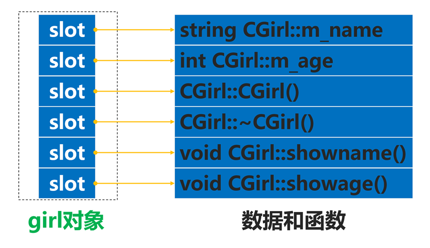

C++类中有两种数据成员：nonstatic、static，三种函数成员：nonstatic、static、virtual。

- 对象内存的大小包括：1）所有非静态数据成员的大小；2）由内存对齐而填补的内存大小；3）为了支持virtual成员而产生的额外负担。

- 静态成员变量属于类，不计算在对象的大小之内。

- 成员函数是分开存储的，不论对象是否存在都占用存储空间，在内存中只有一个副本，也不计算在对象大小之内。

- 用空指针可以调用没有用到this指针的非静态成员函数。

- 对象的地址是第一个非静态成员变量的地址，如果类中没有非静态成员变量，编译器会隐含的增加一个1字节的占位成员。

```
#include <iostream>         // 包含头文件。
using namespace std;        // 指定缺省的命名空间。

class CGirl       // 超女类CGirl。
{
public:
    char    m_name[3];              // 姓名属性。
    int       m_bh;                        // 编号属性。
    static int       m_age;                      // 年龄属性。

    // 默认构造函数和析构函数。
    CGirl() { memset(m_name, 0, sizeof(m_name)); m_age = 0;  }
    ~CGirl() {  }
    // 显示超女的姓名。
    void showname() { if (this == nullptr) return;  cout << "姓名：" << this->m_name << endl; }
    // 显示超女的年龄。
    void showage() { cout << "年龄：" << m_age << endl; }
};

int CGirl::m_age;
int aaa;
void func() {}

int main()
{
    CGirl g;
    cout << "对象g占用的内存大小是：" << sizeof(g) << endl;
    cout << "对象g的地址是：" << (void*)&g << endl;
    cout << "成员变量m_bh的地址是：" << (void*)&g.m_bh << endl;
    cout << "成员变量m_name的地址是：" << (void*)&g.m_name << endl;
    cout << "成员变量m_age的地址是：" << (void *)&g.m_age << endl;
    cout << "全局变量aaa的地址是：" << (void*)&aaa << endl;
    printf("成员函数showname的地址是：%p\n", &CGirl::showname);
    printf("成员函数showage的地址是：%p\n", &CGirl::showage);
    printf("函数func()的地址是：%p\n", func);

    CGirl* g1 = nullptr;
    g1->showname();
}
```

## 友元

如果要访问类的私有成员变量，调用类的公有成员函数是唯一的办法，而类的私有成员函数则无法访问。

友元提供了另一访问类的私有成员的方案。友元有三种：

- 友元全局函数。

- 友元类。

- 友元成员函数。

**1**）友元全局函数

 在友元全局函数中，可以访问另一个类的所有成员。

**2**）友元类

在友元类所有成员函数中，都可以访问另一个类的所有成员。

友元类的注意事项：

- 友元关系不能被继承。

- 友元关系是单向的，不具备交换性。

若类B是类A的友元，类A不一定是类B的友元。B是类A的友元，类C是B的友元，类C不一定是类A的友元，要看类中是否有相应的声明。

**3**）友元成员函数

在友元成员函数中，可以访问另一个类的所有成员。

如果要把男朋友类CBoy的某成员函数声明为超女类CGirl的友元，声明和定义的顺序如下：

```
class CGirl;            // 前置声明。   
class CBoy { ...... };      // CBoy的定义。
class CGirl { ...... };      // CGirl的定义。
                                      
// 友元成员函数的定义。               
void CBoy::func(CGirl &g) { ...... }       
```

```
#include <iostream>         // 包含头文件。
using namespace std;        // 指定缺省的命名空间。

class CGirl       // 超女类CGirl。
{
    friend int main();
    friend void func();
public:
    string    m_name;   // 姓名。
    // 默认构造函数。
    CGirl() { m_name = "西施";  m_xw = 87; }
    // 显示姓名的成员函数。
    void showname() { cout << "姓名：" << m_name << endl; }
private:
    int         m_xw;        // 胸围。
    // 显示胸围的成员函数。
    void showxw() { cout << "胸围：" << m_xw << endl; }
};

void func()
{
    CGirl g;
    g.showname();
    g.showxw();
}

int main()
{
    func();
}

///////////////////////////////////////////////////////////////////////////////////////
#include <iostream>         // 包含头文件。
using namespace std;        // 指定缺省的命名空间。

class CGirl       // 超女类CGirl。
{
    friend class CBoy;
public:
    string    m_name;   // 姓名。
    // 默认构造函数。
    CGirl() { m_name = "西施";  m_xw = 87; }
    // 显示姓名的成员函数。
    void showname() { cout << "姓名：" << m_name << endl; }
private:
    int         m_xw;        // 胸围。
    // 显示胸围的成员函数。
    void showxw() const { cout << "胸围：" << m_xw << endl; }
};

class CBoy    // 超女的男朋友类
{
public:
    void func(const CGirl& g)
    {
        cout << "我女朋友的姓名是：" << g.m_name << endl;
        cout << "我女朋友的胸围是：" << g.m_xw << endl;
        g.showxw();
    }
};
```

```
int main()
{
    CGirl g;
    CBoy b;
    b.func(g);
}

///////////////////////////////////////////////////////////////////////////////////////

#include <iostream>         // 包含头文件。
using namespace std;        // 指定缺省的命名空间。

class CGirl;      // 把超女类的声明前置

class CBoy    // 超女的男朋友类
{
public:
    void func1(const CGirl& g);
    void func2(const CGirl& g);
};

class CGirl       // 超女类CGirl。
{
    friend void CBoy::func1(const CGirl& g);
    // friend void CBoy::func2(const CGirl& g);
public:
    string    m_name;   // 姓名。
    // 默认构造函数。
    CGirl() { m_name = "西施";  m_xw = 87; }
    // 显示姓名的成员函数。
    void showname() { cout << "姓名：" << m_name << endl; }
private:
    int         m_xw;        // 胸围。
    // 显示胸围的成员函数。
    void showxw() const { cout << "胸围：" << m_xw << endl; }
};

void CBoy::func1(const CGirl& g) { cout << "func1()我女朋友的胸围是：" << g.m_xw << endl; }
void CBoy::func2(const CGirl& g) { cout << "func2()我女朋友的姓名是：" << g.m_name << endl; }

int main()
{
    CGirl g;
    CBoy b;
    b.func2(g);
    b.func1(g);
}
```

## 运算符重载基础

C++将运算符重载扩展到自定义的数据类型，它可以让对象操作更美观。

例如字符串string用加号（+）拼接、cout用两个左尖括号（<<）输出。

运算符重载函数的语法：返回值 operator运算符(参数列表);

运算符重载函数的返回值类型要与运算符本身的含义一致。

非成员函数版本的重载运算符函数：形参个数与运算符的操作数个数相同；

成员函数版本的重载运算符函数：形参个数比运算符的操作数个数少一个，其中的一个操作数隐式传递了调用对象。

如果同时重载了非成员函数和成员函数版本，会出现二义性。

**注意：**

1）返回自定义数据类型的引用可以让多个运算符表达式串联起来。（不要返回局部变量的引用）

2）重载函数参数列表中的顺序决定了操作数的位置。

3）重载函数的参数列表中至少有一个是用户自定义的类型，防止程序员为内置数据类型重载运算符。

4）如果运算符重载既可以是成员函数也可以是全局函数，应该优先考虑成员函数，这样更符合运算符重载的初衷。

5）重载函数不能违背运算符原来的含义和优先级。

6）不能创建新的运算符。

7）以下运算符不可重载：

```
sizeof             sizeof运算符
.                  成员运算符
.*                 成员指针运算符
::                 作用域解析运算符
?:                 条件运算符
typeid            一个RTTI运算符
const_cast        强制类型转换运算符
dynamic_cast     强制类型转换运算符
reinterpret_cast   强制类型转换运算符
static_cast        强制类型转换运算符
```

8）以下运算符只能通过成员函数进行重载：

```
=                赋值运算符
()                函数调用运算符
[]                下标运算符
->               通过指针访问类成员的运算符
```

```
#include <iostream>         // 包含头文件。
using namespace std;        // 指定缺省的命名空间。

class CGirl       // 超女类CGirl。
{
    friend CGirl &operator+(CGirl& g, int score);
    friend CGirl& operator+(int score, CGirl& g);
    friend CGirl& operator+(CGirl& g1, CGirl& g2);
private:
    int         m_xw;        // 胸围。
    int         m_score;    // 分数。
public:
    string    m_name;   // 姓名。

    // 默认构造函数。
    CGirl() { m_name = "西施";  m_xw = 87;  m_score = 30; }
    // 自我介绍的方法。
    void show() { cout << "姓名：" << m_name << "，胸围：" << m_xw << "，评分：" << m_score << endl; }

    //CGirl& operator-(int score)    // 给超女减分的函数。
    //{
    //    m_score = m_score - score;
    //    return *this;
    //}
};

CGirl& operator+(CGirl& g, int score)    // 给超女加分的函数。
{
    g.m_score = g.m_score + score;
    return g;
}
CGirl& operator+(int score,CGirl& g)    // 给超女加分的函数。
{
    g.m_score = g.m_score + score;
    return g;
}
CGirl& operator+(CGirl& g1, CGirl& g2)    // 给超女加分的函数。
{
    g1.m_score = g1.m_score + g2.m_score;
    return g1;
}

int main()
{
    // 导演的要求：每轮表演之后，给超女加上她的得分。
    CGirl g;
    g =  g+g;
    g.show();
}
```

## 重载关系运算符

重载关系运算符（==、!=、>、>=、<、<=）用于比较两个自定义数据类型的大小。

可以使用非成员函数和成员函数两种版本，建议采用成员函数版本。

```
#include <iostream>         // 包含头文件。
using namespace std;        // 指定缺省的命名空间。

class CGirl       // 超女类CGirl。
{
    string    m_name;     // 姓名。
    int         m_yz;           // 颜值：1-千年美人；2-百年美人；3-绝代美人；4-极漂亮；5-漂亮；6-一般；7-歪瓜裂枣。
    int         m_sc;           // 身材：1-火辣；2-...；3-...；4-...；5-...；6-...；7-膘肥体壮。
    int         m_acting;    // 演技：1-完美；2-...；3-...；4-...；5-...；6-...；7-四不像。
public:
    // 四个参数的构造函数。
    CGirl(string name, int yz, int sc, int acting) { m_name = name;  m_yz = yz;  m_sc = sc; m_acting = acting; }
    // 比较两个超女的商业价值。
    bool operator==(const CGirl& g1)      // 相等==
    {
        if ((m_yz + m_sc + m_acting) == (g1.m_yz + g1.m_sc + g1.m_acting)) return true;
        return false;
    }
    bool operator>(const CGirl& g1)      // 大于>
    {
        if ((m_yz + m_sc + m_acting) < (g1.m_yz + g1.m_sc + g1.m_acting)) return true;
        return false;
    }
    bool operator<(const CGirl& g1)      // 小于<
    {
        if ((m_yz + m_sc + m_acting) > (g1.m_yz + g1.m_sc + g1.m_acting)) return true;
        return false;
    }
};

int main()
{
    CGirl  g1("西施", 1, 2, 2), g2("冰冰", 1, 1, 1);
      
    if (g1==g2)
        cout << "西施和冰冰的商业价值相同。\n";
    else
        if (g1>g2)
            cout << "西施商业价值相同比冰冰大。\n";
        else
            cout << "冰冰商业价值相同比西施大。\n";
}
```

## 重载左移运算符

重载左移运算符（<<）用于输出自定义对象的成员变量，在实际开发中很有价值（调试和日志）。

只能使用非成员函数版本。

如果要输出对象的私有成员，可以配合友元一起使用。

```c++
#include <iostream>         // 包含头文件。
using namespace std;        // 指定缺省的命名空间。

class CGirl       // 超女类CGirl。
{
    friend ostream& operator<<(ostream& cout, const CGirl& g);
    string    m_name;   // 姓名。
    int         m_xw;        // 胸围。
    int         m_score;    // 评分。
public:
    // 默认构造函数。
    CGirl() { m_name = "西施";  m_xw = 87;  m_score = 30; }
    
    // 自我介绍的方法。
    void show() { cout << "姓名：" << m_name << "，胸围：" << m_xw << "，评分：" << m_score << endl; }
};

ostream& operator<<(ostream& cout, const CGirl& g)
{
    cout << "姓名：" << g.m_name << "，胸围：" << g.m_xw << "，评分：" << g.m_score;
    return cout;
}

int main()
{
    CGirl g;
    cout << g << endl;
}
```

##  重载下标运算符

如果对象中有数组，重载下标运算符[]，操作对象中的数组将像操作普通数组一样方便。

下标运算符必须以成员函数的形式进行重载。

下标运算符重载函数的语法：

```

返回值类型 &perator[](参数);
```

或者：

```
const 返回值类型 &operator[](参数) const;
```

使用第一种声明方式，[]不仅可以访问数组元素，还可以修改数组元素。

使用第二种声明方式，[]只能访问而不能修改数组元素。

在实际开发中，我们应该同时提供以上两种形式，这样做是为了适应const对象，因为通过const 对象只能调

const成员函数，如果不提供第二种形式，那么将无法访问const对象的任何数组元素。

在重载函数中，可以对下标做合法性检查，防止数组越界。

```
#include <iostream>         // 包含头文件。
using namespace std;        // 指定缺省的命名空间。

class CGirl       // 超女类CGirl。
{
private:
    string    m_boys[3];       // 超女的男朋友
public:
    string    m_name;          // 姓名。

    // 默认构造函数。
    CGirl() { m_boys[0] = "子都"; m_boys[1] = "潘安"; m_boys[2] = "宋玉"; }
    // 显示全部男朋友的姓名。
    void show() { cout << m_boys[0] << "、" << m_boys[1] << "、" << m_boys[2] << endl; }
    string& operator[](int ii)
    {
        return m_boys[ii];
    }
    const string& operator[](int ii) const
    {
        return m_boys[ii];
    }
};

int main()
{
    CGirl g;          // 创建超女对象。
    g[1] = "王麻子";
    cout << "第1任男朋友：" << g[1] << endl;
    g.show();

    const CGirl g1 = g;
    cout << "第1任男朋友：" << g1[1] << endl;
}
```

## 重载赋值运算符

C++编译器可能会给类添加四个函数：

- 默认构造函数，空实现。

- 默认析构函数，空实现。

- 默认拷贝构造函数，对成员变量进行浅拷贝。

- 默认赋值函数, 对成员变量进行浅拷贝。

对象的赋值运算是用一个已经存在的对象，给另一个已经存在的对象赋值。

如果类的定义中没有重载赋值函数，编译器就会提供一个默认赋值函数。

如果类中重载了赋值函数，编译器将不提供默认赋值函数。

重载赋值函数的语法：类名 & operator=(const 类名 & 源对象);

注意：

- 编译器提供的默认赋值函数，是浅拷贝。

- 如果对象中不存在堆区内存空间，默认赋值函数可以满足需求，否则需要深拷贝。

- 赋值运算和拷贝构造不同：拷贝构造是指原来的对象不存在，用已存在的对象进行构造；赋值运算是指已经存在了两个对象，把其中一个对象的成员变量的值赋给另一个对象的成员变量。

```
#include <iostream>         // 包含头文件。
using namespace std;        // 指定缺省的命名空间。
                     
class CGirl       // 超女类CGirl。
{
public:
    int         m_bh;               // 编号。
    string    m_name;          // 姓名。
    int*        m_ptr;              // 计划使用堆区内存。
                        
    CGirl() { m_ptr = nullptr; }
    ~CGirl() { if (m_ptr)  delete m_ptr;  }
    // 显示全部成员变量。
    void show() { cout << "编号：" << m_bh << "，姓名：" << m_name << "，m_ptr=" << m_ptr <</* "，*m_ptr=" << *m_ptr<< */endl; }
    CGirl& operator=(const CGirl& g)
    {
        if (this == &g) return *this;          // 如果是自己给自己赋值。
        
        if (g.m_ptr == nullptr)    // 如果源对象的指针为空，则清空目标对象的内存和指针。
        {
            if (m_ptr != nullptr) { delete m_ptr; m_ptr = nullptr; }
        }
        else    // 如果源对象的指针不为空。
        {
            // 如果目标对象的指针为空，先分配内存。
            if (m_ptr == nullptr) m_ptr = new int;
            // 然后，把源对象内存中的数据复制到目标对象的内存中。
            memcpy(m_ptr, g.m_ptr, sizeof(int));
        }
                  
        m_bh = g.m_bh; m_name = g.m_name;
        cout << "调用了重载赋值函数。\n" << endl; 
        return *this;
    }
};
                         
int main()
{
    CGirl g1, g2;          // 创建超女对象。
    g1.m_bh = 8; g1.m_name = "西施"; g1.m_ptr = new int(3);
    g1.show();
    g2.show();
              
    g2 = g1;  
    g2.show(); 
    cout << "*g1.m_ptr=" << *g1.m_ptr << "，*g2.m_ptr=" << *g2.m_ptr << endl;
}
```

## 重载new&delete运算符

重载new和delete运算符的目是为了自定义内存分配的细节。（内存池：快速分配和归还，无碎片）

建议先学习C语言的内存管理函数malloc()和free()。

在C++中，使用new时，编译器做了两件事情：

1）调用标准库函数operator new()分配内存；

2）调用构造函数初始化内存；

使用delete时，也做了两件事情：

1）调用析构函数；

2）调用标准库函数operator delete()释放内存。

构造函数和析构函数由编译器调用，我们无法控制。但是，可以重载内存分配函数operator new()和释放函数operator delete()。

1）重载内存分配函数的语法：void* operator new(size_t size);  

- 参数必须是size_t，返回值必须是void*。

2）重载内存释放函数的语法：void operator delete(void* ptr)  

- 参数必须是void *（指向由operator new()分配的内存），返回值必须是void。

- 重载的new和delete可以是全局函数，也可以是类的成员函数。

- 为一个类重载new和delete时，尽管不必显式地使用static，但实际上仍在创建static成员函数。

- 编译器看到使用new创建自定义的类的对象时，它选择成员版本的operator new()而不是全局版本的new()。

- new[]和delete[]也可以重载。

```c++
#include <iostream>         // 包含头文件。
using namespace std;        // 指定缺省的命名空间。
                   
void* operator new(size_t size)   // 参数必须是size_t（unsigned long long），返回值必须是void*。
{
	cout << "调用了全局重载的new：" << size << "字节。\n";
	void* ptr = malloc(size);        // 申请内存。
	cout << "申请到的内存的地址是：" << ptr << endl;
	return ptr;
}
                
void operator delete(void* ptr)   // 参数必须是void *，返回值必须是void。
{
	cout << "调用了全局重载的delete。\n";
	if (ptr == 0) return;       // 对空指针delete是安全的。
	free(ptr);      // 释放内存。
}
          
class CGirl       // 超女类CGirl。
{
public:
	int        m_bh;               // 编号。
	int        m_xw;               // 胸围。
                               
	CGirl(int bh, int xw) { m_bh = bh, m_xw = xw;  cout << "调用了构造函数CGirl()\n"; }
	~CGirl() { cout << "调用了析构函数~CGirl()\n"; }
	void* operator new(size_t size)   // 参数必须是size_t（unsigned long long），返回值必须是void*。
	{
		cout << "调用了类的重载的new：" << size << "字节。\n";
		void* ptr = malloc(size);        // 申请内存。
		cout << "申请到的内存的地址是：" << ptr << endl;
		return ptr;
	}
         
	void operator delete(void* ptr)   // 参数必须是void *，返回值必须是void。
	{
		cout << "调用了类的重载的delete。\n";
		if (ptr == 0) return;       // 对空指针delete是安全的。
		free(ptr);      // 释放内存。
	}
};    
     
int main()
{
	int* p1 = new int(3);
	cout << "p1=" << (void *)p1 <<"，*p1=" <<*p1<< endl;
	delete p1;
             
	CGirl* p2 = new CGirl(3, 8);
	cout << "p2的地址是：" << p2 << "编号：" << p2->m_bh << "，胸围：" << p2->m_xw << endl;
	delete p2;
}
```

内存池示例：

```
#include <iostream>         // 包含头文件。
using namespace std;        // 指定缺省的命名空间。
                  
class CGirl       // 超女类CGirl。
{
public:
	int        m_bh;               // 编号。
	int        m_xw;               // 胸围。
	static char*    m_pool;           // 内存池的起始地址。
                 
	static bool initpool()             // 个初始化内存池的函数。
	{
		m_pool = (char*)malloc(18);           // 向系统申请18字节的内存。
		if (m_pool == 0)  return false;        // 如果申请内存失败，返回false。
		memset(m_pool, 0, 18);                  // 把内存池中的内容初始化为0。
		cout << "内存池的起始地址是：" << (void*)m_pool << endl;
		return true;
	}
               
	static void freepool()                                     // 释放内存池。
	{
		if (m_pool == 0) return;                  // 如果内存池为空，不需要释放，直接返回。
		free(m_pool);                                        // 把内存池归还给系统。
		cout << "内存池已释放。\n";
	}
               
	CGirl(int bh, int xw) { m_bh = bh, m_xw = xw;  cout << "调用了构造函数CGirl()\n"; }
	~CGirl() { cout << "调用了析构函数~CGirl()\n"; }
             
	void* operator new(size_t size)   // 参数必须是size_t（unsigned long long），返回值必须是void*。
	{
		if (m_pool[0] == 0)      // 判断第一个位置是否空闲。
		{
			cout << "分配了第一块内存：" << (void*)(m_pool + 1) << endl;
			m_pool[0] = 1;         // 把第一个位置标记为已分配。
			return m_pool + 1;  // 返回第一个用于存放对象的址。
		}
		if (m_pool[9] == 0)          // 判断第二个位置是否空闲。
		{
			cout << "分配了第二块内存：" << (void*)(m_pool + 9) << endl;
			m_pool[9] = 1;             // 把第二个位置标记为已分配。
			return m_pool + 9;      // 返回第二个用于存放对象的址。
		}
		
		// 如果以上两个位置都不可用，那就直接系统申请内存。
		void* ptr = malloc(size);        // 申请内存。
		cout << "申请到的内存的地址是：" << ptr << endl;
		return ptr;
	}
              
	void operator delete(void* ptr)   // 参数必须是void *，返回值必须是void。
	{
		if (ptr == 0) return;      // 如果传进来的地址为空，直接返回。
                
		if (ptr == m_pool + 1)      // 如果传进来的地址是内存池的第一个位置。
		{
			cout << "释放了第一块内存。\n";
			m_pool[0] = 0;              // 把第一个位置标记为空闲。
			return;
		}
                
		if (ptr == m_pool + 9)      // 如果传进来的地址是内存池的第二个位置。
		{
			cout << "释放了第二块内存。\n";
			m_pool[9] = 0;              // 把第二个位置标记为空闲。
			return;
		}
                 
		// 如果传进来的地址不属于内存池，把它归还给系统。
		free(ptr);      // 释放内存。
	}
};
                      
char* CGirl::m_pool = 0;       // 初始化内存池的指针。
                  
int main()
{           
	// 初始化内存池。
	if (CGirl::initpool()==false) { cout << "初始化内存池失败。\n"; return -1; }

	CGirl* p1 = new CGirl(3, 8);       // 将使用内存池的第一个位置。
	cout << "p1的地址是：" << p1 << "，编号：" << p1->m_bh << "，胸围：" << p1->m_xw << endl;
                  
	CGirl* p2 = new CGirl(4, 7);       // 将使用内存池的第二个位置。
	cout << "p2的地址是：" << p2 << "，编号：" << p2->m_bh << "，胸围：" << p2->m_xw << endl;
                    
	CGirl* p3 = new CGirl(6, 9);       // 将使用系统的内存。
	cout << "p3的地址是：" << p3 << "，编号：" << p3->m_bh << "，胸围：" << p3->m_xw << endl;
                 
	delete p1;    // 将释放内存池的第一个位置。
                 
	CGirl* p4 = new CGirl(5, 3);        // 将使用内存池的第一个位置。
	cout << "p4的地址是：" << p4 << "，编号：" << p4->m_bh << "，胸围：" << p4->m_xw << endl;
        
	delete p2;    // 将释放内存池的第二个位置。
	delete p3;    // 将释放系统的内存。
	delete p4;    // 将释放内存池的第一个位置。
                
	CGirl::freepool();     // 释放内存池。
}

```

## 重载括号运算符

括号[运算符](https://so.csdn.net/so/search?q=运算符&spm=1001.2101.3001.7020)()也可以重载，对象名可以当成函数来使用（函数对象、仿函数）。

括号运算符重载函数的语法：

返回值类型 operator()(参数列表);

注意：

- 括号运算符必须以成员函数的形式进行重载。

- 括号运算符重载函数具备普通函数全部的特征。

- 如果函数对象与全局函数同名，按作用域规则选择调用的函数。

函数对象的用途：

1）表面像函数，部分场景中可以代替函数，在STL中得到广泛的应用；

2）函数对象本质是类，可以用成员变量存放更多的信息；

3）函数对象有自己的数据类型；

4）可以提供继承体系。

```
#include <iostream>         // 包含头文件。
using namespace std;        // 指定缺省的命名空间。
           
void show(string str)    // 向超女表白的函数。
{
	cout << "普通函数：" << str << endl;
}
          
class CGirl      // 超女类。
{
public:
	void operator()(string str)    // 向超女表白的函数。
	{
		cout << "重载函数：" << str << endl;
	}
};
           
int main()
{
	CGirl show;
	::show("我是一只傻傻鸟。");
	show("我是一只傻傻鸟。");
}
```

## 重载一元运算符

可重载的一元运算符。

```
1）++ 自增    2）-- 自减   3）! 逻辑非   4）& 取地址

5）~ 二进制反码  6）* 解引用  7）+ 一元加  8） - 一元求反
```

一元运算符通常出现在它们所操作的对象的左边。

但是，自增运算符++和自减运算符--有前置和后置之分。

C++ 规定，重载++或--时，如果重载函数有一个int形参，编译器处理后置表达式时将调用这个重载函数。

成员函数版：CGirl &operator++();       // ++前置

成员函数版：CGirl operator++(int);      // 后置++

非成员函数版：CGirl &operator++(CGirl &);  // ++前置

非成员函数版：CGirl operator++(CGirl &,int); // 后置++

```
#include <iostream>         // 包含头文件。
using namespace std;        // 指定缺省的命名空间。
          
class CGirl       // 超女类CGirl。
{
public:
    string    m_name;     // 姓名。
    int         m_ranking;  // 排名。
               
    // 默认构造函数。
    CGirl() { m_name = "西施";  m_ranking = 5; }
    // 自我介绍的方法。
    void show() const { cout << "姓名：" << m_name << "，排名：" << m_ranking << endl; }
    CGirl & operator++()         // ++前置的重载函数。
    {
        m_ranking++; return *this;
    }
    CGirl operator++(int)     // ++后置的重载函数。
    {
        CGirl tmp = *this;
        m_ranking++; 
        return tmp;
    }
};
                
int main()
{
    CGirl g1,g2;        // 创建超女对象。
    int ii=5 , jj=5;
    int xx = ++(++(++ii));        cout << "xx=" << xx << ",ii=" << ii << endl;
    int yy = jj++;                       cout << "yy=" << yy << ",jj=" << jj << endl;
    CGirl g3 = ++(++(++g1));   cout << "g3.m_ranking=" << g3.m_ranking << ",g1.m_ranking=" << g1.m_ranking << endl;
    CGirl g4 = g2++;                   cout << "g4.m_ranking=" << g4.m_ranking << ",g2.m_ranking=" << g2.m_ranking << endl;
    // g2.show();
}
```

## 自动类型转换

对于内置类型，如果两种数据类型是兼容的，C++可以自动转换，如果从更大的数转换为更小的数，可能会被截断或损失精度。

```
long count = 8;        // int转换为long
double time = 11;      // int转换为double
int side = 3.33         // double转换为int的3
```

C++不自动转换不兼容的类型，下面语句是非法的：

```
int* ptr = 8;
```

不能自动转换时，可以使用强制类型转换：

```
int* p = (int*)8; 
```

**如果某种类型与类相关，从某种类型转换为类类型是有意义的。**

```
string str = "我是一只傻傻鸟。";
```

在C++中，将一个参数的构造函数用作自动类型转换函数，它是自动进行的，不需要显式的转换。

```
CGirl g1(8);          // 常规的写法。
CGirl g1 = CGirl(8);   // 显式转换。
CGirl g1 = 8;         // 隐式转换。
CGirl g1;             // 创建对象。
g1 = 8;              // 隐式转换，用CGirl(8)创建临时对象，再赋值给g。
```

注意：

1）一个类可以有多个转换函数。

2）多个参数的构造函数，除第一个参数外，如果其它参数都有缺省值，也可以作为转换函数。

3）CGirl(int)的隐式转换的场景：

- 将CGirl对象初始化为int值时。  CGirl g1 = 8;

- 将int值赋给CGirl对象时。    CGirl g1; g1 = 8;

- 将int值传递给接受CGirl参数的函数时。

- 返回值被声明为CGirl的函数试图返回int值时。

- 在上述任意一种情况下，使用可转换为int类型的内置类型时。

4）如果自动类型转换有二义性，编译将报错。

将构造函数用作自动类型转换函数似乎是一项不错的特性，但有时候会导致意外的类型转换。explicit关键字用于关闭这种自动特性，但仍允许显式转换。

```
explicit CGirl(int bh);
CGirl g=8;        // 错误。
CGirl g=CGirl(8);  // 显式转换，可以。
CGirl g=(CGirl)8;  // 显式转换，可以。
```

在实际开发中，如果强调的是构造，建议使用explicit，如果强调的是类型转换，则不使用explicit。

```
#include <iostream>         // 包含头文件。
using namespace std;        // 指定缺省的命名空间。
           
class CGirl       // 超女类CGirl。
{           
public:
    int         m_bh;           // 编号。
    string    m_name;     // 姓名。
    double  m_weight;   // 体重，单位：kg。
                
    // 默认构造函数。
    CGirl() { m_bh = 0;  m_name.clear();  m_weight = 0; cout << "调用了CGirl()\n"; }
    // 自我介绍的方法。
    void show() { cout << "bh=" << m_bh << ",name=" << m_name << ",weight=" << m_weight << endl; }
    explicit CGirl(int bh) { m_bh = bh;  m_name.clear();  m_weight = 0; cout << "调用了CGirl(int bh)\n"; }
    //CGirl(double weight) { m_bh = 0;  m_name.clear();  m_weight = weight; cout << "调用了CGirl(double weight)\n"; }
};     
          
int main()
{       
    //CGirl g1(8);                // 常规的写法。
    //CGirl g1 = CGirl(8);   // 显式转换。
    //CGirl g1 = 8;             // 隐式转换。
    CGirl g1;                    // 创建对象。
    g1 = (CGirl)8;                      // 隐式转换，用CGirl(8)创建临时对象，再赋值给g。
    //CGirl g1 = 8.7;             // 隐式转换。
    //g1.show();
}    
```

## 转换函数

构造函数只用于从某种类型到类类型的转换，如果要进行相反的转换，可以使用特殊的运算符函数-转换函数。

语法：operator 数据类型();

**注意：转换函数必须是类的成员函数；不能指定返回值类型；不能有参数。**

可以让编译器决定选择转换函数（隐式转换），可以像使用强制类型转换那样使用它们（显式转换）。

```
int ii=girl;       // 隐式转换。
int ii=(int) girl;  // 显式转换。
int ii=int(girl);   // 显式转换。
```

如果隐式转换存在二义性，编译器将报错。

在C++98中，关键字explicit不能用于转换函数，但C++11消除了这种限制，可以将转换函数声明为显式的。

还有一种方法是：用一个功能相同的普通成员函数代替转换函数，普通成员函数只有被调用时才会执行。

```
int ii=girl.to_int();
```

警告：应谨慎的使用隐式转换函数。通常，最好选择仅在被显式地调用时才会执行的成员函数。

```
#include <iostream>         // 包含头文件。
using namespace std;        // 指定缺省的命名空间。
         
class CGirl       // 超女类CGirl。
{   
public:
    int         m_bh;           // 编号。
    string    m_name;     // 姓名。
    double  m_weight;   // 体重，单位：kg。
               
    // 默认构造函数。
    CGirl() { m_bh = 8;  m_name="西施";  m_weight = 50.7; }
    explicit operator int()  { return m_bh; }
    int to_int() { return m_bh; }
    operator string() { return m_name; }
    explicit operator double() { return m_weight; }
};    
            
int main()
{         
    string name = "西施";                 // char * 转换成 string
    const char* ptr = name;             // string 转换成 char *，错误
    const char* ptr = name.c_str();  // 返回char *，正确
            
    CGirl g;
    int a = g.to_int();         cout << "a的值是：" << a << endl;
    string b = string(g);    cout << "b的值是：" << b << endl;
    double c = double(g);  cout << "c的值是：" << c << endl;
    short d = (int)g;
}
```

## 继承的基本概念

继承可以理解为一个类从另一个类获取成员变量和成员函数的过程。

语法：

```
class 派生类名:［继承方式］基类名
{
  派生类新增加的成员
}; 
```

被继承的类称为基类或父类，继承的类称为派生类或子类。

继承和派生是一个概念，只是站的角度不同。

派生类除了拥有基类的成员，还可以定义新的成员，以增强其功能。

使用继承的场景：

1) 如果新创建的类与现有的类相似，只是多出若干成员变量或成员函数时，可以使用继承。
2) 当需要创建多个类时，如果它们拥有很多相似的成员变量或成员函数，可以将这些类共同的成员提取出来，定义为基类，然后从基类继承。

```
#include <iostream>         // 包含头文件。
using namespace std;        // 指定缺省的命名空间。
           
class CAllComers          // 海选报名者类
{           
public:
    string    m_name;    // 姓名
    string    m_tel;         // 联系电话
                 
    // 构造函数。
    CAllComers() { m_name = "某女"; m_tel = "不详"; }
    // 报名时需要唱一首歌。
    void sing() { cout << "我是一只小小鸟。\n"; }
    // 设置姓名。
    void setname(const string& name) { m_name = name; }
    // 设置电话号码。
    void settel(const string& tel) { m_tel = tel; }
};     
         
class CGirl :public CAllComers        // 超女类
{           
public:
    int m_bh;          // 编号。
    CGirl() { m_bh = 8;  }
    void show() { cout << "编号：" << m_bh << "，姓名：" << m_name << "，联系电话：" << m_tel << endl; }
};           
             
int main()
{        
    CGirl g;
    g.setname("西施");
    g.show();
}
```

## 继承方式

类成员的访问权限由高到低依次为：public --> protected --> private，public成员在类外可以访问，private成员只能在类的成员函数中访问。

如果不考虑继承关系，protected成员和private成员一样，类外不能访问。但是，当存在继承关系时，protected和private就不一样了。基类中的protected成员可以在派生类中访问，而基类中的 private成员不能在派生类中访问。

继承方式有三种：public（公有的）、protected（受保护的）和[private](https://so.csdn.net/so/search?q=private&spm=1001.2101.3001.7020)（私有的）。它是可选的，如果不写，那么默认为private。不同的继承方式决定了在派生类中成员函数中访问基类成员的权限。

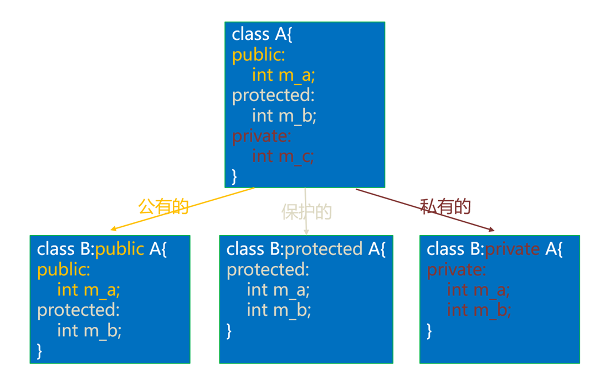

1）基类成员在派生类中的访问权限不得高于继承方式中指定的权限。例如，当继承方式为protected时，那么基类成员在派生类中的访问权限最高也为protected，高于protected的会降级为protected，但低于protected不会升级。再如，当继承方式为public时，那么基类成员在派生类中的访问权限将保持不变。

也就是说，继承方式中的public、protected、private是用来指明基类成员在派生类中的最高访问权限的。

2) **不管继承方式如何，基类中的private成员在派生类中始终不能使用**（不能在派生类的成员函数中访问或调用）。
3) 如果希望基类的成员能够被派生类继承并且毫无障碍地使用，那么这些成员只能声明为public 或protected；只有那些不希望在派生类中使用的成员才声明为private。
4) 如果希望基类的成员既不向外暴露（不能通过对象访问），还能在派生类中使用，那么只能声明为 protected。

由于private和protected继承方式会改变基类成员在派生类中的访问权限，导致继承关系复杂，所以，**在实际开发中，一般使用public**。

**在派生类中，可以通过基类的公有成员函数间接访问基类的私有成员。**

**使用 using 关键字可以改变基类成员在派生类中的访问权限。**

注意：using只能改变基类中public和protected成员的访问权限，不能改变private成员的访问权限，因为基类中的private成员在派生类中是不可见的，根本不能使用。

```
#include <iostream>         // 包含头文件。
using namespace std;        // 指定缺省的命名空间。

class A  {        // 基类
public:
    int m_a=10;
protected:
    int m_b=20;
private:
    int m_c = 30;
};

class B :public A        // 派生类
{
public:
    using A::m_b;         // 把m_b的权限修改为公有的。
private:
    using A::m_a;         // 把m_a的权限修改为私有的。
};

int main()
{
    B b;   
    // b.m_a = 11;
    b.m_b = 21;
    //b.m_c = 21;
}
```

## 继承的对象模型

1）创建派生类对象时，先调用基类的构造函数，再调用派生类的构造函数。

2）销毁派生类对象时，先调用派生类的析构函数，再调用基类的析构函数。**如果手工调用派生类的析构函数，也会调用基类的析构函数。**

3）创建派生类对象时只会申请一次内存，派生类对象包含了基类对象的内存空间，this指针相同的。

4）创建派生类对象时，先初始化基类对象，再初始化派生类对象。

5）在VS中，用cl.exe可以查看类的内存模型。

6）对派生类对象用sizeof得到的是基类所有成员（包括私有成员）+派生类对象所有成员的大小。

7）在C++中，不同继承方式的访问权限只是语法上的处理。

8）对派生类对象用memset()会清空基类私有成员。

9）用指针可以访问到基类中的私有成员（内存对齐）。

查看对象内存布局的方法：

```
cl 源文件名 /d1 reportSingleClassLayout类名
```

**注意：类名不要太短，否则屏幕会显示一大堆东西，找起来很麻烦。**

例如，查看BBB类，源代码文件是demo01.cpp：

```
cl demo01.cpp /d1 reportSingleClassLayoutBBB
```

cl命令环境变量：

1）在PATH环境变量中增加cl.exe的目录

```
C:\Program Files\Microsoft Visual Studio\2022\Community\VC\Tools\MSVC\14.30.30705\bin\Hostx64\x64
```

2）增加INCLUDE环境变量，内容如下：

```
C:\Program Files\Microsoft Visual Studio\2022\Community\VC\Tools\MSVC\14.30.30705\include
C:\Program Files (x86)\Windows Kits\10\Include\10.0.19041.0\shared
C:\Program Files (x86)\Windows Kits\10\Include\10.0.19041.0\ucrt
C:\Program Files (x86)\Windows Kits\10\Include\10.0.19041.0\um
C:\Program Files (x86)\Windows Kits\10\Include\10.0.19041.0\winrt
```

3）增加LIB环境变量，内容如下：

```
C:\Program Files\Microsoft Visual Studio\2022\Community\VC\Tools\MSVC\14.30.30705\lib\x64
C:\Program Files (x86)\Windows Kits\10\Lib\10.0.19041.0\um\x64
C:\Program Files (x86)\Windows Kits\10\Lib\10.0.19041.0\ucrt\x64
```

```
#include <iostream>         // 包含头文件。
using namespace std;        // 指定缺省的命名空间。
            
void* operator new(size_t size)   // 重载new运算符。
{
    void* ptr = malloc(size);        // 申请内存。
    cout << "申请到的内存的地址是：" << ptr << "，大小是：" << size << endl;
    return ptr;
}
               
void operator delete(void* ptr)   // 重载delete运算符。
{
    if (ptr == 0) return;       // 对空指针delete是安全的。
    free(ptr);      // 释放内存。
    cout << "释放了内存。\n";
}
              
class A {        // 基类
public:
    int m_a = 10;
protected:
    int m_b = 20;
private:
    int m_c = 30;
public:
    A() {
        cout << "A中this指针是： " << this << endl;
        cout << "A中m_a的地址是：" << &m_a << endl;
        cout << "A中m_b的地址是：" << &m_b << endl;
        cout << "A中m_c的地址是：" << &m_c << endl;
    }
    void func() { cout << "m_a=" << m_a << ",m_b=" << m_b << ",m_c=" << m_c << endl; }
};
                 
class B :public A        // 派生类
{
public:
    int m_d = 40;
    B() {
        cout << "B中this指针是： " << this << endl;
        cout << "B中m_a的地址是：" << &m_a << endl;
        cout << "B中m_b的地址是：" << &m_b << endl;
        //cout << "B中m_c的地址是：" << &m_c << endl;
        cout << "B中m_d的地址是：" << &m_d << endl;
    }
    void func1() { cout << "m_d=" << m_d << endl; }
};
                
int main()
{
    cout << "基类占用内存的大小是：" << sizeof(A) << endl;
    cout << "派生类占用内存的大小是：" << sizeof(B) << endl;
              
    B *p=new B;
    p->func(); p->func1();
    // memset(p, 0, sizeof(B));
    *((int*)p + 2) = 31;        // 把基类私有成员m_c的值修改成31。
    p->func(); p->func1();
    delete p;
}
```

## 如何构造基类

派生类构造函数的要点如下： 

1）创建派生类对象时，程序首先调用基类构造函数，然后再调用派生类构造函数。

2）如果没以指定基类构造函数，将使用基类的默认构造函数。

3）可以用初始化列表指明要使用的基类构造函数。

4）基类构造函数负责初始化被继承的数据成员；派生类构造函数主要用于初始化新增的数据成员。

5）派生类的构造函数总是调用一个基类构造函数，包括拷贝构造函数。

```
#include <iostream>         // 包含头文件。
using namespace std;        // 指定缺省的命名空间。
               
class A {        // 基类
public:
    int m_a;
private:
    int m_b;
public:
    A() : m_a(0) , m_b(0)                     // 基类的默认构造函数。
    { 
        cout << "调用了基类的默认构造函数A()。\n";  
    }
    A(int a,int b) : m_a(a) , m_b(b)     // 基类有两个参数的构造函数。
    { 
        cout << "调用了基类的构造函数A(int a,int b)。\n";  
    }
    A(const A &a) : m_a(a.m_a+1) , m_b(a.m_b+1)   // 基类的拷贝构造函数。
    {
        cout << "调用了基类的拷贝构造函数A(const A &a)。\n";
    }
               
    // 显示基类A全部的成员。
    void showA() { cout << "m_a=" << m_a << ",m_b=" << m_b << endl; }
};
               
class B :public A        // 派生类
{        
public:
    int m_c;
    B() : m_c(0) , A()             // 派生类的默认构造函数，指明用基类的默认构造函数（不指明也无所谓）。
    {
        cout << "调用了派生类的默认构造函数B()。\n";
    }
    B(int a, int b, int c) : A(a, b), m_c(c)           // 指明用基类的有两个参数的构造函数。
    {
        cout << "调用了派生类的构造函数B(int a,int b,int c)。\n";
    }
    B(const A& a, int c) :A(a), m_c(c)              // 指明用基类的拷贝构造函数。
    {
        cout << "调用了派生类的构造函数B(const A &a,int c) 。\n";
    }
           
    // 显示派生类B全部的成员。
    void showB() { cout << "m_c=" << m_c << endl << endl; }
};          
             
int main()
{
    B b1;                 // 将调用基类默认的构造函数。
    b1.showA();     b1.showB();
       
    B b2(1, 2, 3);      // 将调用基类有两个参数的构造函数。
    b2.showA();     b2.showB();
            
    A a(10, 20);      // 创建基类对象。
    B b3(a, 30);      // 将调用基类的拷贝造函数。
    b3.showA();     b3.showB();
}    
```

## 名字遮蔽与类作用域

如果派生类中的成员（包括成员变量和成员函数）和基类中的成员重名，通过派生类对象或者在派生类的成员函数中使用该成员时，将使用派生类新增的成员，而不是基类的。

注意：基类的成员函数和派生类的成员函数不会构成重载，如果派生类有同名函数，那么就会遮蔽基类中的所有同名函数。

类是一种作用域，每个类都有它自己的作用域，在这个作用域之内定义成员。

在类的作用域之外，普通的成员只能通过对象（可以是对象本身，也可以是对象指针或对象引用）来访问，静态成员可以通过对象访问，也可以通过类访问。

在成员名前面加类名和域解析符可以访问对象的成员。

如果不存在继承关系，类名和域解析符可以省略不写。

当存在继承关系时，基类的作用域嵌套在派生类的作用域中。如果成员在派生类的作用域中已经找到，就不会在基类作用域中继续查找；如果没有找到，则继续在基类作用域中查找。

如果在成员的前面加上类名和域解析符，就可以直接使用该作用域的成员。

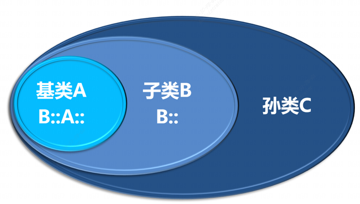

```c++
#include <iostream>         // 包含头文件。
using namespace std;        // 指定缺省的命名空间。
               
class A {        // 基类
public:
    int m_a=10;
    void func() { cout << "调用了A的func()函数。\n"; }
};
               
class B :public A {       // 子类
public:
    int m_a = 20;
    void func() { cout << "调用了B的func()函数。\n"; }
};
           
class C :public B {       // 孙类
public:
    int m_a = 30;
    void func() { cout << "调用了C的func()函数。\n"; }
    void show() {
        cout << "C::m_a的值是：" << C::m_a << endl;
        cout << "B::m_a的值是：" << B::m_a << endl;
        cout << "A::m_a的值是：" << B::A::m_a << endl;
    }
};
           
int main()
{           
    C c;
    cout << "C::m_a的值是：" << c.C::m_a << endl;
    cout << "B::m_a的值是：" << c.B::m_a << endl;
    cout << "A::m_a的值是：" << c.B::A::m_a << endl;
    c.C::func();
    c.B::func();
    c.B::A::func();
}
```

## 继承的特殊关系

派生类和基类之间有一些特殊关系。

1）如果继承方式是公有的，派生类对象可以使用基类成员。

2）可以把派生类对象赋值给基类对象（包括私有成员），但是，会舍弃非基类的成员。

3）基类指针可以在不进行显式转换的情况下指向派生类对象。

4）基类引用可以在不进行显式转换的情况下引用派生类对象。

注意：

1）基类指针或引用只能调用基类的方法，不能调用派生类的方法。

2）可以用派生类构造基类。

3）如果函数的形参是基类，实参可以用派生类。

4）C++要求指针和引用类型与赋给的类型匹配，这一规则对继承来说是例外。但是，这种例外只是单向的，不可以将基类对象和地址赋给派生类引用和指针（没有价值，没有讨论的必要）。

```
#include <iostream>         // 包含头文件。
using namespace std;        // 指定缺省的命名空间。

class A {        // 基类
public:
    int m_a=0;
private:
    int m_b=0;
public:
    // 显示基类A全部的成员。
    void show() { cout << "A::show() m_a=" << m_a << ",m_b=" << m_b << endl; }
    // 设置成员m_b的值。
    void setb(int b) { m_b = b;  }
};

class B :public A        // 派生类
{
public:
    int m_c=0;
    // 显示派生类B全部的成员。
    void show() { cout << "B::show() m_a=" << m_a << "m_c=" << m_c << endl; }
};

int main()
{
    B b;
    A* a = &b;

    b.m_a = 10; 
    b.setb(20);          // 设置成员m_b的值。
    b.m_c = 30;
    b.show();            // 调用的是B类的show()函数。

    a->m_a = 11;
    a->setb(22);          // 设置成员m_b的值。
    // a->m_c = 30;
    
    a->show();         // 调用的是A类的show()函数。
}
```

## 多继承与虚继承

多继承的语法：

```
class 派生类名 : [继承方式1] 基类名1, [继承方式2] 基类名2,......
{
    派生类新增加的成员
};
```

```
#include <iostream>         // 包含头文件。
using namespace std;        // 指定缺省的命名空间。
            
class A1 {        // 基类一
public:
    int m_a = 10;
};
       
class A2 {        // 基类二
public:
    int m_a = 20;
};
         
class B :public A1, public A2 {       // 派生类
public:
    int m_a = 30;
};
       
int main()
{
    B b;
    cout << " B::m_a的值是：" << b.m_a << endl;
    cout << "A1::m_a的值是：" << b.A1::m_a << endl;
    cout << "A2::m_a的值是：" << b.A2::m_a << endl;
}
```

菱形继承：

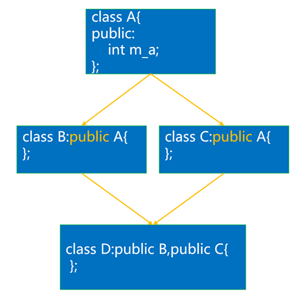

```
#include <iostream>         // 包含头文件。
using namespace std;        // 指定缺省的命名空间。

class A {    
public:
    int m_a = 10;
};

class B : virtual public A { };

class C : virtual public A { };

class DD : public B, public C {};

int main()
{
    DD d;
    // d.B::m_a = 30;
    // d.C::m_a = 80;
    d.m_a = 80;
    cout << "B::m_a的地址是：" << &d.B::m_a << "，值是：" << d.B::m_a << endl;
    cout << "C::m_a的地址是：" << &d.C::m_a << "，值是：" << d.C::m_a << endl;
}
```

虚继承可以解决菱形继承的**二义性**和**数据冗余**的问题。

有了多继承，就存在菱形继承，有了菱形继承就有虚继承，增加了复杂性。

**不提倡使用多继承，只有在比较简单和不出现二义性的情况时才使用多继承，能用单一继承解决的问题就不要使用多继承。**

如果继承的层次很多、关系很复杂，程序的编写、调试和维护工作都会变得更加困难，由于这个原因，C++之后的很多面向对象的编程语言，例如 Java、C#、PHP 等，都不支持多继承。

## 多态的基本概念

基类指针只能调用基类的成员函数，不能调用派生类的成员函数。

如果在基类的成员函数前加virtual 关键字，把它声明为虚函数，基类指针就可以调用派生类中同名的成员函数，通过派生类中同名的成员函数，就可以访问派生对象的成员变量。

有了虚函数，基类指针指向基类对象时就使用基类的成员函数和数据，指向派生类对象时就使用派生类的成员函数和数据，基类指针表现出了多种形式，这种现象称为多态。

基类引用也可以使用多态。

注意：

1）只需要在基类的函数声明中加上virtual关键字，函数定义时不能加。

2）在派生类中重定义虚函数时，函数特征要相同。

3）当在基类中定义了虚函数时，如果派生类没有重定义该函数，那么将使用基类的虚函数。

4）在派生类中重定义了虚函数的情况下，如果想使用基类的虚函数，可以加类名和域解析符。

5）如果要在派生类中重新定义基类的函数，则将它设置为虚函数；否则，不要设置为虚函数，有两方面的好处：首先效率更高；其次，指出不要重新定义该函数。

```
#include <iostream>         // 包含头文件。
using namespace std;        // 指定缺省的命名空间。
            
class CAllComers {        // 报名者类
public:
    int  m_bh = 0;             // 编号。
    virtual void show() { cout << "CAllComers::show()：我是" << m_bh << "号。 " << endl; }
    virtual void show(int a) { cout << "CAllComers::show(int a)：我是" << m_bh << "号。 " << endl; }
};
             
class CGirl :public CAllComers {        // 超女类
public:
    int m_age = 0;           // 年龄。
    void show() { cout << "CGirl::show()：我是" << m_bh << "号， " << m_age << "岁。" << endl; }
    void show(int a) { cout << "CGirl::show(int a)：我是" << m_bh << "号， " << m_age << "岁。" << endl; }
};
        
int main()
{        
    CAllComers a;  a.m_bh = 3;                             // 创建基类对象并对成员赋值。
    CGirl g;             g.m_bh = 8; g.m_age = 23;    // 创建派生类对象并对成员赋值。
            
    CAllComers* p;            // 声明基类指针。
    //p = &a;   p->show();   // 让基类指针指向基类对象，并调用虚函数。
    p = &g;   p->show();   // 让基类指针指向派生类对象，并调用虚函数。
    p->show(5); 
    p->CAllComers::show(5);
}
```

## 多态的应用场景

```
#include <iostream>         // 包含头文件。
using namespace std;        // 指定缺省的命名空间。
         
class Hero                        // 英雄基类
{
public:
	int viability;      // 生存能力。
	int attack;         // 攻击伤害。
	virtual void skill1() { cout << "英雄释放了一技能。\n"; }
	virtual void skill2() { cout << "英雄释放了二技能。\n"; }
	virtual void uskill() { cout << "英雄释放了大绝招。\n"; }
};
           
class XS :public Hero       // 西施派生类
{
public:
	void skill1() { cout << "西施释放了一技能。\n"; }
	void skill2() { cout << "西施释放了二技能。\n"; }
	void uskill() { cout << "西施释放了大招。\n"; }
};
              
class HX :public Hero       // 韩信派生类
{
public:
	void skill1() { cout << "韩信释放了一技能。\n"; }
	void skill2() { cout << "韩信释放了二技能。\n"; }
	void uskill() { cout << "韩信释放了大招。\n"; }
};
                
class LB :public Hero       // 李白派生类
{
public:
	void skill1() { cout << "李白释放了一技能。\n"; }
	void skill2() { cout << "李白释放了二技能。\n"; }
	void uskill() { cout << "李白释放了大招。\n"; }
};
              
int main()
{
	// 根据用户选择的英雄，施展一技能、二技能和大招。
	int id = 0;     // 英雄的id。
	cout << "请输入英雄（1-西施；2-韩信；3-李白。）：";
	cin >> id;
               
	// 创建基类指针，让它指向派生类对象，用基类指针调用派生类的成员函数。
	Hero* ptr = nullptr;
	if (id == 1)	{             // 1-西施
		ptr=new XS;  
	}
	else if (id == 2) {      // 2-韩信
		ptr = new HX;
	}
	else if (id == 3) {      // 3-李白
		ptr = new LB;
	}
           
	if (ptr != nullptr) {
		ptr->skill1();
		ptr->skill2();
		ptr->uskill();
		delete ptr;
	}
}
```

## 多态的对象模型

类的普通成员函数的地址是静态的，在编译阶段已指定。

如果基类中有虚函数，对象的内存模型中有一个虚函数表，表中存放了基类的函数名和地址。

如果派生类中重定义了基类的虚函数，创建派生类对象时，将用派生类的函数取代虚函数表中基类的函数。

C++中的多态分为两种：静态多态与动态多态。

静态多态：也成为编译时的多态；在编译时期就已经确定要执行了的函数地址了；主要有函数重载和函数模板。

动态多态：即动态绑定，在运行时才去确定对象类型和正确选择需要调用的函数，一般用于解决基类指针或引用派生类对象调用类中重写的方法（函数）时出现的问题。

## 如何析构派生类

构造函数不能继承，创建派生类对象时，先执行基类构造函数，再执行派生类构造函数。

析构函数不能继承，而销毁派生类对象时，先执行派生类析构函数，再执行基类析构函数。

派生类的析构函数在执行完后，会自动执行基类的析构函数。

如果手工的调用派生类的析构函数，也会自动调用基类的析构函数。

析构派生类的要点如下： 

1）析构派生类对象时，会自动调用基类的析构函数。与构造函数不同的是，在派生类的析构函数中不用显式地调用基类的析构函数，因为每个类只有一个析构函数，编译器知道如何选择，无需程序员干涉。

2）析构函数可以手工调用，如果对象中有堆内存，析构函数中以下代码是必要的：

delete ptr;

ptr=nulllptr;

3）用基类指针指向派生类对象时，delete基类指针调用的是基类的析构函数，不是派生类的，如果希望调用派生类的析构函数，就要把基类的析构函数设置为虚函数。

4）C++编译器对虚析构函数做了特别的处理。

5）对于基类，即使它不需要析构函数，也应该提供一个空虚析构函数。

6）赋值运算符函数不能继承，派生类继承的函数的特征标与基类完全相同，但赋值运算符函数的特征标随类而异，它包含了一个类型为其所属类的形参。

7）友元函数不是类成员，不能继承。

​		构造函数是不能继承的，也就是说，创建派生类对象时，必须调用派生类的构造函数。然而，派生类构造函数通常使用成员初始化列表语法来调用基类构造函数，以创建派生对象的基类部分。如果派生类构造函数没有使用成员初始化列表语法显式调用基类构造函数，将使用基类的默认构造函数。在继承链中，每个类都可以使用成员初始化列表将信息传递给相邻的基类。C++11 新增了一种让您能够继承构造函数的机制，但默认仍不继承构造函数。

​		析构函数也是不能继承的。然而，在释放对象时，程序将首先调用派生类的析构函数，然后调用基类的析构函数。如果基类有默认析构函数，编译器将为派生类生成默认析构函数。

​		通常，对于基类，其析构函数应设置为虚的。赋值运算符是不能继承的，原因很简单。派生类继承的方法的特征标与基类完全相同，但赋值运算符的特征标随类而异，这是因为它包含一个类型为其所属类的形参。

​		由于友元函数并非类成员，因此不能继承。然而，您可能希望派生类的友元函数能够使用基类的友元函数。为此，可以通过强制类型转换将，派生类引用或指针转换为基类引用或指针，然后使用转换后的指针或引用来调用基类的友元函数。

```
#include <iostream>         // 包含头文件。
using namespace std;        // 指定缺省的命名空间。
          
class AA {                    // 基类
public:
	AA() { cout << "调用了基类的构造函数AA()。\n"; }
	virtual void func() { cout << "调用了基类的func()。\n"; 	}
	// virtual ~AA() { cout << "调用了基类的析构函数~AA()。\n"; }
	virtual ~AA() {}
};
            
class BB:public AA  {  // 派生类
public:
	BB() { cout << "调用了派生类的构造函数BB()。\n"; }
	void func() { cout << "调用了派生类的func()。\n"; }
	~BB() { cout << "调用了派生类的析构函数~BB()。\n"; }
};
         
int main()
{
	AA *a=new BB;
	delete a;
}
```

## 纯虚函数和抽象类

​		纯虚函数是一种特殊的虚函数，在某些情况下，基类中不能对虚函数给出有意义的实现，把它声明为纯虚函数。纯虚函数只有函数名、参数和返回值类型，没有函数体，具体实现留给该派生类去做。

语法：virtual 返回值类型 函数名 (参数列表)=0;

​		纯虚函数在基类中为派生类保留一个函数的名字，以便派生类它进行重定义。如果在基类中没有保留函数名字，则无法支持多态性。含有纯虚函数的类被称为抽象类，不能实例化对象，可以创建指针和引用。派生类必须重定义抽象类中的纯虚函数，否则也属于抽象类。基类中的纯虚析构函数也需要实现。
​		有时候，想使一个类成为抽象类，但刚好又没有任何纯虚函数，怎么办？方法很简单：在想要成为抽象类的类中声明一个纯虚析构函数。

```
#include <iostream>         // 包含头文件。
using namespace std;        // 指定缺省的命名空间。
     
class AA {                    // 基类
public:
	AA() { cout << "调用了基类的构造函数AA()。\n"; }
	virtual void func() = 0  { cout << "调用了基类的func()。\n"; }
	virtual ~AA() = 0 { cout << "调用了基类的析构函数~AA()。\n"; }
};
      
class BB :public AA {  // 派生类
public:
	BB() { cout << "调用了派生类的构造函数BB()。\n"; }
	void func() { cout << "调用了派生类的func()。\n"; }
	~BB() { cout << "调用了派生类的析构函数~BB()。\n"; }
};
            
int main()
{
	BB b; 
	AA &r = b;
	r.func();
}
```

## 运行阶段类型识别dynamic_cast

运行阶段类型识别（RTTI RunTime Type Identification）为程序在运行阶段确定对象的类型，**只适用于包含虚函数的类**。

基类指针可以指向派生类对象，如何知道基类指针指向的是哪种派生类的对象呢？（想调用派生类中的非虚函数）。

dynamic_cast运算符用指向基类的指针来生成派生类的指针，它不能回答“指针指向的是什么类的对象”的问题，但能回答“是否可以安全的将对象的地址赋给特定类的指针”的问题。

语法：派生类指针 = dynamic_cast<派生类类型 *>(基类指针);

如果转换成功，dynamic_cast返回对象的地址，如果失败，返回nullptr。

注意：

1）dynamic_cast只适用于包含虚函数的类。

2）dynamic_cast可以将派生类指针转换为基类指针，这种画蛇添足的做法没有意义。

3）dynamic_cast可以用于引用，但是，没有与空指针对应的引用值，如果转换请求不正确，会出现bad_cast异常。

```
#include <iostream>         // 包含头文件。
using namespace std;        // 指定缺省的命名空间。

class Hero                        // 英雄基类
{
public:
	int viability;      // 生存能力。
	int attack;         // 攻击伤害。
	virtual void skill1() { cout << "英雄释放了一技能。\n"; }
	virtual void skill2() { cout << "英雄释放了二技能。\n"; }
	virtual void uskill() { cout << "英雄释放了大绝招。\n"; }
};

class XS :public Hero       // 西施派生类
{
public:
	void skill1() { cout << "西施释放了一技能。\n"; }
	void skill2() { cout << "西施释放了二技能。\n"; }
	void uskill() { cout << "西施释放了大招。\n"; }
	void show() { cout << "我是天下第一美女。\n"; }
};

class HX :public Hero       // 韩信派生类
{
public:
	void skill1() { cout << "韩信释放了一技能。\n"; }
	void skill2() { cout << "韩信释放了二技能。\n"; }
	void uskill() { cout << "韩信释放了大招。\n"; }
};

class LB :public Hero       // 李白派生类
{
public:
	void skill1() { cout << "李白释放了一技能。\n"; }
	void skill2() { cout << "李白释放了二技能。\n"; }
	void uskill() { cout << "李白释放了大招。\n"; }
};

int main()
{
	// 根据用户选择的英雄，施展一技能、二技能和大招。
	int id = 0;     // 英雄的id。
	cout << "请输入英雄（1-西施；2-韩信；3-李白。）：";
	cin >> id;

	// 创建基类指针，让它指向派生类对象，用基类指针调用派生类的成员函数。
	Hero* ptr = nullptr;
	if (id == 1) {             // 1-西施
		ptr = new XS;
	}
	else if (id == 2) {      // 2-韩信
		ptr = new HX;
	}
	else if (id == 3) {      // 3-李白
		ptr = new LB;
	}

	if (ptr != nullptr) {
		ptr->skill1();
		ptr->skill2();
		ptr->uskill();

		// 如果基类指针指向的对象是西施，那么就调用西施的show()函数。
		//if (id == 1) {
		//	XS* pxs = (XS *)ptr;        // C风格强制转换的方法，程序员必须保证目标类型正确。
		//	pxs->show();
		//}
		XS* xsptr = dynamic_cast<XS*>(ptr);         // 把基类指针转换为派生类。
		if (xsptr != nullptr) xsptr->show();              // 如果转换成功，调用派生类西施的非虚函数。

		delete ptr;
	}

	// 以下代码演示把基类引用转换为派生类引用时发生异常的情况。
	/*HX hx;
	Hero& rh = hx;
	try{
		XS & rxs= dynamic_cast<XS &>(rh);
	}
	catch (bad_cast) {
		cout << "出现了bad_cast异常。\n";
	}*/
}
```

## typeid运算符和type_info类

typeid运算符用于获取数据类型的信息。

l 语法一：typeid(数据类型);

l 语法二：typeid(变量名或表达式);

typeid运算符返回type_info类（在头文件<typeinfo>中定义）的对象的引用。

type_info类的实现随编译器而异，但至少有name()成员函数，该函数返回一个字符串，通常是类名。

type_info重载了==和!=运算符，用于对类型进行比较。

注意：

1）type_info类的构造函数是private属性，也没有拷贝构造函数，所以不能直接实例化，只能由编译器在内部实例化。

2）不建议用name()成员函数返回的字符串作为判断数据类型的依据。（编译器可能会转换类型名）

3）typeid运算符可以用于多态的场景，在运行阶段识别对象的数据类型。

4）假设有表达式typeid(***ptr**)，当ptr是空指针时，如果ptr是多态的类型，将引发bad_typeid异常。

```
#include <iostream>
#include <string>
using namespace std; 

class AA {   // 定义一个类。
public: 
    AA() {} 
};

int main()
{
    // typeid用于自定义的数据类型。
    AA aa;
    AA* paa = &aa;
    AA& raa = aa;
    cout << "typeid(AA)=" << typeid(AA).name() << endl;
    cout << "typeid(aa)=" << typeid(aa).name() << endl;
    cout << "typeid(AA *)=" << typeid(AA*).name() << endl;
    cout << "typeid(paa)=" << typeid(paa).name() << endl;
    cout << "typeid(AA &)=" << typeid(AA&).name() << endl;
    cout << "typeid(raa)=" << typeid(raa).name() << endl;

    // type_info重载了==和!=运算符，用于对类型进行比较。
    if (typeid(AA) == typeid(aa))     cout << "ok1\n";
    if (typeid(AA) == typeid(*paa)) cout << "ok2\n";
    if (typeid(AA) == typeid(raa))    cout << "ok3\n";
    if (typeid(AA*) == typeid(paa))   cout << "ok4\n";

    return 0;
}
```

## 自动推导类型auto

 

在C语言和C++98中，auto关键字用于修饰变量（自动存储的局部变量）。

在C++11中，赋予了auto全新的含义，不再用于修饰变量，而是作为一个类型指示符，指示编译器在编译时推导auto声明的变量的数据类型。

语法：auto 变量名 = 初始值;

在Linux平台下，编译需要加-std=c++11参数。

注意：

1）auto声明的变量必须在定义时初始化。

2）初始化的右值可以是具体的数值，也可以是表达式和函数的返回值等。

3）auto不能作为函数的形参类型。

4）auto不能直接声明数组。

5）auto不能定义类的非静态成员变量。

**不要滥用auto，auto在编程时真正的用途如下：**

**1）代替冗长复杂的变量声明。**

**2）在模板中，用于声明依赖模板参数的变量。**

**3）函数模板依赖模板参数的返回值。**

**4）用于lambda表达式中。**

```
#include <iostream>         // 包含头文件。
using namespace std;        // 指定缺省的命名空间。
          
double func(double b, const char* c, float d, short e, long f)
{
	cout << ",b=" << b << ",c=" << c << ",d=" << d << ",e=" << e << ",f=" << f << endl;
	return 5.5;
}
          
int main()
{
	double (*pf)( double , const char* , float , short , long );    // 声明函数指针pf。
	pf = func;
	pf( 2, "西施", 3, 4, 5);
	auto pf1 = func;
	pf1(2, "西施", 3, 4, 5);
}
```

## 函数模板的基本概念

函数模板是通用的函数描述，使用任意类型（泛型）来描述函数。

编译的时候，编译器推导实参的数据类型，根据实参的数据类型和函数模板，生成该类型的函数定义。

生成函数定义的过程被称为实例化。

创建交换两个变量的函数模板：

```
template <typename T>
void Swap(T &a, T &b)
{
	T tmp = a;
	a = b;
	b = tmp;
}
```

在C++98添加关键字typename之前，C++使用关键字class来创建模板。

如果考虑向后兼容，函数模板应使用typename，而不是class。

函数模板实例化可以让编译器自动推导，也可以在调用的代码中显式的指定。

## 函数模板的注意事项

1）可以为类的成员函数创建模板，但不能是虚函数和析构函数。

2）使用函数模板时，必须明确数据类型，确保实参与函数模板能匹配上。

3）使用函数模板时，推导的数据类型必须适应函数模板中的代码。

4）使用函数模板时，如果是自动类型推导，不会发生隐式类型转换，如果显式指定了函数模板的数据类型，可以发生隐式类型转换。

5）函数模板支持多个通用数据类型的参数。

6）函数模板支持重载，可以有非通用数据类型的参数。

## 函数模板的具体化

可以提供一个具体化的函数定义，当编译器找到与函数调用匹配的具体化定义时，将使用该定义，不再寻找模板。

具体化（特例化、特化）的语法：

```
template<> void 函数模板名<数据类型>(参数列表)
template<> void 函数模板名 (参数列表)
{
	// 函数体。
}
```

对于给定的函数名，可以有普通函数、函数模板和具体化的函数模板，以及它们的重载版本。

编译器使用各种函数的规则：

1）具体化优先于常规模板，普通函数优先于具体化和常规模板。

2）如果希望使用函数模板，可以用空模板参数强制使用函数模板。

3）如果函数模板能产生更好的匹配，将优先于普通函数。

```
#include <iostream>         // 包含头文件。
using namespace std;        // 指定缺省的命名空间。
                      
class CGirl            // 超女类。
{
public:
	int m_bh;              // 编号。
	string m_name;   // 姓名。
	int m_rank;          // 排名。
};
              
template <typename T>
void Swap(T& a, T& b);      // 交换两个变量的值函数模板。
            
template<> 
void Swap<CGirl>(CGirl& g1, CGirl& g2);      // 交换两个超女对象的排名。
// template<> 
// void Swap(CGirl& g1, CGirl& g2);      // 交换两个超女对象的排名。
           
int main()
{
	int a = 10, b = 20;
	Swap(a, b);           // 使用了函数模板。
	cout << "a=" << a << ",b=" << b << endl;
            
	CGirl g1, g2;
	g1.m_rank = 1; g2.m_rank = 2;
	Swap(g1, g2);     // 使用了超女类的具体化函数。
	cout << "g1.m_rank=" << g1.m_rank << ",g2.m_rank=" << g2.m_rank << endl;
}
            
template <typename T>
void Swap(T& a, T& b)      // 交换两个变量的值函数模板。
{
	T tmp = a;
	a = b;
	b = tmp;
	cout << "调用了Swap(T& a, T& b)\n";
}
        
template<> 
void Swap<CGirl>(CGirl& g1, CGirl& g2)      // 交换两个超女对象的排名。
// template<> 
// void Swap(CGirl& g1, CGirl& g2)      // 交换两个超女对象的排名。
{
	int tmp = g1.m_rank;
	g1.m_rank = g2.m_rank;
	g2.m_rank = tmp;
	cout << "调用了Swap(CGirl& g1, CGirl& g2)\n";
}
//////////////////////////////////////////////////////
#include <iostream>         // 包含头文件。
using namespace std;        // 指定缺省的命名空间。

void Swap(int a, int b)      // 普通函数。
{ 	
	cout << "使用了普通函数。\n";  
}
template <typename T> 
void Swap(T a, T b)          // 函数模板。
{	
	cout << "使用了函数模板。\n";  
}
template <> 
void Swap(int a, int b)     // 函数模板的具体化版本。
{ 	
	cout << "使用了具体化的函数模板。\n";  
}       
int main()
{
	Swap('c', 'd');
}
```

## 函数模板分文件编写

函数模板只是函数的描述，没有实体，创建函数模板的代码放在头文件中。

函数模板的具体化有实体，编译的原理和普通函数一样，所以，声明放在头文件中，定义放在源文件中。

```
/////////////////////////////////////////////////////////////////
// public.h
#pragma once
#include <iostream>         // 包含头文件。
using namespace std;        // 指定缺省的命名空间。

void Swap(int a, int b);      // 普通函数。

template <typename T>
void Swap(T a, T b)         // 函数模板。
{
	cout << "使用了函数模板。\n";
}

template <>
void Swap(int a, int b);    // 函数模板的具体化版本。


/////////////////////////////////////////////////////////////////
// public.cpp
#include "public.h"

void Swap(int a, int b)      // 普通函数。
{
	cout << "使用了普通函数。\n";
}

template <>
void Swap(int a, int b)     // 函数模板的具体化版本。
{
	cout << "使用了具体化的函数模板。\n";
}


/////////////////////////////////////////////////////////////////
// demo01.cpp
#include "public.h"

int main()
{
	Swap(1,2);         // 将使用普通函数。
	Swap(1.3, 3.5);  // 将使用具体化的函数模板。
	Swap('c', 'd');    // 将使用函数模板。
}
```

## 函数模板高级

### decltype关键字

在[C++](https://baike.baidu.com/item/C%2B%2B)11中，decltype[操作符](https://baike.baidu.com/item/操作符/8978896)，用于查询[表达式](https://baike.baidu.com/item/表达式/7655228)的数据类型。

语法：decltype(expression) var;

decltype分析表达式并得到它的类型，不会计算执行[表达式](https://so.csdn.net/so/search?q=表达式&spm=1001.2101.3001.7020)。函数调用也一种表达式，因此不必担心在使用decltype时执行了函数。

decltype推导规则（按步骤）：

1）如果expression是一个没有用括号括起来的标识符，则var的类型与该标识符的类型相同，包括const等限定符。

2）如果expression是一个函数调用，则var的类型与函数的返回值类型相同（函数不能返回void，但可以返回void *）。

3）如果expression是一个左值（能取地址）(要排除第一种情况)、或者用括号括起来的标识符，那么var的类型是expression的引用。

4）如果上面的条件都不满足，则var的类型与expression的类型相同。

如果需要多次使用decltype，可以结合typedef和using。

### 函数后置返回类型

```
int func(int x,double y);
```

等同：

```
auto func(int x,double y) -> int;
```

将返回类型移到了函数声明的后面。

auto是一个占位符（C++11给auto新增的角色）, 为函数返回值占了一个位置。

这种语法也可以用于函数定义：

```
auto func(int x,double y) -> int
{
  // 函数体。
}
```

### C++14的auto关键字

C++14标准对函数返回类型推导规则做了优化，函数的返回值可以用auto，不必尾随返回类型。

```
#include <iostream>         // 包含头文件。
using namespace std;        // 指定缺省的命名空间。

template <typename T1, typename T2>
auto func(T1 x, T2 y) -> decltype(x + y)
{
	// 其它的代码。
	decltype(x+y)  tmp = x + y;
	cout << "tmp=" << tmp << endl;

	return tmp;
}
int main()
{
	func(3, 5.8);
}
```

## 模板类的基本概念

类模板是通用类的描述，使用任意类型（泛型）来描述类的定义。

使用类模板的时候，指定具体的数据类型，让编译器生成该类型的类定义。

```c++
template <class T>
class 类模板名
{
	类的定义;
};
```

函数模板建议用typename描述通用数据类型，类模板建议用class。

注意：

1）在创建对象的时候，必须指明具体的数据类型。

2）使用类模板时，数据类型必须适应类模板中的代码。

3）类模板可以为通用数据类型指定缺省的数据类型（C++11标准的函数模板也可以）。

4）模板类的成员函数可以在类外实现。

5）可以用new创建模板类对象。

6）在程序中，模板类的成员函数使用了才会创建。

```
#include <iostream>         // 包含头文件。
using namespace std;        // 指定缺省的命名空间。
          
template <class T1, class T2=string>
class AA
{
public:
	T1 m_a;      // 通用类型用于成员变量。
	T2 m_b;      // 通用类型用于成员变量。
          
	AA() {  }        // 默认构造函数是空的。
	// 通用类型用于成员函数的参数。
	AA(T1 a,T2 b):m_a(a),m_b(b) {  }
	// 通用类型用于成员函数的返回值。
	T1 geta()            // 获取成员m_a的值。
	{
		T1 a = 2;        // 通用类型用于成员函数的代码中。
		return m_a + a;
	}
	T2 getb();            // 获取成员m_b的值。
};
           
template <class T1, class T2>
T2 AA<T1,T2>::getb()            // 获取成员m_b的值。
{
	return m_b;
}
            
int main()
{
	AA<int, string>* a = new AA<int, string>(3, "西施");     // 用模板类AA创建对象a。
	
	cout << "a->geta()=" << a->geta() << endl;
	cout << "a->getb()=" << a->getb() << endl;
         
	delete a;
}
```

## 模板类的示例

### 栈

```
#include <iostream>         // 包含头文件。
using namespace std;        // 指定缺省的命名空间。
          
// typedef string DataType;        // 定义栈元素的数据类型。
          
template <class DataType>
class Stack       // 栈类
{
private:
	DataType* items;               // 栈数组。
	int   stacksize;         // 栈实际的大小。
	int   top;                  // 栈顶指针。
public:
	// 构造函数：1）分配栈数组内存；2）把栈顶指针初始化为0。
	Stack(int size) :stacksize(size), top(0) {
		items = new DataType[stacksize];
	}
	~Stack() {
		delete [] items; items = nullptr;
	}
	bool isempty() const {            // 判断栈是否为空。
		return top == 0;
	}
	bool isfull() const {                 // 判断栈是否已满。
		return top == stacksize;
	}
	bool push(const DataType& item) {   // 元素入栈。
		if (top < stacksize) { items[top++] = item; return true; }
		return false;
	}
	bool pop(DataType& item) {               // 元素出栈。
		if (top > 0) { item = items[--top]; return true; }
		return false;
	}
};
       
int main()
{
	Stack<string> ss(5);       // 创建栈对象，大小是5。
           
	// 元素入栈。
	// ss.push(1); ss.push(2); ss.push(3); ss.push(4); ss.push(5);
	ss.push("西施"); ss.push("冰冰"); ss.push("幂幂"); ss.push("金莲");
          
	// 元素出栈。
	string item;
	while (ss.isempty() == false)
	{
		ss.pop(item);   cout << "item = " << item << endl;
	}
}

```

### 数组

类模板可以有非通用类型参数：1）通常是整型（C++20标准可以用其它的类型）；2）实例化模板时必须用常量表达式；3）模板中不能修改参数的值；4）可以为非通用类型参数提供默认值。

优点：在栈上分配内存，易维护，执行速度快，合适小型数组。

缺点：在程序中，不同的非通用类型参数将导致编译器生成不同的类。

构造函数的方法更通用，因为数据的大小是类的成员（而不是硬编码），可以创建数组大小可变的类。

```
#include <iostream>         // 包含头文件。
using namespace std;        // 指定缺省的命名空间。
           
template <class T,int len=10>
class Array
{
private:
	T items[len];      // 数组元素。
public:
	Array()    {}    	   // 默认构造函数。
	~Array() {}         // 析构函数
	T& operator[](int ii) { return items[ii]; }  // 重载操作符[]，可以修改数组中的元素。
	const T& operator[](int ii) const { return items[ii]; }  // 重载操作符[]，不能修改数组中的元素。
};
        
template <class T>
class Vector
{
private:
	int len;               // 数组元素的个数。
	T*  items;           // 数组元素。
public:
	// 默认构造函数，分配内存。
	Vector(int size=10):len(size) {
		items = new T[len];
	}
	~Vector() {         // 析构函数
		delete[] items; items = nullptr;
	}
	void resize(int size) {         // 护展数组的内存空间。
		if (size <= len) return;   // 只能往更大扩展。
		T* tmp = new T[size];   // 分配更大的内存空间。
		for (int ii = 0; ii < len; ii++) tmp[ii] = items[ii];     // 把原来数组中的元素复制到新数组。
		delete[] items;    // 释放原来的数组。
		items = tmp;      // 让数组指针指向新数组。
		len = size;           // 扩展后的数组长度。
	}
	int size() const { return len; }     // 获取数组长度。
	T& operator[](int ii) {   // 重载操作符[]，可以修改数组中的元素。
		if (ii >= len) resize(ii + 1);    // 扩展数组。
		return items[ii]; 
	}
	const T& operator[](int ii) const { return items[ii]; }  // 重载操作符[]，不能修改数组中的元素。
};
        
int main()
{
	// Array<string,10> aa;  // 创建模板类Array的对象。
	Vector<int> aa(1);     // 创建模板类Vector的对象。
	aa[0] = 5; aa[1] = 8; aa[2] = 3; aa[3] = 2; aa[4] = 7; 
	// aa[0] = "西施"; aa[1] = "冰冰"; aa[2] = "幂幂"; aa[3] = "金莲"; aa[4] = "小乔";
           
	for (int ii=0; ii<5;ii++) cout << "aa[" << ii << "]=" << aa[ii] << endl;
}
```

## 嵌套和递归使用模板类

在C++11之前，嵌套使用模板类的时候，> >之间要加空格。

```c++
#include <iostream>         // 包含头文件。
using namespace std;        // 指定缺省的命名空间。
                   
template <class DataType>
class Stack       // 栈类
{
private:
	DataType* items;               // 栈数组。
	int   stacksize;         // 栈实际的大小。
	int   top;                  // 栈顶指针。
public:
	// 构造函数：1）分配栈数组内存；2）把栈顶指针初始化为0。
	Stack(int size = 3) :stacksize(size), top(0) {
		items = new DataType[stacksize];
	}
	~Stack() {
		delete[] items; items = nullptr;
	}
	Stack& operator=(const Stack& v)   // 重载赋值运算符函数，实现深拷贝。
	{
		delete[] items;         // 释放原内存。
		stacksize = v.stacksize;     // 栈实际的大小。
		items = new DataType[stacksize];   // 重新分配数组。
		for (int ii = 0; ii < stacksize; ii++) items[ii] = v.items[ii];    // 复制数组中的元素。
		top = v.top;     // 栈顶指针。
		return *this;
	}
	bool isempty() const {            // 判断栈是否为空。
		return top == 0;
	}
	bool isfull() const {                 // 判断栈是否已满。
		return top == stacksize;
	}
	bool push(const DataType& item) {   // 元素入栈。
		if (top < stacksize) { items[top++] = item; return true; }
		return false;
	}
	bool pop(DataType& item) {               // 元素出栈。
		if (top > 0) { item = items[--top]; return true; }
		return false;
	}
};
                
template <class T>
class Vector           // 动态数组。
{
private:
	int len;               // 数组元素的个数。
	T* items;           // 数组元素。
public:
	// 默认构造函数，分配内存。
	Vector(int size = 2) :len(size) {
		items = new T[len];
	}
	~Vector() {         // 析构函数
		delete[] items; items = nullptr;
	}
	Vector& operator=(const Vector& v)   // 重载赋值运算符函数，实现深拷贝。
	{
		delete[] items;           // 释放原内存。
		len = v.len;                // 数组实际的大小。
		items = new T[len];  // 重新分配数组。
		for (int ii = 0; ii < len; ii++) items[ii] = v.items[ii];    // 复制数组中的元素。
		return *this;
	}
	void resize(int size) {         // 护展数组的内存空间。
		if (size <= len) return;   // 只能往更大扩展。
		T* tmp = new T[size];   // 分配更大的内存空间。
		for (int ii = 0; ii < len; ii++) tmp[ii] = items[ii];     // 把原来数组中的元素复制到新数组。
		delete[] items;    // 释放原来的数组。
		items = tmp;      // 让数组指针指向新数组。
		len = size;           // 扩展后的数组长度。
	}
	int size() const { return len; }     // 获取数组长度。
	T& operator[](int ii) {   // 重载操作符[]，可以修改数组中的元素。
		if (ii >= len) resize(ii + 1);    // 扩展数组。
		return items[ii];
	}
	const T& operator[](int ii) const { return items[ii]; }  // 重载操作符[]，不能修改数组中的元素。
};
                   
int main()
{
	// Vector容器的大小缺省值是2，Stack容器的大小缺省值是3。
	// 创建Vector容器，容器中的元素用Stack<string>。
	Vector<Stack<string>> vs;         // C++11之前，>>之间要加空格。
               
	// 手工的往容器中插入数据。
	vs[0].push("西施1"); vs[0].push("西施2"); vs[0].push("西施3");        // vs容器中的第0个栈。
	vs[1].push("西瓜1"); vs[1].push("西瓜2"); vs[1].push("西瓜3");        // vs容器中的第1个栈。
	vs[2].push("冰冰");   vs[2].push("幂幂");                                            // vs容器中的第2个栈。 
	
	// 用嵌套的循环，把vs容器中的数据显示出来。
	for (int ii = 0; ii < vs.size(); ii++)         // 遍历Vector容器。
	{
		while (vs[ii].isempty() == false)      // 遍历Stack容器。
		{
			string item; vs[ii].pop(item); cout << "item = " << item << endl;
		}
	}
             
	// 创建Stack容器，容器中的元素用Vector<string>。
	Stack<Vector<string>> sv;
              
	Vector<string> tmp;       // 栈的元素，临时Vector<string>容器。
	// 第一个入栈的元素。
	tmp[0] = "西施1"; tmp[1] = "西施2";  sv.push(tmp);
	// 第二个入栈的元素。
	tmp[0] = "西瓜1"; tmp[1] = "西瓜2";  sv.push(tmp);
	// 第三个入栈的元素。
	tmp[0] = "冰冰1"; tmp[1] = "冰冰2";   tmp[2] = "冰冰3";  tmp[3] = "冰冰4";  sv.push(tmp);
              
	// 用嵌套的循环，把sv容器中的数据显示出来。
	while (sv.isempty() == false)
	{
		sv.pop(tmp);   // 出栈一个元素，放在临时容器中。
		for (int ii = 0; ii < tmp.size(); ii++)   // 遍历临时Vector<string>容器，显示容器中每个元素的值。
			cout << " vs[" << ii << "] = " << tmp[ii] << endl;
	}
            
	// 创建Vector容器，容器中的元素用Vector<string>。
	Vector<Vector<string>> vv;       // 递归使用模板类。
               
	vv[0][0] = "西施1"; vv[0][1] = "西施2";  vv[0][2] = "西施3";
	vv[1][0] = "西瓜1"; vv[1][1] = "西瓜2";
	vv[2][0] = "冰冰1"; vv[2][1] = "冰冰2";   vv[2][2] = "冰冰3";  vv[2][3] = "冰冰4";
            
	// 用嵌套的循环，把vv容器中的数据显示出来。
	for (int ii = 0; ii < vv.size(); ii++)
	{
		for (int jj = 0; jj < vv[ii].size(); jj++)
			// cout << " vv[" << ii << "][" << jj << "] = " << vv[ii][jj] << endl;
			cout << vv[ii][jj] << " ";
		cout << endl;
	}
}
```

## 模板类具体化

模板类具体化（特化、特例化）有两种：完全具体化和部分具体化。

语法请见示例程序。

具体化程度高的类优先于具体化程度低的类，具体化的类优先于没有具体化的类。

具体化的模板类，成员函数类外实现的代码应该放在源文件中。

```c++
#include <iostream>         // 包含头文件。
using namespace std;        // 指定缺省的命名空间。

// 类模板
template<class T1, class T2>
class AA {                 // 类模板。
public:
	T1 m_x;
	T2 m_y;

	AA(const T1 x, const T2 y) :m_x(x), m_y(y) { cout << "类模板：构造函数。\n"; }
	void show() const;
};

template<class T1, class T2>
void AA<T1, T2>::show() const {    // 成员函数类外实现。
	cout << "类模板：x = " << m_x << ", y = " << m_y << endl;
}
/////////////////////////////////////////////////////////////////////////////////////////

// 类模板完全具体化
template<>
class AA<int, string> {
public:
	int      m_x;
	string m_y;

	AA(const int x, const string y) :m_x(x), m_y(y) { cout << "完全具体化：构造函数。\n"; }
	void show() const;
};

void AA<int, string>::show() const {    // 成员函数类外实现。
	cout << "完全具体化：x = " << m_x << ", y = " << m_y << endl;
}
/////////////////////////////////////////////////////////////////////////////////////////

// 类模板部分具体化
template<class T1>
class AA<T1, string> {
public:
	T1       m_x;
	string m_y;

	AA(const T1 x, const string y) :m_x(x), m_y(y) { cout << "部分具体化：构造函数。\n"; }
	void show() const;
};

template<class T1>
void AA<T1, string>::show() const {    // 成员函数类外实现。
	cout << "部分具体化：x = " << m_x << ", y = " << m_y << endl;
}
/////////////////////////////////////////////////////////////////////////////////////////

int main()
{
	// 具体化程度高的类优先于具体化程度低的类，具体化的类优先于没有具体化的类。
	AA<int, string>    aa1(8, "我是一只傻傻鸟。");   // 将使用完全具体化的类。
	AA<char, string> aa2(8, "我是一只傻傻鸟。");   // 将使用部分具体化的类。
	AA<int, double> aa3(8, 999999);                      // 将使用模板类。
}
```

## 模板类与继承

1）模板类继承普通类（常见）。

```c++
#include <iostream>         // 包含头文件。
using namespace std;        // 指定缺省的命名空间。

class AA     // 普通类AA。
{
public:
	int m_a;
	AA(int a) :m_a(a) { cout << "调用了AA的构造函数。\n"; }
	void func1() { cout << "调用了func1()函数：m_a=" << m_a << endl;; }
};

template<class T1, class T2>
class BB:public AA      // 模板类BB。
{
public:
	T1 m_x;
	T2 m_y;
	BB(const T1 x, const T2 y,int a) : AA(a) , m_x(x), m_y(y) { cout << "调用了BB的构造函数。\n"; }
	void func2() const { cout << "调用了func2()函数：x = " << m_x << ", y = " << m_y << endl; }
};

int main()
{
	BB<int, string> bb(8, "我是一只傻傻鸟。",3);
	bb.func2();
	bb.func1();
}
```

2）普通类继承模板类的实例化版本。

```
#include <iostream>         // 包含头文件。
using namespace std;        // 指定缺省的命名空间。

template<class T1, class T2>
class BB      // 模板类BB。
{
public:
	T1 m_x;
	T2 m_y;
	BB(const T1 x, const T2 y) : m_x(x), m_y(y) { cout << "调用了BB的构造函数。\n"; }
	void func2() const { cout << "调用了func2()函数：x = " << m_x << ", y = " << m_y << endl; }
};

class AA:public BB<int,string>     // 普通类AA。
{
public:
	int m_a;
	AA(int a,int x,string y) : BB(x,y),m_a(a) { cout << "调用了AA的构造函数。\n"; }
	void func1() { cout << "调用了func1()函数：m_a=" << m_a << endl;; }
};

int main()
{
	AA aa(3,8, "我是一只傻傻鸟。");
	aa.func1();
	aa.func2();
}

```

3）普通类继承模板类。(常见)

```
#include <iostream>         // 包含头文件。
using namespace std;        // 指定缺省的命名空间。

template<class T1, class T2>
class BB      // 模板类BB。
{
public:
	T1 m_x;
	T2 m_y;
	BB(const T1 x, const T2 y) : m_x(x), m_y(y) { cout << "调用了BB的构造函数。\n"; }
	void func2() const { cout << "调用了func2()函数：x = " << m_x << ", y = " << m_y << endl; }
};

template<class T1, class T2>
class AA:public BB<T1,T2>     // 普通类AA变成了模板类，才能继承模板类。
{
public:
	int m_a;
	AA(int a, const T1 x, const T2 y) : BB<T1,T2>(x,y),m_a(a) { cout << "调用了AA的构造函数。\n"; }
	void func1() { cout << "调用了func1()函数：m_a=" << m_a << endl;; }
};

int main()
{
	AA<int,string> aa(3,8, "我是一只傻傻鸟。");
	aa.func1();
	aa.func2();
}
```

4）模板类继承模板类。

```
#include <iostream>         // 包含头文件。
using namespace std;        // 指定缺省的命名空间。

template<class T1, class T2>
class BB      // 模板类BB。
{
public:
	T1 m_x;
	T2 m_y;
	BB(const T1 x, const T2 y) : m_x(x), m_y(y) { cout << "调用了BB的构造函数。\n"; }
	void func2() const { cout << "调用了func2()函数：x = " << m_x << ", y = " << m_y << endl; }
};

template<class T1, class T2>
class AA:public BB<T1,T2>     // 普通类AA变成了模板类，才能继承模板类。
{
public:
	int m_a;
	AA(int a, const T1 x, const T2 y) : BB<T1,T2>(x,y),m_a(a) { cout << "调用了AA的构造函数。\n"; }
	void func1() { cout << "调用了func1()函数：m_a=" << m_a << endl;; }
};

template<class T, class T1, class T2>
class CC :public BB<T1, T2>   // 模板类继承模板类。
{
public:
	T m_a;
	CC(const T a, const T1 x, const T2 y) : BB<T1, T2>(x, y), m_a(a) { cout << "调用了CC的构造函数。\n"; }
	void func3() { cout << "调用了func3()函数：m_a=" << m_a << endl;; }
};

int main()
{
	CC<int,int,string> cc(3,8, "我是一只傻傻鸟。");
	cc.func3();
	cc.func2();
}
```

5）模板类继承模板参数给出的基类（不能是模板类）。

```
#include <iostream>         // 包含头文件。
using namespace std;        // 指定缺省的命名空间。

class AA {
public:
    AA()         { cout << "调用了AA的构造函数AA()。\n"; }
    AA(int a) { cout << "调用了AA的构造函数AA(int a)。\n"; }
};

class BB {
public:
    BB()         { cout << "调用了BB的构造函数BB()。\n"; }
    BB(int a) { cout << "调用了BB的构造函数BB(int a)。\n"; }
};

class CC {
public:
    CC()         { cout << "调用了CC的构造函数CC()。\n"; }
    CC(int a) { cout << "调用了CC的构造函数CC(int a)。\n"; }
};

template<class T>
class DD {
public:
    DD()         { cout << "调用了DD的构造函数DD()。\n"; }
    DD(int a) { cout << "调用了DD的构造函数DD(int a)。\n"; }
};

template<class T>
class EE : public T {          // 模板类继承模板参数给出的基类。
public:
    EE() :T()           { cout << "调用了EE的构造函数EE()。\n"; }
    EE(int a) :T(a) { cout << "调用了EE的构造函数EE(int a)。\n"; }
};

int main()
{
    EE<AA> ea1;                 // AA作为基类。
    EE<BB> eb1;                 // BB作为基类。
    EE<CC> ec1;                 // CC作为基类。
    EE<DD<int>> ed1;      // EE<int>作为基类。
    // EE<DD> ed1;                // DD作为基类，错误。
}
```

## 模板类与函数

模板类可以用于函数的参数和返回值，有三种形式：

1）普通函数，参数和返回值是模板类的实例化版本。

2）函数模板，参数和返回值是某种的模板类。

3）函数模板，参数和返回值是任意类型（支持普通类和模板类和其它类型）。

```c++
#include <iostream>         // 包含头文件。
using namespace std;        // 指定缺省的命名空间。

template<class T1, class T2>
class AA    // 模板类AA。
{
public:
    T1 m_x;
    T2 m_y;
    AA(const T1 x, const T2 y) : m_x(x), m_y(y) { }
    void show() const { cout << "show()  x = " << m_x << ", y = " << m_y << endl; }
};

// 采用普通函数，参数和返回值是模板类AA的实例化版本。
AA<int, string> func(AA<int, string>& aa)
{
    aa.show();
    cout << "调用了func(AA<int, string> &aa)函数。\n";
    return aa;
}

// 函数模板，参数和返回值是的模板类AA。
template <typename T1,typename T2>
AA<T1, T2> func(AA<T1, T2>& aa)
{
    aa.show();
    cout << "调用了func(AA<T1, T2> &aa)函数。\n";
    return aa;
}

// 函数模板，参数和返回值是任意类型。
template <typename T>
T func(T &aa)
{
    aa.show();
    cout << "调用了func(AA<T> &aa)函数。\n";
    return aa;
}

int main()
{
    AA<int, string> aa(3, "我是一只傻傻鸟。");
    func(aa);
}
```

## 模板类与友元

模板类的友元函数有三类：

1）非模板友元：友元函数不是模板函数，而是利用模板类参数生成的函数。

```
#include <iostream>         // 包含头文件。
using namespace std;        // 指定缺省的命名空间。

template<class T1, class T2>
class AA    
{
    T1 m_x;
    T2 m_y;
public:
    AA(const T1 x, const T2 y) : m_x(x), m_y(y) { }
    // 非模板友元：友元函数不是模板函数，而是利用模板类参数生成的函数，只能在类内实现。
    friend void show(const AA<T1, T2>& a)
    {
        cout << "x = " << a.m_x << ", y = " << a.m_y << endl;
    }
   /* friend void show(const AA<int, string>& a);
    friend void show(const AA<char, string>& a);*/
};

//void show(const AA<int, string>& a)
//{
//    cout << "x = " << a.m_x << ", y = " << a.m_y << endl;
//}
//
//void show(const AA<char, string>& a)
//{
//    cout << "x = " << a.m_x << ", y = " << a.m_y << endl;
//}

int main()
{
    AA<int, string> a(88, "我是一只傻傻鸟。");
    show(a);

    AA<char, string> b(88, "我是一只傻傻鸟。");
    show(b);
}
```

2）约束模板友元：模板类实例化时，每个实例化的类对应一个友元函数。

```
#include <iostream>         // 包含头文件。
using namespace std;        // 指定缺省的命名空间。

// 约束模板友元：模板类实例化时，每个实例化的类对应一个友元函数。
template <typename T>
void show(T& a);                                                 // 第一步：在模板类的定义前面，声明友元函数模板。

template<class T1, class T2>
class AA    // 模板类AA。
{
    friend void show<>(AA<T1, T2>& a);          // 第二步：在模板类中，再次声明友元函数模板。
    T1 m_x;
    T2 m_y;

public:

    AA(const T1 x, const T2 y) : m_x(x), m_y(y) { }
};

template<class T1, class T2>
class BB    // 模板类BB。
{
    friend void show<>(BB<T1, T2>& a);          // 第二步：在模板类中，再次声明友元函数模板。
    T1 m_x;
    T2 m_y;

public:

    BB(const T1 x, const T2 y) : m_x(x), m_y(y) { }
};

template <typename T>                                 // 第三步：友元函数模板的定义。
void show(T& a)
{
    cout << "通用：x = " << a.m_x << ", y = " << a.m_y << endl;
}

template <>                                                    // 第三步：具体化版本。
void show(AA<int, string>& a)
{
    cout << "具体AA<int, string>：x = " << a.m_x << ", y = " << a.m_y << endl;
}

template <>                                                    // 第三步：具体化版本。
void show(BB<int, string>& a)
{
    cout << "具体BB<int, string>：x = " << a.m_x << ", y = " << a.m_y << endl;
}

int main()
{
    AA<int, string> a1(88, "我是一只傻傻鸟。");
    show(a1);         // 将使用具体化的版本。

    AA<char, string> a2(88, "我是一只傻傻鸟。");
    show(a2);        // 将使用通用的版本。

    BB<int, string> b1(88, "我是一只傻傻鸟。");
    show(b1);         // 将使用具体化的版本。

    BB<char, string> b2(88, "我是一只傻傻鸟。");
    show(b2);        // 将使用通用的版本。
}
```

3）非约束模板友元：模板类实例化时，如果实例化了n个类，也会实例化n个友元函数，每个实例化的类都拥有n个友元函数。

```
#include <iostream>         // 包含头文件。
using namespace std;        // 指定缺省的命名空间。

// 非类模板约束的友元函数，实例化后，每个函数都是每个每个类的友元。
template<class T1, class T2>
class AA    
{
    template <typename T> friend void show(T& a);     // 把函数模板设置为友元。
    T1 m_x;
    T2 m_y;
public:
    AA(const T1 x, const T2 y) : m_x(x), m_y(y) { }
};

template <typename T> void show(T& a)                     // 通用的函数模板。
{
    cout << "通用：x = " << a.m_x << ", y = " << a.m_y << endl;
}

template <>void show(AA<int, string>& a)                 // 函数模板的具体版本。
{
    cout << "具体<int, string>：x = " << a.m_x << ", y = " << a.m_y << endl;
}

int main()
{
    AA<int, string> a(88, "我是一只傻傻鸟。");
    show(a);         // 将使用具体化的版本。

    AA<char, string> b(88, "我是一只傻傻鸟。");
    show(b);        // 将使用通用的版本。
}
```

## 成员模板类

```
#include <iostream>         // 包含头文件。
using namespace std;        // 指定缺省的命名空间。

template<class T1, class T2>
class AA              // 类模板AA。
{
public:
    T1 m_x;
    T2 m_y;

    AA(const T1 x, const T2 y) : m_x(x), m_y(y) {}
    void show() { cout << "m_x=" << m_x << "，m_y=" << m_y << endl; }

    template<class T>
    class BB
    {
    public:
        T m_a;
        T1 m_b;
        BB() {}
        void show();
    };
    BB<string> m_bb;

    template<typename T>
    void show(T tt);
};

template<class T1, class T2>
template<class T>
void AA<T1,T2>::BB<T>::show() { 
    cout << "m_a=" << m_a << "，m_b=" << m_b << endl; 
}

template<class T1, class T2>
template<typename T>
void AA<T1,T2>::show(T tt) {
    cout << "tt=" << tt << endl;
    cout << "m_x=" << m_x << "，m_y=" << m_y << endl;
    m_bb.show();
}

int main()
{
    AA<int, string> a(88, "我是一只傻傻鸟。");
    a.show();
    a.m_bb.m_a = "我有一只小小鸟。";
    a.m_bb.show();
    a.show("你是一只什么鸟？");
}
```

## 将模板类用作参数

```
#include <iostream>         // 包含头文件。
using namespace std;        // 指定缺省的命名空间。

template <class T, int len>
class LinkList             // 链表类模板。
{
public:
    T*   m_head;          // 链表头结点。
    int  m_len = len;   // 表长。
    void insert()     { cout << "向链表中插入了一条记录。\n"; }
    void ddelete()  { cout << "向链表中删除了一条记录。\n"; }
    void update()   { cout << "向链表中更新了一条记录。\n"; }
};

template <class T, int len>
class Array                // 数组类模板。
{
public:
    T*   m_data;          // 数组指针。
    int  m_len = len;   // 表长。
    void insert()     { cout << "向数组中插入了一条记录。\n"; }
    void ddelete()  { cout << "向数组中删除了一条记录。\n"; }
    void update()   { cout << "向数组中更新了一条记录。\n"; }
};

// 线性表模板类：tabletype-线性表类型，datatype-线性表的数据类型。
template<template<class, int >class tabletype, class datatype, int len>
class LinearList
{
public:
    tabletype<datatype, len> m_table;     // 创建线性表对象。

    void insert()    { m_table.insert(); }         // 线性表插入操作。
    void ddelete() { m_table.ddelete(); }      // 线性表删除操作。
    void update()  { m_table.update(); }      // 线性表更新操作。

    void oper()     // 按业务要求操作线性表。
    {
        cout << "len=" << m_table.m_len << endl;
        m_table.insert();
        m_table.update();
    }
};

int main()
{
    // 创建线性表对象，容器类型为链表，链表的数据类型为int，表长为20。
    LinearList<LinkList, int, 20>  a;   
    a.insert();   
    a.ddelete();   
    a.update();

    // 创建线性表对象，容器类型为数组，数组的数据类型为string，表长为20。
    LinearList<Array, string, 20>  b;
    b.insert();   
    b.ddelete();   
    b.update();
}
```

## 编译预处理

C++程序编译的过程：预处理 -> 编译（优化、汇编）-> 链接

预处理指令主要有以下三种：

- 包含头文件：#include

- 宏定义：#define（定义宏）、#undef（删除宏）。

- 条件编译：#ifdef、#ifndef

### 包含头文件

\#include 包含[头文件](https://so.csdn.net/so/search?q=头文件&spm=1001.2101.3001.7020)有两种方式：

- #include <文件名>：直接从编译器自带的函数库目录中寻找文件。

- #include "文件名"：先从自定义的目录中寻找文件，如果找不到，再从编译器自带的函数库目录中寻找。

\#include也包含其它的文件，如：*.h、*.cpp或其它的文件。

**C++98标准后的头文件：**

- C的标准库：老版本的有.h后缀；新版本没有.h的后缀，增加了字符c的前缀。例如：老版本是<stdio.h>，新版本是<cstdio>，新老版本库中的内容是一样的。在程序中，不指定std命名空间也能使用库中的内容。

- C++的标准库：老版本的有.h后缀；新版本没有.h的后缀。例如：老版本是<iostream.h>，新版本是<iostream>，老版本已弃用，只能用新版本。在程序中，必须指定std命名空间才能使用库中的内容。

**注意：用户自定义的头文件还是用.h为后缀。**

 

### 宏定义指令

无参数的宏：#define 宏名 宏内容

有参数的宏：#define MAX(x,y) ((x)>(y) ? (x) : (y))   MAX(3,5) ((3)>(5) ? (3) : (5))

编译的时候，编译器把程序中的宏名用宏内容替换，是为宏展开（宏替换）。

宏可以只有宏名，没有宏内容。

在C++中，内联函数可代替有参数的宏，效果更好。

C++中常用的宏：

- 当前源代码文件名：__FILE__

- 当前源代码函数名：__FUNCTION__

- 当前源代码行号：__LINE__

- 编译的日期：__DATE__

- 编译的时间：__TIME__

- 编译的时间戳：__TIMESTAMP__

- 当用C++编译程序时，宏__cplusplus就会被定义。

 

### 条件编译

最常用的两种：#ifdef、#ifndef  、if #define if not #define

```c++
#ifdef 宏名
 程序段一
#else
 程序段二
#endif
```

含义：如果#ifdef后面的宏名已存在，则使用程序段一，否则使用程序段二。

```c++
#ifndef 宏名
 程序段一
#else
 程序段二 
#endif
```

含义：如果#ifndef后面的宏名不存在，则使用程序段一，否则使用序段二。

 

### 解决头文件中代码重复包含的问题

在C/C++中，在使用预编译指令#include的时候，为了防止头文件被重复包含，有两种方式。

第一种：用#ifndef指令。

```c++
#ifndef _GIRL_
  #define _GIRL_
  //代码内容。
#endif 
```

第二种：把#pragma once指令放在文件的开头。

\#ifndef方式受C/C++语言标准的支持，不受编译器的任何限制；而#pragma once方式有些编译器不支持。

\#ifndef可以针对文件中的部分代码；而#pragma once只能针对整个文件。

\#ifndef更加灵活，兼容性好；#pragma once操作简单，效率高。

## 编译和链接

### 源代码的组织

**头文件（\*.h）：**#include头文件、函数的声明、结构体的声明、类的声明、模板的声明、内联函数、#define和const定义的常量等。

**源文件（\*.cpp）：**函数的定义、类的定义、模板具体化的定义。

**主程序（main函数所在的程序）：**主程序负责实现框架和核心流程，把需要用到的头文件用#include包含进来。

### 编译预处理

预处理的包括以下方面： 

1）处理#include头文件包含指令。

2）处理#ifdef #else #endif、#ifndef #else #endif条件编译指令。

3）处理#define宏定义。

4）为代码添加行号、文件名和函数名。

5）删除注释。

6）保留部分#pragma编译指令（编译的时候会用到）。

### 编译

将预处理生成的文件，经过词法分析、语法分析、语义分析以及优化和汇编后，编译成若干个目标文件（二进制文件）。

### 链接

将编译后的目标文件，以及它们所需要的库文件链接在一起，形成一个体整。

### 更多细节

1）分开编译的好处：每次只编译修改过的源文件，然后再链接，效率最高。

2）编译单个*.cpp文件的时候，必须要让编译器知道名称的存在，否则会出现找不到标识符的错误。（直接和间接包含头文件都可以）

3）编译单个*.cpp文件的时候，编译器只需要知道名称的存在，**不会把它们的定义一起编译**。

4）如果函数和类的定义不存在，编译不会报错，但链接会出现无法解析的外部命令。

5）链接的时候，变量、函数和类的定义只能有一个，否则会出现重定义的错误。（如果把变量、函数和类的定义放在*.h文件中，*.h会被多次包含，链接前可能存在多个副本；如果放在*.cpp文件中，*.cpp文件不会被包含，只会被编译一次，链接前只存在一个版本）

6）把变量、函数和类的定义放在*.h中是不规范的做法，如果*.h被多个*.cpp包含，会出现重定义。

7）用#include包含*.cpp也是不规范的做法，原理同上。

8）尽可能不使用全局变量，如果一定要用，要在*.h文件中声明（需要加extern关键字），在*.cpp文件中定义。

9）全局的const常量在头文件中定义（const常量仅在单个文件内有效）。

10）*.h文件重复包含的处理方法只对单个的*.cpp文件有效，不是整个项目。

11）函数模板和类模板的声明和定义可以分开书写，但它们的定义并不是真实的定义，只能放在*.h文件中；函数模板和类模板的具体化版本的代码是真实的定义，所以放在*.cpp文件中。

12）Linux下C++编译和链接的原理与VS一样。

## 命名空间

在实际开发中，较大型的项目会使用大量的全局名字，如类、函数、模板、变量等，很容易出现名字冲突的情况。

命名空间分割了全局空间，每个命名空间是一个作用域，防止名字冲突。

### 语法

创建命名空间：

```
namespace 命名空间的名字
{
    // 类、函数、模板、变量的声明和定义。
}
```

创建命名空间的别名：

```
namespace 别名=原名;
```

### 使用命名空间

在同一命名空间内的名字可以直接访问，该命名空间之外的代码则必须明确指出命名空间。

1）运算符::

语法：命名空间::名字

简单明了，且不会造成任何冲突，但使用起来比较繁琐。

2）using声明

语法：using 命名空间::名字

用using声明名后，就可以进行直接使用名称。

如果该声明区域有相同的名字，则会报错。

3）using编译指令

语法：using namespace命名空间

using编译指令将使整个命名空间中的名字可用。如果声明区域有相同的名字，局部版本将隐藏命名空间中的名字，不过，可以使用域名解析符使用命名空间中的名称。

### 注意事项

1）命名空间是全局的，可以分布在多个文件中。

2）命名空间可以嵌套。

3）在命名空间中声明全局变量，而不是使用外部全局变量和静态变量。

4）对于using声明，首选将其作用域设置为局部而不是全局。

5）不要在头文件中使用using编译指令，如果非要使用，应将它放在所有的#include之后。

6）匿名的命名空间，从创建的位置到文件结束有效。

```
// demo01.cpp ///////////////////////////////////////
#include <iostream>         // 包含头文件。
#include "public1.h"
#include "public2.h"
using namespace std;        // 指定缺省的命名空间。

int main()
{
	using namespace aa;
	using namespace bb;
	using bb::ab;
	cout << "aa::ab=" << aa::ab << endl;
	aa::func1();
	aa::A1 a;
	a.show();
	cout << "bb::ab=" << bb::ab << endl;
}

// public2.cpp ///////////////////////////////////////
#include <iostream>         // 包含头文件。
using namespace std;        // 指定缺省的命名空间。
#include "public2.h"

namespace aa
{
	int    ab = 1;        // 全局变量。
}

namespace bb
{
	int    ab = 2;        // 全局变量。
	
	void func1() {          // 全局函数的定义。
		cout << "调用了bb::func1()函数。\n";
	}

	void A1::show() {    // 类成员函数的类外实现。
		cout << "调用了bb::A1::show()函数。\n";
	}
}

// public1.cpp ///////////////////////////////////////
#include <iostream>         // 包含头文件。
using namespace std;        // 指定缺省的命名空间。
#include "public1.h"

namespace aa
{
	void func1() {          // 全局函数的定义。
		cout << "调用了aa::func1()函数。\n";
	}

	void A1::show() {    // 类成员函数的类外实现。
		cout << "调用了aa::A1::show()函数。\n";
	}
}
// public2.h ///////////////////////////////////////
#pragma once

namespace aa
{
	extern int    ab;        // 全局变量。
}

namespace bb
{
	extern int    ab ;        // 全局变量。

	void func1();       // 全局函数的声明。

	class A1              // 类。
	{
	public:
		void show();    // 类的成员函数。
	};
}

// public1.h ///////////////////////////////////////
#pragma once

namespace aa
{
	void func1();       // 全局函数的声明。

	class A1              // 类。
	{
	public:
		void show();    // 类的成员函数。
	};
}
```

## C++强制类型转换

C风格的强制类型转换很容易理解，不管什么类型都可以直接进行转换，使用格式如下：

目标类型 b = (目标类型) a;

C++也是支持C风格的强制类型转换，但是C风格的强制类型转换可能会带来一些隐患，出现一些难以察觉的问题，所以C++又推出了四种新的强制类型转换来替代C风格的强制类型转换，降低使用风险。

在C++中，新增了四个关键字static_cast、const_cast、reinterpret_cast和dynamic_cast，用于支持C++风格的强制类型转换。

C++风格的强制类型转换能更清晰的表明它们要干什么，程序员只要看一眼这样的代码，立即能知道强制转换的目的，并且，在多态场景也只能使用C++风格的强制类型转换。

### static_cast

static_cast是最常用的C++风格的强制类型转换，主要是为了执行那些较为合理的强制类型转换，使用格式如下：

```
static_cast<目标类型>(表达式);
```

**1）用于基本内置数据类型之间的转换**

C风格：编译器可能会提示警告信息。
static_cast：不会提示警告信息。

```
#include <iostream>
using namespace std;

int main(int argc, char* argv[])
{
    char cc = 'X';
    float ff = cc;     // 隐式转换，不会告警。
    float ffc = static_cast<float>(cc);  // 显式地使用static_cast进行强制类型转换，不会告警。

    double dd = 3.38;
    long ll = dd;    // 隐式转换，会告警。
    long llc = static_cast<long>(dd);  // 显式地使用static_cast进行强制类型转换，不会告警。
}
```

**2）用于指针之间的转换**

C风格：可用于各种类型指针之间的转换。

static_cast：各种类型指针之间的不允许转换，必须借助void*类型作为中间介质。

```
#include <iostream>
int main(int argc, char* argv[])
{
    int type_int = 10;
    float* float_ptr1 = (float *) & type_int; // int* -> float* 隐式转换无效
    // float* float_ptr2 = static_cast<float*>(&type_int); // int* -> float* 使用static_cast转换无效
    char* char_ptr1 = (char *) & type_int; // int* -> char* 隐式转换无效
    // char* char_ptr2 = static_cast<char*>(&type_int); // int* -> char* 使用static_cast转换无效

    void* void_ptr = &type_int; // 任何指针都可以隐式转换为void*
    float* float_ptr3 = (float *)void_ptr; // void* -> float* 隐式转换无效
    float* float_ptr4 = static_cast<float*>(void_ptr); // void* -> float* 使用static_cast转换成功
    char* char_ptr3 = (char *)void_ptr; // void* -> char* 隐式转换无效
    char* char_ptr4 = static_cast<char*>(void_ptr); // void* -> char* 使用static_cast转换成功
}
```

**3）不能转换掉expression的const或volitale属性**

```
#include <iostream>
int main(int argc, char* argv[])
{
    int temp = 10;

    const int* a_const_ptr = &temp;
    int* b_const_ptr = static_cast<int*>(a_const_ptr); // const int* -> int* 无效

    const int a_const_ref = 10;
    int& b_const_ref = static_cast<int&>(a_const_ref); // const int& -> int& 无效

    volatile int* a_vol_ptr = &temp;
    int* b_vol_ptr = static_cast<int*>(a_vol_ptr); // volatile int* -> int* 无效

    volatile int a_vol_ref = 10;
    int& b_vol_ref = static_cast<int&>(a_vol_ref); // volatile int& -> int& 无效
}
```

## C++类型转换-static_cast

C风格的类型转换很容易理解：

语法：(目标类型)表达式或目标类型(表达式);

C++认为C风格的类型转换过于松散，可能会带来隐患，不够安全。

C++推出了新的类型转换来替代C风格的类型转换，采用更严格的语法检查，降低使用风险。

C++新增了四个关键字static_cast、const_cast、reinterpret_cast和dynamic_cast，用于支持C++风格的类型转换。

C++的类型转换只是语法上的解释，本质上与C风格的类型转换没什么不同，C语言做不到事情的C++也做不到。

```
static_cast<目标类型>(表达式);
const_cast<目标类型>(表达式);
reinterpret_cast<目标类型>(表达式);
dynamic_cast<目标类型>(表达式);
```

### static_cast

**1）用于内置数据类型之间的转换**

除了语法不同，C和C++没有区别。

```
#include <iostream>
using namespace std;

int main(int argc, char* argv[])
{
    int    ii = 3;
    long ll = ii;                     // 绝对安全，可以隐式转换，不会出现警告。

    double dd = 1.23;
    long ll1 = dd;                  // 可以隐式转换，但是，会出现可能丢失数据的警告。
    long ll2 = (long)dd;              // C风格：显式转换，不会出现警告。
    long ll3 = static_cast<long>(dd);    // C++风格：显式转换，不会出现警告。
    cout << "ll1=" << ll1 << ",ll2=" << ll2 << ",ll3=" << ll3 << endl;
}
```

**2）用于指针之间的转换**

C风格可以把不同类型的指针进行转换。

C++不可以，需要借助void *。

```
#include <iostream>
using namespace std;

void func(void* ptr) {   // 其它类型指针 -> void *指针 -> 其它类型指针
    double* pp = static_cast<double*>(ptr);
}

int main(int argc, char* argv[])
{
    int ii = 10;

    //double* pd1 = &ii;                      // 错误，不能隐式转换。
    double* pd2 = (double*) &ii;      // C风格，强制转换。
    //double* pd3 = static_cast<double*>(&ii);    // 错误，static_cast不支持不同类型指针的转换。

    void* pv = &ii;                               // 任何类型的指针都可以隐式转换成void*。
    double* pd4 = static_cast<double*>(pv);  // static_cast可以把void *转换成其它类型的指针。
    func(&ii);
}
```

### const_cast

static_cast不能丢掉指针（引用）的const和volitale属性，const_cast可以。

```
#include <iostream>
using namespace std;

void func(int *ii)
{}

int main(int argc, char* argv[])
{
	const int *aa=nullptr;
	int *bb = (int *)aa;                          // C风格，强制转换，丢掉const限定符。
	int* cc = const_cast<int*>(aa);      // C++风格，强制转换，丢掉const限定符。

	func(const_cast<int *>(aa));
}
```

### reinterpret_cast

static_cast不能用于转换不同类型的指针（引用）（不考虑有继承关系的情况），reinterpret_cast可以。

reinterpret_cast的意思是**重新解释**，能够将一种对象类型转换为另一种，不管它们是否有关系。

语法：reinterpret_cast<目标类型>(表达式);

<目标类型>和(表达式)中必须有一个是指针（引用）类型。

reinterpret_cast不能丢掉(表达式)的const或volitale属性。

应用场景：

1）reinterpret_cast的第一种用途是改变指针（引用）的类型。

2）reinterpret_cast的第二种用途是将指针（引用）转换成整型变量。整型与指针占用的字节数必须一致，否则会出现警告，转换可能损失精度。

3）reinterpret_cast的第三种用途是将一个整型变量转换成指针（引用）。

```
#include <iostream>
using namespace std;

void func(void* ptr) {  
    long long ii = reinterpret_cast<long long>(ptr);
    cout << "ii=" << ii << endl;
}

int main(int argc, char* argv[])
{
    long long ii = 10;

    func(reinterpret_cast<void *>(ii));
}
```

## string容器 

string是字符容器，内部维护了一个动态的字符数组。

与普通的字符数组相比，string容器有三个优点：1）使用的时候，不必考虑内存分配和释放的问题；2）动态管理内存（可扩展）；3）提供了大量操作容器的API。缺点是效率略有降低，占用的资源也更多。

string类是std::basic_string类模板的一个具体化版本的别名。

```
using std::string=std::basic_string<char, std::char_traits<char>, std::allocator<char>>
```

### 构造和析构

静态常量成员string::npos为字符数组的最大长度（通常为unsigned int的最大值）；

NBTS（null-terminated string）：C风格的字符串（以空字符0结束的字符串）。

**string****类有七个构造函数（C++11新增了两个）：**

1）string(); // 创建一个长度为0的string对象（默认构造函数）。

2）string(const char *s); // 将string对象初始化为s指向的NBTS（转换函数）。

3）string(const string &str); // 将string对象初始化为str（拷贝构造函数）。

4）string(const char *s,size_t n); // 将string对象初始化为s指向的地址后n字节的内容。

5）string(const string &str,size_t pos=0,size_t n=npos); // 将sring对象初始化为str从位置pos开始到结尾的字符（或从位置pos开始的n个字符）。

6）template<class T> string(T begin,T end); // 将string对象初始化为区间[begin,end]内的字符，其中begin和end的行为就像指针，用于指定位置，范围包括begin在内，但不包括end。

7）string(size_t n,char c); // 创建一个由n个字符c组成的string对象。

析构函数~string()释放内存空间。

**C++11****新增的构造函数：**

1）string(string && str) noexcept：它将一个string对象初始化为string对象str，并可能修改str（移动构造函数）。

2）string(initializer_list<char> il)：它将一个string对象初始化为初始化列表il中的字符。

例如：string ss = { 'h','e','l','l','o' };

```c++
#include <iostream>
using  namespace std;

int main()
{
    // 1）string()：创建一个长度为0的string对象（默认构造函数）。
    string s1;        // 创建一个长度为0的string对象
    cout << "s1=" << s1 << endl;       // 将输出s1=
    cout << "s1.capacity()=" << s1.capacity() << endl;    // 返回当前容量，可以存放字符的总数。
    cout << "s1.size()=" << s1.size() << endl;                   // 返回容器中数据的大小。
    cout << "容器动态数组的首地址=" << (void *)s1.c_str() << endl;
    s1 = "xxxxxxxxxxxxxxxxxxxx";
    cout << "s1.capacity()=" << s1.capacity() << endl;    // 返回当前容量，可以存放字符的总数。
    cout << "s1.size()=" << s1.size() << endl;                   // 返回容器中数据的大小。
    cout << "容器动态数组的首地址=" << (void *)s1.c_str() << endl;

    // 2）string(const char *s)：将string对象初始化为s指向的NBTS（转换函数）。
    string s2("hello world");
    cout << "s2=" << s2 << endl;       // 将输出s2=hello world
    string s3 = "hello world";
    cout << "s3=" << s3 << endl;       // 将输出s3=hello world

    // 3）string(const string & str)：将string对象初始化为str（拷贝构造函数）。
    string s4(s3);                                     // s3 = "hello world";
    cout << "s4=" << s4 << endl;       // 将输出s4=hello world
    string s5 = s3;
    cout << "s5=" << s5 << endl;       // 将输出s5=hello world

    // 4）string(const char* s, size_t n)：将string对象初始化为s指向的NBTS的前n个字符，即使超过了NBTS结尾。
    string s6("hello world", 5);
    cout << "s6=" << s6 << endl;       // 将输出s6=hello
    cout << "s6.capacity()=" << s6.capacity() << endl;    // 返回当前容量，可以存放字符的总数。
    cout << "s6.size()=" << s6.size() << endl;                   // 返回容器中数据的大小。
    string s7("hello world", 50); 
    cout << "s7=" << s7 << endl;       // 将输出s7=hello未知内容
    cout << "s7.capacity()=" << s7.capacity() << endl;    // 返回当前容量，可以存放字符的总数。
    cout << "s7.size()=" << s7.size() << endl;                   // 返回容器中数据的大小。

    // 5）string(const string & str, size_t pos = 0, size_t n = npos)：
    // 将string对象初始化为str从位置pos开始到结尾的字符，或从位置pos开始的n个字符。
    string s8(s3, 3, 5);                               // s3 = "hello world";
    cout << "s8=" << s8 << endl;         // 将输出s8=lo wo
    string s9(s3, 3);          
    cout << "s9=" << s9 << endl;         // 将输出s9=lo world
    cout << "s9.capacity()=" << s9.capacity() << endl;    // 返回当前容量，可以存放字符的总数。
    cout << "s9.size()=" << s9.size() << endl;                   // 返回容器中数据的大小。
    string s10("hello world", 3, 5);
    cout << "s10=" << s10 << endl;       // 将输出s10=lo wo
    string s11("hello world", 3);                // 注意：不会用构造函数5），而是用构造函数4）
    cout << "s11=" << s11 << endl;       // 将输出s11=hel

    // 6）template<class T> string(T begin, T end)：将string对象初始化为区间[begin, end]内的字符，
    //      其中begin和end的行为就像指针，用于指定位置，范围包括begin在内，但不包括end。

    // 7）string(size_t n, char c)：创建一个由n个字符c组成的string对象。
    string s12(8, 'x');
    cout << "s12=" << s12 << endl;       // 将输出s12=xxxxxxxx
    cout << "s12.capacity()=" << s12.capacity() << endl;    // s12.capacity()=15
    cout << "s12.size()=" << s12.size() << endl;                   // s12.size()=8
    string s13(30, 0);
    cout << "s13=" << s13 << endl;       // 将输出s13=
    cout << "s13.capacity()=" << s13.capacity() << endl;    // s13.capacity()=31
    cout << "s13.size()=" << s13.size() << endl;                   // s12.size()=30 
}
```

```
#define _CRT_SECURE_NO_WARNINGS
#include <iostream>
using  namespace std;

int main()
{
	char cc[8];   // 在栈上分配8字节的内存空间。

	// 把cc的内存空间用于字符串。
	strcpy(cc, "hello");
	cout << "cc=" << cc << endl << endl;

	// 把cc的内存空间用于int型整数。
	int* a, * b;
	a = (int *)cc;          // 前4个字节的空间用于整数a。
	b = (int *)cc + 4;   // 后4个字节的空间用于整数b。
	*a = 12345;
	*b = 54321;
	cout << "*a=" << *a << endl;
	cout << "*b=" << *b << endl << endl;
	
	// 把cc的内存空间用于double。
	double* d = (double*)cc;
	*d = 12345.7;
	cout << "*d=" << *d << endl << endl;

	// 把cc的内存空间用于结构体。
	struct stt
	{
		int a;
		char b[4];
	}*st;
	st = (struct stt*)cc;
	st->a = 38;
	strcpy(st->b, "abc");
	cout << "st->a=" << st->a << endl;
	cout << "st->b=" << st->b << endl << endl;
	
	// void* malloc(size_t size);
	//char* cc1 = (char*)malloc(8);
	//int* cc1 = (int*)malloc(8);
}
```

```
#define _CRT_SECURE_NO_WARNINGS
#include <iostream>
using  namespace std;

int main()
{
    struct st_girl {   // 超女结构体。
        int    bh;
        char name[30];
        bool yz;
        double weight;
        string memo;
    } girl;

    cout << "超女结构体的大小：" << sizeof(struct st_girl) << endl;

    string buffer;  // 创建一个空的string容器buffer。

    // 生成10名超女的信息，存入buffer中。
    for (int ii = 1; ii <= 10; ii++)
    {
        // 对超女结构体成员赋值。    
        memset(&girl, 0, sizeof(struct st_girl));  
        girl.bh = ii;
        sprintf(girl.name, "西施%02d", ii);
        girl.yz = true;
        girl.weight = 48.5 + ii;
        girl.memo = "中国历史第一美女。";

        // 把超女结构追加到buffer中。
        buffer.append((char*)&girl, sizeof(struct st_girl));
    }

    cout << "buffer.capacity()=" << buffer.capacity() << endl;  // 显示容量。
    cout << "buffer.size()=" << buffer.size() << endl;  // 显示实际大小。

    // 用一个循环，把buffer容器中全部的数据取出来。
    for (int ii = 0; ii < buffer.size() / sizeof(struct st_girl); ii++)
    {
        memset(&girl, 0, sizeof(struct st_girl));  // 初始化超女结构体。

        // 把容器中的数据复制到超女结构体。
        memcpy(&girl , buffer.data() + ii * sizeof(struct st_girl), sizeof(struct st_girl));
        // buffer.copy((char*)&girl, sizeof(struct st_girl), ii * sizeof(struct st_girl));

        // 显示超女结构体成员的值。
        cout << "bh=" << girl.bh <<  ",name=" << girl.name << ",yz=" << girl.yz << ",weight=" 
                << girl.weight << ",memo=" << girl.memo << endl;
    }
}
```

### 特性操作

```
小（字符串语义）。
size_t size() const;         // 返回容器中数据的大小（容器语义）。
bool empty() const;     // 判断容器是否为空。
void clear();             // 清空容器，清空后，size()将返回0。
void shrink_to_fit();	      // 将容器的容量降到实际大小（需要重新分配内存）。
void reserve( size_t size=0);  // 将容器的容量设置为至少size。
void resize(size_t len,char c=0);  // 把容器的实际大小置为len，如果len<实际大小，会截断多出的部分；如果len>实际大小，就用字符c填充。resize()后，length()和size()将返回len。
```

### 字符操作

```
char &operator[](size_t n); 
const char &operator[](size_t n) const;  // 只读。
char &at(size_t n); 
const char &at(size_t n) const;          // 只读。
operator[]和at()返回容器中的第n个元素，但at函数提供范围检查，当越界时会抛出out_of_range异常，operator[]不提供范围检查。
const char *c_str() const; // 返回容器中动态数组的首地址，语义：寻找以null结尾的字符串。
const char *data() const; // 返回容器中动态数组的首地址，语义：只关心容器中的数据。
int copy(char *s, int n, int pos = 0) const; // 把当前容器中的内容，从pos开始的n个字节拷贝到s中，返回实际拷贝的数目。
```

### 赋值操作

给已存在的容器赋值，将覆盖容器中原有的内容。

```
1）string &operator=(const string &str); // 把容器str赋值给当前容器。
2）string &assign(const char *s); // 将string对象赋值为s指向的NBTS。
3）string &assign(const string &str); // 将string对象赋值为str。
4）string &assign(const char *s,size_t n); // 将string对象赋值为s指向的地址后n字节的内容。
5）string &assign(const string &str,size_t pos=0,size_t n=npos); // 将sring对象赋值为str从位置pos开始到结尾的字符（或从位置pos开始的n个字符）。
6）template<class T> string &assign(T begin,T end); // 将string对象赋值为区间[begin,end]内的字符。
7）string &assign(size_t n,char c); // 将string对象赋值为由n个字符c。
```

### 连接操作

把内容追加到已存在容器的后面。

```
1）string &operator+=(const string &str); //把容器str连接到当前容器。
2）string &append(const char *s); // 把指向s的NBTS连接到当前容器。
3）string &append(const string &str); // 把容器str连接到当前容器。
4）string &append(const char *s,size_t n); // 将s指向的地址后n字节的内容连接到当前容器。
5）string &append(const string &str,size_t pos=0,size_t n=npos); // 将str从位置pos开始到结尾的字符（或从位置pos开始的n个字符）连接到当前容器。
6）template<class T> string &append (T begin,T end); // 将区间[begin,end]内的字符连接到容器。
7）string &append(size_t n,char c); // 将n个字符c连接到当前容器。
```

### 交换操作

```
void swap(string &str);    // 把当前容器与str交换。
```

如果数据量很小，交换的是动态数组中的内容，如果数据量比较大，交换的是动态数组的地址。

### 截取操作

```
string substr(size_t pos = 0,size_t n = npos) const; // 返回pos开始的n个字节组成的子容器。
```

### 比较操作

```
bool operator==(const string &str1,const string &str2) const; // 比较两个字符串是否相等。
int compare(const string &str) const; // 比较当前字符串和str1的大小。
int compare(size_t pos, size_t n,const string &str) const; // 比较当前字符串从pos开始的n个字符组成的字符串与str的大小。
int compare(size_t pos, size_t n,const string &str,size_t pos2,size_t n2)const; // 比较当前字符串从pos开始的n个字符组成的字符串与str中pos2开始的n2个字符组成的字符串的大小。
```

以下几个函数用于和C风格字符串比较。

```
int compare(const char *s) const; 
int compare(size_t pos, size_t n,const char *s) const;
int compare(size_t pos, size_t n,const char *s, size_t pos2) const;
compre()函数有异常，慎用
```

### 查找操作

```
size_t find(const string& str, size_t pos = 0) const;
size_t find(const char* s, size_t pos = 0) const;
size_t find(const char* s, size_t pos, size_t n) const;
size_t find(char c, size_t pos = 0) const;

size_t rfind(const string& str, size_t pos = npos) const;
size_t rfind(const char* s, size_t pos = npos) const;
size_t rfind(const char* s, size_t pos, size_t n) const;
size_t rfind(char c, size_t pos = npos) const;

size_t find_first_of(const string& str, size_t pos = 0) const;
size_t find_first_of(const char* s, size_t pos = 0) const;
size_t find_first_of(const char* s, size_t pos, size_t n) const;
size_t find_first_of(char c, size_t pos = 0) const;

size_t find_last_of(const string& str, size_t pos = npos) const;
size_t find_last_of(const char* s, size_t pos = npos) const;
size_t find_last_of(const char* s, size_t pos, size_t n) const;
size_t find_last_of(char c, size_t pos = npos) const;

size_t find_first_not_of(const string& str, size_t pos = 0) const;
size_t find_first_not_of(const char* s, size_t pos = 0) const;
size_t find_first_not_of(const char* s, size_t pos, size_t n) const;
size_t find_first_not_of(char c, size_t pos = 0) const;

size_t find_last_not_of(const string& str, size_t pos = npos) const;
size_t find_last_not_of(const char* s, size_t pos = npos) const;
size_t find_last_not_of(const char* s, size_t pos, size_t n) const;
size_t find_last_not_of(char c, size_t pos = npos) const;
```

### 替换操作

```
string& replace(size_t pos, size_t len, const string& str);
string& replace(size_t pos, size_t len, const string& str, size_t subpos, size_t sublen = npos);
string& replace(size_t pos, size_t len, const char* s);
string& replace(size_t pos, size_t len, const char* s, size_t n);
string& replace(size_t pos, size_t len, size_t n, char c);
以下函数意义不大。
string& replace(iterator i1, iterator i2, const string& str);
string& replace(iterator i1, iterator i2, const char* s);
string& replace(iterator i1, iterator i2, const char* s, size_t n);
string& replace(iterator i1, iterator i2, size_t n, char c);
template <class InputIterator>
string& replace(iterator i1, iterator i2, InputIterator first, InputIterator last);
```

### 插入操作

```
string& insert(size_t pos, const string& str);
string& insert(size_t pos, const string& str, size_t subpos, size_t sublen = npos);
string& insert(size_t pos, const char* s);
string& insert(size_t pos, const char* s, size_t n);
string& insert(size_t pos, size_t n, char c);
以下函数意义不大。
iterator insert(iterator p, size_t n, char c);
iterator insert(iterator p, char c);
template <class InputIterator>
iterator insert(iterator p, InputIterator first, InputIterator last);
```

### 删除操作

```
string &erase(size_t pos = 0, size_t n = npos); // 删除pos开始的n个字符。
以下函数意义不大。
iterator erase(iterator it); // 删除it指向的字符，返回删除后迭代器的位置。
iterator erase(iterator first, iterator last); / /删除[first，last）之间的所有字符，返回删除后迭代器的位置。
```

## vector容器

vector容器封装了动态数组。

包含头文件： #include<vector>

vector类模板的声明：

```
template<class T, class Alloc = allocator<T>>
class vector{
private:
	T *start_; 
	T *finish_;
	T *end_;
	……
}
```

**分配器**

各种STL容器模板都接受一个可选的模板参数，该参数指定使用哪个分配器对象来管理内存

如果省略该模板参数的值，将默认使用allocator<T>，用new和delete分配和释放内存。

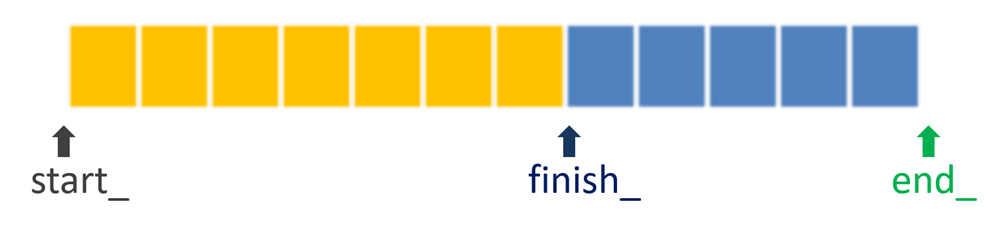

### 构造函数

```
1）vector();  // 创建一个空的vector容器。
2）vector(initializer_list<T> il); // 使用统一初始化列表。
3）vector(const vector<T>& v);  // 拷贝构造函数。
4）vector(Iterator first, Iterator last);  // 用迭代器创建vector容器。
5）vector(vector<T>&& v);  // 移动构造函数（C++11标准）。
6）explicit vector(const size_t n);   // 创建vector容器，元素个数为n（容量和实际大小都是n）。
7）vector(const size_t n, const T& value);  // 创建vector容器，元素个数为n，值均为value。
```

析构函数~vector()释放内存空间。

### 特性操作

```
size_t max_size() const;     // 返回容器的最大长度，此函数意义不大。
size_t capacity() const;      // 返回容器的容量。
size_t size() const;          // 返回容器的实际大小（已使用的空间）。
bool empty() const;        // 判断容器是否为空。
void clear();               // 清空容器。
void reserve(size_t size);   // 将容器的容量设置为至少size。
void shrink_to_fit();	       // 将容器的容量降到实际大小（需要重新分配内存）。
void resize(size_t size);    // 把容器的实际大小置为size。
void resize(size_t size,const T &value);  // 把容器的实际大小置为size，如果size<实际大小，会截断多出的部分；如果size>实际大小，就用value填充。
```

### 元素操作

```
T &operator[](size_t n); 
const T &operator[](size_t n) const;  // 只读。
T &at(size_t n); 
const T &at(size_t n) const;          // 只读。
T *data();            // 返回容器中动态数组的首地址。
const T *data() const; // 返回容器中动态数组的首地址。
T &front();        // 第一个元素。
const T &front();  // 第一个元素，只读。
const T &back();  // 最后一个元素，只读。
T &back();        // 最后一个元素。
```

### 赋值操作

给已存在的容器赋值，将覆盖容器中原有的内容。

```
1）vector &operator=(const vector<T> &v);    // 把容器v赋值给当前容器。
2）vector &operator=(initializer_list<T> il); // 用统一初始化列表给当前容器赋值。
3）void assign(initializer_list<T> il);        // 使用统一初始化列表赋值。
4）void assign(Iterator first, Iterator last);  // 用迭代器赋值。
5）void assign(const size_t n, const T& value);  // 把n个value给容器赋值。
```

```
#include <iostream>
#include <vector>
using  namespace std;

int main()
{
	vector<int> v1;
	v1 = { 1,2,3,4,5 };     // 使用统一初始化列表赋值。
	for (int ii = 0; ii < v1.size(); ii++) cout << v1[ii] << "  ";
	cout << endl;

	vector<int> v2;
	v2 = v1;                    // 把容器v1赋值给当前容器。
	for (int ii = 0; ii < v2.size(); ii++) cout << v2[ii] << "  ";
	cout << endl;

	vector<int> v3;
	v3.assign({ 1,2,3,4,5 });   // 用assign()函数给当前容器赋值，参数是统一初始化列表。
	for (int ii = 0; ii < v3.size(); ii++) cout << v3[ii] << "  ";
	cout << endl;
}
```

### 交换操作

```
void swap(vector<T> &v);    // 把当前容器与v交换。
```

交换的是动态数组的地址。

### 比较操作

```
bool operator == (const vector<T> & v) const;
bool operator != (const vector<T> & v) const;
```

### 插入和删除

```
1）void push_back(const T& value);  // 在容器的尾部追加一个元素。
2）void emplace_back(…);           // 在容器的尾部追加一个元素，…用于构造元素。C++11
3）iterator insert(iterator pos, const T& value);  // 在指定位置插入一个元素，返回指向插入元素的迭代器。
4）iterator emplace (iterator pos, …);  // 在指定位置插入一个元素，…用于构造元素，返回指向插入元素的迭代器。C++11
5）iterator insert(iterator pos, iterator first, iterator last);  // 在指定位置插入一个区间的元素，返回指向第一个插入元素的迭代器。
6）void pop_back();                      // 从容器尾部删除一个元素。
7）iterator erase(iterator pos);             // 删除指定位置的元素，返回下一个有效的迭代器。
8）iterator erase(iterator first, iterator last); // 删除指定区间的元素，返回下一个有效的迭代器。
```

```
#include <iostream>
#include <vector>
using  namespace std;

class AA
{
public:
	int m_bh;               // 编号。
	string m_name;     // 姓名。

	AA()      // 默认构造函数。
	{ 
		//cout << "默认构造函数AA()。\n"; 
	}

	AA(const int &bh,const string& name) : m_bh(bh),m_name(name)   // 有两个参数的构造函数。
	{
		//cout << "构造函数，name=" << m_name << "。\n"; 
	}
	AA(const AA& g) :m_bh(g.m_bh), m_name(g.m_name)                       // 拷贝构造函数。
	{ 
		//cout << "拷贝构造函数，name=" << m_name << "。\n"; 
	}
	//~AA() { cout << "析构函数。\n"; }
};

int main()
{
	vector<AA> v(10);
	cout << v.size() << v.data() << endl;
	//AA a(18,"西施"); 
	//v.push_back(a);
	//v.emplace_back(a);
	v.emplace_back(18,"西施");

	cout << "bh=" << v[0].m_bh << ",name=" << v[0].m_name << endl;
}
```

### vector的嵌套

vector容器可以嵌套使用。

```
#include <iostream>
#include <vector>
using  namespace std;

int main()
{
	vector<vector<int>> vv;   // 创建一个vector容器vv，元素的数据类型是vector<int>。

	vector<int> v;        // 创建一个容器v，它将作为容器vv的元素。

	v = { 1,2,3,4,5 };      // 用统一初始化列表给v赋值。
	vv.push_back(v);    // 把容器v作为元素追加到vv中。

	v = { 11,12,13,14,15,16,17 };   // 用统一初始化列表给v赋值。
	vv.push_back(v);                      // 把容器v作为元素追加到vv中。

	v = { 21,22,23 };     // 用统一初始化列表给v赋值。
	vv.push_back(v);    // 把容器v作为元素追加到vv中。

	// 用嵌套的循环，把vv容器中的数据显示出来。
	for (int ii = 0; ii < vv.size(); ii++)
	{
		for (int jj = 0; jj < vv[ii].size(); jj++)
			cout << vv[ii][jj] << " ";      // 像二维数组一样使用容器vv。

		cout << endl;
	}
}
```

### 注意事项

**1）迭代器失效的问题**

resize()、reserve()、assign()、push_back()、pop_back()、insert()、erase()等函数会引起vector容器的动态数组发生变化，可能导致vector迭代器失效。

## 迭代器 

迭代器是访问容器中元素的通用方法。

如果使用迭代器，不同的容器，访问元素的方法是相同的。

迭代器支持的基本操作：赋值（=）、解引用（*）、比较（==和!=）、从左向右遍历（++）。

一般情况下，迭代器是指针和移动指针的方法。

**迭代器有五种分类：**

**1）正向迭代器**

只能使用++运算符从左向右遍历容器，每次沿容器向右移动一个元素。

```
容器名<元素类型>::iterator 迭代器名;        // 正向迭代器。
容器名<元素类型>::const_iterator 迭代器名;  // 常正向迭代器。
```

相关的成员函数：

```
iterator begin();
const_iterator begin();
const_iterator cbegin();  // 配合auto使用。
iterator end();
const_iterator end();
const_iterator cend();
```

**2）双向迭代器**

具备正向迭代器的功能，还可以反向（从右到左）遍历容器（也是用++），不管是正向还是反向遍历，都可以用--让迭代器后退一个元素。

```
容器名<元素类型>:: reverse_iterator 迭代器名;        // 反向迭代器。
容器名<元素类型>:: const_reverse_iterator 迭代器名;  // 常反向迭代器。
```

相关的成员函数：

```
reverse_iterator rbegin();
const_reverse_iterator crbegin();
reverse_iterator rend();
const_reverse_iterator crend();
```

**3）随机访问迭代器**

具备双向迭代器的功能，还支持以下操作：

- 用于比较两个迭代器相对位置的关系运算（<、<=、>、>=）。

- 迭代器和一个整数值的加减法运算（+、+=、-、-=）。

- 支持下标运算（iter[n]）。

数组的指针是纯天然的随机访问迭代器。

**4) 输入和输出迭代器**

这两种迭代器比较特殊，它们不是把容器当做操作对象，而是把输入/输出流作为操作对象。

```
#include <iostream>
#include <vector>
#include <list>
using  namespace std;

struct Node   // 单链表的结点。
{
	int item;
	Node* next;
};

int* find_(int* arr, int n, const int& val)  // 在整型数组arr中查找值为val的元素。
{
	for (int ii = 0; ii < n; ii++)                     // 遍历数组。
		if (arr[ii] == val) return &arr[ii];       // 如果找到了，返回数组中元素的地址。

	return nullptr;
}

int* find_(int* begin, int* end, const int& val)  // 在整型数组的区间中查找值为val的元素。
{
	for (int* iter = begin; iter != end; iter++)      // 遍历查找区间。
		if (*iter == val) return iter;                         // 如果找到了元素，返回区间中的位置。

	return nullptr;
}

Node* find_(Node* begin, Node* end, const Node& val)         // 在单链表中查找值为val的元素。
{
	for (Node * iter = begin; iter != end; iter = iter->next)     // 遍历链表。
		if (iter->item == val.item) return iter;           // 如果找到了，返回链表中结点的地址。

	return nullptr;
}

// 查找元素的算法。
template<typename T1, typename T2>  
// begin-查找区间开始的位置；end-查找区间结束的位置；val-待查找的值。
T1 find_(T1 begin, T1 end, const T2 &val)      
{
	for (T1 iter = begin; iter != end; iter++)     // 遍历查找区间。
		if (*iter == val) return iter;                       // 如果找到了元素，返回区间中的位置。

	return end;
}

int main()
{
	// 在vector容器中查找元素。
	vector<int> vv = { 1,2,3,4,5 };      // 初始化vector容器。
	vector<int>::iterator it2 = find_(vv.begin(), vv.end(), 3); 
	if (it2 != vv.end()) cout << "查找成功。\n";
	else cout << "查找失败。\n";

	// 在list容器中查找元素。
	list<int> ll = {1,2,3,4,5};               // 初始化vector容器。
	list<int>::iterator it3 = find_(ll.begin(), ll.end(), 3);
	if (it3 != ll.end()) cout << "查找成功。\n";
	else cout << "查找失败。\n";
}
```

## 基于范围的for循环

对于一个有范围的[集合](https://so.csdn.net/so/search?q=集合&spm=1001.2101.3001.7020)来说，在程序代码中指定循环的范围有时候是多余的，还可能犯错误。

C++11中引入了基于范围的for循环。

语法：

```
for (迭代的变量 : 迭代的范围)
{
	// 循环体。
}
```

注意：

1）迭代的范围可以是数组名、容器名、初始化列表或者可迭代的对象（支持begin()、end()、++、==）。

2）数组名传入函数后，已退化成指针，不能作为容器名。

3）如果容器中的元素是结构体和类，迭代器变量应该申明为引用，加const约束表示只读。

4）注意迭代器失效的问题。

```
#include <iostream>
#include <vector>
using  namespace std;

class AA
{
public:
	string m_name;

	AA() { cout << "默认构造函数AA()。\n"; }

	AA(const string& name) : m_name(name) { cout << "构造函数，name=" << m_name << "。\n"; }

	AA(const AA& a) : m_name(a.m_name) { cout << "拷贝构造函数，name=" << m_name << "。\n"; }

	AA& operator=(const AA& a) { m_name = a.m_name;  cout << "赋值函数，name=" << m_name << "。\n";  return *this; }

	~AA() { cout << "析构函数，name=" << m_name<<"。\n"; }
};

int main()
{
	vector<int> vv = { 1,2,3,4,5,6,7,8,9,10 };

	//for (auto it = vv.begin(); it != vv.end(); it++)     // 用迭代器遍历容器vv。
	//{
	//	cout << *it << " ";
	//}
	//cout << endl;

	for (auto val : vv)      // 用基于范围的for循环遍历数组vv。
	{
		cout << val << " ";
		vv.push_back(10);
	}
	cout << endl;

	/*vector<AA> v;
	cout << "1111，v.capacity()=" << v.capacity() << "\n";
	v.emplace_back("西施");
	cout << "2222，v.capacity()=" << v.capacity() << "\n";
	v.emplace_back("冰冰");
	cout << "3333，v.capacity()=" << v.capacity() << "\n";
	v.emplace_back("幂幂");
	cout << "4444，v.capacity()=" << v.capacity() << "\n";

	for (const auto &a : v)
		cout << a.m_name << " ";
	cout << endl;*/
}
```

## list容器 

list容器封装了双链表。

包含头文件： #include<list>

list类模板的声明：

```
template<class T, class Alloc = allocator<T>>
class list{
private:
	iterator head;
	iterator tail;
	……
}
```

### 构造函数

```
1）list();  // 创建一个空的list容器。
2）list(initializer_list<T> il); // 使用统一初始化列表。
3）list(const list<T>& l);  // 拷贝构造函数。
4）list(Iterator first, Iterator last);  // 用迭代器创建list容器。
5）list(list<T>&& l);  // 移动构造函数（C++11标准）。
6）explicit list(const size_t n);   // 创建list容器，元素个数为n。
7）list(const size_t n, const T& value);  // 创建list容器，元素个数为n，值均为value。
```

析构函数~list()释放内存空间。

```
#include <iostream>
#include <vector>
#include <list>
using  namespace std;

int main()
{
	// 1）list();  // 创建一个空的list容器。
	list<int> l1;
	// cout << "li.capacity()=" << l1.capacity() << endl;  // 链表没有容量说法。
	cout << "li.size()=" << l1.size() << endl;

	// 2）list(initializer_list<T> il); // 使用统一初始化列表。
	list<int> l2({ 1, 2, 3, 4, 5, 6, 7, 8, 9, 10 });
	// list<int> l2={ 1, 2, 3, 4, 5, 6, 7, 8, 9, 10 };
	// list<int> l2  { 1, 2, 3, 4, 5, 6, 7, 8, 9, 10 };
	for (int value : l2)       // 用基于范围的for循环遍历容器。
		cout << value << " ";
	cout << endl;

	// 3）list(const list<T>& l);  // 拷贝构造函数。
	list<int> l3(l2);
	// list<int> l3=l2;
	for (int value : l3)    
		cout << value << " ";
	cout << endl;

	// 4）list(Iterator first, Iterator last);  // 用迭代器创建list容器。
	list<int> l4(l3.begin(), l3.end());      // 用list容器的迭代器。
	for (int value : l4)  
		cout << value << " ";
	cout << endl;

	vector<int> v1 = { 1, 2, 3, 4, 5, 6, 7, 8, 9, 10 };  // 创建vector容器。
	list<int> l5(v1.begin() + 2, v1.end() - 3);          // 用vector容器的迭代器创建list容器。
	for (int value : l5)   
		cout << value << " ";
	cout << endl;

	int a1[] = { 1, 2, 3, 4, 5, 6, 7, 8, 9, 10 };   // 创建数组。
	list<int> l6(a1 + 2, a1 + 10 - 3);           // 用数组的指针作为迭代器创建list容器。
	for (int value : l6)     
		cout << value << " ";
	cout << endl;

	char str[] = "hello world";         // 定义C风格字符串。
	string s1(str + 1, str + 7);          // 用C风格字符串创建string容器。
	for (auto value : s1)                   // 遍历string容器。
		cout << value << " ";
	cout << endl;
	cout << s1 << endl;                 // 以字符串的方式显示string容器。

	vector<int> v2(l3.begin(), l3.end());   // 用list迭代器创建vector容器。
	for (auto value : v2)                               // 遍历vector容器。
		cout << value << " ";
	cout << endl;
}
```

### 特性操作

```
size_t max_size() const;     // 返回容器的最大长度，此函数意义不大。
size_t size() const;        // 返回容器的实际大小（已使用的空间）。
bool empty() const;      // 判断容器是否为空。
void clear();             // 清空容器。
void resize(size_t size);   // 把容器的实际大小置为size。
void resize(size_t size,const T &value);  // 把容器的实际大小置为size，如果size<实际大小，会截断多出的部分；如果size>实际大小，就用value填充。
```

### 元素操作

```
T &front();        // 第一个元素。
const T &front();  // 第一个元素，只读。
const T &back();  // 最后一个元素，只读。
T &back();        // 最后一个元素。
```

### 赋值操作

给已存在的容器赋值，将覆盖容器中原有的内容。

```
1）list &operator=(const list<T> &l);         // 把容器l赋值给当前容器。
2）list &operator=(initializer_list<T> il);  // 用统一初始化列表给当前容器赋值。
3）list assign(initializer_list<T> il);        // 使用统一初始化列表赋值。
4）list assign(Iterator first, Iterator last);  // 用迭代器赋值。
5）void assign(const size_t n, const T& value);  // 把n个value给容器赋值。
```

### 交换、反转、排序、归并

```
void swap(list<T> &l);   // 把当前容器与l交换，交换的是链表结点的地址。
void reverse();           // 反转链表。
void sort();              // 对容器中的元素进行升序排序。
void sort(_Pr2 _Pred);    // 对容器中的元素进行排序，排序的方法由_Pred决定（二元函数）。
void merge(list<T> &l);  // 采用归并法合并两个已排序的list容器，合并后的list容器仍是有序的。
```

```
#include <iostream>
#include <vector>
#include <list>
using  namespace std;

int main()
{
	list<int>  la = { 8,2,6,4,5 };

	for (auto &val : la)
		cout << val << " ";
	cout << endl;

	la.reverse();      // 反转链表。

	for (auto& val : la)
		cout << val << " ";
	cout << endl;

	la.sort();            // 链表排序。

	for (auto& val : la)
		cout << val << " ";
	cout << endl;

	list<int>  lb = { 3,7,9,10,1 };
	lb.sort();            // 链表排序。

	la.merge(lb);    // 归并链表。
	 
	for (auto& val : la)
		cout << val << " ";
	cout << endl;
}
```

### 比较操作

```
bool operator == (const vector<T> & l) const;
bool operator != (const vector<T> & l) const;
```

### 插入和删除

```
1）void push_back(const T& value);  // 在链表的尾部追加一个元素。
2）void emplace_back(…);           // 在链表的尾部追加一个元素，…用于构造元素。C++11
3）iterator insert(iterator pos, const T& value);  // 在指定位置插入一个元素，返回指向插入元素的迭代器。
4）iterator emplace (iterator pos, …);  // 在指定位置插入一个元素，…用于构造元素，返回指向插入元素的迭代器。C++11
5）iterator insert(iterator pos, iterator first, iterator last);  // 在指定位置插入一个区间的元素，返回指向第一个插入元素的迭代器。
6）void pop_back();                      // 从链表尾部删除一个元素。
7）iterator erase(iterator pos);             // 删除指定位置的元素，返回下一个有效的迭代器。
8）iterator erase(iterator first, iterator last); // 删除指定区间的元素，返回下一个有效的迭代器。
9）push_front(const T& value);  // 在链表的头部插入一个元素。
10）emplace_front(…);          // 在链表的头部插入一个元素，…用于构造元素。C++11
11）splice(iterator pos, const vector<T> & l);	  // 把另一个链表连接到当前链表。
12）splice(iterator pos, const vector<T> & l, iterator first, iterator last);	// 把另一个链表指定的区间连接到当前链表。
13）splice(iterator pos, const vector<T> & l, iterator first);	// 把另一个链表从first开始的结点连接到当前链表。
14）void remove(const T& value);	 // 删除链表中所有值等于value的元素。
15）void remove_if(_Pr1 _Pred);    // 删除链表中满足条件的元素，参数_Pred是一元函数。
16）void unique();                 // 删除链表中相邻的重复元素，只保留一个。
17）void pop_front();              // 从链表头部删除一个元素。
```

```
#include <iostream>
#include <vector>
#include <list>
using  namespace std;

int main()
{
	list<int>  la = { 8,2,6,4,5 };
	for (auto& val : la) 	cout << val << " ";
	cout << endl;

	list<int>  lb = { 3,7,9,10,1 };
	for (auto& val : lb) 	cout << val << " ";
	cout << endl;

	auto first = lb.begin();
	first++;
	auto last = lb.end();
	last--;

	la.splice(la.begin(), lb, first, last);

	for (auto& val : la) 	cout << val << " ";
	cout << endl;

	cout << "lb.size()=" << lb.size() << endl;
	for (auto& val : lb) 	cout << val << " ";
	cout << endl;
}
```

### list链表的简单实现

```

以下demo程序简单的实现了list容器。
示例：
#include<iostream>
using namespace std;

namespace 
{
	template<class _Ty> class List;

	template<class _Ty> class ListIterator;

	// 节点类。
	template<class _Ty>
	class ListNode
	{
		friend class List<_Ty>;
		friend class ListIterator<_Ty>;
	public:
		ListNode() :_Value(_Ty()), _Next(nullptr), _Prev(nullptr) {}
		ListNode(_Ty V, ListNode* next = nullptr, ListNode* prev = nullptr) :_Value(V), _Next(next), _Prev(prev) {}
	private:
		_Ty           _Value;
		ListNode* _Next;
		ListNode* _Prev;
	};

	// 迭代器。
	template<class _Ty>
	class ListIterator
	{
		typedef ListIterator<_Ty> _It;
	public:
		ListIterator() :_Ptr(nullptr) {}
		ListIterator(ListNode<_Ty>* _P) :_Ptr(_P) {}
	public:
		_It& operator++()
		{
			_Ptr = _Ptr->_Next;
			return *this;
		}
		_It& operator--()
		{
			_Ptr = _Ptr->Prev;
			return *this;
		}
		_Ty& operator*()
		{
			return (_Ptr->_Value);
		}
		bool operator!=(const _It& it)
		{
			return _Ptr != it._Ptr;
		}
		bool operator==(const _It& it)
		{
			return _Ptr == it._Ptr;
		}
		ListNode<_Ty>* _Mynode()
		{
			return _Ptr;
		}
	private:
		ListNode<_Ty>* _Ptr;
	};

	// 链表类。
	template<class _Ty>
	class List
	{
	public:
		typedef ListNode<_Ty>* _Nodeptr;
		typedef ListIterator<_Ty> iterator;
	public:
		List() :_Size(0)
		{
			CreateHead();
		}
		List(size_t n, const _Ty& x = _Ty()) :_Size(0)
		{
			CreateHead(),
				insert(begin(), n, x);
		}
		List(const _Ty* first, const _Ty* last) :_Size(0)
		{
			CreateHead();
			while (first != last)
				push_back(*first++);
		}
		List(iterator first, iterator last)
		{
			CreateHead();
			while (first != last)
			{
				push_back(*first);
				++first;
			}
		}
		List(List<_Ty>& lt) :_Size(0)
		{
			CreateHead();
			List<_Ty>tmp(lt.begin(), lt.end());
			this->swap(tmp);
		}
		~List()
		{
			clear();
			delete _Head;
			_Size = 0;
		}
	public:
		void push_back(const _Ty& x)
		{
			insert(end(), x);
		}
		void pop_back()
		{
			erase(--end());
		}
		void push_front(const _Ty& x)
		{
			insert(begin(), x);
		}
		void pop_front()
		{
			erase(begin());
		}
		_Ty& front()
		{
			return *begin();
		}
		const _Ty& front()const
		{
			return *begin();
		}
		_Ty& back()
		{
			return *--end();
		}
		const _Ty& back()const
		{
			return *--end();
		}
	public:
		size_t size()const
		{
			return _Size;
		}
		bool empty()const
		{
			return (size() == 0);
		}
	public:
		iterator begin()
		{
			return iterator(_Head->_Next);
		}
		iterator end()
		{
			return iterator(_Head);
		}
		void clear()
		{
			erase(begin(), end());
		}
	public:
		//在_P位置前插入值为x的节点
		iterator insert(iterator _P, const _Ty& x)
		{
			_Nodeptr cur = _P._Mynode();
			_Nodeptr _S = new ListNode<_Ty>(x);

			_S->_Next = cur;
			_S->_Prev = cur->_Prev;
			_S->_Prev->_Next = _S;
			_S->_Next->_Prev = _S;

			_Size++;
			return iterator(_S);
		}
		void insert(iterator _P, size_t n, const _Ty& x = _Ty())
		{
			while (n--)
				insert(_P, x);
		}
		//删除_P位置的节点，返回该节点的下一个节点位置
		iterator erase(iterator _P)
		{
			_Nodeptr cur = _P._Mynode();
			_Nodeptr next_node = cur->_Next;

			cur->_Prev->_Next = cur->_Next;
			cur->_Next->_Prev = cur->_Prev;
			delete cur;

			_Size--;

			return iterator(next_node);
		}
		iterator erase(iterator first, iterator last)
		{
			while (first != last)
			{
				first = erase(first);
			}
			return first;
		}
		void swap(List<_Ty>& lt)
		{
			std::swap(_Head, lt._Head);
			std::swap(_Size, lt._Size);
		}
	protected:
		void CreateHead()
		{
			_Head = new ListNode<_Ty>;
			_Head->_Prev = _Head->_Next = _Head;
		}
	private:
		_Nodeptr       _Head;
		size_t         _Size;

	};
};

int main()
{
	int arr[] = { 1, 2, 3, 4, 5, 6, 7, 8, 9, 10 };

	List<int>la(arr+2, arr + 10);
	List<int>lb(la);

	for (auto elem:la)
		cout << elem << " ";
	cout << endl;

	for (auto elem : lb)
		cout << elem << " ";
	cout << endl;
}
```

## pair键值对

pair是类模板，一般用于表示key/value数据，其实现是结构体。

pair结构模板的定义如下：

```
template <class T1, class T2>
struct pair 
{ 
    T1 first;     // 第一个成员，一般表示key。
    T2 second;  // 第二个成员，一般表示value。
	pair();       // 默认构造函数。
	pair(const T1 &val1,const T2 &val2);   // 有两个参数的构造函数。
	pair(const pair<T1,T2> &p);           // 拷贝构造函数。
	void swap(pair<T1,T2> &p);           // 交换两个pair。
};
```

make_pair函数模板的定义如下：

```
template <class T1, class T2>
make_pair(const T1 &first,const T2 &second)
{
	return pair<T1,T2>(first, second);
}
```

```
#include <iostream>
using  namespace std;

template <class T1, class T2>
struct Pair
{
	T1 first;        // 第一个成员，一般表示key。
	T2 second;  // 第二个成员，一般表示value。
	Pair()  {
		cout << "调用了有默认的构造函数。\n";
	}
	Pair(const T1& val1, const T2& val2) :first(val1), second(val2)  {
		cout << "调用了有两个参数的构造函数。\n";
	}
	Pair(const Pair<T1, T2>& p) : first(p.first),second(p.second)  {
		cout << "调用了拷贝构造函数。\n";
	}
};

template <class T1, class T2>
Pair<T1, T2> make_Pair(const T1& first, const T2& second)
{
	// Pair<T1, T2> p(first, second);
	// return p;        // 返回局部对象。
	return Pair<T1, T2>(first, second);  // 返回临时对象。
}

int main()
{
	//pair<int, string> p0;
	//cout << "p0 first=" << p0.first << ",second=" << p0.second << endl;

	//pair<int, string> p1(1, "西施1");    // 两个参数的构造函数。
	//cout << "p1 first=" << p1.first << ",second=" << p1.second << endl;

	//pair<int, string> p2 = p1;             // 拷贝构造。
	//cout << "p2 first=" << p2.first << ",second=" << p2.second << endl;

	//pair<int, string> p3 = { 3, "西施3" };   // 两个参数的构造函数。
	//// pair<int, string> p3 { 3, "西施3" };   // 两个参数的构造函数，省略了等于号。
	//cout << "p3 first=" << p3.first << ",second=" << p3.second << endl;

	auto p4 = Pair<int, string>(4, "西施4");   // 匿名对象（显式调用构造函数）。
	cout << "p4 first=" << p4.first << ",second=" << p4.second << endl;

	auto p5 = make_Pair<int, string>(5, "西施5");   // make_pair()返回的临时对象。
	cout << "p5 first=" << p5.first << ",second=" << p5.second << endl;

	//pair<int, string> p6 = make_pair(6, "西施6");  // 慎用，让make_pair()函数自动推导，再调用拷贝构造，再隐式转换。
	//cout << "p6 first=" << p6.first << ",second=" << p6.second << endl;

	//auto p7 = make_pair(7, "西施7");    // 慎用，让make_pair()函数自动推导，再调用拷贝构造。
	//cout << "p7 first=" << p7.first << ",second=" << p7.second << endl;

	//p5.swap(p4);   // 交换两个pair。

	//cout << "p4 first=" << p4.first << ",second=" << p4.second << endl;
	//cout << "p5 first=" << p5.first << ",second=" << p5.second << endl;

	//struct st_girl
	//{
	//	string name;
	//	int   age;
	//	double height;
	//};
	//// 用pair存放结构体数据。
	//pair<int, st_girl> p = { 3,{"西施",23,48.6} };
	//cout << "p first=" << p.first << endl;
	//cout << "p second.name=" << p.second.name << endl;
	//cout << "p second.age=" << p.second.age << endl;
	//cout << "p second.height=" << p.second.height << endl;
}
```

### map容器 

map 容器封装了红黑树（平衡二叉排序树），用于查找。

包含头文件： #include<map>

map容器的元素是pair键值对。

map类模板的声明：

```
template <class K, class V, class P = less<K>, class _Alloc = allocator<pair<const K, V >>>
class map : public _Tree<_Tmap_traits< K, V, P, _Alloc, false>> 
{
   	… 
}
```

第一个模板参数K：key的数据类型（pair.first）。

第二个模板参数V：value的数据类型（pair.second）。

第三个模板参数P：排序方法，缺省按key升序。

第四个模板参数_Alloc：分配器，缺省用new和delete。

map提供了双向迭代器。

二叉链表： 

```
struct BTNode                        
{                                  
   	pair<K,V> p;       // 键值对。      
	BTNode *parent;   // 父节点。   
	BTNode *lchirld;    // 左子树。 
	BTNode *rchild;    // 右子树。 
};                   
```

### 构造函数

```
1）map();  // 创建一个空的map容器。
2）map(initializer_list<pair<K,V>> il); // 使用统一初始化列表。
3）map(const map<K,V>& m);  // 拷贝构造函数。
4）map(Iterator first, Iterator last);  // 用迭代器创建map容器。
5）map(map<K,V>&& m);  // 移动构造函数（C++11标准）。
```

```
#include <iostream>
#include <map>
using  namespace std;

int main()
{
	// 1）map();  // 创建一个空的map容器。
	map<int, string> m1;

	// 2）map(initializer_list<pair<K, V>> il); // 使用统一初始化列表。
	map<int, string> m2( { { 8,"冰冰" }, { 3,"西施" }, { 1,"幂幂" }, { 7,"金莲" }, { 5,"西瓜" } } );
	// map<int, string> m2={ { 8,"冰冰" }, { 3,"西施" }, { 1,"幂幂" }, { 7,"金莲" }, { 5,"西瓜" } };
	// map<int, string> m2   { { 8,"冰冰" }, { 3,"西施" }, { 1,"幂幂" }, { 7,"金莲" }, { 5,"西瓜" } };
	for (auto& val : m2)
		cout << val.first << "," << val.second << "  ";
	cout << endl;

	// 3）map(const map<K, V>&m);  // 拷贝构造函数。
	map<int, string> m3 = m2;
	for (auto& val : m3)
		cout << val.first << "," << val.second << "  ";
	cout << endl;

	// 4）map(Iterator first, Iterator last);  // 用迭代器创建map容器。
	auto first = m3.begin();  first++;
	auto last = m3.end();  last--;
	map<int, string> m4(first,last);
	for (auto& val : m4)
		cout << val.first << "," << val.second << "  ";
	cout << endl;
	
	// 5）map(map<K, V> && m);  // 移动构造函数（C++11标准）。
}
```

### 特性操作

```
size_t size() const;        // 返回容器的实际大小（已使用的空间）。
bool empty() const;      // 判断容器是否为空。
void clear();             // 清空容器。
```

### 元素操作

```
V &operator[](K key);             // 用给定的key访问元素。
const V &operator[](K key) const;  // 用给定的key访问元素，只读。
V &at(K key);                     // 用给定的key访问元素。
const V &at(K key) const;         // 用给定的key访问元素，只读。
```

注意：

1）[ ]运算符：如果指定键不存在，会向容器中添加新的键值对；如果指定键不存在，则读取或修改容器中指定键的值。

2）at()成员函数：如果指定键不存在，不会向容器中添加新的键值对，而是直接抛出out_of_range 异常。

示例：

```
#include <iostream>
#include <map>
using  namespace std;

int main()
{
	map<string, string> m( { { "08","冰冰" }, { "03","西施" }, { "01","幂幂" }, { "07","金莲" }, { "05","西瓜" } } );
	
	cout << "m[08]=" << m["08"] << endl;     // 显示key为08的元素的value。
	cout << "m[09]=" << m["09"] << endl;    // 显示key为09的元素的value。key为09的元素不存在，将添加新的键值对。
	m["07"] = "花花";                                          // 把key为07的元素的value修改为花花。
	m["12"] = "小乔";                                          // 将添加新的键值对。

	for (auto& val : m)
		cout << val.first << "," << val.second << "  ";
	cout << endl;
}
```

### 赋值操作

给已存在的容器赋值，将覆盖容器中原有的内容。

```
1）map<K,V> &operator=(const map<K,V>& m);         // 把容器m赋值给当前容器。
2）map<K,V> &operator=(initializer_list<pair<K,V>> il);  // 用统一初始化列表给当前容器赋值。
```

### 交换操作

```
void swap(map<K,V>& m);    // 把当前容器与m交换。
```

交换的是树的根结点。

### 比较操作

```
bool operator == (const map<K,V>& m) const;
bool operator != (const map<K,V>& m) const;
```

### 查找操作

1）查找键值为key的键值对

在map容器中查找键值为key的键值对，如果成功找到，则返回指向该键值对的迭代器；失败返回end()。

```
iterator find(const K &key); 
const_iterator find(const K &key) const;  // 只读。
```

2）查找键值>=key的键值对

在map容器中查找第一个键值>=key的键值对，成功返回迭代器；失败返回end()。

```
iterator lower_bound(const K &key); 
const_iterator lower_bound(const K &key) const;  // 只读。
```

3）查找键>key的键值对

在map容器中查找第一个键值>key的键值对，成功返回迭代器；失败返回end()。

```
iterator upper_bound(const K &key); 
const_iterator upper_bound(const K &key) const;  // 只读。
```

4）统计键值对的个数

统计map容器中键值为key的键值对的个数。

```
size_t count(const K &key) const;
```

```
#include <iostream>
#include <map>
using  namespace std;

int main()
{
	map<string, string> m( { { "08","冰冰" }, { "03","西施" }, { "01","幂幂" }, { "07","金莲" }, { "05","西瓜" } } );

	for (auto& val : m)
		cout << val.first << "," << val.second << "  ";
	cout << endl;
	
	// 在map容器中查找键值为key的键值对，如果成功找到，则返回指向该键值对的迭代器；失败返回end()。
	auto it1 = m.find("05");
	if (it1 != m.end())
		cout << "查找成功：" << it1->first << "," << it1->second << endl;
	else
		cout << "查找失败。\n";

	// 在map容器中查找第一个键值 >= key的键值对，成功返回迭代器；失败返回end()。
	auto it2 = m.lower_bound("05");
	if (it2 != m.end())
		cout << "查找成功：" << it2->first << "," << it2->second << endl;
	else
		cout << "查找失败。\n";

	//	在map容器中查找第一个键值 > key的键值对，成功返回迭代器；失败返回end()。
	auto it3 = m.upper_bound("05");
	if (it3 != m.end())
		cout << "查找成功：" << it3->first << "," << it3->second << endl;
	else
		cout << "查找失败。\n";

	//	统计map容器中键值为key的键值对的个数。
	cout << "count(05)=" << m.count("05") << endl;   // 返回1。
	cout << "count(06)=" << m.count("06") << endl;   // 返回0。
}
```

### 插入和删除

```
1）void insert(initializer_list<pair<K,V>> il);  // 用统一初始化列表在容器中插入多个元素。
2）pair<iterator,bool> insert(const pair<K,V> &value);  // 在容器中插入一个元素，返回值pair：first是已插入元素的迭代器，second是插入结果。
3）void insert(iterator first,iterator last);  // 用迭代器插入一个区间的元素。
4）pair<iterator,bool> emplace (...);  // 将创建新键值对所需的数据作为参数直接传入，map容器将直接构造元素。返回值pair：first是已插入元素的迭代器，second是插入结果。
例：mm.emplace(piecewise_construct, forward_as_tuple(8), forward_as_tuple("冰冰", 18));
5）iterator emplace_hint (const_iterator pos,...); // 功能与第4）个函数相同，第一个参数提示插入位置，该参数只有参考意义，如果提示的位置是正确的，对性能有提升，如果提示的位置不正确，性能反而略有下降，但是，插入是否成功与该参数元关。该参数常用end()和begin()。成功返回新插入元素的迭代器；如果元素已经存在，则插入失败，返回现有元素的迭代器。
6）size_t erase(const K & key);  // 从容器中删除指定key的元素，返回已删除元素的个数。
7）iterator erase(iterator pos);  // 用迭代器删除元素，返回下一个有效的迭代器。
8）iterator erase(iterator first,iterator last);  // 用迭代器删除一个区间的元素，返回下一个有效的迭代器。
```

```
#include <iostream>
#include <map>
using  namespace std;

class CGirl        // 超女类。
{
public:
	string m_name;   // 超女姓名。
	int      m_age;       // 超女年龄。

	/*CGirl() : m_age(0) {
		cout << "默认构造函数。\n";
	}*/
	CGirl(const string name, const int age) : m_name(name), m_age(age) {
		cout << "两个参数的构造函数。\n";
	}
	CGirl(const CGirl & g) : m_name(g.m_name), m_age(g.m_age) {
		cout << "拷贝构造函数。\n";
	}
};

int main()
{
	//map<int, CGirl> mm;
	//mm.insert     (pair<int, CGirl>(8, CGirl("冰冰", 18)));                // 一次构造函数，两次拷贝构造函数。
	//mm.insert     (make_pair<int, CGirl>(8, CGirl("冰冰", 18)));     // 一次构造函数，两次拷贝构造函数。
	//mm.emplace(pair<int, CGirl>(8, CGirl("冰冰", 18)));                // 一次构造函数，两次拷贝构造函数。
	//mm.emplace(make_pair<int, CGirl>(8, CGirl("冰冰", 18)));     // 一次构造函数，两次拷贝构造函数。
	//mm.emplace(8, CGirl("冰冰", 18));                                             // 一次构造函数，一次拷贝构造函数。
	//mm.emplace(8, "冰冰", 18);                                                        // 错误。
	//mm.emplace(piecewise_construct, forward_as_tuple(8), forward_as_tuple("冰冰", 18));  // 一次构造函数。

	//for (const auto& val : mm)
	//	cout << val.first << "," << val.second.m_name << "," << val.second.m_name << "  ";
	//cout << endl;

	//return 0;

	map<int, string> m;

	// 1）void insert(initializer_list<pair<K,V>> il);  // 用统一初始化列表在容器中插入多个元素。
	m.insert({ { 8,"冰冰" }, { 3,"西施" }});
	m.insert({ pair<int,string>(1,"幂幂"), make_pair<int,string>(7,"金莲"), {5,"西瓜"}});
	m.insert({ { 18,"冰冰" }, { 3,"西施" } });

	// 2）pair<iterator,bool> insert(const pair<K,V> &value);  
	// 在容器中插入一个元素，返回值pair：first是已插入元素的迭代器，second是插入结果。
	auto ret = m.insert(pair<int, string>(18, "花花"));
	if (ret.second == true) cout << "插入成功：" << ret.first->first << "," << ret.first->second << endl;
	else cout << "插入失败。\n";

	// 3）void insert(iterator first, iterator last);  // 用迭代器插入一个区间的元素。

	// 4）pair<iterator, bool> emplace(...);  
	// 将创建新键值对所需的数据作为参数直接传入，map容器将直接构造元素。
	// 返回值pair：first是已插入元素的迭代器，second是插入结果。
	auto ret1 = m.emplace(20, "花花");
	if (ret1.second == true) cout << "插入成功：" << ret1.first->first << "," << ret1.first->second << endl;
	else cout << "插入失败。\n";

	// 5）iterator emplace_hint(const_iterator pos, ...); 
	// 功能与第4）个函数相同，第一个参数提示插入位置，该参数只有参考意义，如果提示的位置是正确的，
	// 对性能有提升，如果提示的位置不正确，性能反而略有下降，但是，插入是否成功与该参数元关。
	// 该参数常用end()和begin()。成功返回新插入元素的迭代器；如果元素已经存在，则插入失败，返回现
	// 有元素的迭代器。
	m.emplace_hint(m.begin(), piecewise_construct, forward_as_tuple(23), forward_as_tuple("冰棒")); 

	for (auto& val : m)
		cout << val.first << "," << val.second << "  ";
	cout << endl;
}
```

### unordered_map容器

unordered_map容器封装了哈希表，查找、插入和删除元素时，只需要比较几次key的值。

包含头文件： #include<unordered_map>

unordered_map容器的元素是pair键值对。

unordered_map类模板的声明：

```
template <class K, class V, class _Hasher = hash<K>, class _Keyeq = equal_to<K>,
    class _Alloc = allocator<pair<const K, V>>>
class unordered_map : public _Hash<_Umap_traits<K, V, _Uhash_compare<K, _Hasher, _Keyeq>, _Alloc, false>>
{
	…
}
```

第一个模板参数K：key的数据类型（pair.first）。

第二个模板参数V：value的数据类型（pair.second）。

第三个模板参数_Hasher：哈希函数，默认值为std::hash<K>

第四个模板参数_Keyeq：比较函数，用于判断两个key是否相等，默认值是std::equal_to<K>。

第五个模板参数_Alloc：分配器，缺省用new和delete。

创建std::unordered_map类模板的别名：

```
template<class K,class V>
using umap = std::unordered_map<K, V>;
```

### 构造函数

```
1）umap();  // 创建一个空的umap容器。
2）umap(size_t bucket);  // 创建一个空的umap容器，指定了桶的个数，下同。
3）umap(initializer_list<pair<K,V>> il); // 使用统一初始化列表。
4）umap(initializer_list<pair<K,V>> il, size_t bucket); // 使用统一初始化列表。
5）umap(Iterator first, Iterator last);  // 用迭代器创建umap容器。
6）umap(Iterator first, Iterator last, size_t bucket);  // 用迭代器创建umap容器。
7）umap(const umap<K,V>& m);  // 拷贝构造函数。
8）umap(umap<K,V>&& m);  // 移动构造函数（C++11标准）。
```

```
#include <iostream>
#include <unordered_map>
using  namespace std;

template<class K, class V>
using umap = std::unordered_map<K, V>;   

int main()
{
	// 1）umap();  // 创建一个空的map容器。
	umap<int, string> m1;

	// 2）umap(initializer_list<pair<K, V>> il); // 使用统一初始化列表。
	umap<int, string> m2({ { 8,"冰冰" }, { 3,"西施" }, { 1,"幂幂" }, { 7,"金莲" }, { 5,"西瓜" } });
	// umap<int, string> m2={ { 8,"冰冰" }, { 3,"西施" }, { 1,"幂幂" }, { 7,"金莲" }, { 5,"西瓜" } };
	// umap<int, string> m2   { { 8,"冰冰" }, { 3,"西施" }, { 1,"幂幂" }, { 7,"金莲" }, { 5,"西瓜" } };
	for (auto& val : m2)
		cout << val.first << "," << val.second << "  ";
	cout << endl;

	// 3）umap(const map<K, V>&m);  // 拷贝构造函数。
	umap<int, string> m3 = m2;
	for (auto& val : m3)
		cout << val.first << "," << val.second << "  ";
	cout << endl;

	// 4）umap(Iterator first, Iterator last);  // 用迭代器创建map容器。
	auto first = m3.begin();  first++;
	auto last = m3.end();  last--;
	umap<int, string> m4(first, last);
	for (auto& val : m4)
		cout << val.first << "," << val.second << "  ";
	cout << endl;

	// 5）umap(map<K, V> && m);  // 移动构造函数（C++11标准）。
}
```

### 特性操作

```
1）size_t size() const;        // 返回容器中元素的个数。
2）bool empty() const;      // 判断容器是否为空。
3）void clear();             // 清空容器。
4）size_t max_bucket_count();     // 返回容器底层最多可以使用多少桶，无意义。
5）size_t bucket_count();          // 返回容器桶的数量，空容器有8个桶。
6）float load_factor();   // 返回容器当前的装填因子，load_factor() = size() / bucket_count()。
7）float max_load_factor();        // 返回容器的最大装填因子，达到该值后，容器将扩充，缺省为1。
8）void max_load_factor (float z ); // 设置容器的最大装填因子。
9）iterator begin(size_t n);        // 返回第n个桶中第一个元素的迭代器。
10）iterator end(size_t n);          // 返回第n个桶中最后一个元素尾后的迭代器。
11）void reserve(size_t n);          // 将容器设置为至少n个桶。
12）void rehash(size_t n);           // 将桶的数量调整为>=n。如果n大于当前容器的桶数，该方法会将容器重新哈希；如果n的值小于当前容器的桶数，该方法可能没有任何作用。
13）size_t bucket_size(size_t n);     // 返回第n个桶中元素的个数，0 <= n < bucket_count()。
14）size_t bucket(K &key);          // 返回值为key的元素对应的桶的编号。
```

### 元素操作

```
V &operator[](K key);             // 用给定的key访问元素。
const V &operator[](K key) const;  // 用给定的key访问元素，只读。
V &at(K key);                     // 用给定的key访问元素。
const V &at(K key) const;         // 用给定的key访问元素，只读。
```

注意：

1）[ ]运算符：如果指定键不存在，会向容器中添加新的键值对；如果指定键不存在，则读取或修改容器中指定键的值。

2）at()成员函数：如果指定键不存在，不会向容器中添加新的键值对，而是直接抛出out_of_range 异常。

```
#include <iostream>
#include <unordered_map>
using  namespace std;

template<class K, class V>
using umap = std::unordered_map<K, V>;  

int main()
{
	umap<string, string> m( { { "08","冰冰" }, { "03","西施" }, { "01","幂幂" }, { "07","金莲" }, { "05","西瓜" } } );
	
	cout << "m[08]=" << m["08"] << endl;     // 显示key为08的元素的value。
	cout << "m[09]=" << m["09"] << endl;    // 显示key为09的元素的value。key为09的元素不存在，将添加新的键值对。
	m["07"] = "花花";                                          // 把key为07的元素的value修改为花花。
	m["12"] = "小乔";                                          // 将添加新的键值对。

	for (auto& val : m)
		cout << val.first << "," << val.second << "  ";
	cout << endl;
}
```

### 赋值操作

给已存在的容器赋值，将覆盖容器中原有的内容。

```
1）umap<K,V> &operator=(const umap<K,V>& m);       // 把容器m赋值给当前容器。
2）umap<K,V> &operator=(initializer_list<pair<K,V>> il);  // 用统一初始化列表给容器赋值。
```

### 交换操作

```
void swap(umap<K,V>& m);    // 把当前容器与m交换。
```

交换的是树的根结点。

### 比较操作

```
bool operator == (const umap<K,V>& m) const;
bool operator != (const umap<K,V>& m) const;
```

### 查找操作

1）查找键值为key的键值对

在umap容器中查找键值为key的键值对，如果成功找到，则返回指向该键值对的迭代器；失败返回end()。

```
iterator find(const K &key); 
const_iterator find(const K &key) const;  // 只读。
```

2）统计键值对的个数

统计umap容器中键值为key的键值对的个数。

```
size_t count(const K &key) const;
```

### 插入和删除

```
1）void insert(initializer_list<pair<K,V>> il);  // 用统一初始化列表在容器中插入多个元素。
2）pair<iterator,bool> insert(const pair<K,V> &value);  // 在容器中插入一个元素，返回值pair：first是已插入元素的迭代器，second是插入结果。
3）void insert(iterator first,iterator last);  // 用迭代器插入一个区间的元素。
4）pair<iterator,bool> emplace (...);  // 将创建新键值对所需的数据作为参数直接传入，map容器将直接构造元素。返回值pair：first是已插入元素的迭代器，second是插入结果。
例：mm.emplace(piecewise_construct, forward_as_tuple(8), forward_as_tuple("冰冰", 18));
5）iterator emplace_hint (const_iterator pos,...); // 功能与第4）个函数相同，第一个参数提示插入位置，该参数只有参考意义。对哈希容器来说，此函数意义不大。
6）size_t erase(const K & key);  // 从容器中删除指定key的元素，返回已删除元素的个数。
7）iterator erase(iterator pos);  // 用迭代器删除元素，返回下一个有效的迭代器。
8）iterator erase(iterator first,iterator last);  // 用迭代器删除一个区间的元素，返回下一个有效的迭代器。
```

```
#include <iostream>
#include <unordered_map>
using  namespace std;

template<class K, class V>
using umap = std::unordered_map<K, V>;

class CGirl        // 超女类。
{
public:
	string m_name;   // 超女姓名。
	int      m_age;       // 超女年龄。

	/*CGirl() : m_age(0) {
		cout << "默认构造函数。\n";
	}*/
	CGirl(const string name, const int age) : m_name(name), m_age(age) {
		cout << "两个参数的构造函数。\n";
	}
	CGirl(const CGirl& g) : m_name(g.m_name), m_age(g.m_age) {
		cout << "拷贝构造函数。\n";
	}
};

int main()
{
	//umap<int, CGirl> mm;
	////mm.insert     (pair<int, CGirl>(8, CGirl("冰冰", 18)));                // 一次构造函数，两次拷贝构造函数。
	////mm.insert     (make_pair<int, CGirl>(8, CGirl("冰冰", 18)));     // 一次构造函数，两次拷贝构造函数。
	////mm.emplace(pair<int, CGirl>(8, CGirl("冰冰", 18)));                // 一次构造函数，两次拷贝构造函数。
	////mm.emplace(make_pair<int, CGirl>(8, CGirl("冰冰", 18)));     // 一次构造函数，两次拷贝构造函数。
	////mm.emplace(8, CGirl("冰冰", 18));                                             // 一次构造函数，一次拷贝构造函数。
	////// mm.emplace(8, "冰冰", 18);                                                        // 错误。
	//mm.emplace(piecewise_construct, forward_as_tuple(8), forward_as_tuple("冰冰", 18));  // 一次构造函数。

	//for (const auto& val : mm)
	//	cout << val.first << "," << val.second.m_name << "," << val.second.m_name << "  ";
	//cout << endl;

	//return 0;

	umap<int, string> m;

	// 1）void insert(initializer_list<pair<K,V>> il);  // 用统一初始化列表在容器中插入多个元素。
	m.insert({ { 8,"冰冰" }, { 3,"西施" } });
	m.insert({ pair<int,string>(1,"幂幂"), make_pair<int,string>(7,"金莲"), {5,"西瓜"} });
	m.insert({ { 18,"冰冰" }, { 3,"西施" } });

	// 2）pair<iterator,bool> insert(const pair<K,V> &value);  
	// 在容器中插入一个元素，返回值pair：first是已插入元素的迭代器，second是插入结果。
	auto ret = m.insert(pair<int, string>(18, "花花"));
	if (ret.second == true) cout << "插入成功：" << ret.first->first << "," << ret.first->second << endl;
	else cout << "插入失败。\n";

	// 3）void insert(iterator first, iterator last);  // 用迭代器插入一个区间的元素。

	// 4）pair<iterator, bool> emplace(...);  
	// 将创建新键值对所需的数据作为参数直接传入，umap容器将直接构造元素。
	// 返回值pair：first是已插入元素的迭代器，second是插入结果。
	auto ret1 = m.emplace(20, "花花");
	if (ret1.second == true) cout << "插入成功：" << ret1.first->first << "," << ret1.first->second << endl;
	else cout << "插入失败。\n";

	// 5）iterator emplace_hint(const_iterator pos, ...); 
	m.emplace_hint(m.begin(), piecewise_construct, forward_as_tuple(23), forward_as_tuple("冰棒"));

	for (auto& val : m)
		cout << val.first << "," << val.second << "  ";
	cout << endl;
}
```

### queue容器

queue容器的逻辑结构是队列，物理结构可以是数组或链表，主要用于多线程之间的数据共享。

包含头文件： #include<queue>

queue类模板的声明：

```
template <class T, class _Container = deque<T>>
class queue{
	……
}
```

第一个模板参数T：元素的数据类型。

第二个模板参数_Container：底层容器的类型，缺省是std::deque，可以用std::list，还可以用自定义的类模板。

queue容器不支持迭代器。

### 构造函数

```
1）queue();  // 创建一个空的队列。
2）queue(const queue<T>& q);  // 拷贝构造函数。
3）queue(queue<T>&& q);  // 移动构造函数（C++11标准）。
```

析构函数~queue()释放内存空间。

### 常用操作

```
1）void push(const T& value);  // 元素入队。
2）void emplace(…);           // 元素入队，…用于构造元素。C++11
3）size_t size() const;          // 返回队列中元素的个数。
4）bool empty() const;        // 判断队列是否为空。
5）T &front();                 // 返回队头元素。
6）const T &front();           // 返回队头元素，只读。
7）T &back();                 // 返回队尾元素。
8）const T &back();           // 返回队头元素，只读。
9）void pop();                // 出队，删除队头的元素。
```

```
#include <iostream>
#include <queue>
#include <deque>
#include <list>
using  namespace std;

class girl       // 超女类。
{
public:
	int m_bh;             // 编号。
	string m_name;  // 姓名。
	girl(const int& bh, const string& name) : m_bh(bh), m_name(name) {}
};

int main()
{
	// template <class T, class _Container = deque<T>>
	// class queue {
	//	 ……
	// }
	// 第一个模板参数T：元素的数据类型。
	// 第二个模板参数_Container：底层容器的类型，缺省是std::deque，可以用std::list，还可以用自定义的类模板。

	queue<girl, list<girl>> q;          // 物理结构为链表。
	//queue<girl, deque<girl>> q;    // 物理结构为数组。
	//queue<girl> q;                           // 物理结构为数组。
	//queue<girl, vector<girl>> q;    // 物理结构为vector，不可以。	

	q.push(girl(3, "西施"));   // 效率不高。
	q.emplace(8, "冰冰");     // 效率更高。
	q.push(girl(5, "幂幂"));
	q.push(girl(2, "西瓜"));

	while (q.empty() == false)
	{
		cout << "编号：" << q.front().m_bh << "，姓名：" << q.front().m_name << endl;
		q.pop();
	}
}
```

### 其它操作

```
1）queue &operator=(const queue<T> &q);    // 赋值。
2）void swap(queue<T> &q);    // 交换。
3）bool operator == (const queue<T> & q) const; // 重载==操作符。
4）bool operator != (const queue<T> & q) const; // 重载!=操作符。
```

## STL其它容器 

### array（静态数组）

**1）物理结构**

在栈上分配内存，创建数组的时候，数组长度必须是常量，创建后的数组大小不可变。

```
template<class T, size_t size>
class array{
private:
	T elems_[size]; 
	……
};
```

**2）迭代器**

随机访问迭代器。

**3）特点**

部分场景中，比常规数组更方便（能用于模板），可以代替常规数组。

**4）各种操作**

```
1）void fill(const T & val);   // 给数组填充值（清零）。
2）size_t size();        // 返回数组的大小。
3）bool empty() const;    // 无意义。
4）T &operator[](size_t n); 
5）const T &operator[](size_t n) const; // 只读。
6）T &at(size_t n); 
7）const T &at(size_t n) const;     // 只读。
8）T *data();      // 返回数组的首地址。
9）const T *data() const; // 返回数组的首地址。
10）T &front();     // 第一个元素。
11）const T &front();  // 第一个元素，只读。
12）const T &back();  // 最后一个元素，只读。
13）T &back();    // 最后一个元素。
```

```
#include <iostream>
#include <array>
using  namespace std;

////void func(int arr[][6],int len)
//void func(int (* arr)[6], int len)
//{
//	for (int ii = 0; ii < len; ii++)
//	{
//		for (int jj = 0; jj < 6; jj++)
//			cout << arr[ii][jj] << " ";
//		cout << endl;
//	}
//}

//void func(const array < array<int, 5>, 10 >& arr)  
//{
//	for (int ii = 0; ii < arr.size(); ii++)
//	{
//		for (int jj = 0; jj < arr[ii].size(); jj++)
//			cout << arr[ii][jj] << " ";
//		cout << endl;
//	}
//}

template <typename T>
void func(const T& arr)
{
	for (int ii = 0; ii < arr.size(); ii++)
	{
		for (int jj = 0; jj < arr[ii].size(); jj++)
			cout << arr[ii][jj] << " ";
		cout << endl;
	}
}

int main()
{
	//int aa[11] = {1,2,3,4,5,6,7,8,9,10,11};         // 一维数组。
	//array<int, 10> aa = { 1,2,3,4,5,6,7,8,9,10 };         // 一维数组。
	//for (int ii = 0; ii < 10; ii++)            // 传统的方法。
	//	cout << aa[ii] << " ";
	//cout << endl;
	//
	//for (int ii = 0; ii < aa.size(); ii++)  // 利用array的size()方法。
	//	cout << aa[ii] << " ";
	//cout << endl;
	//
	//for (auto it= aa.begin(); it < aa.end(); it++)      // 使用迭代器。
	//	cout << *it << " ";
	//cout << endl;

	//for (auto val : aa)                           // 基于范围的for循环。
	//	cout << val << " ";
	//cout << endl;

	//int bb[10][6];
	//for (int ii = 0; ii < 10; ii++)  // 对二维数组赋值。
	//{
	//	for (int jj = 0; jj < 6; jj++)
	//		bb[ii][jj] = jj * 10 + ii;
	//}

	//func(bb,10);  // 把二维数组传给函数。

	array< array<int, 5>, 10 > bb;  // 二维数组，相当于int bb[10][5]。
	 
	for (int ii = 0; ii < bb.size(); ii++)  // 对二维数组赋值。
	{
		for (int jj = 0; jj < bb[ii].size(); jj++)
			bb[ii][jj] = jj * 10 + ii;
	}

	func(bb);  // 把二维数组传给函数。
}
```

### deque（双端队列）

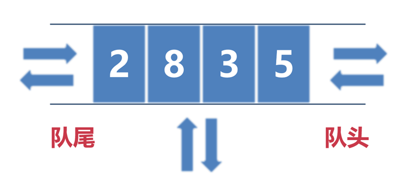

**1）物理结构**

deque容器存储数据的空间是多段等长的连续空间构成，各段空间之间并不一定是连续的。

为了管理这些连续空间的分段，deque容器用一个数组存放着各分段的首地址。

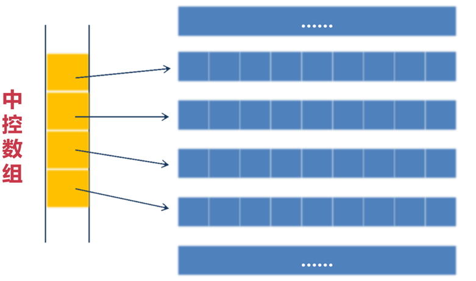

通过建立数组，deque容器的分段的连续空间能实现整体连续的效果。

当deque容器在头部或尾部增加元素时，会申请一段新的连续空间，同时在数组中添加指向该空间的指针。

**2）迭代器**

随机访问迭代器。

**3）特点**

- 提高了在**两端**插入和删除元素的效率，扩展空间的时候，不需要拷贝以前的元素。

- 在中间插入和删除元素的效率比vector更糟糕。

- 随机访问的效率比vector容器略低。

**4) 各种操作**

与vector容器相同。

### forward_list（单链表）

**1）物理结构**

单链表。

**2）迭代器**

正向迭代器。

**3）特点**

比双链表少了一个指针，可节省一丢丢内存，减少了两次对指针的赋值操作。

如果单链表能满足业务需求，建议使用单链表而不是双链表。

**4）各种操作**

与list容器相同。

### multimap

- 底层是红黑树。

- multimap和map的区别在：multimap允许关键字重复，而map不允许重复。

- 各种操作与map容器相同。

### set&multiset

- 底层是红黑树。

- set和map的区别在：map中存储的是键值对，而set只保存关键字。

- multiset和set的区别在：multiset允许关键字重复，而set不允许重复。

- 各种操作与map容器相同。

### unordered_multimap

- 底层是哈希表。

- unordered_multimap和unordered_map的区别在：unordered_multimap允许关键字重复，而unordered_map不允许重复。

- 各种操作与unordered_map容器相同。

### unordered_set&unordered_multiset

- 底层是哈希表。

- unordered_set和unordered_map的区别在：unordered_map中存储的是键值对，而unordered_set只保存关键字。

- unordered_multiset和unordered_set的区别在：unordered_multiset允许关键字重复，而unordered_set不允许重复。

- 各种操作与unordered_map容器相同。

### priority_queue（优先队列）

- 优先级队列相当于一个有权值的单向队列queue，在这个队列中，所有元素是按照优先级排列的。

- 底层容器可以用deque和list。

- 各种操作与queue容器相同。

### stack（栈）

- 底层容器可以用deque和list。

## STL算法

STL提供了很多处理容器的函数模板，它们的设计是相同的，有以下特点：

1）用迭代器表示需要处理数据的区间。

2）返回迭代器放置处理数据的结果（如果有结果）。

3）接受一个函数对象参数（结构体模板），用于处理数据（如果需要）。

### 函数对象

很多STL算法都使用函数对象，也叫函数符（functor），包括函数名、函数指针和仿函数。

函数符的概念：

1）生成器（generator）：不用参数就可以调用的函数符。

2）一元函数（unary function）：用一个参数可以调用的函数符。

3）二元函数（binary function）：用两个参数可以调用的函数符。

改进的概念：

1）一元谓词（predicate）：返回bool值的一元函数。

2）二元谓词（binary predicate）：返回bool值的二元函数。

### 预定义的函数对象

STL定义了多个基本的函数符，用于支持STL的算法函数。

包含头文件：#include <functional>

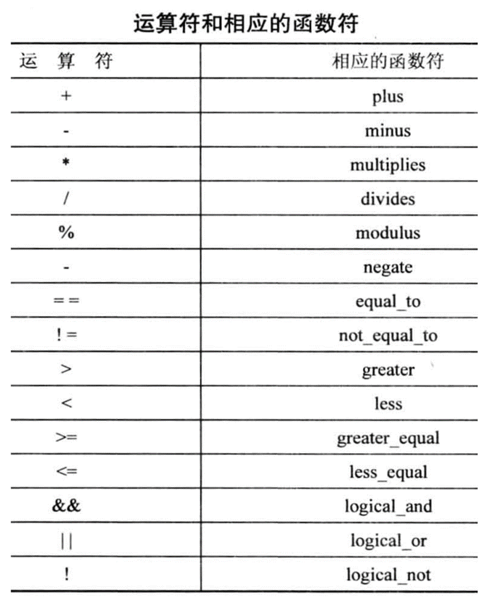

### 算法函数

STL将算法函数分成四组：

1）非修改式序列操作：对区间中的每个元素进行操作，这些操作不修改容器的内容。

2）修改式序列操作：对区间中的每个元素进行操作，这些操作可以容器的内容（可以修改值，也可以修改排列顺序）。

3）排序和相关操作：包括多个排序函数和其它各种函数，如集合操作。

4）通用数字运算：包括将区间的内容累积、计算两个容器的内部乘积、计算小计、计算相邻对象差的函数。通常，这些都是数组的操作特性，因此vector是最有可能使用这些操作的容器。

前三组在头文件#include <algorithm>中，第四组专用于数值数据，在#include <numeric>中。

详见《C++ Primer plus》，第六版，从886页开始。

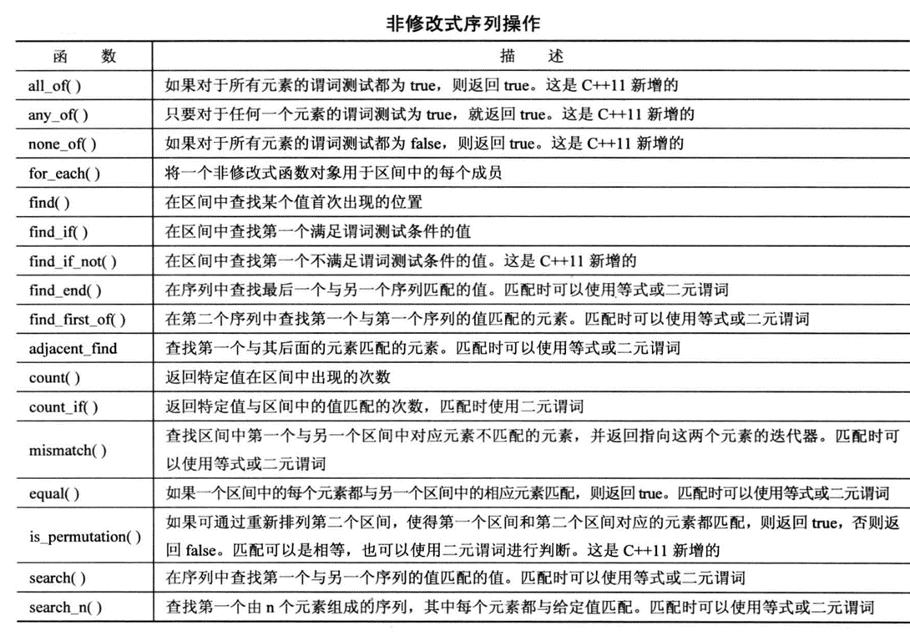

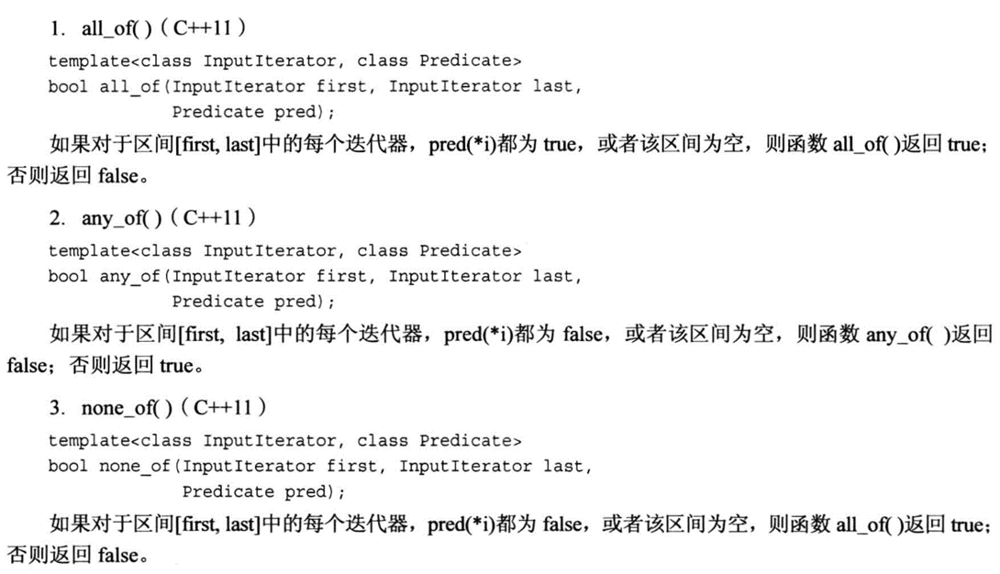

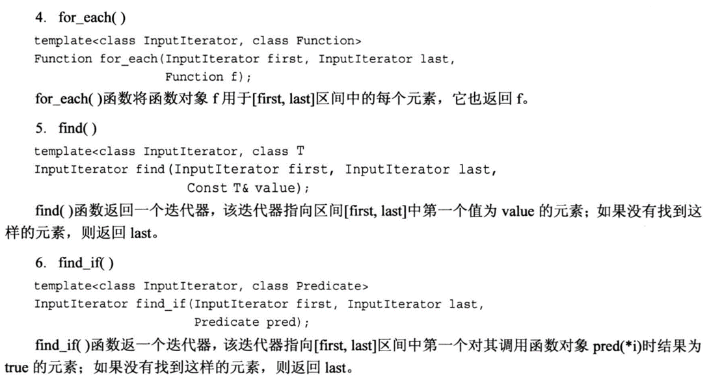

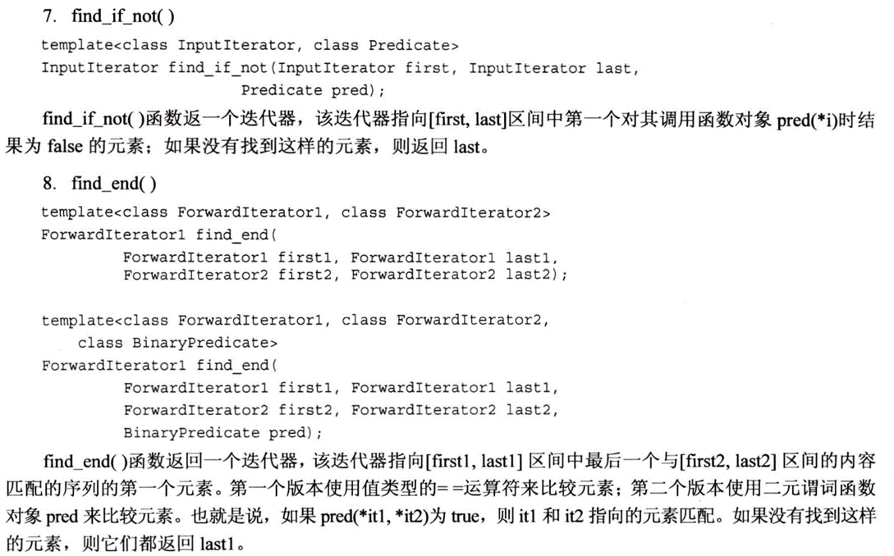

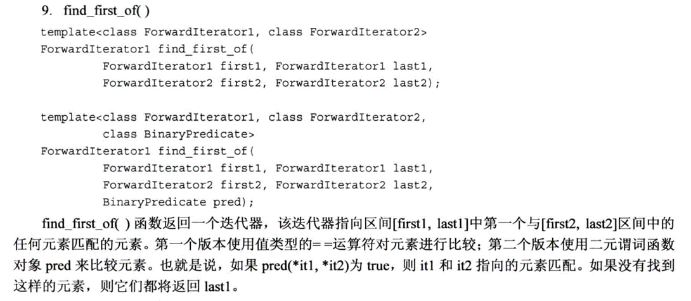

### 学习要领

**1）如果容器有成员函数，则使用成员函数，如果没有才考虑用STL的算法函数。**

2）把全部的STL算法函数过一遍，知道大概有些什么东西。

**3）如果打算采用某算法函数，一定要搞清楚它的原理，关注它的效率。**

4）不要太看重这些算法函数，自己写一个也就那么回事。

5）不是因为简单，而是因为不常用。

### 常用函数

**1）for_each()遍历**

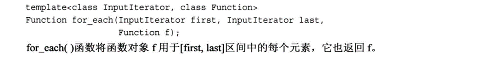

**2）find()遍历**

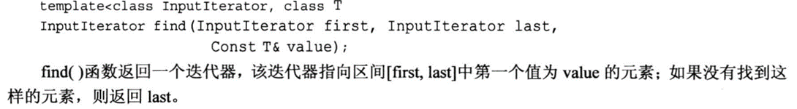

**3）find_if()遍历**

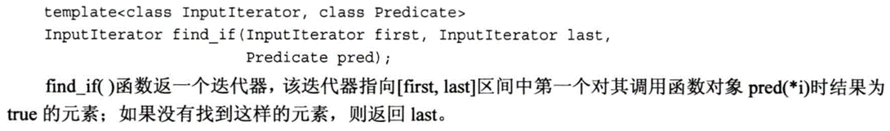

**4）find_not_if()遍历**

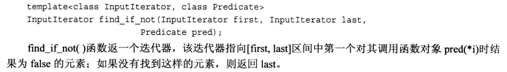

**5）sort()排序**

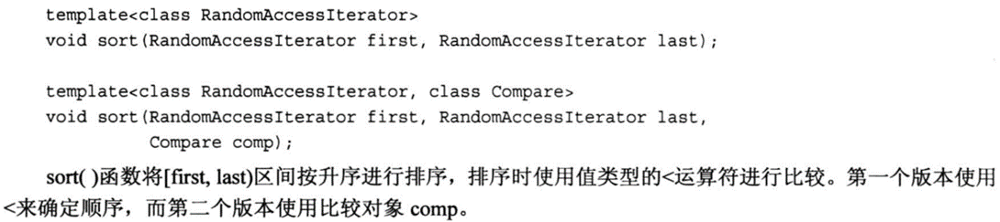

STL的sort算法，数据量大时采用QuickSort(快速排序)，分段归并排序。一旦分段后的数据量小于某个门槛（16），为避免QuickSort的递归调用带来过大的额外负荷，就改用InsertSort（插入排序）。如果递归层次过深，还会改用HeapSort（堆排序）。

适用于数组容器vector、string、deque（list容器有sort成员函数，红黑树和哈希表没有排序的说法）。

**6）二分查找**

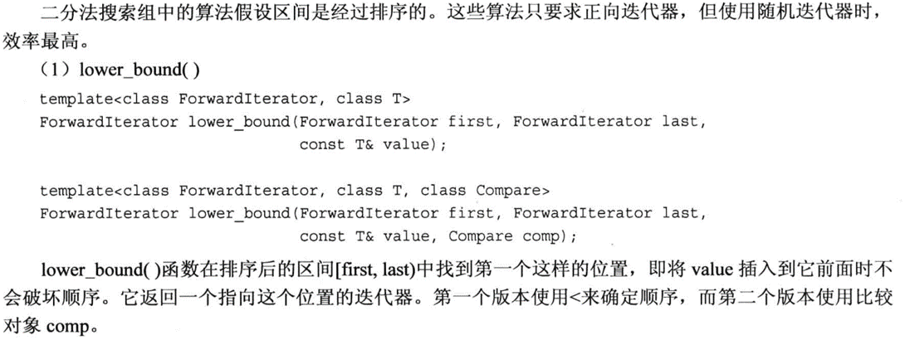

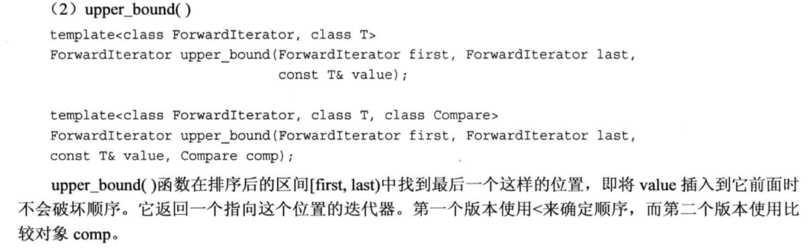

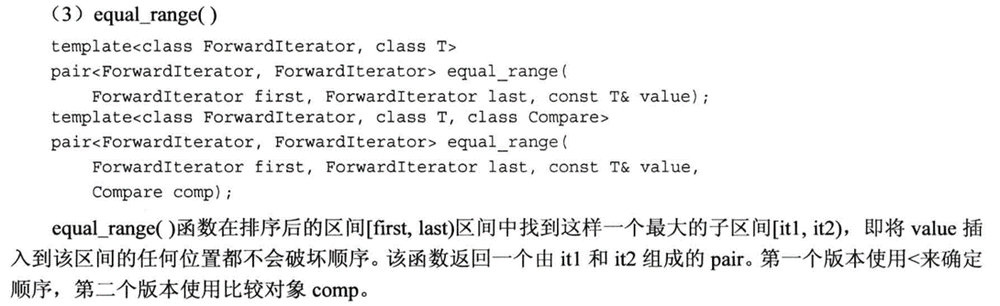

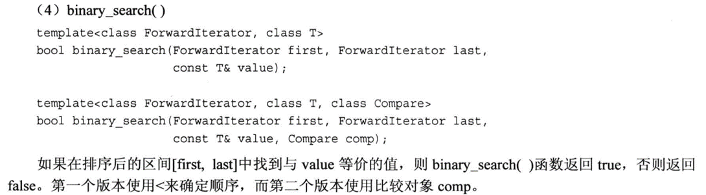

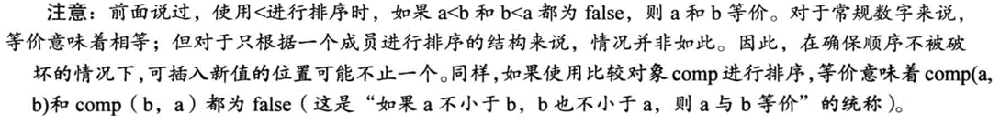

```
示例（foreach）：
#include <iostream>
#include <vector>
#include <list>
#include <algorithm>
using  namespace std;

template<typename T>
void zsshow(const T& no)    // 张三的个性化表白函数。
{
	cout << "亲爱的" << no << "号：我是一只傻傻鸟。\n";
}

template<typename T>
class czs   // 张三的个性化表白仿函数。
{
public:
	void operator()(const T& no) {  
		cout << "亲爱的" << no << "号：我是一只傻傻鸟。\n";
	}
};

template<typename T1, typename T2>
void foreach(const T1 first, const T1 last, T2 pfun)
{
	for (auto it = first; it != last; it++)
		pfun(*it);        // 以超女编号为实参调用类的operator()函数。
}

int main()
{
	vector<int> bh = { 5,8,2,6,9,3,1,7 };   // 存放超女编号的容器。
	//list<string> bh = { "05","08","02","06","09","03","01","07" };   // 存放超女编号的容器。

	// 写一个函数，在函数中遍历容器，向超女表白，表白的方法可自定义。
	foreach(bh.begin(), bh.end(), zsshow<int>);  // 第三个参数是模板函数。
	
	foreach(bh.begin(), bh.end(), czs<int>());       // 第三个参数是仿函数。
}
```

```
示例（findif）：
#include <iostream>
#include <vector>
#include <list>
#include <algorithm>
using  namespace std;

template<typename T>
bool zsshow(const T& no,const T & in_no)    // 张三的个性化表白函数。
{
	if (no != in_no) return false;
	cout << "亲爱的" << no << "号：我是一只傻傻鸟。\n";
	return true;
}

template<typename T>
class czs   // 张三的个性化表白仿函数。
{
public:
	bool operator()(const T& no, const T& in_no) {
		if (no != in_no) return false;
		cout << "亲爱的" << no << "号：我是一只傻傻鸟。\n";
		return true;
	}
};

template<typename T1, typename T2, typename T3>
T1 findif(const T1 first, const T1 last, T2 pfun,T3 in_no)
{
	for (auto it = first; it != last; it++)
		if (pfun(*it, in_no) ==true)  return it;        // 用迭代器调用函数对象。

	return last;
}

int main()
{
	vector<int> bh = { 5,8,2,6,9,33,1,7 };   // 存放超女编号的容器。
	//list<string> bh = { "05","08","02","06","09","03","01","07" };   // 存放超女编号的容器。

	auto it1=findif(bh.begin(), bh.end(), zsshow<int>,2);  // 第三个参数是模板函数。
	if (it1 == bh.end()) cout << "查找失败。\n";
	else cout << "查找成功：" << *it1 << endl;

	auto it2=findif(bh.begin(), bh.end(), czs<int>(),33);       // 第三个参数是仿函数。
	if (it2 == bh.end()) cout << "查找失败。\n";
	else cout << "查找成功：" << *it2 << endl;
}
```

```
#include <iostream>
#include <vector>
#include <list>
#include <algorithm>  // STL算法函数头文件。
using  namespace std;

template<typename T>
bool zsshow(const T& no)    // 张三的个性化表白函数。
{
	if (no != 3) return false;
	cout << "亲爱的" << no << "号：我是一只傻傻鸟。\n";
	return true;
}

template<typename T>
class czs   // 张三的个性化表白仿函数。
{
public:
	T m_no;     // 存放张三喜欢的超女编号。
	czs(const T& no) : m_no(no) {}  // 构造函数的参数是张三喜欢的超女编号。
	bool operator()(const T& no) {
		if (no != m_no) return false;
		cout << "亲爱的" << no << "号：我是一只傻傻鸟。\n";
		return true;
	}
};

template<typename T1, typename T2>
T1 findif(const T1 first, const T1 last, T2 pfun)
{
	for (auto it = first; it != last; it++)
		if (pfun(*it) ==true)  return it;        // 用迭代器调用函数对象。

	return last;
}

int main()
{
	vector<int> bh = { 5,8,2,6,9,33,1,7 };   // 存放超女编号的容器。
	//list<string> bh = { "05","08","02","06","09","03","01","07" };   // 存放超女编号的容器。

	auto it1=find_if(bh.begin(), bh.end(), zsshow<int>);  // 第三个参数是模板函数。
	if (it1 == bh.end()) cout << "查找失败。\n";
	else cout << "查找成功：" << *it1 << endl;

	auto it2=find_if(bh.begin(), bh.end(), czs<int>(8));       // 第三个参数是仿函数。
	if (it2 == bh.end()) cout << "查找失败。\n";
	else cout << "查找成功：" << *it2 << endl;
}
```


```
#include <iostream>
#include <vector>
#include <list>
#include <algorithm>   // STL算法函数。
#include <functional>   // STL仿函数。
using  namespace std;

template<typename T>
bool compasc(const T& left, const T& right)   {     // 普通函数，用于升序。
	return left < right;
}

template<typename T>
struct _less
{
	bool operator()(const T& left, const T& right) { // 仿函数，用于升序。
		return left < right;
	}
};

template<typename T>
bool compdesc(const T& left, const T& right) {     // 普通函数，用于降序。
	return left > right;
}

template<typename T>
class _greater
{
public:
	bool operator()(const T& left, const T& right) { // 仿函数，用于降序。
		return left > right;
	}
};

template<typename T, typename compare>
void bsort(const T first, const T last, compare comp)  // 冒泡排序。
{
	while(true)
	{
		bool bswap = false;        // 本轮遍历已交换过元素的标识，true-交换过，false-未交换过。
		for (auto it = first; ; )
		{
			auto left = it;                  // 左边的元素。
			it++;
			auto right = it;               // 右边的元素。
			if (right == last) break;  // 表示it1已经是最后一个元素了。

			//if (*left > *right)             // 如果左边的元素比右边大，交换它们的值。
			//if (*left < *right)             // 如果左边的元素比右边小，交换它们的值。
			// 排序规则：如果comp()返回true，left排在前面（升序），否则right排在前面（降序）。
			if (comp(*left, *right) == true)  continue;

			// 交换两个元素的值。
			auto tmp = *right;
			*right = *left;
			*left = tmp;
			bswap = true;        // 一轮遍历已交换过元素的标识。
		}

		if (bswap == false) break;  // 如果在for循环中不曾交换过元素，说明全部的元素已有序。
	}
}

int main()
{
	vector<int> bh = { 5,8,2,6,9,33,1,7 };   // 存放超女编号的容器。
	//list<string> bh = { "05","08","02","06","09","03","01","07" };   // 存放超女编号的容器。

	//bsort(bh.begin(), bh.end(),compasc<int>);        // 普通函数（升序）。
	//bsort(bh.begin(), bh.end(), compdesc<int>);     // 普通函数（降序）。

	//bsort(bh.begin(), bh.end(),_less<int>());             // 仿函数（升序）。
	//bsort(bh.begin(), bh.end(), _greater<int>());      // 仿函数（降序）。

	//bsort(bh.begin(), bh.end(), less<int>());             // STL提供的仿函数（升序）。
	//bsort(bh.begin(), bh.end(), greater<int>());       // STL提供的仿函数（降序）。

	//sort(bh.begin(), bh.end(),_less<int>());             // 仿函数（升序）。
	sort(bh.begin(), bh.end(), _greater<int>());      // 仿函数（降序）。

	for (auto val : bh)
		cout << val << " ";
	cout << endl;
}
```


```
#include <iostream>
#include <vector>
#include <list>
#include <algorithm>
using  namespace std;

template<typename T>
struct girl   {
	T   m_yz;         // 统计的颜值。
	int m_count;   // 符合条件的元素个数。

	girl(const T yz) : m_yz(yz), m_count(0) {}

	void operator()(const T& yz) {
		if (yz==m_yz) 	m_count++;
	}
};

int main()
{
	vector<int> vv = { 1,3,2,4,1,2,3,1,4,3 };   // 1-极漂亮；2-漂亮；3-普通；4-歪瓜裂枣

	girl<int> g=for_each(vv.begin(), vv.end(), girl<int>(1));       // 按颜值统计超女人数。

	cout << "g.m_count=" << g.m_count << endl;
}
```

## 智能指针unique_ptr

unique_ptr独享它指向的对象，也就是说，同时只有一个unique_ptr指向同一个对象，当这个unique_ptr被销毁时，指向的对象也随即被销毁。

包含头文件：#include <memory>

```
template <typename T, typename D = default_delete<T>>
class unique_ptr
{
public:
	explicit unique_ptr(pointer p) noexcept;	// 不可用于转换函数。
	~unique_ptr() noexcept;    
	T& operator*() const;            // 重载*操作符。
	T* operator->() const noexcept;  // 重载->操作符。
	unique_ptr(const unique_ptr &) = delete;   // 禁用拷贝构造函数。
	unique_ptr& operator=(const unique_ptr &) = delete;  // 禁用赋值函数。
	unique_ptr(unique_ptr &&) noexcept;	  // 右值引用。
	unique_ptr& operator=(unique_ptr &&) noexcept;  // 右值引用。
	// ...
private:
	pointer ptr;  // 内置的指针。
};

```

第一个模板参数T：指针指向的数据类型。

第二个模板参数D：指定删除器，缺省用delete释放资源。

```
class AA
{
public:
	string m_name;
	AA() { cout << m_name << "调用构造函数AA()。\n"; }
	AA(const string & name) : m_name(name) { cout << "调用构造函数AA("<< m_name << ")。\n"; }
	~AA() { cout << m_name << "调用了析构函数~AA(" << m_name << ")。\n"; }
};
```

### 基本用法

**1）初始化**

**方法一：**

```
unique_ptr<AA> p0(new AA("西施"));   // 分配内存并初始化。
```

**方法二：**

```
unique_ptr<AA> p0 = make_unique<AA>("西施");  // C++14标准。
unique_ptr<int> pp1=make_unique<int>();     // 数据类型为int。
unique_ptr<AA> pp2 = make_unique<AA>();    // 数据类型为AA，默认构造函数。
unique_ptr<AA> pp3 = make_unique<AA>("西施"); // 数据类型为AA，一个参数的构造函数。
unique_ptr<AA> pp4 = make_unique<AA>("西施",8); // 数据类型为AA，两个参数的构造函数。
```

方法三（不推荐）：

```
AA* p = new AA("西施");
unique_ptr<AA> p0(p);         // 用已存在的地址初始化。
```

**2）使用方法**

- 智能指针重载了*和->操作符，可以像使用指针一样使用unique_ptr。

- 不支持普通的拷贝和赋值。

 ```
 	AA* p = new AA("西施");
 	unique_ptr<AA> pu2 = p;              // 错误，不能把普通指针直接赋给智能指针。
 	unique_ptr<AA> pu3 = new AA("西施"); // 错误，不能把普通指针直接赋给智能指针。
 	unique_ptr<AA> pu2 = pu1;           // 错误，不能用其它unique_ptr拷贝构造。
 	unique_ptr<AA> pu3;
 	pu3 = pu1;                            // 错误，不能用=对unique_ptr进行赋值。
 ```

- 不要用同一个裸指针初始化多个unique_ptr对象。

- get()方法返回裸指针。

- 不要用unique_ptr管理不是new分配的内存。

**3）用于函数的参数**

- 传引用（不能传值，因为unique_ptr没有拷贝构造函数）。

- 裸指针。

**4）不支持指针的运算（+、-、++、--）**

### 更多技巧

1）将一个unique_ptr赋给另一个时，如果源unique_ptr是一个临时右值，编译器允许这样做；如果源unique_ptr将存在一段时间，编译器禁止这样做。一般用于函数的返回值。

```
unique_ptr<AA> p0;
p0 = unique_ptr<AA>(new AA ("西瓜"));
```

2）用nullptr给unique_ptr赋值将释放对象，空的unique_ptr==nullptr。

3）release()释放对原始指针的控制权，将unique_ptr置为空，返回裸指针。（可用于把unique_ptr传递给子函数，子函数将负责释放对象）

4）std::move()可以转移对原始指针的控制权。（可用于把unique_ptr传递给子函数，子函数形参也是unique_ptr）

5）reset()释放对象。

```
void reset(T * _ptr= (T *) nullptr);
pp.reset();        // 释放pp对象指向的资源对象。
pp.reset(nullptr);  // 释放pp对象指向的资源对象
pp.reset(new AA("bbb"));  // 释放pp指向的资源对象，同时指向新的对象。
```

6）swap()交换两个unique_ptr的控制权。

```
void swap(unique_ptr<T> &_Right);
```

7）unique_ptr也可象普通指针那样，当指向一个类继承体系的基类对象时，也具有多态性质，如同使用裸指针管理基类对象和派生类对象那样。

8）unique_ptr不是绝对安全，如果程序中调用exit()退出，全局的unique_ptr可以自动释放，但局部的unique_ptr无法释放。

9）unique_ptr提供了支持数组的具体化版本。

数组版本的unique_ptr，重载了操作符[]，操作符[]返回的是引用，可以作为左值使用。

```
// unique_ptr<int[]> parr1(new int[3]);          // 不指定初始值。
unique_ptr<int[]> parr1(new int[3]{ 33,22,11 });  // 指定初始值。
cout << "parr1[0]=" << parr1[0] << endl;
cout << "parr1[1]=" << parr1[1] << endl;
cout << "parr1[2]=" << parr1[2] << endl;

unique_ptr<AA[]> parr2(new AA[3]{string("西施"), string("冰冰"), string("幂幂")});
cout << "parr2[0].m_name=" << parr2[0].m_name << endl;
cout << "parr2[1].m_name=" << parr2[1].m_name << endl;
cout << "parr2[2].m_name=" << parr2[2].m_name << endl;
```

```
#include <iostream>
#include <memory>
using  namespace std;

class AA
{
public:
	string m_name;
	AA() { cout << m_name << "调用构造函数AA()。\n"; }
	AA(const string & name) : m_name(name) { cout << "调用构造函数AA("<< m_name << ")。\n"; }
	~AA() { cout << "调用了析构函数~AA(" << m_name << ")。\n"; }
};

// 函数func1()需要一个指针，但不对这个指针负责。
void func1(const AA* a) {
	cout << a->m_name << endl;
}

// 函数func2()需要一个指针，并且会对这个指针负责。
void func2(AA* a) {
	cout << a->m_name << endl;
	delete a;
}

// 函数func3()需要一个unique_ptr，不会对这个unique_ptr负责。
void func3(const unique_ptr<AA> &a) {
	cout << a->m_name << endl;
}

// 函数func4()需要一个unique_ptr，并且会对这个unique_ptr负责。
void func4(unique_ptr<AA> a) {
	cout << a->m_name << endl;
}

int main()
{
	unique_ptr<AA> pu(new AA("西施"));

	cout << "开始调用函数。\n";
	//func1(pu.get());        // 函数func1()需要一个指针，但不对这个指针负责。
	//func2(pu.release());  // 函数func2()需要一个指针，并且会对这个指针负责。
	//func3(pu);                // 函数func3()需要一个unique_ptr，不会对这个unique_ptr负责。
	func4(move(pu));     // 函数func4()需要一个unique_ptr，并且会对这个unique_ptr负责。
	cout << "调用函数完成。\n";

	if (pu == nullptr) cout << "pu是空指针。\n";
}
```

```
#include <iostream>
#include <memory>
using  namespace std;

class AA
{
public:
	string m_name;
	AA() { cout << m_name << "调用构造函数AA()。\n"; }
	AA(const string & name) : m_name(name) { cout << "调用构造函数AA("<< m_name << ")。\n"; }
	~AA() { cout << "调用了析构函数~AA(" << m_name << ")。\n"; }
};

int main()
{
	//AA* parr1 = new AA[2];   // 普通指针数组。
	////AA* parr1 = new AA[2]{ string("西施"), string("冰冰") };
	//parr1[0].m_name = "西施1";
	//cout << "parr1[0].m_name=" << parr1[0].m_name << endl;
	//parr1[1].m_name = "西施2";
	//cout << "parr1[1].m_name=" << parr1[1].m_name << endl;
	//delete [] parr1;
	
	unique_ptr<AA[]> parr2(new AA[2]);   // unique_ptr数组。
	//unique_ptr<AA[]> parr2(new AA[2]{ string("西施"), string("冰冰") });
	parr2[0].m_name = "西施1";
	cout << "parr2[0].m_name=" << parr2[0].m_name << endl;
	parr2[1].m_name = "西施2";
	cout << "parr2[1].m_name=" << parr2[1].m_name << endl;
}
```

## 智能指针shared_ptr

shared_ptr共享它指向的对象，多个shared_ptr可以指向（关联）相同的对象，在内部采用计数机制来实现。

当新的shared_ptr与对象关联时，引用计数增加1。

当shared_ptr超出作用域时，引用计数减1。当引用计数变为0时，则表示没有任何shared_ptr与对象关联，则释放该对象。

### 基本用法

shared_ptr的构造函数也是explicit，但是，没有删除拷贝构造函数和赋值函数。

**1）初始化**

**方法一：**

```
shared_ptr<AA> p0(new AA("西施"));   // 分配内存并初始化。
```

**方法二：**

```
shared_ptr<AA> p0 = make_shared<AA>("西施");  // C++11标准，效率更高。
shared_ptr<int> pp1=make_shared<int>();         // 数据类型为int。
shared_ptr<AA> pp2 = make_shared<AA>();       // 数据类型为AA，默认构造函数。
shared_ptr<AA> pp3 = make_shared<AA>("西施");  // 数据类型为AA，一个参数的构造函数。
shared_ptr<AA> pp4 = make_shared<AA>("西施",8); // 数据类型为AA，两个参数的构造函数。
```

方法三：

```
AA* p = new AA("西施");
shared_ptr<AA> p0(p);                  // 用已存在的地址初始化。
```

**方法四：**

```
shared_ptr<AA> p0(new AA("西施")); 
shared_ptr<AA> p1(p0);                 // 用已存在的shared_ptr初始化，计数加1。
shared_ptr<AA> p1=p0;                 // 用已存在的shared_ptr初始化，计数加1。
```

**2）使用方法**

- 智能指针重载了*和->操作符，可以像使用指针一样使用shared_ptr。

- use_count()方法返回引用计数器的值。
-  unique()方法，如果use_count()为1，返回true，否则返回false。

- shared_ptr支持赋值，左值的shared_ptr的计数器将减1，右值shared_ptr的计算器将加1。

- get()方法返回裸指针。

- 不要用同一个裸指针初始化多个shared_ptr。

- 不要用shared_ptr管理不是new分配的内存。

**3) 用于函数的参数**

与unique_ptr的原理相同。

**4）不支持指针的运算（+、-、++、--）**

### 更多细节

1）用nullptr给shared_ptr赋值将把计数减1，如果计数为0，将释放对象，空的shared_ptr==nullptr

2）std::move()可以转移对原始指针的控制权。还可以将unique_ptr转移成shared_ptr。

3）reset()改变与资源的关联关系。

```
pp.reset();        // 解除与资源的关系，资源的引用计数减1。
pp. reset(new AA("bbb"));  // 解除与资源的关系，资源的引用计数减1。关联新资源。
```

4）swap()交换两个shared_ptr的控制权。

```
void swap(shared_ptr<T> &_Right);
```

5）shared_ptr也可象普通指针那样，当指向一个类继承体系的基类对象时，也具有多态性质，如同使用裸指针管理基类对象和派生类对象那样。

6）shared_ptr不是绝对安全，如果程序中调用exit()退出，全局的shared_ptr可以自动释放，但局部的shared_ptr无法释放。

7）shared_ptr提供了支持数组的具体化版本。

数组版本的shared_ptr，重载了操作符[]，操作符[]返回的是引用，可以作为左值使用。

8）shared_ptr的线程安全性：

- shared_ptr的引用计数本身是线程安全（引用计数是原子操作）。

- 多个线程同时读同一个shared_ptr对象是线程安全的。

- 如果是多个线程对同一个shared_ptr对象进行读和写，则需要加锁。

- 多线程读写shared_ptr所指向的同一个对象，不管是相同的shared_ptr对象，还是不同的shared_ptr对象，也需要加锁保护。

9）如果unique_ptr能解决问题，就不要用shared_ptr。unique_ptr的效率更高，占用的资源更少。

```
#include <iostream>
#include <memory>
using  namespace std;

class AA
{
public:
	string m_name;
	AA() { cout << m_name << "调用构造函数AA()。\n"; }
	AA(const string & name) : m_name(name) { cout << "调用构造函数AA("<< m_name << ")。\n"; }
	~AA() { cout << "调用了析构函数~AA(" << m_name << ")。\n"; }
};

int main()
{
	shared_ptr<AA> pa0(new AA("西施a"));     // 初始化资源西施a。
	shared_ptr<AA> pa1 = pa0;                       // 用已存在的shared_ptr拷贝构造，计数加1。
	shared_ptr<AA> pa2 = pa0;                       // 用已存在的shared_ptr拷贝构造，计数加1。
	cout << "pa0.use_count()=" << pa0.use_count() << endl;   // 值为3。

	shared_ptr<AA> pb0(new AA("西施b"));    // 初始化资源西施b。
	shared_ptr<AA> pb1 = pb0;                      // 用已存在的shared_ptr拷贝构造，计数加1。
	cout << "pb0.use_count()=" << pb0.use_count() << endl;   // 值为2。

	pb1 = pa1;      // 资源西施a的引用加1，资源西施b的引用减1。
	pb0 = pa1;      // 资源西施a的引用加1，资源西施b的引用成了0，将被释放。

	cout << "pa0.use_count()=" << pa0.use_count() << endl;   // 值为5。
	cout << "pb0.use_count()=" << pb0.use_count() << endl;   // 值为5。
}
```

## 智能指针的删除器

在默认情况下，[智能指针](https://so.csdn.net/so/search?q=智能指针&spm=1001.2101.3001.7020)过期的时候，用delete原始指针; 释放它管理的资源。

程序员可以自定义删除器，改变智能指针释放资源的行为。

删除器可以是全局函数、仿函数和Lambda表达式，形参为原始指针。

```
#include <iostream>
#include <memory>
using  namespace std;

class AA
{
public:
	string m_name;
	AA() { cout << m_name << "调用构造函数AA()。\n"; }
	AA(const string & name) : m_name(name) { cout << "调用构造函数AA("<< m_name << ")。\n"; }
	~AA() { cout << "调用了析构函数~AA(" << m_name << ")。\n"; }
};

void deletefunc(AA* a) {    // 删除器，普通函数。
	cout << "自定义删除器（全局函数）。\n";
	delete a;
}

struct deleteclass               // 删除器，仿函数。
{
	void operator()(AA* a) {
		cout << "自定义删除器（仿函数）。\n";
		delete a;
	}
};

auto deleterlamb = [](AA* a) {   // 删除器，Lambda表达式。
	cout << "自定义删除器（Lambda）。\n";
	delete a;
};

int main()
{
	shared_ptr<AA> pa1(new AA("西施a"), deletefunc);
	//shared_ptr<AA> pa2(new AA("西施b"), deleteclass());
	//shared_ptr<AA> pa3(new AA("西施c"), deleterlamb);
	
	//unique_ptr<AA,decltype(deletefunc)*> pu1(new AA("西施1"), deletefunc);
    // unique_ptr<AA, void (*)(AA*)> pu0(new AA("西施1"), deletefunc);
	//unique_ptr<AA, deleteclass> pu2(new AA("西施2"), deleteclass());
	//unique_ptr<AA, decltype(deleterlamb)> pu3(new AA("西施3"), deleterlamb);
}
```

## 智能指针weak_ptr

shared_ptr内部维护了一个共享的引用计数器，多个shared_ptr可以指向同一个资源。

如果出现了循环引用的情况，引用计数永远无法归0，资源不会被释放。

```
#include <iostream>
#include <memory>
using  namespace std;

class BB;

class AA
{
public:
	string m_name;
	AA() { cout << m_name << "调用构造函数AA()。\n"; }
	AA(const string & name) : m_name(name) { cout << "调用构造函数AA("<< m_name << ")。\n"; }
	~AA() { cout << "调用了析构函数~AA(" << m_name << ")。\n"; }
	shared_ptr<BB> m_p;
};

class BB
{
public:
	string m_name;
	BB() { cout << m_name << "调用构造函数BB()。\n"; }
	BB(const string& name) : m_name(name) { cout << "调用构造函数BB(" << m_name << ")。\n"; }
	~BB() { cout << "调用了析构函数~BB(" << m_name << ")。\n"; }
	shared_ptr<AA> m_p;
};

int main()
{
	shared_ptr<AA> pa = make_shared<AA>("西施a");
	shared_ptr<BB> pb = make_shared<BB>("西施b");
	
	pa-> m_p = pb;
	pb->m_p = pa;
}
```

### weak_ptr是什么

weak_ptr 是为了配合shared_ptr而引入的，它指向一个由shared_ptr管理的资源但不影响资源的生命周期。也就是说，将一个weak_ptr绑定到一个shared_ptr不会改变shared_ptr的引用计数。

不论是否有weak_ptr指向，如果最后一个指向资源的shared_ptr被销毁，资源就会被释放。

weak_ptr更像是shared_ptr的助手而不是智能指针。

```
#include <iostream>
#include <memory>
using  namespace std;

class BB;

class AA
{
public:
	string m_name;
	AA() { cout << m_name << "调用构造函数AA()。\n"; }
	AA(const string & name) : m_name(name) { cout << "调用构造函数AA("<< m_name << ")。\n"; }
	~AA() { cout << "调用了析构函数~AA(" << m_name << ")。\n"; }
	weak_ptr<BB> m_p;
};

class BB
{
public:
	string m_name;
	BB() { cout << m_name << "调用构造函数BB()。\n"; }
	BB(const string& name) : m_name(name) { cout << "调用构造函数BB(" << m_name << ")。\n"; }
	~BB() { cout << "调用了析构函数~BB(" << m_name << ")。\n"; }
	weak_ptr<AA> m_p;
};

int main()
{
	shared_ptr<AA> pa = make_shared<AA>("西施a");
	shared_ptr<BB> pb = make_shared<BB>("西施b");
	
	cout << "pa.use_count()=" << pa.use_count() << endl;
	cout << "pb.use_count()=" << pb.use_count() << endl;

	pa->m_p = pb;
	pb->m_p = pa;

	cout << "pa.use_count()=" << pa.use_count() << endl;
	cout << "pb.use_count()=" << pb.use_count() << endl;
}
```

weak_ptr没有重载 ->和 *操作符，不能直接访问资源。

有以下成员函数：

```
1）operator=();  // 把shared_ptr或weak_ptr赋值给weak_ptr。
2）expired();     // 判断它指资源是否已过期（已经被销毁）。
3）lock();        // 返回shared_ptr，如果资源已过期，返回空的shared_ptr。
4）reset();       // 将当前weak_ptr指针置为空。
5）swap();       // 交换。
```

**weak_ptr****不控制对象的生命周期，但是，它知道对象是否还活着。**

**用lock()函数把它可以提升为shared_ptr，如果对象还活着，返回有效的shared_ptr，如果对象已经死了，提升会失败，返回一个空的shared_ptr。**

**提升的行为（lock()）是线程安全的。**

```
#include <iostream>
#include <memory>
using  namespace std;

class BB;

class AA
{
public:
	string m_name;
	AA() { cout << m_name << "调用构造函数AA()。\n"; }
	AA(const string& name) : m_name(name) { cout << "调用构造函数AA(" << m_name << ")。\n"; }
	~AA() { cout << "调用了析构函数~AA(" << m_name << ")。\n"; }
	weak_ptr<BB> m_p;
};

class BB
{
public:
	string m_name;
	BB() { cout << m_name << "调用构造函数BB()。\n"; }
	BB(const string& name) : m_name(name) { cout << "调用构造函数BB(" << m_name << ")。\n"; }
	~BB() { cout << "调用了析构函数~BB(" << m_name << ")。\n"; }
	weak_ptr<AA> m_p;
};

int main()
{
	shared_ptr<AA> pa = make_shared<AA>("西施a");

	{
		shared_ptr<BB> pb = make_shared<BB>("西施b");

		pa->m_p = pb;
		pb->m_p = pa;

		shared_ptr<BB> pp = pa->m_p.lock();            // 把weak_ptr提升为shared_ptr。
		if (pp == nullptr)
			cout << "语句块内部：pa->m_p已过期。\n";
		else
			cout << "语句块内部：pp->m_name=" << pp->m_name << endl;
	}

	shared_ptr<BB> pp = pa->m_p.lock();            // 把weak_ptr提升为shared_ptr。
	if (pp == nullptr)
		cout << "语句块外部：pa->m_p已过期。\n";
	else
		cout << "语句块外部：pp->m_name=" << pp->m_name << endl;
}
```

## 文件操作

### 写入文本文件

文本文件一般以行的形式组织数据。

**包含头文件：**#include <fstream>

**类：**ofstream（output file stream）

**ofstream**打开文件的模式（方式）：

对于ofstream，不管用哪种模式打开文件，如果文件不存在，都会创建文件。

```
ios::out     		缺省值：会截断文件内容。
ios::trunc  		截断文件内容。（truncate）
ios::app   		不截断文件内容，只在文件未尾追加文件。（append）
```

```
#include <iostream>
#include <fstream>  // ofstream类需要包含的头文件。
using  namespace std;

int main()
{
	// 文件名一般用全路径，书写的方法如下：
	//  1）"D:\data\txt\test.txt"       // 错误。
	//  2）R"(D:\data\txt\test.txt)"   // 原始字面量，C++11标准。
	//  3）"D:\\data\\txt\\test.txt"   // 转义字符。
	//  4）"D:/tata/txt/test.txt"        // 把斜线反着写。
	//  5）"/data/txt/test.txt"          //  Linux系统采用的方法。
	string filename = R"(D:\data\txt\test.txt)";
	//char    filename[] = R"(D:\data\txt\test.txt)";

	// 创建文件输出流对象，打开文件，如果文件不存在，则创建它。
	// ios::out     		缺省值：会截断文件内容。
	// ios::trunc  		截断文件内容。（truncate）
	// ios::app   			不截断文件内容，只在文件未尾追加文件。（append）
	//ofstream fout(filename);
	//ofstream fout(filename, ios::out);
	//ofstream fout(filename, ios::trunc);
	//ofstream fout(filename, ios::app);
	
	ofstream fout;
	fout.open(filename,ios::app);

	// 判断打开文件是否成功。
	// 失败的原因主要有：1）目录不存在；2）磁盘空间已满；3）没有权限，Linux平台下很常见。
	if (fout.is_open() == false)
	{
		cout << "打开文件" << filename << "失败。\n";  return 0;
	}

	// 向文件中写入数据。
	fout << "西施|19|极漂亮\n";
	fout << "冰冰|22|漂亮\n";
	fout << "幂幂|25|一般\n";

	fout.close();	   // 关闭文件，fout对象失效前会自动调用close()。

	cout << "操作文件完成。\n";
}
```

### 读取文本文件

包含头文件：#include <fstream>

类：ifstream

**ifstream**打开文件的模式（方式）：

对于ifstream，如果文件不存在，则打开文件失败。

```
ios::in     		缺省值。
```

```
#include <iostream>
#include <fstream>  // ifstream类需要包含的头文件。
#include <string>     // getline()函数需要包含的头文件。
using  namespace std;

int main()
{
	// 文件名一般用全路径，书写的方法如下：
	//  1）"D:\data\txt\test.txt"       // 错误。
	//  2）R"(D:\data\txt\test.txt)"   // 原始字面量，C++11标准。
	//  3）"D:\\data\\txt\\test.txt"   // 转义字符。
	//  4）"D:/tata/txt/test.txt"        // 把斜线反着写。
	//  5）"/data/txt/test.txt"          //  Linux系统采用的方法。
	string filename = R"(D:\data\txt\test.txt)";
	//char    filename[] = R"(D:\data\txt\test.txt)";

	// 创建文件输入流对象，打开文件，如果文件不存在，则打开文件失败。。
	// ios::in     			缺省值。
	//ifstream fin(filename);
	//ifstream fin(filename, ios::in);
	
	ifstream fin;
	fin.open(filename,ios::in);

	// 判断打开文件是否成功。
	// 失败的原因主要有：1）目录不存在；2）文件不存在；3）没有权限，Linux平台下很常见。
	if (fin.is_open() == false)
	{
		cout << "打开文件" << filename << "失败。\n";  return 0;
	}

	//// 第一种方法。
	//string buffer;  // 用于存放从文件中读取的内容。
	//// 文本文件一般以行的方式组织数据。
	//while (getline(fin, buffer))
	//{
	//	cout << buffer << endl;
	//}

	//// 第二种方法。
	//char buffer[16];   // 存放从文件中读取的内容。
	//// 注意：如果采用ifstream.getline()，一定要保证缓冲区足够大。
	//while (fin.getline(buffer, 15))
	//{
	//	cout << buffer << endl;
	//}

	// 第三种方法。
	string buffer;
	while (fin >> buffer)
	{
		cout << buffer << endl;
	}

	fin.close();	   // 关闭文件，fin对象失效前会自动调用close()。

	cout << "操作文件完成。\n";
}
```

### 写入二进制文件

二进制文件以数据块的形式组织数据，把内存中的数据直接写入文件。

**包含头文件：**#include <fstream>

**类：**ofstream（output file stream）

**ofstream**打开文件的模式（方式）：

对于ofstream，不管用哪种模式打开文件，如果文件不存在，都会创建文件。

```
ios::out     		缺省值：会截断文件内容。
ios::trunc  		截断文件内容。（truncate）
ios::app   		不截断文件内容，只在文件未尾追加文件。（append）
ios::binary   	以二进制方式打开文件。
```

**操作文本文件和二进制文件的一些细节：**

1）在windows平台下，文本文件的换行标志是"\r\n"。

2）在linux平台下，文本文件的换行标志是"\n"。

3）在windows平台下，如果以文本方式打开文件，写入数据的时候，系统会将"\n"转换成"\r\n"；读取数据的时候，系统会将"\r\n"转换成"\n"。 如果以二进制方式打开文件，写和读都不会进行转换。

4）在Linux平台下，以文本或二进制方式打开文件，系统不会做任何转换。

5）以文本方式读取文件的时候，遇到换行符停止，读入的内容中没有换行符；以二制方式读取文件的时候，遇到换行符不会停止，读入的内容中会包含换行符（换行符被视为数据）。

6）在实际开发中，从兼容和语义考虑，一般：**a）以文本模式打开文本文件，用行的方法操作它；b）以二进制模式打开二进制文件，用数据块的方法操作它；c）以二进制模式打开文本文件和二进制文件，用数据块的方法操作它，这种情况表示不关心数据的内容。（例如复制文件和传输文件）**d）不要以文本模式打开二进制文件，也不要用行的方法操作二进制文件，可能会破坏二进制数据文件的格式，也没有必要。（因为二进制文件中的某字节的取值可能是换行符，但它的意义并不是换行，可能是整数n个字节中的某个字节）

```
#include <iostream>
#include <fstream>  // ofstream类需要包含的头文件。
using  namespace std;

int main()
{
	// 文件名一般用全路径，书写的方法如下：
	//  1）"D:\data\bin\test.dat"       // 错误。
	//  2）R"(D:\data\bin\test.dat)"   // 原始字面量，C++11标准。
	//  3）"D:\\data\\bin\\test.dat"   // 转义字符。
	//  4）"D:/tata/bin/test.dat"        // 把斜线反着写。
	//  5）"/data/bin/test.dat"          //  Linux系统采用的方法。
	string filename = R"(D:\data\bin\test.dat)";
	//char    filename[] = R"(D:\data\bin\test.dat)";

	// 创建文件输出流对象，打开文件，如果文件不存在，则创建它。
	// ios::out     		缺省值：会截断文件内容。
	// ios::trunc  		截断文件内容。（truncate）
	// ios::app   			不截断文件内容，只在文件未尾追加文件。（append）
	// ios::binary   		以二进制方式打开文件。
	//ofstream fout(filename, ios::binary);
	//ofstream fout(filename, ios::out | ios::binary);
	//ofstream fout(filename, ios::trunc | ios::binary);
	//ofstream fout(filename, ios::app | ios::binary);

	ofstream fout;
	fout.open(filename, ios::app | ios::binary);

	// 判断打开文件是否成功。
	// 失败的原因主要有：1）目录不存在；2）磁盘空间已满；3）没有权限，Linux平台下很常见。
	if (fout.is_open() == false)
	{
		cout << "打开文件" << filename << "失败。\n";  return 0;
	}

	// 向文件中写入数据。
	struct st_girl {               // 超女结构体。
		char name[31];         // 姓名。
		int    no;                    // 编号。   
		char memo[301];      // 备注。
		double weight;         // 体重。
	}girl;
	girl = { "西施",3,"中国历史第一美女。" ,45.8 };
	fout.write((const char *)& girl, sizeof(st_girl));   // 写入第一块数据。
	girl = { "冰冰",8,"也是个大美女哦。",55.2};
	fout.write((const char*)&girl, sizeof(st_girl));     // 写入第二块数据。

	fout.close();	   // 关闭文件，fout对象失效前会自动调用close()。

	cout << "操作文件完成。\n";
}
```

### 读取二进制文件

包含头文件：#include <fstream>

类：ifstream

**ifstream**打开文件的模式（方式）：

对于ifstream，如果文件不存在，则打开文件失败。

```
ios::in     		缺省值。
ios::binary   	以二进制方式打开文件。
```

```
#include <iostream>
#include <fstream>  // ifstream类需要包含的头文件。
using  namespace std;

int main()
{
	// 文件名一般用全路径，书写的方法如下：
	//  1）"D:\data\bin\test.dat"       // 错误。
	//  2）R"(D:\data\bin\test.dat)"   // 原始字面量，C++11标准。
	//  3）"D:\\data\\bin\\test.dat"   // 转义字符。
	//  4）"D:/tata/bin/test.dat"        // 把斜线反着写。
	//  5）"/data/bin/test.dat"          //  Linux系统采用的方法。
	string filename = R"(D:\data\bin\test.dat)";
	//char    filename[] = R"(D:\data\bin\test.dat)";

	// 创建文件输入流对象，打开文件，如果文件不存在，则打开文件失败。。
	// ios::in     			缺省值。
	// ios::binary   		以二进制方式打开文件。
	//ifstream fin(filename , ios::binary);
	//ifstream fin(filename , ios::in | ios::binary);

	ifstream fin;
	fin.open(filename, ios::in | ios::binary);

	// 判断打开文件是否成功。
	// 失败的原因主要有：1）目录不存在；2）文件不存在；3）没有权限，Linux平台下很常见。
	if (fin.is_open() == false)
	{
		cout << "打开文件" << filename << "失败。\n";  return 0;
	}

	// 二进制文件以数据块（数据类型）的形式组织数据。
	struct st_girl {               // 超女结构体。
		char name[31];         // 姓名。
		int    no;                    // 编号。   
		char memo[301];      // 备注。
		double weight;         // 体重。
	}girl;
	while (fin.read((char*)&girl, sizeof(girl)))
	{
		cout << "name=" << girl.name << "，no=" << girl.no << 
			"，memo=" << girl.memo << "，weight=" << girl.weight << endl;
	}

	fin.close();	   // 关闭文件，fin对象失效前会自动调用close()。

	cout << "操作文件完成。\n";
}
```

### 随机存取

#### fstream类

fstream类既可以读文本/二进制文件，也可以写文本/二进制文件。

fstream类的缺省模式是ios::in | ios::out，如果文件不存在，则创建文件；**但是，不会清空文件原有的内容。**

普遍的做法是：

1）如果只想写入数据，用ofstream；如果只想读取数据，用ifstream；如果想写和读数据，用fstream，这种情况不多见。不同的类体现不同的语义。

2）在Linux平台下，文件的写和读有严格的权限控制。（需要的权限越少越好）

#### 文件的位置指针 

对文件进行读/写操作时，文件的位置指针指向当前文件读/写的位置。

很多资料用“文件读指针的位置”和“文件写指针的位置”，容易误导人。不管用哪个类操作文件，文件的位置指针只有一个。

**1）获取文件位置指针**

ofstream类的成员函数是tellp()；ifstream类的成员函数是tellg()；fstream类两个都有，效果相同。

```
std::streampos tellp();
std::streampos tellg();
```

**2）移动文件位置指针**

ofstream类的函数是seekp()；ifstream类的函数是seekg()；fstream类两个都有，效果相同。

方法一：

```
std::istream & seekg(std::streampos _Pos);  
fin.seekg(128);   // 把文件指针移到第128字节。
fin.seekp(128);   // 把文件指针移到第128字节。
fin.seekg(ios::beg) // 把文件指针移动文件的开始。
fin.seekp(ios::end) // 把文件指针移动文件的结尾。
```

方法二：

```
std::istream & seekg(std::streamoff _Off,std::ios::seekdir _Way);
在ios中定义的枚举类型：
enum seek_dir {beg, cur, end};  // beg-文件的起始位置；cur-文件的当前位置；end-文件的结尾位置。
fin.seekg(30, ios::beg);    // 从文件开始的位置往后移30字节。
fin.seekg(-5, ios::cur);     // 从当前位置往前移5字节。
fin.seekg( 8, ios::cur);     // 从当前位置往后移8字节。
fin.seekg(-10, ios::end);   // 从文件结尾的位置往前移10字节。
```

**3）随机存取**

随机存取是指直接移动文件的位置指针，在指定位置读取/写入数据。

```
#include <iostream>
#include <fstream>  // fstream类需要包含的头文件。
using  namespace std;

int main()
{
	string filename = R"(D:\data\txt\test.txt)";
	
	fstream fs;
	fs.open(filename, ios::in | ios::out);

	if (fs.is_open() == false)
	{
		cout << "打开文件" << filename << "失败。\n";  return 0;
	}
	
	fs.seekg(26);    // 把文件位置指针移动到第26字节处。

	fs << "我是一只傻傻的小菜鸟。\n"; 

	/*string buffer; 
	while (fs >> buffer)
	{
		cout << buffer << endl;
	}*/

	fs.close();	   // 关闭文件，fs对象失效前会自动调用close()。

	cout << "操作文件完成。\n";
}
```

### 打开文件的模式（方式）

写文件如果文件不存在，各种模式都会创建文件。

```
ios::out     		1）会截断文件；2）可以用seekp()移动文件指针。
ios:trunc  		1）会截断文件；2）可以用seekp()移动文件指针。
ios::app   		1）不会截断文件；2）文件指针始终在文件未尾，不能用seekp()移动文件指针。
ios::ate    		打开文件时文件指针指向文件末尾，但是，可以在文件中的任何地方写数据。
ios::in        		打开文件进行读操作，即读取文件中的数据。
ios::binary       	打开文件为二进制文件，否则为文本文件。
```

注：ate是at end的缩写，trunc是truncate（截断）的缩写，app是append（追加）的缩写。

### 缓冲区及流状态

#### 文件缓冲区

 文件缓冲区（缓存）是系统预留的内存空间，用于存放输入或输出的数据。

根据输出和输入流，分为输出缓冲区和输入缓冲区。

注意，在C++中，每打开一个文件，系统就会为它分配缓冲区。**不同的流，缓冲区是独立的**。

程序员不用关心输入缓冲区，只关心**输出缓冲区**就行了。

在缺省模式下，输出缓冲区中的数据满了才把数据写入磁盘，但是，这种模式不一定能满足业务的需求。

**输出缓冲区的操作：**

1）flush()成员函数

刷新缓冲区，把缓冲区中的内容写入磁盘文件。

2）endl

换行，然后刷新缓冲区。

3）unitbuf

```
fout << unitbuf;
```

设置fout输出流，在每次操作之后自动刷新缓冲区。

4）nounitbuf

```
fout << nounitbuf;
```

设置fout输出流，让fout回到缺省的缓冲方式。

#### 流状态

**流状态有三个：eofbit、badbit和failbit，取值：1-设置；或0-清除。**

**当三个流状成都为0时，表示一切顺利，good()成员函数返回true。**

1）eofbit

当输入流操作到达文件未尾时，将设置eofbit。

eof()成员函数检查流是否设置了eofbit。

2）badbit

无法诊断的失败破坏流时，将设置badbit。（例如：对输入流进行写入；磁盘没有剩余空间）。

bad()成员函数检查流是否设置了badbit。

3）failbit

当输入流操作未能读取预期的字符时，将设置failbit（非致命错误，可挽回，一般是软件错误，例如：想读取一个整数，但内容是一个字符串；文件到了未尾）I/O失败也可能设置failbit。

fail()成员函数检查流是否设置了failbit。

4）clear()成员函数清理流状态。

5）setstate()成员函数重置流状态。

```
#include <iostream>
#include <fstream>          // ofstream类需要包含的头文件。
#include <unistd.h>
using  namespace std;

int main()
{
  ofstream fout("/oracle/tmp/bbb.txt");   // 打开文件。
  fout << unitbuf;

  for (int ii = 0; ii < 1000; ii++)  // 循环1000次。
  {
    fout << "ii=" << ii << "，我是一只傻傻傻傻傻傻傻傻傻傻傻傻傻傻的鸟。\n";
    //fout.flush();      // 刷新缓冲区。
    usleep(100000);    // 睡眠十分之一秒。
  }

  fout.close();  // 关闭文件。
}
```

```
#include <iostream>
#include <fstream>  // ifstream类需要包含的头文件。
#include <string>     // getline()函数需要包含的头文件。
using  namespace std;

int main()
{
	ifstream fin(R"(D:\data\txt\test.txt)", ios::in);

	if (fin.is_open() == false) {
		cout << "打开文件" << R"(D:\data\txt\test.txt)" << "失败。\n";  return 0;
	}

	string buffer;
	/*while (fin >> buffer) {
		cout << buffer << endl;
	}*/
	while (true) {
		fin >> buffer;
		cout << "eof()=" << fin.eof() << ",good() = " << fin.good() << ", bad() = " << fin.bad() << ", fail() = " << fin.fail() << endl;
		if (fin.eof() == true) break;
		
		cout << buffer << endl;
	}

	fin.close();	   // 关闭文件，fin对象失效前会自动调用close()。
}
```

## C++异常

### 异常的语法

**1）捕获全部的异常**

```
 try
    {
        // 可能抛出异常的代码。
        // throw 异常对象;
    }
    catch (...)
    {
        // 不管什么异常，都在这里统一处理。
    }
```

**2）捕获指定的异常**

```
    try
    {
        // 可能抛出异常的代码。
        // throw 异常对象;
    }
    catch (exception1 e)
    {
        // 发生exception1异常时的处理代码。
    }
    catch (exception2 e)
    {
       // 发生exception2异常时的处理代码。
    }
```

在try语句块中，如果没有发生异常，执行完try语句块中的代码后，将继续执行try语句块之后的代码；如果发生了异常，用throw抛出异常对象，异常对象的类型决定了应该匹配到哪个catch语句块，如果没有匹配到catch语句块，程序将调用abort()函数中止。

如果try语句块中用throw抛出异常对象，并且匹配到了catch语句块，执行完catch语句块中的代码后，将继续执行catch语句块之后的代码，不会回到try语句块中。

**如果程序中的异常没有被捕获，程序将异常中止。**

```
#include <iostream>
using namespace std;

int main(int argc, char* argv[])
{
    try
    {
        // 可能抛出异常的代码。
        int ii = 0;
        cout << "你是一只什么鸟？（1-傻傻鸟；2-小小鸟）";
        cin >> ii;

        if (ii==1)  throw "不好，有人说我是一只傻傻鸟。";            // throw抛出const char *类型的异常。
        if (ii==2)  throw ii;                                                             // throw抛出int类型的异常。
        if (ii==3)  throw string("不好，有人说我是一只傻傻鸟。"); // throw抛出string类型的异常。

        cout << "我不是一只傻傻鸟，哦耶。\n";
    }
    catch (int ii)
    {
        cout << "异常的类型是int=" << ii << endl;
    }
    catch (const char* ss)
    {
        cout << "异常的类型是const char *=" << ss << endl;
    }
    catch (string str)
    {
        cout << "异常的类型是string=" << str << endl;
    }
    //catch (...)  // 不管什么异常，都在这里处理。
    //{
    //    cout << "捕获到异常，具体没管是什么异常。\n";
    //}

    cout << "程序继续运行......\n";   // 执行完try ... catch ...后，将继续执行程序中其它的代码。
}
```

### 栈解旋

异常被抛出后，从进入try语句块开始，到异常被抛出之前，这期间在**栈**上构造的所有对象，都会被自动析构。析构的顺序与构造的顺序相反。这一过程称为栈的解旋。也就是在执行throw前，在try执行期间构造的所有对象被自动析构后，才会进入catch匹配。

在**堆**上构造的对象怎么办？

### 异常规范

C++98标准提出了异常规范，目的是为了让使用者知道函数可能会引发哪些异常。

```
void func1() throw(A, B, C);     // 表示该函数可能会抛出A、B、C类型的异常。
void func2() throw();           // 表示该函数不会抛出异常。
void func3();                  // 该函数不符合C++98的异常规范。
```

C++11标准弃用了异常规范，使用新增的关键字noexcept指出函数不会引发异常。

```
void func4() noexcept;         // 该函数不会抛出异常。
```

在实际开发中，大部分程序员懒得在函数后面加noexcept，弃用异常已是共识，没必要多此一举。

关键字noexcept也可以用作运算符，判断表达试（操作数）是否可能引发异常；如果表达式**可能引发异常，则返回false**，否则返回true。

### C++标准库异常

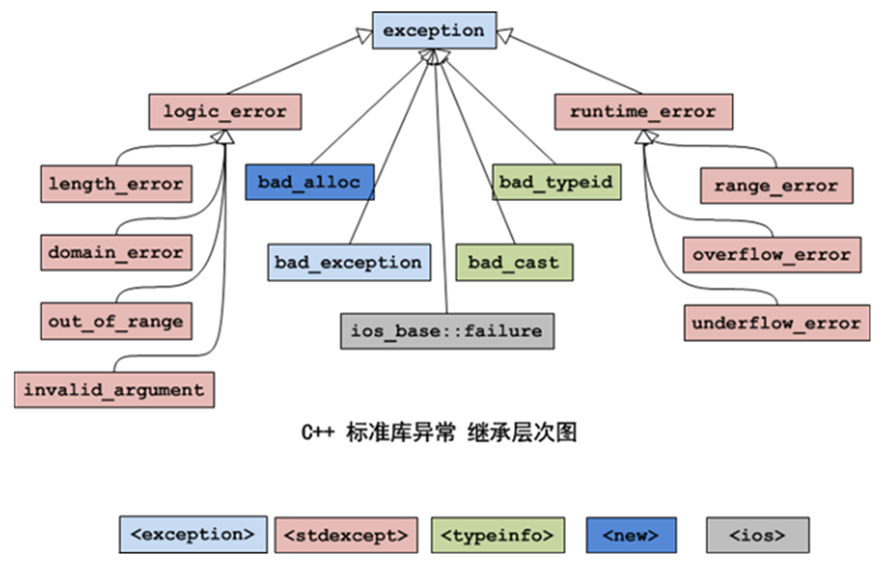

### 重点关注的异常

**1）std::bad_alloc**

如果内存不足，调用new会产生异常，导致程序中止；如果在new关键字后面加(std::nothrow)选项，则返回nullptr，不会产生异常。

```
#include <iostream>
using namespace std;

int main()
{
	try {
		// 如果分配内存失败，会抛出异常。
		//double* ptr = new double[100000000000];  
		// 如果分配内存失败，将返回nullptr，会抛出异常。
		double* ptr = new (std::nothrow) double[100000000000];  

		if (ptr == nullptr) cout << "ptr is null.\n";
	}
	catch (bad_alloc& e)
	{
		cout << "catch bad_alloc.\n";
	}
}
```

**2）std::bad_cast**

dynamic_cast可以用于引用，但是，C++没有与空指针对应的引用值，如果转换请求不正确，会出现std::bad_cast异常。

**3）std::bad_typeid**

假设有表达式typeid(*ptr)，当ptr是空指针时，如果ptr是多态的类型，将引发std::bad_typeid异常。

### 逻辑错误异常

程序的逻辑错误产生的异常std::logic_error，通过合理的编程可以避免。

**1）std::out_of_range**

```
Defines a type of object to be thrown as exception. It reports errors that are consequence of attempt to access elements out of defined range.
It may be thrown by the member functions of std::bitset and std::basic_string, by std::stoi and std::stod families of functions, and by the bounds-checked member access functions (e.g. std::vector::at and std::map::at).
```

**2）std::length_error**

```
Defines a type of object to be thrown as exception. It reports errors that result from attempts to exceed implementation defined length limits for some object.
This exception is thrown by member functions of std::basic_string and std::vector::reserve.
```

**3）std::domain_error**

```
Defines a type of object to be thrown as exception. It may be used by the implementation to report domain errors, that is, situations where the inputs are outside of the domain on which an operation is defined.
The standard library components do not throw this exception (mathematical functions report domain errors as specified in math_errhandling). Third-party libraries, however, use this. For example, boost.math throws std::domain_error if boost::math::policies::throw_on_error is enabled (the default setting).
```

**4）std::invalid_argument** 

```
Defines a type of object to be thrown as exception. It reports errors that arise because an argument value has not been accepted.
This exception is thrown by std::bitset::bitset, and the std::stoi and std::stof families of functions.
```


```
#include <iostream>
#include <vector>  
using namespace std; 

int main()
{
	try{
		vector<int> vv = { 1,2,3 };  // 容器vv中只有三个元素。
		vv.at(3) = 5;                        // 将引发out_of_range异常。
	}
	catch (out_of_range) {
		cout << "出现了out_of_range异常。\n";
	}
}
```

```
#include <stdexcept>
#include <iostream>
#include <string>
using namespace std;

int main()
{
	string str = "123";  // 不会抛出异常。   
	//string str = "";     // 将抛出Invalid_argument异常。
	//string str = "253647586946334221002101";  // 将抛出out_of_range异常。

	try {
		int x = stoi(str);        // 把string字符串转换为整数。
		cout << "x=" << x << endl;
	}
	catch (invalid_argument&) {
		cout << " invalid_argument. \n";
	}
	catch (out_of_range&) {
		cout << " out of range. \n";
	}
	catch (...) {
		cout << " something else…" << endl;
	}
}
```

### 其它异常

**1）std::range_error**

```
Defines a type of object to be thrown as exception. It can be used to report range errors (that is, situations where a result of a computation cannot be represented by the destination type).
The only standard library components that throw this exception are std::wstring_convert::from_bytes and std::wstring_convert::to_bytes.
The mathematical functions in the standard library components do not throw this exception (mathematical functions report range errors as specified in math_errhandling).
```

**2）std::overflow_error**

```
Defines a type of object to be thrown as exception. It can be used to report arithmetic overflow errors (that is, situations where a result of a computation is too large for the destination type)
The only standard library components that throw this exception are std::bitset::to_ulong and std::bitset::to_ullong.
The mathematical functions of the standard library components do not throw this exception (mathematical functions report overflow errors as specified in math_errhandling). Third-party libraries, however, use this. For example, boost.math throws std::overflow_error if boost::math::policies::throw_on_error is enabled (the default setting).
```

**3）std::underflow_error**

```
Defines a type of object to be thrown as exception. It may be used to report arithmetic underflow errors (that is, situations where the result of a computation is a subnormal floating-point value)
The standard library components do not throw this exception (mathematical functions report underflow errors as specified in math_errhandling). Third-party libraries, however, use this. For example, boost.math throws std::underflow_error if boost::math::policies::throw_on_error is enabled (the default setting
```

**4）ios_base::failure**

这个异常，程序员不主动找它就没事。

```
#include <iostream>
#include <fstream>

int main()
{
    using namespace std;
    fstream file;
    file.exceptions(ios::failbit);    // 设置如果出现ios::failbit，就引发异常。
    try
    {
        file.open("rm.txt", ios_base::in);  // 如果打开的文件不存在，就会引发异常。
    }
    catch (ios_base::failure f)
    {
        cout << caught an exception: " << f.what() << endl;
    }
}
```

**5）std::bad_exception**

```
This is a special type of exception specifically designed to be listed in the dynamic-exception-specifier of a function (i.e., in its throw specifier).
If a function with bad_exception listed in its dynamic-exception-specifier throws an exception not listed in it and unexpected rethrows it (or throws any other exception also not in the dynamic-exception-specifier), a bad_exception is automatically thrown.
```

## C++断言

### 断言

断言（assertion）是一种常用的编程手段，用于排除程序中不应该出现的逻辑错误。

使用断言需要包含头文件<cassert>或<assert.h>，头文件中提供了带参数的宏assert，用于程序在运行时进行断言。

语法：assert(表达式);

断言就是判断(表达式)的值，如果为0（false），程序将调用abort()函数中止，如果为非0（true），程序继续执行。

断言可以提高程序的可读性，帮助程序员定位违反了某些前提条件的错误。

注意：

- 断言用于处理程序中不应该发生的错误，而非逻辑上可能会发生的错误。

- 不要把需要执行的代码放到断言的表达式中。

- 断言的代码一般放在函数/成员函数的第一行，表达式多为函数的形参。

```
#include <iostream>
#include <cassert>              // 断言assert宏需要包含的头文件。
using  namespace std;

void  copydata(void *ptr1,void *ptr2)   // 把ptr2中的数据复制到ptr1中。
{
    assert(ptr1&&ptr2);  // 断言ptr1和ptr2都不会为空。

    cout << "继续执行复制数据的代码......\n";
}

int main()
{
    int ii=0,jj=0;
    
    copydata(&ii, &jj);  // 把ptr2中的数据复制到ptr1中。
}
```

### C++11静态断言

assert宏是运行时断言，在程序运行的时候才能起作用。

C++11新增了静态断言static_assert，用于在编译时检查源代码。

使用静态断言不需要包含头文件。

语法：static_assert(常量表达式,提示信息);

注意：static_assert的第一个参数是**常量表达式**。而assert的表达式既可以是常量，也可以是变量。

## C++11新标准

### long long类型

新增了类型long long和unsigned long long，以支持64位（或更宽）的整型。

在VS中，int和long都是4字节，long long是8字节。

在Linux中，int是4字节，long和long long是8字节。

### char16_t和char32_t类型

新增了类型char16_t和char32_t，以支持16位和32位的字符。

意义不大，好像没什么人用，连demo程序都找不到。

### 统一的初始化（列表）

C++11丰富了大括号的使用范围，用大括号括起来的列表（统一的初始化列表）可以用于所有内置类型和用户自定义类型。使用统一的初始化列表时，可以添加等号（=），也可以不添加：

```
int x={5};
double y{2.75};
short quar[5]{4,5,2,76,1};
```

统一的初始化列表也可以用于new表达式中：

```
int *ar=new int[4]{2,4,6,7};
```

创建对象时，也可以使用大括号（而不是圆括号）来调用构造函数：

```
class Girl
{
private:
    int m_bh;
    string m_name;
public:
    Girl(int bh,string name) : m_bh(bh),m_name(name) {}
};

Girl g1(3, "西施");    // C++98的风格。
Girl g2={5, "冰冰"};  // C++11的风格。
Girl g3{8, "幂幂"};    // C++11的风格。
```

**STL**容器提供了将initializer_list模板类作为参数的构造函数：

```
vector<int> v1(10);   // 把v1初始化为10个元素。
vector<int> v2{10};   // 把v2初始化为1个元素，这个元素的值是10。
vector<int> v2{3,5,8};   // 把v3初始化为3个元素，值分别是3、5、8。
```

**头文件<initializer_list>提供了对模板类initializer_list的支持，这个类包含成员函数begin()和end()。除了用于构造函数外，还可以将initializer_list用于常规函数的参数：**

```
#include <iostream>
#include <initializer_list>

double sum(std::initializer_list<double> il)
{
    double total = 0;
    for (auto it = il.begin(); it != il.end(); it++)
        total = total + *it;
    return total;
}

int main()
{
    // double total = sum(  3.14, 5.20, 8  );    // 错误，如果没有大括号，这是三个参数。
    double total = sum({ 3.14, 5.20, 8 });        // 正确，有大括号，这是一个参数。
    std::cout << "total=" << total << std::endl;
}
```

### 原始字面量

### 自动推导类型auto

### decltype关键字

### 函数后置返回类型

### 智能指针

### 异常规范方面的修改

### 模板的别名

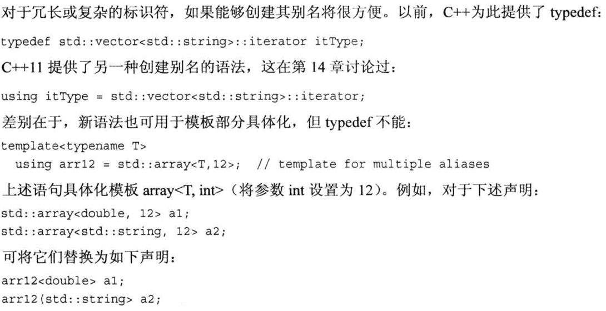

### 空指针nullptr

空指针是不会指向有效数据的指针。以前，C/C++用0表示空指针，这带来了一些问题，这样的话0既可以表示指针常量，又可以表示整型常量。

C++11新增了关键字nullptr，用于表示空指针；它是指针类型，不是整型类型。

为了向后兼容，C++11仍允许用0来表示空指针，因此表达式nullptr==0为true。

使用nullptr提供了更高的类型安全。例如，可以将0传递给形参为int的函数，但是，如果将nullptr传递给这样的函数，编译器将视为错误。

因此，出于清晰和安全考虑，请使用nullptr。

### 强类型枚举（枚举类）

传统的C++枚举提供了一种创建常量的方式，但类型检查比较低级。还有，如果在同一作用域内定义的两个枚举，它们的成员不能同名。

针对枚举的缺陷，C++11 标准引入了枚举类，又称强类型枚举。

声明强类型枚举非常简单，只需要在enum后加上关键字 class。

```
enum e1{ red, green };
enum class e2 { red, green, blue };
enum class e3 { red, green, blue, yellow };
```

使用强类型枚举时，要在枚举成员名前面加枚举名和::，以免发生名称冲突，如：e2::red，e3::blue

强类型枚举默认的类型为int，也可以显式地指定类型，具体做法是在枚举名后面加上:type，type可以是除wchar_t以外的任何整型。

```
enum class e2:char { red, green, blue };
```

### explicit关键字

C++支持对象自动转换，但是，自动类型转换可能导致意外。为了解决这种问题，C++11引入了explicit关键字，用于关闭自动转换的特性。

### 类内成员初始化

在类的定义中初始化成员变量。

```
class Girl
{
private:
    int m_bh=20;                 // 年龄。
    string m_name="美女";        // 姓名。
    char m_xb = 'X';              // 性别。
public:
    Girl(int bh, string name) : m_bh(bh), m_name(name) {}
};
```

### 基于范围的for循环

### 新的STL容器

1）array（静态数组）

array的大小是固定的，不像其它的模板类，但array有begin()和end()成员函数，程序员可以array对象使用STL算法。

2）forward_list（单向链表）

3）unordered_map、unordered_multimap、unordered_set、unordered_multiset（哈希表）

### 新的STL方法（成员函数）

1）C++11新增了的方法cbegin()、cend()、crbegin()、crend()，这些方法将元素视为const。

2）iterator emplace (iterator pos, …); // 在指定位置插入一个元素，…用于构造元素，返回指向插入元素的迭代器。

3）更重要的是，除了传统的拷贝构造函数和赋值函数，C++11新增了移动构造函数和移动赋值函数。

### 摒弃export

C++98新增了export关键字，C++11不再使用，但仍保留它作为关键字，供以后使用。

### 嵌套模板的尖括号

为了避免与运算符>>混淆，C++要求在声明嵌套模板时使用空格将尖括号分开：

```
vector<list<int> > v1;   // 两个>之间必须加空格。
```

C++11不再这样要求：

```
vector<list<int>> v2;    // 两个>之间不必加空格。
```

### final关键字

final关键字用于限制某个类不能被继承，或者某个虚函数不能被重写。

final关键字放在类名或虚函数名的后面。

```
class AA
{
public:
    virtual void test()
    {
        cout << "AA class...";
    }
};

class BB : public AA
{
public:
    void test() final    // 如果有其它类继承BB，test()方法将不允许重写。
    {
        cout << "BB class...";
    }
};

class CC : public BB
{
public:
    void test()  // 错误，BB类中的test()后面有final，不允许重写。
    {
        cout << "CC class...";
    }
};
```

### override关键字

在派生类中，把override放在成员函数的后面，表示重写基类的虚函数，**提高代码的可读性。**

在派生类中，如果某成员函数不是重写基类的虚函数，随意的加上override关键字，编译器会报错。

```
class AA 
{
public:
    virtual void test()
    {
        cout << "AA class...";
    }
};

class BB : public AA
{
public:
    void test() override
    {
        cout << "BB class...";
    }
};
```

### 数值类型和字符串之间的转换

传统方法用sprintf()和snprintf()函数把数值转换为char*字符串；用atoi()、atol()、atof()把char*字符串转换为数值。

C++11提供了新的方法，在数值类型和string字符串之间转换。

**1、数值转换为字符串**

使用to_string()函数可以将各种数值类型转换为string字符串类型，这是一个重载函数，在头文件 <string>中声明，函数原型如下：

```
string to_string (int val);
string to_string (long val);
string to_string (long long val);
string to_string (unsigned val);
string to_string (unsigned long val);
string to_string (unsigned long long val);
string to_string (float val);
string to_string (double val);
string to_string (long double val);
```

**2、字符转换为串数值**

在C++中，数值类型包括整型和浮点型，针对于不同的数值类型提供了不同的函数在头文件 <string>中声明，函数原型如下：

```
int                 stoi( const string& str, size_t* pos = nullptr, int base = 10 );
long               stol( const string& str, size_t* pos = nullptr, int base = 10 );
long long          stoll( const string& str, size_t* pos = nullptr, int base = 10 );
unsigned long      stoul( const string& str, size_t* pos = nullptr, int base = 10 );
unsigned long long stoull( const string& str, size_t* pos = nullptr, int base = 10 );
float               stof( const string& str, size_t* pos = nullptr );
double             stod( const string& str, size_t* pos = nullptr );
long double        stold( const string& str, size_t* pos = nullptr );
```

形参说明：

str：需要要转换的string字符串。

pos：传出参数，存放从哪个字符开始无法继续解析的位置，例如：123a45, 传出的位置将为3。

base：若base为0，则自动检测数值进制：若前缀为0，则为八进制，若前缀为0x或0X，则为十六进制，否则为十进制。

**注意：string字符串转换为数值的函数可能会抛出异常**

```
string str="123a45";
size_t pos;
int val = stoi(str, &pos, 10);
cout << "val=" << val << endl;          // 输出123
cout << "pos=" << pos << endl;       // 输出3
```

### 静态断言static_assert

### 常量表达式constexpr关键字

const关键字从功能上来说有双重语义：只读变量和修饰常量。

```
void func(const int len1)
{
    // len1是只读变量，不是常量。
    int array1[len1]={0};        // VS会报错，Linux平台的数组长度支持变量，不会报错。

    const int len2 = 8;
    int array2[len2]={0};      // 正确，len2是常量。
}
```

C++11标准为了解决const关键字的双重语义问题，保留了const表示“只读”的语义，而将“常量”的语义划分给了新添加的constexpr关键字。

所以，C++11 标准中，建议将const和constexpr的功能区分开，表达“只读”语义的场景用const，表达“常量”语义的场景用constexpr。

### 默认函数控制=default与=delete

在C++中自定义的类，编译器会默认生成一些成员函数：

- 无参构造函数

- 拷贝构造函数

- 拷贝赋值函数

- 移动构造函数

- 移动赋值函数

- 析构函数

=default表示启用默认函数。

=delete表示禁用默认函数。

```
#include <iostream>
using namespace std;

class Girl
{
private:
    int m_bh = 20;                  // 年龄。
    string m_name = "美女";  // 姓名。
    char m_xb = 'X';               // 性别。
public:
    Girl() = default;                          // 启用默认构造函数。
    Girl(int bh, string name) : m_bh(bh), m_name(name) {}
    Girl(const Girl& g) = delete;      // 删除拷贝构造函数。
    void show() { cout << "bh=" << m_bh << ",m_name=" << m_name << endl; }
};

int main()
{
    Girl g1;
    g1.show();
    // Girl g2 = g1;            // 错误，拷贝构造函数已删除。
}
```

## 委托构造和继承构造

C++11标准新增了委托构造和继承构造两种方法，用于简化代码。

### 委托构造

在实际的开发中，为了满足不同的需求，一个类可能会重载多个构造函数。多个构造函数之间可能会有重复的代码。例如变量初始化，如果在每个构造函数中都写一遍，这样代码会显得臃肿。

委托构造就是在一个构造函数的初始化列表中调用另一个构造函数。

注意：

- 不要生成环状的构造过程。

- 一旦使用委托构造，就不能在初始化列表中初始化其它的成员变量。

```
#include <iostream>
using namespace std;

class AA
{
private:
    int      m_a;
    int      m_b;
    double   m_c;
public:
    // 有一个参数的构造函数，初始化m_c
    AA(double c) {
        m_c = c + 3;     // 初始化m_c
        cout << " AA(double c)" << endl;
    }
    // 有两个参数的构造函数，初始化m_a和m_b
    AA(int a, int b) {
        m_a = a + 1;     // 初始化m_a
        m_b = b + 2;    // 初始化m_b
        cout << " AA(int a, int b)" << endl;
    }
    // 构造函数委托AA(int a, int b)初始化m_a和m_b
    AA(int a, int b, const string& str) : AA(a, b) {
        cout << "m_a=" << m_a << ",m_b=" << m_b << ",str=" << str << endl;
    }
    // 构造函数委托AA(double c)初始化m_c
    AA(double c, const string& str) : AA(c) {
        cout << "m_c=" << m_c << ",str=" << str << endl;
    }
};

int main()
{
    AA a1(10, 20, "我是一只傻傻鸟。");

    AA a2(3.8, "我有一只小小鸟。");
}
```

### 继承构造

在C++11之前，派生类如果要使用基类的构造函数，可以在派生类构造函数的初始化列表中指定。在《126、如何构造基类》中有详细介绍。

C++11推出了继承构造（Inheriting Constructor），在派生类中使用using来声明继承基类的构造函数。

```
#include <iostream>
using namespace std;

class AA       // 基类。
{
public:
    int      m_a;
    int      m_b;
    // 有一个参数的构造函数，初始化m_a
    AA(int a) : m_a(a) { cout << " AA(int a)" << endl; }
    // 有两个参数的构造函数，初始化m_a和m_b
    AA(int a, int b) : m_a(a), m_b(b) { cout << " AA(int a, int b)" << endl; }
};

class BB :public AA       // 派生类。
{
public:
    double   m_c;
    using AA::AA;     // 使用基类的构造函数。
    // 有三个参数的构造函数，调用A(a,b)初始化m_a和m_b，同时初始化m_c
    BB(int a, int b, double c) : AA(a, b), m_c(c) {
        cout << " BB(int a, int b, double c)" << endl;
    }
    void show() { cout << "m_a=" << m_a << ",m_b=" << m_b << ",m_c=" << m_c << endl; }
};

int main()
{
    // 将使用基类有一个参数的构造函数，初始化m_a
    BB b1(10);       
    b1.show();

    // 将使用基类有两个参数的构造函数，初始化m_a和m_b
    BB b2(10,20);  
    b2.show();

    // 将使用派生类自己有三个参数的构造函数，调用A(a,b)初始化m_a和m_b，同时初始化m_c
    BB b3(10,20,10.58);  
    b3.show();
}
```

## lambda函数

lambda函数是C++11标准新增的语法糖，也称为lambda[表达式](https://so.csdn.net/so/search?q=表达式&spm=1001.2101.3001.7020)或匿名函数。

lambda函数的特点是：距离近、简洁、高效和功能强大。

示例：[](const int& no) -> void { cout << "亲爱的" << no << "号：我是一只傻傻鸟。\n"; };

语法：

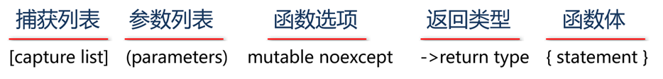

```
#include <iostream>
#include <vector>
#include <algorithm>
using  namespace std;

// 表白函数。
void zsshow(const int & no)  {  
	cout << "亲爱的" << no << "号：我是一只傻傻鸟。\n";
}

// 表白仿函数。
class czs   
{
public:
	void operator()(const int & no) {
		cout << "亲爱的" << no << "号：我是一只傻傻鸟。\n";
	}
};

int main()
{
	vector<int> vv = { 5,8,3 };   // 存放超女编号的容器。
	
	// 第三个参数是普通函数。
	for_each(vv.begin(), vv.end(), zsshow);  

	// 第三个参数是仿函数。
	for_each(vv.begin(), vv.end(), czs());       

	// 第三个参数是lambda表达式。
	for_each(vv.begin(), vv.end(), 
		[](const int& no) {
			cout << "亲爱的" << no << "号：我是一只傻傻鸟。\n";
		}
	); 
}
```

### 参数列表

参数列表是可选的，类似普通函数的参数列表，如果没有参数列表，()可以省略不写。

与普通函数的不同：

- lambda函数不能有默认参数。

- 所有参数必须有参数名。

- 不支持可变参数。

### 返回类型

用后置的方法书写返回类型，类似于普通函数的返回类型，如果不写返回类型，编译器会根据函数体中的代码推断出来。

如果有返回类型，建议显式的指定，自动推断可能与预期不一致。

### 函数体

类似于普通函数的函数体。

### 捕获列表

通过捕获列表，lambda函数可以访问父作用域中的非静态局部变量（静态局部变量可以直接访问，不能访问全局变量）。

捕获列表书写在[]中，与函数参数的传递类似，捕获方式可以是值和引用。

以下列出了不同的捕获列表的方式。

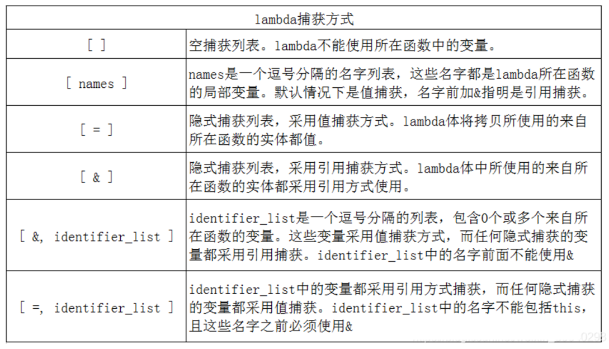

**1）值捕获**

与传递参数类似，采用值捕获的前提是变量可以拷贝。

与传递参数不同，变量的值是在lambda函数创建时拷贝，而不是调用时拷贝。

```
size_t v1 = 42;
auto f = [ v1 ]  { return v1; };	// 使用了值捕获，将v1拷贝到名为f的可调用对象。
v1 = 0;
auto j = f();    // j为42，f保存了我们创建它是v1的拷贝。
```

由于被捕获的值是在lambda函数创建时拷贝，因此在随后对其修改不会影响到lambda内部的值。

默认情况下，如果以传值方式捕获变量，则在lambda函数中不能修改变量的值。

**2）引用捕获**

和函数引用参数一样，引用变量的值在lambda函数体中改变时，将影响被引用的对象。

```
size_t v1 = 42;
auto f = [ &v1 ]  { return v1; };	 // 引用捕获，将v1拷贝到名为f的可调用对象。
v1 = 0;
auto j = f();	   // j为0。
```

如果采用引用方式捕获变量，就必须保证被引用的对象在lambda执行的时候是存在的。

**3）隐式捕获**

除了显式列出我们希望使用的父作域的变量之外，还可以让编译器根据函数体中的代码来推断需要捕获哪些变量，这种方式称之为隐式捕获。

隐式捕获有两种方式，分别是[=]和[&]。[=]表示以值捕获的方式捕获外部变量，[&]表示以引用捕获的方式捕获外部变量。

```
int a = 123;
auto f = [ = ]  { cout << a << endl; };		//值捕获
f(); 	// 输出：123
auto f1 = [ & ] { cout << a++ << endl; }; 		//引用捕获
f1();	//输出：123（采用了后++）
cout << a << endl; 		//输出 124
```

**4）混合方式捕获**

lambda函数还支持混合方式捕获，即同时使用显式捕获和隐式捕获。

混合捕获时，捕获列表中的第一个元素必须是 = 或 &，此符号指定了默认捕获的方式是值捕获或引用捕获。

需要注意的是：显式捕获的变量必须使用和默认捕获不同的方式捕获。例如：

```
int i = 10;
int  j = 20;
auto f1 = [ =, &i] () { return j + i; };		// 正确，默认值捕获，显式是引用捕获
auto f2 = [ =, i] () { return i + j; };		// 编译出错，默认值捕获，显式值捕获，冲突了
auto f3 = [ &, &i] () { return i +j; };		// 编译出错，默认引用捕获，显式引用捕获，冲突了
```

**5）修改值捕获变量的值**

在lambda函数中，如果以传值方式捕获变量，则函数体中不能修改该变量，否则会引发编译错误。

在lambda函数中，如果希望修改值捕获变量的值，可以加mutable选项，但是，在lambda函数的外部，变量的值不会被修改。

```
int a = 123;
auto f = [a]()mutable { cout << ++a << endl; }; // 不会报错
cout << a << endl; 	// 输出：123
f(); 					// 输出：124
cout << a << endl; 	// 输出：123
```

**6）异常说明**

lambda可以抛出异常，用throw(…)指示异常的类型，用noexcept指示不抛出任何异常。

### lambda函数的本质

当我们编写了一个lambda函数之后，编译器将它翻译成一个类，该类中有一个重载了()的函数。

**1）采用值捕获**

采用值捕获时，lambda函数生成的类用捕获变量的值初始化自己的成员变量。

```
int a =10;
int b = 20;
auto addfun = [=] (const int c ) -> int { return a+c; };
int c = addfun(b);    
cout << c << endl;
```

等同于：

```
class Myclass
{
	int m_a;		// 该成员变量对应通过值捕获的变量。
public:
	Myclass( int a ) : m_a(a){};	// 该形参对应捕获的变量。
	// 重载了()运算符的函数，返回类型、形参和函数体都与lambda函数一致。
	int operator()(const int c) const
	{
		return a + c;
	}
};
```

默认情况下，由lambda函数生成的类是const成员函数，所以变量的值不能修改。如果加上mutable，相当于去掉const。这样上面的限制就能讲通了。

**2）采用引用捕获**

如果lambda函数采用引用捕获的方式，编译器直接引用就行了。

唯一需要注意的是，lambda函数执行时，程序必须保证引用的对象有效。

## 右值引用

### 左值、右值

在C++中，所有的值不是左值，就是右值。左值是指表达式结束后依然存在的持久化对象，右值是指表达式结束后就不再存在的临时对象。有名字的对象都是左值，右值没有名字。

还有一个可以区分左值和右值的便捷方法：**看能不能对表达式取地址，如果能，则为左值，否则为右值**。

C++11扩展了右值的概念，将右值分为了纯右值和将亡值。

- 纯右值：a）非引用返回的临时变量；b）运算表达式产生的结果；c）字面常量（C风格字符串除外，它是地址）。

- 将亡值：与右值引用相关的表达式，例如：将要被移动的对象、T&&函数返回的值、std::move()的返回值、转换成T&&的类型的转换函数的返回值。

不懂纯右值和将亡值的区别其实没关系，统一看作右值即可，不影响使用。

```
class AA {
    int m_a;
};

AA getTemp()
{
    return AA();
}

int ii = 3;       // ii是左值，3是右值。
int jj = ii+8;    // jj是左值，ii+8是右值。
AA aa = getTemp();   // aa是左值 ，getTemp()的返回值是右值（临时变量）。
```

### 左值引用、右值引用

C++98中的引用很常见，就是给变量取个别名，在C++11中，因为增加了右值引用(rvalue reference)的概念，所以C++98中的引用都称为了左值引用(lvalue reference)。

右值引用就是给右值取个名字。

语法：数据类型&& 变量名=右值;

```
#include <iostream>
using  namespace std;

class AA {
public:
    int m_a=9;
};

AA getTemp()
{
    return AA();
}

int main()
{
    int&& a = 3;         // 3是右值。

    int b = 8;               // b是左值。
    int&& c = b + 5;   //  b+5是右值。

    AA&& aa = getTemp();   // getTemp()的返回值是右值（临时变量）。

    cout << "a=" << a << endl;
    cout << "c=" << c << endl;
    cout << "aa.m_a=" << aa.m_a << endl;
}
```

getTemp()的返回值本来在表达式语句结束后其生命也就该终结了（因为是临时变量），而通过右值引用重获了新生，其生命周期将与右值引用类型变量aa的生命周期一样，只要aa还活着，该右值临时变量将会一直存活下去。

**引入右值引用的主要目的是实现移动语义。**

左值引用只能绑定（关联、指向）左值，右值引用只能绑定右值，如果绑定的不对，编译就会失败。

但是，常量左值引用却是个奇葩，它可以算是一个万能的引用类型，它可以绑定非常量左值、常量左值、右值，而且在绑定右值的时候，常量左值引用还可以像右值引用一样将右值的生命期延长，缺点是，只能读不能改。

```
int a = 1;        
const int& ra = a;   // a是非常量左值。

const int b = 1;  
const int& rb = b;  // b是常量左值。

const int& rc = 1;   // 1是右值。
```

总结一下，其中T是一个具体类型：

1）左值引用， 使用 T&, 只能绑定左值。

2）右值引用， 使用 T&&， 只能绑定右值。

3）已命名的右值引用是左值。

4）常量左值，使用 const T&, 既可以绑定左值又可以绑定右值。

## 移动语义

如果一个对象中有堆区资源，需要编写拷贝构造函数和赋值函数，实现深拷贝。

深拷贝把对象中的堆区资源复制了一份，如果源对象（被拷贝的对象）是临时对象，拷贝完就没什么用了，这样会造成没有意义的资源申请和释放操作。如果能够直接使用源对象拥有的资源，可以节省资源申请和释放的时间。C++11新增加的移动语义就能够做到这一点。

实现移动语义要增加两个函数：移动构造函数和移动赋值函数。

移动构造函数的语法：

```
类名(类名&& 源对象){......}
```

移动赋值函数的语法：

```
类名& operator=(类名&& 源对象){……}
```

注意：

1）对于一个左值，会调用拷贝构造函数，但是有些左值是局部变量，生命周期也很短，能不能也移动而不是拷贝呢？C++11为了解决这个问题，提供了std::move()方法来将左值转义为右值，从而方便使用移动语义。它其实就是告诉编译器，虽然我是一个左值，但不要对我用拷贝构造函数，用移动构造函数吧。左值对象被转移资源后，不会立刻析构，只有在离开自己的作用域的时候才会析构，如果继续使用左值中的资源，可能会发生意想不到的错误。

2）如果没有提供移动构造/赋值函数，只提供了拷贝构造/赋值函数，编译器找不到移动构造/赋值函数就去寻找拷贝构造/赋值函数。

3）C++11中的所有容器都实现了移动语义，避免对含有资源的对象发生无谓的拷贝。

4）移动语义对于拥有资源（如内存、文件句柄）的对象有效，如果是基本类型，使用移动语义没有意义。

```
#include <iostream>
using namespace std;

class AA
{
public:
    int* m_data = nullptr;  // 数据成员，指向堆区资源的指针。

    AA() = default;             // 启用默认构造函数。

    void alloc() {                // 给数据成员m_data分配内存。
        m_data = new int;                       // 分配内存。
        memset(m_data, 0, sizeof(int));   // 初始化已分配的内存。
    }

    AA(const AA& a) {     // 拷贝构造函数。
        cout << "调用了拷贝构造函数。\n";            // 显示自己被调用的日志。
        if (m_data == nullptr) alloc();                     // 如果没有分配内存，就分配。
        memcpy(m_data, a.m_data, sizeof(int));     // 把数据从源对象中拷贝过来。
    }

    AA(AA&& a) {     // 移动构造函数。
        cout << "调用了移动构造函数。\n";            // 显示自己被调用的日志。
        if (m_data != nullptr) delete m_data;         // 如果已分配内存，先释放掉。
        m_data = a.m_data;                                   // 把资源从源对象中转移过来。
        a.m_data = nullptr;                                    // 把源对象中的指针置空。
    }

    AA& operator=(const AA& a) { // 赋值函数。
        cout << "调用了赋值函数。\n";                   // 显示自己被调用的日志。
        if (this == &a)   return *this;                      // 避免自我赋值。
        if (m_data == nullptr) alloc();                     // 如果没有分配内存，就分配。
        memcpy(m_data, a.m_data, sizeof(int));    // 把数据从源对象中拷贝过来。
        return *this;
    }

    AA& operator=(AA&& a) { // 移动赋值函数。
        cout << "调用了移动赋值函数。\n";            // 显示自己被调用的日志。
        if (this == &a)   return *this;                      // 避免自我赋值。
        if (m_data != nullptr) delete m_data;         // 如果已分配内存，先释放掉。
        m_data = a.m_data;                                   // 把资源从源对象中转移过来。
        a.m_data = nullptr;                                    // 把源对象中的指针置空。
        return *this;
    }

     ~AA() {                 // 析构函数。
         if (m_data != nullptr) {
             delete m_data; m_data = nullptr;
         }
    }
};

int main()
{
    AA a1;                  // 创建对象a1。
    a1.alloc();             // 分配堆区资源。
    *a1.m_data = 3;   // 给堆区内存赋值。
    cout << "a1.m_data=" << *a1.m_data << endl;

    AA a2 = a1;         // 将调用拷贝构造函数。
    cout << "a2.m_data=" << *a2.m_data << endl;

    AA a3;
    a3 = a1;              // 将调用赋值函数。
    cout << "a3.m_data=" << *a3.m_data << endl;

    auto f = [] { AA aa; aa.alloc(); *aa.m_data = 8; return aa; };   // 返回AA类对象的lambda函数。
    AA a4 = f();                // lambda函数返回临时对象，是右值，将调用移动构造函数。
    cout << "a4.m_data=" << *a4.m_data << endl;

    AA a6;
    a6 = f();              // lambda函数返回临时对象，是右值，将调用移动赋值函数。
    cout << "a6.m_data=" << *a6.m_data << endl;
}
```

## 完美转发

在函数模板中，可以将参数“完美”的转发给其它函数。所谓完美，即不仅能准确的转发参数的值，还能保证被转发参数的左、右值属性不变。

C++11标准引入了右值引用和移动语义，所以，能否实现完美转发，决定了该参数在传递过程使用的是拷贝语义还是移动语义。

为了支持完美转发，C++11提供了以下方案：

1）如果模板中（包括类模板和函数模板）函数的参数书写成为T&& 参数名，那么，函数既可以接受左值引用，又可以接受右值引用。

2）提供了模板函数std::forward<T>(参数) ，用于转发参数，如果 参数是一个右值，转发之后仍是右值引用；如果参数是一个左值，转发之后仍是左值引用。

```
#include <iostream>
using namespace std;

void func1(int& ii) {        // 如果参数是左值，调用此函数。
    cout << "参数是左值=" << ii << endl;
}

void func1(int&& ii) {     // 如果参数是右值，调用此函数。
    cout << "参数是右值=" << ii << endl;
}

// 1）如果模板中（包括类模板和函数模板）函数的参数书写成为T&& 参数名，
// 那么，函数既可以接受左值引用，又可以接受右值引用。
// 2）提供了模板函数std::forward<T>(参数) ，用于转发参数，
// 如果参数是一个右值，转发之后仍是右值引用；如果 参数是一个左值，转发之后仍是左值引用。
template<typename TT>
void func(TT&& ii)
{
    func1(forward<TT>(ii));
}

int main()
{
    int ii = 3;
    func(ii);       // 实参是左值。
    func(8);       // 实参是右值。
}
```

## 可变参数模板

可变参数模版是C++11新增的最强大的特性之一，它对参数进行了泛化，能支持任意个数、任意数据类型的参数。

```
#include <iostream>
#include <thread>
using namespace std;

template <typename T>
void show(T girl)      // 向超女表白的函数，参数可能是超女编号，也可能是姓名，所以用T。
{
	cout << "亲爱的" << girl << "，我是一只傻傻鸟。\n";
}

// 递归终止时调用的非模板函数，函数名要与展开参数包的递归函数模板相同。
void print()
{
	cout << "递归终止。\n";
}

// 展开参数包的递归函数模板。
template <typename T, typename ...Args>
void print(T arg, Args... args)
{
	//cout << "参数： " << arg << endl;         // 显示本次展开的参数。

	show(arg);        // 把参数用于表白。

	//cout << "还有" << sizeof...(args) << "个参数未展开。" << endl;  // 显示未展开变参的个数。

	print(args...);     // 继续展开参数。
}

template <typename...Args>
void func(const string& str, Args...args)   // 除了可变参数，还可以有其它常规参数。
{
	cout << str << endl;    // 表白之前，喊句口号。

	print(args...);    // 展开可变参数包。

	cout << "表白完成。\n";
}

int main(void)
{
	//print("金莲", 4, "西施");   
	//print("冰冰", 8, "西施", 3);
	func("我是绝世帅歌。", "冰冰", 8, "西施", 3);  // "我是绝世帅歌。"不是可变参数，其它的都是。
}
```

## 时间操作chrono库

C++11提供了chrono模版库，实现了一系列时间相关的操作（时间长度、系统时间和计时器）。

头文件：#include <chrono>

命名空间：std::chrono

### 时间长度

duration模板类用于表示一段时间（时间长度、时钟周期），如：1小时、8分钟、5秒。

duration的定义如下:

```
template<class Rep, class Period = std::ratio<1, 1>>
class duration
{
   ……
};
```

为了方便使用，定义了一些常用的时间长度，比如：时、分、秒、毫秒、微秒、纳秒，它们都位于std::chrono命名空间下，定义如下：

```
using hours			= duration<Rep, std::ratio<3600>>	// 小时
using minutes			= duration<Rep, std::ratio<60>>		// 分钟
using seconds			= duration<Rep>						// 秒
using milliseconds		= duration<Rep, std::milli>			// 毫秒
using microseconds  	= duration<Rep, std::micro>  		// 微秒
using nanoseconds 	= duration<Rep, std::nano>  			// 纳秒
```

注意：

- duration模板类重载了各种算术运算符，用于操作duration对象。

- duration模板类提供了count()方法，获取duration对象的值。

```
#include <iostream>
#include <chrono>      // chrono库的头文件。
using namespace std;

int main()
{
    chrono::hours  t1(1);                                  // 1小时
    chrono::minutes  t2(60);                            //  60分钟
    chrono::seconds  t3(60 * 60);                    //  60*60秒
    chrono::milliseconds  t4(60 * 60 * 1000);  // 60*60*1000毫秒
    chrono::microseconds t5(60 * 60 * 1000 * 1000);          // 警告：整数溢出。
    chrono::nanoseconds t6(60 * 60 * 1000 * 1000*1000);  // 警告：整数溢出。

    if (t1 == t2)    cout << "t1==t2\n";
    if (t1 == t3)    cout << "t1==t3\n";
    if (t1 == t4)    cout << "t1==t4\n";

    // 获取时钟周期的值，返回的是int整数。
    cout << "t1=" << t1.count() << endl;
    cout << "t2=" << t2.count() << endl;
    cout << "t3=" << t3.count() << endl;
    cout << "t4=" << t4.count() << endl;

    chrono::seconds t7(1);                                         // 1秒
    chrono::milliseconds  t8(1000);                           // 1000毫秒
    chrono::microseconds t9(1000 * 1000);              // 1000*1000微秒
    chrono::nanoseconds t10(1000 * 1000 * 1000);  //  1000*1000*1000纳秒

    if (t7 == t8)    cout << "t7==t8\n";
    if (t7 == t9)    cout << "t7==t9\n";
    if (t7 == t10)  cout << "t7==t10\n";

    // 获取时钟周期的值。
    cout << "t7=" << t7.count() << endl;
    cout << "t8=" << t8.count() << endl;
    cout << "t9=" << t9.count() << endl;
    cout << "t10=" << t10.count() << endl;
}
```

### 系统时间

system_clock类支持了对系统时钟的访问，提供了三个静态成员函数：

```
// 返回当前时间的时间点。
static std::chrono::time_point<std::chrono::system_clock> now() noexcept;

// 将时间点time_point类型转换为std::time_t 类型。
static std::time_t to_time_t( const time_point& t ) noexcept;

// 将std::time_t类型转换为时间点time_point类型。
static std::chrono::system_clock::time_point from_time_t( std::time_t t ) noexcept;
```

```
#define _CRT_SECURE_NO_WARNINGS  // localtime()需要这个宏。
#include <iostream>
#include <chrono>
#include <iomanip>   // put_time()函数需要包含的头文件。
#include <sstream>
using namespace std;

int main()
{
    // 1）静态成员函数chrono::system_clock::now()用于获取系统时间。（C++时间）
   auto now = chrono::system_clock::now();

    // 2）静态成员函数chrono::system_clock::to_time_t()把系统时间转换为time_t。（UTC时间）
    auto t_now = chrono::system_clock::to_time_t(now);

    // t_now = t_now + 24*60*60;   // 把当前时间加1天。
    // t_now = t_now + -1*60*60;   // 把当前时间减1小时。
    // t_now = t_now + 120;           // 把当前时间加120秒。

    // 3）std::localtime()函数把time_t转换成本地时间。（北京时）
    // localtime()不是线程安全的，VS用localtime_s()代替，Linux用localtime_r()代替。
    auto tm_now = std::localtime(&t_now);

    // 4）格式化输出tm结构体中的成员。
    std::cout << std::put_time(tm_now, "%Y-%m-%d %H:%M:%S") << std::endl;
    std::cout << std::put_time(tm_now, "%Y-%m-%d") << std::endl;
    std::cout << std::put_time(tm_now, "%H:%M:%S") << std::endl;
    std::cout << std::put_time(tm_now, "%Y%m%d%H%M%S") << std::endl;

    stringstream ss;   // 创建stringstream对象ss，需要包含<sstream>头文件。
    ss << std::put_time(tm_now, "%Y-%m-%d %H:%M:%S");    // 把时间输出到对象ss中。
    string timestr = ss.str();     // 把ss转换成string的对象。
    cout << timestr << endl;
}
```

### 计时器

steady_clock类相当于秒表，操作系统只要启动就会进行时间的累加，常用于耗时的统计（精确到纳秒）。

```
#include <iostream>
#include <chrono>
using namespace std;

int main()
{
    // 静态成员函数chrono::steady_clock::now()获取开始的时间点。
    auto start = chrono::steady_clock::now();

    // 执行一些代码，让它消耗一些时间。
    cout << "计时开始 ...... \n";
    for (int ii = 0; ii < 1000000; ii++) {
        // cout << "我是一只傻傻鸟。\n";
    }
    cout << "计时完成 ...... \n";

    // 静态成员函数chrono::steady_clock::now()获取结束的时间点。
    auto end = chrono::steady_clock::now();

    // 计算消耗的时间，单位是纳秒。
    auto dt = end - start;
    cout << "耗时: " << dt.count() << "纳秒（"<<(double)dt.count()/(1000*1000*1000)<<"秒）";
}
```

## C++11线程

在C++11之前，C++没有对线程提供语言级别的支持，各种操作系统和编译器实现线程的方法不一样。

C++11增加了线程以及线程相关的类，统一编程风格、简单易用、跨平台。

### 创建线程

头文件：#include <thread>

线程类：std::thread

**构造函数：**

1）thread() noexcept;

默认构造函，构造一个线程对象，不执行任何任务（不会创建/启动子线程）。

2）template< class Function, class... Args >

```
explicit thread(Function&& fx, Args&&... args );
```

创建线程对象，在线程中执行任务函数fx中的代码，args是要传递给任务函数fx的参数。

任务函数fx可以是**普通函数、类的非静态成员函数**、类的静态成员函数、lambda函数、仿函数。

3）thread(const thread& ) = delete;

删除拷贝构造函数，不允许线程对象之间的拷贝。

4）thread(thread&& other ) noexcept;

移动构造函数，将线程other的资源所有权转移给新创建的线程对象。

**赋值函数：**

```
thread& operator= (thread&& other) noexcept;
thread& operator= (const other&) = delete;
```

线程中的资源不能被复制，如果other是右值，会进行资源所有权的转移，如果other是左值，禁止拷贝。

注意：

- 先创建的子线程不一定跑得最快（程序运行的速度有很大的偶然性）。

- 线程的任务函数返回后，子线程将终止。

- 如果主程序（主线程）退出（不论是正常退出还是意外终止），全部的子线程将强行被终止。

```
#include <iostream>
#include <thread>                // 线程类头文件。
#include <windows.h>         // Sleep()函数需要这个头文件。
using namespace std;

// 普通函数。
void func(int bh, const string& str) {
	for (int ii = 1; ii <= 10; ii++)
	{
		cout << "第" << ii << "次表白：亲爱的" << bh << "号，" << str << endl;
		Sleep(1000);   // 休眠1秒。
	}
}

// 仿函数。
class mythread1
{
public:
	void operator()(int bh, const string& str) {
		for (int ii = 1; ii <= 10; ii++)
		{
			cout << "第" << ii << "次表白：亲爱的" << bh << "号，" << str << endl;
			Sleep(1000);   // 休眠1秒。
		}
	}
};

// 类中有静态成员函数。
class mythread2
{
public:
	static void func(int bh, const string& str) {
		for (int ii = 1; ii <= 10; ii++)
		{
			cout << "第" << ii << "次表白：亲爱的" << bh << "号，" << str << endl;
			Sleep(1000);   // 休眠1秒。
		}
	}
};

// 类中有普通成员函数。
class mythread3
{
public:
	void func(int bh, const string& str) {
		for (int ii = 1; ii <= 10; ii++)
		{
			cout << "第" << ii << "次表白：亲爱的" << bh << "号，" << str << endl;
			Sleep(1000);   // 休眠1秒。
		}
	}
};

int main()
{
	// 用普通函数创建线程。
	//thread t1(func, 3, "我是一只傻傻鸟。");
	//thread t2(func, 8, "我有一只小小鸟。");

	// 用lambda函数创建线程。
	auto f = [](int bh, const string& str) {
		for (int ii = 1; ii <= 10; ii++)
		{
			cout << "第" << ii << "次表白：亲爱的" << bh << "号，" << str << endl;
			Sleep(1000);   // 休眠1秒。
		}
	};
	//thread t3(f, 3, "我是一只傻傻鸟。");

	// 用仿函数创建线程。
	//thread t4(mythread1(), 3, "我是一只傻傻鸟。");

	// 用类的静态成员函数创建线程。
	//thread t5(mythread2::func, 3, "我是一只傻傻鸟。");

	// 用类的普通成员函数创建线程。
	mythread3 myth;   // 必须先创建类的对象，必须保证对象的生命周期比子线程要长。
	thread t6(&mythread3::func, &myth, 3, "我是一只傻傻鸟。");  // 第二个参数必须填对象的this指针，否则会拷贝对象。

	cout << "任务开始。\n";
	for (int ii = 0; ii < 10; ii++) {
		cout << "执行任务中......\n";
		Sleep(1000);   // 假设执行任务需要时间。
	}
	cout << "任务完成。\n";

	//t1.join();         // 回收线程t1的资源。
	//t2.join();         // 回收线程t2的资源。
	//t3.join();         // 回收线程t3的资源。
	//t4.join();         // 回收线程t4的资源。
	//t5.join();         // 回收线程t5的资源。
	t6.join();         // 回收线程t6的资源。
}
```

### 线程资源的回收

虽然同一个进程的多个线程共享进程的栈空间，但是，每个子线程在这个栈中拥有自己私有的栈空间。所以，线程结束时需要回收资源。

回收子线程的资源有两种方法：

1）在主程序中，调用join()成员函数等待子线程退出，回收它的资源。如果子线程已退出，join()函数立即返回，否则会阻塞等待，直到子线程退出。

2）在主程序中，调用detach()成员函数分离子线程，子线程退出时，系统将自动回收资源。分离后的子线程不可join()。

用joinable()成员函数可以判断子线程的分离状态，函数返回布尔类型。

```
#include <iostream>
#include <thread>                // 线程类头文件。
#include <windows.h>         // Sleep()函数需要这个头文件。
using namespace std;

// 普通函数。
void func(int bh, const string& str) {
	for (int ii = 1; ii <= 10; ii++)
	{
		cout << "第" << ii << "次表白：亲爱的" << bh << "号，" << str << endl;
		Sleep(1000);   // 休眠1秒。
	}
}

int main()
{
	// 用普通函数创建线程。
	thread t1(func, 3, "我是一只傻傻鸟。");
	thread t2(func, 8, "我有一只小小鸟。");
	
	t1.detach(); t2.detach();  // 分离子线程。

	//cout << "任务开始。\n";
	//for (int ii = 0; ii < 12; ii++) {
	//	cout << "执行任务中......\n";
	//	Sleep(1000);   // 假设执行任务需要时间。
	//}
	//cout << "任务完成。\n";
	
	//t1.join();         // 回收线程t1的资源。
	//t2.join();         // 回收线程t2的资源。
	Sleep(12000);
}
```

### this_thread的全局函数

C++11提供了[命名空间](https://so.csdn.net/so/search?q=命名空间&spm=1001.2101.3001.7020)this_thread来表示当前线程，该命名空间中有四个函数：get_id()、sleep_for()、sleep_until()、yield()。

**1）get_id()**

```
thread::id get_id() noexcept;
```

该函数用于获取线程ID，thread类也有同名的成员函数。

**2）sleep_for() VS Sleep(1000)  Linux sleep(1)**

```
template <class Rep, class Period>
void sleep_for (const chrono::duration<Rep,Period>& rel_time);
```

该函数让线程休眠一段时间。

**3）sleep_until()     2022-01-01 12:30:35**

```
template <class Clock, class Duration>
void sleep_until (const chrono::time_point<Clock,Duration>& abs_time);
```

该函数让线程休眠至指定时间点。（可实现定时任务）

**4）yield()**

```
void yield() noexcept;
```

该函数让线程主动让出自己已经抢到的CPU时间片。

**5）thread类其它的成员函数**

```
void swap(std::thread& other);    // 交换两个线程对象。
static unsigned hardware_concurrency() noexcept;   // 返回硬件线程上下文的数量。
```

The interpretation of this value is system- andimplementation- specific, and may not be exact, but just an approximation.

Note that this does not need to match the actualnumber of processors or cores available in the system: A system can supportmultiple threads per processing unit, or restrict the access to its resourcesto the program.

If this value is not computable or well defined,the function returns 0. 

```
#include <iostream>
#include <thread>                // 线程类头文件。
using namespace std;

// 普通函数。
void func(int bh, const string& str) {
	cout << "子线程：" << this_thread::get_id() << endl;

	for (int ii = 1; ii <= 3; ii++)
	{
		cout << "第" << ii << "次表白：亲爱的" << bh << "号，" << str << endl;
		this_thread::sleep_for(chrono::seconds(1));    // 休眠1秒。
	}
}

int main()
{
	// 用普通函数创建线程。
	thread t1(func, 3, "我是一只傻傻鸟。");
	thread t2(func, 8, "我有一只小小鸟。");

	cout << "主线程：" << this_thread::get_id() << endl;
	cout << "线程t1：" << t1.get_id() << endl;
	cout << "线程t2：" << t2.get_id() << endl;

	t1.join();         // 回收线程t1的资源。
	t2.join();         // 回收线程t2的资源。
}
```

### call_once函数

在多线程环境中，某些函数只能被调用一次，例如：初始化某个对象，而这个对象只能被初始化一次。

在线程的任务函数中，可以用std::call_once()来保证某个函数只被调用一次。

头文件：#include <mutex>

```
template< class callable, class... Args >
  void call_once( std::once_flag& flag, Function&& fx, Args&&... args );
```

第一个参数是std::once_flag，用于标记函数fx是否已经被执行过。

第二个参数是需要执行的函数fx。

后面的可变参数是传递给函数fx的参数。

```
#include <iostream>
#include <thread>        // 线程类头文件。
#include <mutex>        // std::once_flag和std::call_once()函数需要包含这个头文件。
using namespace std;

once_flag onceflag;       // once_flag全局变量。本质是取值为0和1的锁。
// 在线程中，打算只调用一次的函数。
void once_func(const int bh, const string& str)  { 
	cout << "once_func() bh= " << bh << ", str=" << str << endl;
}

// 普通函数。
void func(int bh, const string& str) {
	call_once(onceflag,once_func,0, "各位观众，我要开始表白了。");

	for (int ii = 1; ii <= 3; ii++)
	{
		cout << "第" << ii << "次表白：亲爱的" << bh << "号，" << str << endl;
		this_thread::sleep_for(chrono::seconds(1));    // 休眠1秒。
	}
}

int main()
{
	// 用普通函数创建线程。
	thread t1(func, 3, "我是一只傻傻鸟。");
	thread t2(func, 8, "我有一只小小鸟。");

	t1.join();         // 回收线程t1的资源。
	t2.join();         // 回收线程t2的资源。
}
```

### native_handle函数

C++11定义了线程标准，不同的平台和编译器在实现的时候，本质上都是对操作系统的线程库进行封装，会损失一部分功能。

为了弥补C++11线程库的不足，thread类提供了native_handle()成员函数，用于获得与操作系统相关的原生线程句柄，操作系统原生的线程库就可以用原生线程句柄操作线程。

```
#include <iostream>
#include <thread>
#include <pthread.h>        // Linux的pthread线程库头文件。
using namespace std;

void func()    // 线程任务函数。
{
  for (int ii=1;ii<=10;ii++)
  {
    cout << "ii=" << ii << endl;
    this_thread::sleep_for(chrono::seconds(1));    // 休眠1秒。
  }
}

int main()
{
  thread tt(func);          // 创建线程。

  this_thread::sleep_for(chrono::seconds(5));    // 休眠5秒。

  pthread_t thid= tt.native_handle();  // 获取Linux操作系统原生的线程句柄。

  pthread_cancel(thid);  // 取消线程。

  tt.join();   // 等待线程退出。
}
```

### 线程安全

```
#include <iostream>
#include <thread>        // 线程类头文件。
using namespace std;

int aa = 0;     // 定义全局变量。

// 普通函数，把全局变量aa加1000000次。
void func() {
	for (int ii = 1; ii <= 1000000; ii++)
		aa++;
}

int main()
{
	// 用普通函数创建线程。
	thread t1(func);     // 创建线程t1，把全局变量aa加1000000次。
	thread t2(func);     // 创建线程t2，把全局变量aa加1000000次。

	t1.join();         // 回收线程t1的资源。
	t2.join();         // 回收线程t2的资源。

	cout << "aa=" << aa << endl;   // 显示全局变量aa的值。
}
```

## 互斥锁

C++11提供了四种互斥锁：

- mutex：互斥锁。

- timed_mutex：带超时机制的互斥锁。

- recursive_mutex：递归互斥锁。

- recursive_timed_mutex：带超时机制的递归互斥锁。

包含头文件：#include <mutex>

### mutex类

**1）加锁****lock()**

互斥锁有锁定和未锁定两种状态。

如果互斥锁是未锁定状态，调用lock()成员函数的线程会得到互斥锁的所有权，并将其上锁。

如果互斥锁是锁定状态，调用lock()成员函数的线程就会阻塞等待，直到互斥锁变成未锁定状态。

**2）解锁****unlock()**

只有持有锁的线程才能解锁。

**3）尝试加锁****try_lock()**

如果互斥锁是未锁定状态，则加锁成功，函数返回true。

如果互斥锁是锁定状态，则加锁失败，函数立即返回false。（线程不会阻塞等待）

```
#include <iostream>
#include <thread>                // 线程类头文件。
#include <mutex>                // 互斥锁类的头文件。
using namespace std;

mutex mtx;        // 创建互斥锁，保护共享资源cout对象。

// 普通函数。
void func(int bh, const string& str) {
	for (int ii = 1; ii <= 10; ii++)
	{
		mtx.lock();      // 申请加锁。
		cout << "第" << ii << "次表白：亲爱的" << bh << "号，" << str << endl;
		mtx.unlock();  // 解锁。
		this_thread::sleep_for(chrono::seconds(1));     // 休眠1秒。
	}
}

int main()
{
	// 用普通函数创建线程。
	thread t1(func, 1, "我是一只傻傻鸟。");
	thread t2(func, 2, "我是一只傻傻鸟。");
	thread t3(func, 3, "我是一只傻傻鸟。");
	thread t4(func, 4, "我是一只傻傻鸟。");
	thread t5(func, 5, "我是一只傻傻鸟。");

	t1.join();         // 回收线程t1的资源。
	t2.join();         // 回收线程t2的资源。
	t3.join();         // 回收线程t3的资源。
	t4.join();         // 回收线程t4的资源。
	t5.join();         // 回收线程t5的资源。
}
```

### timed_mutex类

增加了两个成员函数：

```
bool try_lock_for(时间长度);
bool try_lock_until(时间点);
```

### recursive_mutex类

递归互斥锁允许同一线程多次获得互斥锁，可以解决同一线程多次加锁造成的死锁问题。

```
#include <iostream>
#include <mutex>        // 互斥锁类的头文件。
using namespace std;

class AA
{
	recursive_mutex m_mutex;
public:
	void func1() {
		m_mutex.lock();
		cout << "调用了func1()\n";
		m_mutex.unlock();
	}

	void func2() {
		m_mutex.lock();
		cout << "调用了func2()\n";
		func1();
		m_mutex.unlock();
	}
};

int main()
{
	AA aa;
	//aa.func1();
	aa.func2();
}
```

### lock_guard类

lock_guard是模板类，可以简化互斥锁的使用，也更安全。

lock_guard的定义如下：

```
template<class Mutex>
class lock_guard
{
    explicit lock_guard(Mutex& mtx);
}
```

lock_guard在构造函数中加锁，在析构函数中解锁。

lock_guard采用了**RAII**思想（在类构造函数中分配资源，在析构函数中释放资源，保证资源在离开作用域时自动释放）。

## 条件变量-生产消费者模型

条件变量是一种线程同步机制。当条件不满足时，相关线程被一直阻塞，直到某种条件出现，这些线程才会被唤醒。

C++11的条件变量提供了两个类：

condition_variable：只支持与普通mutex搭配，效率更高。

condition_variable_any：是一种通用的条件变量，可以与任意mutex搭配（包括用户自定义的锁类型）。

包含头文件：<condition_variable>

### condition_variable类

主要成员函数：

1）condition_variable() 默认构造函数。

2）condition_variable(const condition_variable &)=delete 禁止拷贝。

3）condition_variable& condition_variable::operator=(const condition_variable &)=delete 禁止赋值。

4）notify_one() 通知一个等待的线程。

5）notify_all() 通知全部等待的线程。

6）wait(unique_lock<mutex> lock) 阻塞当前线程，直到通知到达。

7）wait(unique_lock<mutex> lock,Pred pred) 循环的阻塞当前线程，直到通知到达且谓词满足。

8）wait_for(unique_lock<mutex> lock,时间长度)

9）wait_for(unique_lock<mutex> lock,时间长度,Pred pred)

10）wait_until(unique_lock<mutex> lock,时间点)

11）wait_until(unique_lock<mutex> lock,时间点,Pred pred)

### unique_lock类

template <class Mutex> class unique_lock是模板类，模板参数为互斥锁类型。

unique_lock和lock_guard都是管理锁的辅助类，都是RAII风格（在构造时获得锁，在析构时释放锁）。它们的区别在于：为了配合condition_variable，unique_lock还有lock()和unlock()成员函数。

```
#include <iostream>
#include <string>
#include <thread>                      // 线程类头文件。
#include <mutex>                      // 互斥锁类的头文件。
#include <deque>                      // deque容器的头文件。
#include <queue>                      // queue容器的头文件。
#include <condition_variable>  // 条件变量的头文件。
using namespace std;
class AA
{
    mutex m_mutex;                                    // 互斥锁。
    condition_variable m_cond;                  // 条件变量。
    queue<string, deque<string>> m_q;   // 缓存队列，底层容器用deque。
public:
    void incache(int num)     // 生产数据，num指定数据的个数。
    {
        lock_guard<mutex> lock(m_mutex);   // 申请加锁。
        for (int ii=0 ; ii<num ; ii++)
        {
            static int bh = 1;           // 超女编号。
            string message = to_string(bh++) + "号超女";    // 拼接出一个数据。
            m_q.push(message);     // 把生产出来的数据入队。
        }
        m_cond.notify_one();     // 唤醒一个被当前条件变量阻塞的线程。
    }
    
    void outcache()       // 消费者线程任务函数。
    {
        while (true)
        {
            string message;
            {
                // 把互斥锁转换成unique_lock<mutex>，并申请加锁。
                unique_lock<mutex> lock(m_mutex);

                while (m_q.empty())    // 如果队列空，进入循环，否则直接处理数据。必须用循环，不能用if
                    m_cond.wait(lock);  // 等待生产者的唤醒信号。

                // 数据元素出队。
                message = m_q.front();  m_q.pop();
            }
            // 处理出队的数据（把数据消费掉）。
            this_thread::sleep_for(chrono::milliseconds(1));   // 假设处理数据需要1毫秒。
            cout << "线程：" << this_thread::get_id() << "，" << message << endl;
        }
    }
};

int main()
{
    AA aa;
  
    thread t1(&AA::outcache, &aa);     // 创建消费者线程t1。
    thread t2(&AA::outcache, &aa);     // 创建消费者线程t2。
    thread t3(&AA::outcache, &aa);     // 创建消费者线程t3。

    this_thread::sleep_for(chrono::seconds(2));    // 休眠2秒。
    aa.incache(3);      // 生产3个数据。

    this_thread::sleep_for(chrono::seconds(3));    // 休眠3秒。
    aa.incache(5);      // 生产5个数据。

    t1.join();   // 回收子线程的资源。
    t2.join();
    t3.join(); 
}
```

```
#include <iostream>
#include <string>
#include <thread>                      // 线程类头文件。
#include <mutex>                      // 互斥锁类的头文件。
#include <deque>                      // deque容器的头文件。
#include <queue>                      // queue容器的头文件。
#include <condition_variable>  // 条件变量的头文件。
using namespace std;
class AA
{
    mutex m_mutex;                                    // 互斥锁。
    condition_variable m_cond;                  // 条件变量。
    queue<string, deque<string>> m_q;   // 缓存队列，底层容器用deque。
public:
    void incache(int num)     // 生产数据，num指定数据的个数。
    {
        lock_guard<mutex> lock(m_mutex);   // 申请加锁。
        for (int ii=0 ; ii<num ; ii++)
        {
            static int bh = 1;           // 超女编号。
            string message = to_string(bh++) + "号超女";    // 拼接出一个数据。
            m_q.push(message);     // 把生产出来的数据入队。
        }
        //m_cond.notify_one();     // 唤醒一个被当前条件变量阻塞的线程。
        m_cond.notify_all();          // 唤醒全部被当前条件变量阻塞的线程。
    }
    
    void outcache()   {    // 消费者线程任务函数。
        while (true)   {
            // 把互斥锁转换成unique_lock<mutex>，并申请加锁。
            unique_lock<mutex> lock(m_mutex);

            // 条件变量虚假唤醒：消费者线程被唤醒后，缓存队列中没有数据。
            //while (m_q.empty())    // 如果队列空，进入循环，否则直接处理数据。必须用循环，不能用if
            //    m_cond.wait(lock);  // 1）把互斥锁解开；2）阻塞，等待被唤醒；3）给互斥锁加锁。
            m_cond.wait(lock, [this] { return !m_q.empty(); });

            // 数据元素出队。
            string message = m_q.front();  m_q.pop();
            cout << "线程：" << this_thread::get_id() << "，" << message << endl;
            lock.unlock();      // 手工解锁。

            // 处理出队的数据（把数据消费掉）。
            this_thread::sleep_for(chrono::milliseconds(1));   // 假设处理数据需要1毫秒。
        }
    }
};

int main()
{
    AA aa;
  
    thread t1(&AA::outcache, &aa);     // 创建消费者线程t1。
    thread t2(&AA::outcache, &aa);     // 创建消费者线程t2。
    thread t3(&AA::outcache, &aa);     // 创建消费者线程t3。

    this_thread::sleep_for(chrono::seconds(2));    // 休眠2秒。
    aa.incache(2);      // 生产2个数据。

    this_thread::sleep_for(chrono::seconds(3));    // 休眠3秒。
    aa.incache(5);      // 生产5个数据。

    t1.join();   // 回收子线程的资源。
    t2.join();
    t3.join(); 
}
```

## 原子类型atomic

C++11提供了atomic<T>模板类（结构体），用于支持原子类型，模板参数可以是bool、char、int、long、long long、指针类型（不支持浮点类型和自定义数据类型）。

原子操作由CPU指令提供支持，它的性能比锁和消息传递更高，并且，不需要程序员处理加锁和释放锁的问题，支持修改、读取、交换、比较并交换等操作。

头文件：#include <atomic>

构造函数：

```
atomic() noexcept = default;  // 默认构造函数。
atomic(T val) noexcept;  // 转换函数。
atomic(const atomic&) = delete;  // 禁用拷贝构造函数。
```

赋值函数：

```
atomic& operator=(const atomic&) = delete;   // 禁用赋值函数。
```

常用函数：

```
void store(const T val) noexcept;   // 把val的值存入原子变量。
T load() noexcept;  // 读取原子变量的值。
T fetch_add(const T val) noexcept; // 把原子变量的值与val相加，返回原值。
T fetch_sub(const T val) noexcept; // 把原子变量的值减val，返回原值。
T exchange(const T val) noexcept; // 把val的值存入原子变量，返回原值。
T compare_exchange_strong(T &expect,const T val) noexcept; // 比较原子变量的值和预期值expect，如果当两个值相等，把val存储到原子变量中，函数返回true；如果当两个值不相等，用原子变量的值更新预期值，函数返回false。CAS指令。
bool is_lock_free();  // 查询某原子类型的操作是直接用CPU指令（返回true），还是编译器内部的锁（返回false）。
```

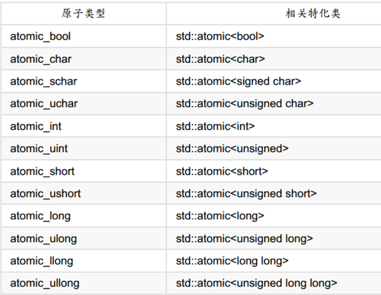

注意：

- atomic<T>模板类重载了整数操作的各种运算符。

- atomic<T>模板类的模板参数支持指针，但不表示它所指向的对象是原子类型。

- 原子整型可以用作计数器，布尔型可以用作开关。

- CAS指令是实现无锁队列基础。

```
#include <iostream>
#include <atomic>     // 原子类型的头文件。
using namespace std;

int main()
{
	atomic<int> a = 3;       // atomic(T val) noexcept;  // 转换函数。
	cout << "a=" << a.load() << endl;   // 读取原子变量a的值。输出：a=3
	a.store(8);      // 把8存储到原子变量中。
	cout << "a=" << a.load() << endl;   // 读取原子变量a的值。 输出：a=8
	
	int old;        // 用于存放原值。
	old = a.fetch_add(5);         // 把原子变量a的值与5相加，返回原值。
	cout << "old = " << old <<"，a = " << a.load() << endl;   // 输出：old=8，a=13
	old = a.fetch_sub(2);         // 把原子变量a的值减2，返回原值。
	cout << "old = " << old << "，a = " << a.load() << endl;   // 输出：old=13，a=11
	
	atomic<int> ii = 3;  // 原子变量
	int expect = 4;         // 期待值
	int val = 5;               // 打算存入原子变量的值
	// 比较原子变量的值和预期值expect，
	// 如果当两个值相等，把val存储到原子变量中；
	// 如果当两个值不相等，用原子变量的值更新预期值。
	// 执行存储操作时返回true，否则返回false。
	bool bret = ii.compare_exchange_strong(expect, val);
	cout << "bret=" << bret << endl;
	cout << "ii=" << ii << endl;
	cout << "expect=" << expect << endl;
}
```

## 可调用对象

在C++中，可以像函数一样调用的有：普通函数、类的静态成员函数、仿函数、lambda函数、类的非静态成员函数、可被转换为函数的类的对象，统称可调用对象或函数对象。

可调用对象有类型，可以用指针存储它们的地址，可以被引用（类的成员函数除外）

### 普通函数

普通函数类型可以声明函数、定义函数指针和函数引用，但是，不能定义函数的实体。

```
#include <iostream>
using namespace std;

using Fun = void (int, const string&);  // 普通函数类型的别名。
Fun show;        // 声明普通函数。


int main()
{
	show(1, "我是一只傻傻鸟。");					// 直接调用普通函数。

	void(*fp1)(int, const string&) = show;	// 声明函数指针，指向普通函数。
	void(&fr1)(int, const string&) = show;	// 声明函数引用，引用普通函数。
	fp1(2, "我是一只傻傻鸟。");						// 用函数指针调用普通函数。
	fr1(3, "我是一只傻傻鸟。");						// 用函数引用调用普通函数。

	Fun* fp2 = show;										// 声明函数指针，指向普通函数。
	Fun& fr2 = show;									// 声明函数引用，引用普通函数。
	fp2(4, "我是一只傻傻鸟。");						// 用函数指针调用普通函数。
	fr2(5, "我是一只傻傻鸟。");						// 用函数引用调用普通函数。
}

// 定义普通函数
void show(int bh, const string& message) {  
	cout << "亲爱的" << bh << "，" << message << endl;
}

// 以下代码是错误的，不能用函数类型定义函数的实体。
//Func show1 {
//	cout << "亲爱的" << bh << "，" << message << endl;
//}
```

### 类的静态成员函数

类的静态成员函数和普通函数本质上是一样的，把普通函数放在类中而已。

```
#include <iostream>
using namespace std;

using Fun = void (int, const string&);  // 普通函数类型的别名。

struct AA	// 类中有静态成员函数。
{
	static void show(int bh, const string& message) {
		cout << "亲爱的" << bh << "，" << message << endl;
	}
};

int main()
{
	AA::show(1, "我是一只傻傻鸟。");					// 直接调用静态成员函数。

	void(*fp1)(int, const string&) = AA::show;	// 用函数指针指向静态成员函数。
	void(&fr1)(int, const string&) = AA::show;	// 引用静态成员函数。
	fp1(2, "我是一只傻傻鸟。");						// 用函数指针调用静态成员函数。
	fr1(3, "我是一只傻傻鸟。");						// 用函数引用调用静态成员函数。

	Fun* fp2 = AA::show;										// 用函数指针指向静态成员函数。
	Fun& fr2 = AA::show;									// 引用静态成员函数。
	fp2(4, "我是一只傻傻鸟。");						// 用函数指针调用静态成员函数。
	fr2(5, "我是一只傻傻鸟。");						// 用函数引用调用静态成员函数。
}
```

### 仿函数

仿函数的本质是类，调用的代码像函数。

仿函数的类型就是类的类型。

```
#include <iostream>
using namespace std;

struct BB	// 仿函数。
{
	void operator()(int bh, const string& message) {
		cout << "亲爱的" << bh << "，" << message << endl;
	}
};

int main()
{
	BB bb;
	bb(11, "我是一只傻傻鸟。");		// 用对象调用仿函数。
	BB()(12, "我是一只傻傻鸟。");		// 用匿名对象调用仿函数。

	BB& br = bb;           		// 引用函数
	br(13, "我是一只傻傻鸟。");		// 用对象的引用调用仿函数。
}
```

### lambda函数

lambda函数的本质是仿函数，仿函数的本质是类。

```
#include <iostream>
using namespace std;

int main()
{
	// 创建lambda对象。
	auto lb = [](int bh, const string& message) {
		cout << "亲爱的" << bh << "，" << message << endl;
	};

	auto& lr = lb;  // 引用lambda对象。

	lb(1, "我是一只傻傻鸟。");		// 用lambda对象调用仿函数。
	lr(2, "我是一只傻傻鸟。");		// 用lambda对象的引用调用仿函数。
}
```

### 类的非静态成员函数

类的非静态成员函数有地址，但是，只能通过类的对象才能调用它，所以，C++对它做了特别处理。

类的非静态成员函数只有指针类型，没有引用类型，不能引用。

```
#include <iostream>
using namespace std;

struct CC	// 类中有普通成员函数。
{
	void show(int bh, const string& message) {
		cout << "亲爱的" << bh << "，" << message << endl;
	}
};

int main()
{
	CC cc;
	cc.show(14, "我是一只傻傻鸟。");

	void (CC::* fp11)(int, const string&) = &CC::show;		// 定义类的成员函数的指针。
	(cc.*fp11)(15, "我是一只傻傻鸟。");									// 用类的成员函数的指针调用成员函数。

	using pFun = void (CC::*)(int, const string&);		// 类成员函数的指针类型。
	pFun fp12 = &CC::show;										// 让类成员函数的指针指向类的成员函数的地址。
	(cc.*fp12)(16, "我是一只傻傻鸟。");							// 用类成员函数的指针调用类的成员函数。
}
```

## 包装器function

std::function模板类是一个通用的可调用对象的包装器，用简单的、统一的方式处理可调用对象。

template<class _Fty>

class function……

_Fty是可调用对象的类型，格式：返回类型(参数列表)。

包含头文件：#include <functional>

注意：

- 重载了bool运算符，用于判断是否包装了可调用对象。

- 如果std::function对象未包装可调用对象，使用std::function对象将抛出std::bad_function_call异常。

```
#include <iostream>
#include <functional>
using namespace std;

// 普通函数
void show(int bh, const string& message) {
	cout << "亲爱的" << bh << "，" << message << endl;
}

struct AA	// 类中有静态成员函数。
{
	static void show(int bh, const string& message) {
		cout << "亲爱的" << bh << "，" << message << endl;
	}
};

struct BB	// 仿函数。
{
	void operator()(int bh, const string& message) {
		cout << "亲爱的" << bh << "，" << message << endl;
	}
};

struct CC	// 类中有普通成员函数。
{
	void show(int bh, const string& message) {
		cout << "亲爱的" << bh << "，" << message << endl;
	}
};

struct DD		// 可以被转换为普通函数指针的类。
{
	using Fun = void (*)(int, const string&);    // 函数指针的别名。
	operator Fun() {
		return show;	// 返回普通函数show的地址。
	}
};

int main()
{
	using Fun = void(int, const string&);  // 函数类型的别名。

	// 普通函数。
	void(*fp1)(int, const string&) = show;	// 声明函数指针，指向函数对象。
	fp1(1, "我是一只傻傻鸟。");						// 用函数指针调用普通函数。
	function<void(int, const string&)> fn1 = show;    // 包装普通全局函数show。
	fn1(1, "我是一只傻傻鸟。");										// 用function对象调用普通全局函数show。

	// 类的静态成员函数。
	void(*fp3)(int, const string&) = AA::show;	// 用函数指针指向类的静态成员函数。
	fp3(2, "我是一只傻傻鸟。");							// 用函数指针调用类的静态成员函数。
	function<void(int, const string&)> fn3 = AA::show;		// 包装类的静态成员函数。
	fn3(2, "我是一只傻傻鸟。");												// 用function对象调用类的静态成员函数。

	// 仿函数。
	BB bb;
	bb(3, "我是一只傻傻鸟。");		// 用仿函数对象调用仿函数。
	function<void(int, const string&)> fn4 = BB();		// 包装仿函数。
	fn4(3, "我是一只傻傻鸟。");										// 用function对象调用仿函数。

	// 创建lambda对象。
	auto lb = [](int bh, const string& message) {
		cout << "亲爱的" << bh << "，" << message << endl;
	};
	lb(4, "我是一只傻傻鸟。");          // 调用lambda函数。
	function<void(int, const string&)> fn5 = lb;			// 包装lamba函数。
	fn5(4, "我是一只傻傻鸟。");										// 用function对象调用lamba函数。

	// 类的非静态成员函数。
	CC cc;
	void (CC:: * fp11)(int, const string&) = &CC::show;		// 定义类成员函数的指针。
	(cc.*fp11)(5, "我是一只傻傻鸟。");									// 用类成员函数的指针调用类的成员函数。
	function<void(CC&,int, const string&)> fn11 = &CC::show;	// 包装成员函数。
	fn11(cc,5, "我是一只傻傻鸟。");											// 用function对象调用成员函数。

	// 可以被转换为函数指针的类对象。
	DD dd;
	dd(6, "我是一只傻傻鸟。");						// 用可以被转换为函数指针的类对象调用普通函数。
	function<void(int, const string&)> fn12 = dd;			// 包装可以被转换为函数指针的类。
	fn12(6, "我是一只傻傻鸟。");										// 用function对象调用它。

	function<void(int, const string&)> fx=dd;
	try {
		if (fx) fx(6, "我是一只傻傻鸟。");
	}
	catch (std::bad_function_call e) {
		cout << "抛出了std::bad_function_call异常。";
	}
}
```

### 适配器bind

std::bind()模板函数是一个通用的函数适配器（绑定器），它用一个可调用对象及其参数，生成一个新的可调用对象，以适应模板。

包含头文件：#include <functional>

函数原型：

```
template< class Fx, class... Args >
  	function<> bind (Fx&& fx, Args&...args);
```

Fx：需要绑定的可调用对象（可以是前两节课介绍的那六种，也可以是function对象）。

args：绑定参数列表，可以是左值、右值和参数占位符std::placeholders::_n，如果参数不是占位符，缺省为值传递，std:: ref(参数)则为引用传递。

std::bind()返回std::function的对象。

std::bind()的本质是仿函数。

示例一（bind的基本用法）：

```
#include <iostream>
#include <functional>
using namespace std;

// 普通函数
void show(int bh, const string& message) {
	cout << "亲爱的" << bh << "号，" << message << endl;
}

int main()
{
	function<void(int, const string&)> fn1 = show;
	function<void(int, const string&)> fn2 = bind(show, placeholders::_1, placeholders::_2);
	fn1(1, "我是一只傻傻鸟。");
	fn2(1, "我是一只傻傻鸟。");

	function<void(const string&, int)> fn3 = bind(show, placeholders::_2, placeholders::_1);
	fn3("我是一只傻傻鸟。", 1);
	function<void(const string&)> fn4 = bind(show, 3, placeholders::_1);
	fn4("我是一只傻傻鸟。");

	function<void(int, const string&,int)> fn5 = bind(show, placeholders::_1, placeholders::_2);
	fn5(1, "我是一只傻傻鸟。", 88);
}
```

示例二（绑定六种可调用对象）：

```
#include <iostream>
#include <functional>
using namespace std;

// 普通函数
void show(int bh, const string& message) {
	cout << "亲爱的" << bh << "，" << message << endl;
}

struct AA	// 类中有静态成员函数。
{
	static void show(int bh, const string& message) {
		cout << "亲爱的" << bh << "，" << message << endl;
	}
};

struct BB	// 仿函数。
{
	void operator()(int bh, const string& message) {
		cout << "亲爱的" << bh << "，" << message << endl;
	}
};

struct CC	// 类中有普通成员函数。
{
	void show(int bh, const string& message) {
		cout << "亲爱的" << bh << "，" << message << endl;
	}
};

struct DD		// 可以被转换为普通函数指针的类。
{
	using Fun = void (*)(int, const string&);    // 函数指针的别名。
	operator Fun() {
		return show;	// 返回普通函数show的地址。
	}
};

int main()
{
	// 普通函数。
	function<void(int, const string&)> fn1 = bind(show, placeholders::_1, placeholders::_2);    // 绑定普通全局函数show。
	fn1(1, "我是一只傻傻鸟。");										// 用function对象调用普通全局函数show。

	// 类的静态成员函数。
	function<void(int, const string&)> fn3 = bind(AA::show, placeholders::_1, placeholders::_2);		// 绑定类的静态成员函数。
	fn3(2, "我是一只傻傻鸟。");												// 用function对象调用类的静态成员函数。

	// 仿函数。
	function<void(int, const string&)> fn4 = bind(BB(), placeholders::_1, placeholders::_2);			// 绑定仿函数。
	fn4(3, "我是一只傻傻鸟。");										// 用function对象调用仿函数。

	// 创建lambda对象。
	auto lb = [](int bh, const string& message) {
		cout << "亲爱的" << bh << "，" << message << endl;
	};
	function<void(int, const string&)> fn5 = bind(lb, placeholders::_1, placeholders::_2);			// 绑定lamba函数。
	fn5(4, "我是一只傻傻鸟。");										// 用function对象调用lamba函数。

	// 类的非静态成员函数。
	CC cc;
	//function<void(CC&, int, const string&)> fn11 = bind(&CC::show, placeholders::_1, placeholders::_2, placeholders::_3);		// 绑定成员函数。
	//fn11(cc, 5, "我是一只傻傻鸟。");											// 用function对象调用成员函数。
	function<void(int, const string&)> fn11 = bind(&CC::show,&cc,placeholders::_1, placeholders::_2);		// 绑定成员函数。
	fn11(5, "我是一只傻傻鸟。");											// 用function对象调用成员函数。

	// 可以被转换为函数指针的类对象。
	DD dd;
	function<void(int, const string&)> fn12 = bind(dd, placeholders::_1, placeholders::_2);			// 绑定可以被转换为函数指针的类。
	fn12(6, "我是一只傻傻鸟。");										// 用function对象调用它。
}
```

## 可变函数和参数

写一个函数，函数的参数是函数对象及参数，功能和thread类的构造函数相同。

```
#include <iostream>
#include <thread>
#include <functional>        
using namespace std;

void show0() {  // 普通函数。
	cout << "亲爱的，我是一只傻傻鸟。\n";
}

void show1(const string& message) {  // 普通函数。
	cout << "亲爱的，" << message << endl;
}

struct CC	// 类中有普通成员函数。
{
	void show2(int bh, const string& message) {
		cout << "亲爱的" << bh << "号，" << message << endl;
	}
};

template<typename Fn, typename...Args>
auto show(Fn&& fn, Args&&...args) -> decltype(bind(forward<Fn>(fn), forward<Args>(args)...))
{
	cout << "表白前的准备工作......\n";

	auto f = bind(forward<Fn>(fn), forward<Args>(args)...);
	f();

	cout << "表白完成。\n";
	return f;
}

int main()
{
	show(show0);
	show(show1,"我是一只傻傻鸟。");
	CC cc;
	auto f = show(&CC::show2,&cc, 3,"我是一只傻傻鸟。");
	f();
	
	//thread t1(show0);
	//thread t2(show1,"我是一只傻傻鸟。");
	//CC cc;
	//thread t3(&CC::show2,&cc, 3,"我是一只傻傻鸟。");
	//t1.join();
	//t2.join();
	//t3.join();
}
```

## 回调函数的实现

在消息队列和网络库的框架中，当接收到消息（报文）时，回调用户自定义的函数对象，把消息（报文）参数传给它，由它决定如何处理。

```
#include <iostream>
#include <string>
#include <thread>                      // 线程类头文件。
#include <mutex>                      // 互斥锁类的头文件。
#include <deque>                      // deque容器的头文件。
#include <queue>                      // queue容器的头文件。
#include <condition_variable>  // 条件变量的头文件。
#include <functional>
using namespace std;

void show(const string& message) {  // 处理业务的普通函数
    cout << "处理数据：" << message << endl;
}

struct BB {  // 处理业务的类
    void show(const string& message) {
        cout << "处理表白数据：" << message << endl;
    }
};

class AA
{
    mutex m_mutex;                                    // 互斥锁。
    condition_variable m_cond;                  // 条件变量。
    queue<string, deque<string>> m_q;   // 缓存队列，底层容器用deque。
    function<void(const string&)> m_callback;  // 回调函数对象。
public:
    // 注册回调函数，回调函数只有一个参数（消费者接收到的数据）。
    template<typename Fn, typename ...Args>
    void callback(Fn && fn, Args&&...args) {
        m_callback = bind(forward<Fn>(fn), forward<Args>(args)..., std::placeholders::_1);  // 绑定回调函数。
    }

    void incache(int num)     // 生产数据，num指定数据的个数。
    {
        lock_guard<mutex> lock(m_mutex);   // 申请加锁。
        for (int ii = 0; ii < num; ii++)
        {
            static int bh = 1;           // 超女编号。
            string message = to_string(bh++) + "号超女";    // 拼接出一个数据。
            m_q.push(message);     // 把生产出来的数据入队。
        }
        //m_cond.notify_one();     // 唤醒一个被当前条件变量阻塞的线程。
        m_cond.notify_all();          // 唤醒全部被当前条件变量阻塞的线程。
    }

    void outcache() {    // 消费者线程任务函数。
        while (true) {
            // 把互斥锁转换成unique_lock<mutex>，并申请加锁。
            unique_lock<mutex> lock(m_mutex);

            // 1）把互斥锁解开；2）阻塞，等待被唤醒；3）给互斥锁加锁。
            m_cond.wait(lock, [this] { return !m_q.empty(); });

            // 数据元素出队。
            string message = m_q.front();  m_q.pop();
            cout << "线程：" << this_thread::get_id() << "，" << message << endl;
            lock.unlock();      // 手工解锁。

            // 处理出队的数据（把数据消费掉）。
            if (m_callback) m_callback(message);  // 回调函数，把收到的数据传给它。
        }
    }
};

int main()
{
    AA aa;
    // aa.callback(show);                   // 把普通函数show()注册为回调函数。
    BB bb;
    aa.callback(&BB::show, &bb);    // 把类成员函数BB::show()注册为回调函数。

    thread t1(&AA::outcache, &aa);     // 创建消费者线程t1。
    thread t2(&AA::outcache, &aa);     // 创建消费者线程t2。
    thread t3(&AA::outcache, &aa);     // 创建消费者线程t3。

    this_thread::sleep_for(chrono::seconds(2));    // 休眠2秒。
    aa.incache(2);      // 生产2个数据。

    this_thread::sleep_for(chrono::seconds(3));    // 休眠3秒。
    aa.incache(5);      // 生产5个数据。

    t1.join();   // 回收子线程的资源。
    t2.join();
    t3.join();
}
```

## 如何取代虚函数

C++虚函数在执行过程中会跳转两次（先查找对象的函数表，再次通过该函数表中的地址找到真正的执行地址），这样的话，CPU会跳转两次，而普通函数只跳转一次。

CPU每跳转一次，预取指令要作废很多，所以效率会很低。（百度）

为了管理的方便（基类指针可指向派生类对象和自动析构派生类），保留类之间的继承关系。

```
#include <iostream>         // 包含头文件。
#include <functional>
using namespace std;

struct Hero  {							// 英雄基类
	//virtual void show() { cout << "英雄释放了技能。\n"; }
	function<void()> m_callback;        // 用于绑定子类的成员函数。

	// 注册子类成员函数，子类成员函数没有参数。
	template<typename Fn, typename ...Args>
	void callback(Fn&& fn, Args&&...args) {
		m_callback = bind(forward<Fn>(fn), forward<Args>(args)...);
	}
	void show() { m_callback(); }   // 调用子类的成员函数。
};

struct XS :public Hero  {			// 西施派生类
	void show() { cout << "西施释放了技能。\n"; }
};

struct HX :public Hero  {			// 韩信派生类
	void show() { cout << "韩信释放了技能。\n"; }
};

int main()
{
	// 根据用户选择的英雄，施展技能。
	int id = 0;     // 英雄的id。
	cout << "请输入英雄（1-西施；2-韩信。）：";
	cin >> id;

	// 创建基类指针，将指向派生类对象，用基类指针调用派生类的成员函数。
	Hero* ptr = nullptr;

	if (id == 1) {            // 1-西施
		ptr = new XS;
		ptr->callback(&XS::show, static_cast<XS*>(ptr));  // 注册子类成员函数。
	}
	else if (id == 2) {     // 2-韩信
		ptr = new HX;
		ptr->callback(&HX::show, static_cast<HX*>(ptr));  // 注册子类成员函数。
	}

	if (ptr != nullptr) {
		ptr->show();		// 调用子类的成员函数。
		delete ptr;			// 释放派生类对象。
	}
}
```


