## 线性回归

### 最小二乘法

最简单的情形是一元线性回归，由大体上有线性关系的一个自变量和一个因变量组成，模型是：

$$
Y=X \cdot W+B=\begin{pmatrix}x_1 & x_2 & x_3\end{pmatrix}\begin{pmatrix}w_{1} \\\\w_{2} \\\\w_{3}\end{pmatrix}+b
$$
$X$ 是自变量，$Y$ 是因变量，$\varepsilon$ 是随机误差，$W$ 和 $B$ 是参数，在线性回归模型中，$W,B$ 是我们要通过算法学习出来的。
$$
z_i=w \cdot x_i+b{1}
$$
使得：

$$
z_i \simeq y_i{2}
$$


其中，$x_i$ 是样本特征值，$y_i$ 是样本标签值，$z_i$ 是模型预测值。

如何学得 $w$ 和 $b$ 呢？均方差(MSE - mean squared error)是回归任务中常用的手段：
$$
J = \frac{1}{2m}\sum_{i=1}^m(z_i-y_i)^2 = \frac{1}{2m}\sum_{i=1}^m(y_i-wx_i-b)^2{3}
$$

$J$ 称为损失函数。实际上就是试图找到一条直线，使所有样本到直线上的残差的平方和最小。

如果想让误差的值最小，通过对 $w$ 和 $b$ 求导，再令导数为 $0$（到达最小极值），就是 $w$ 和 $b$ 的最优解。

推导过程如下：

$$
\begin{aligned}
\frac{\partial{J}}{\partial{w}} &=\frac{\partial{(\frac{1}{2m}\sum_{i=1}^m(y_i-wx_i-b)^2)}}{\partial{w}} \\\\
&= \frac{1}{m}\sum_{i=1}^m(y_i-wx_i-b)(-x_i) 
\end{aligned}
{4}
$$

令公式4为 $0$：

$$
\sum_{i=1}^m(y_i-wx_i-b)x_i=0 {5}
$$

$$
\begin{aligned}
\frac{\partial{J}}{\partial{b}} &=\frac{\partial{(\frac{1}{2m}\sum_{i=1}^m(y_i-wx_i-b)^2)}}{\partial{b}} \\\\
&=\frac{1}{m}\sum_{i=1}^m(y_i-wx_i-b)(-1) 
\end{aligned}
{6}
$$

令公式6为 $0$：

$$
\sum_{i=1}^m(y_i-wx_i-b)=0 {7}
$$

由式7得到（假设有 $m$ 个样本）：

$$
\sum_{i=1}^m b = m \cdot b = \sum_{i=1}^m{y_i} - w\sum_{i=1}^m{x_i} {8}
$$

两边除以 $m$：

$$
b = \frac{1}{m}\left(\sum_{i=1}^m{y_i} - w\sum_{i=1}^m{x_i}\right)=\bar y-w \bar x {9}
$$

其中：

$$
\bar y = \frac{1}{m}\sum_{i=1}^m y_i, \bar x=\frac{1}{m}\sum_{i=1}^m x_i {10}
$$

将公式10代入公式5：

$$
\sum_{i=1}^m(y_i-wx_i-\bar y + w \bar x)x_i=0
$$

$$
\sum_{i=1}^m(x_i y_i-wx^2_i-x_i \bar y + w \bar x x_i)=0
$$

$$
\sum_{i=1}^m(x_iy_i-x_i \bar y)-w\sum_{i=1}^m(x^2_i - \bar x x_i) = 0
$$

$$
w = \frac{\sum_{i=1}^m(x_iy_i-x_i \bar y)}{\sum_{i=1}^m(x^2_i - \bar x x_i)} {11}
$$

将公式10代入公式11：

$$
w = \frac{\sum_{i=1}^m (x_i \cdot y_i) - \sum_{i=1}^m x_i \cdot \frac{1}{m} \sum_{i=1}^m y_i}{\sum_{i=1}^m x^2_i - \sum_{i=1}^m x_i \cdot \frac{1}{m}\sum_{i=1}^m x_i} {12}
$$

分子分母都乘以 $m$：

$$
w = \frac{m\sum_{i=1}^m x_i y_i - \sum_{i=1}^m x_i \sum_{i=1}^m y_i}{m\sum_{i=1}^m x^2_i - (\sum_{i=1}^m x_i)^2} {13}
$$

$$
b= \frac{1}{m} \sum_{i=1}^m(y_i-wx_i) {14}
$$

而事实上，式13有很多个变种，大家会在不同的文章里看到不同版本，往往感到困惑，比如下面两个公式也是正确的解：

$$
w = \frac{\sum_{i=1}^m y_i(x_i-\bar x)}{\sum_{i=1}^m x^2_i - (\sum_{i=1}^m x_i)^2/m} {15}
$$

$$
w = \frac{\sum_{i=1}^m x_i(y_i-\bar y)}{\sum_{i=1}^m x^2_i - \bar x \sum_{i=1}^m x_i} {16}
$$

以上两个公式，如果把公式10代入，也应该可以得到和式13相同的答案，只不过需要一些运算技巧。比如，很多人不知道这个神奇的公式：

$$
\begin{aligned}
\sum_{i=1}^m (x_i \bar y) &= \bar y \sum_{i=1}^m x_i =\frac{1}{m}(\sum_{i=1}^m y_i) (\sum_{i=1}^m x_i) \\\\
&=\frac{1}{m}(\sum_{i=1}^m x_i) (\sum_{i=1}^m y_i)= \bar x \sum_{i=1}^m y_i \\\\
&=\sum_{i=1}^m (y_i \bar x) 
\end{aligned}
{17}
$$

#### 代码实现

我们下面用`Python`代码来实现一下以上的计算过程：

计算 $w$ 值：

```Python
# 根据公式15
def method1(X,Y,m):
    x_mean = X.mean()
    p = sum(Y*(X-x_mean))
    q = sum(X*X) - sum(X)*sum(X)/m
    w = p/q
    return w

# 根据公式16
def method2(X,Y,m):
    x_mean = X.mean()
    y_mean = Y.mean()
    p = sum(X*(Y-y_mean))
    q = sum(X*X) - x_mean*sum(X)
    w = p/q
    return w

# 根据公式13
def method3(X,Y,m):
    p = m*sum(X*Y) - sum(X)*sum(Y)
    q = m*sum(X*X) - sum(X)*sum(X)
    w = p/q
    return w
```

由于有函数库的帮助，我们不需要手动计算`sum()`, `mean()`这样的基本函数。

计算 $b$ 值：

```Python
# 根据公式14
def calculate_b_1(X,Y,w,m):
    b = sum(Y-w*X)/m
    return b

# 根据公式9
def calculate_b_2(X,Y,w):
    b = Y.mean() - w * X.mean()
    return b
```

用以上几种方法，最后得出的结果都是一致的，可以起到交叉验证的作用：

```
w1=2.056827, b1=2.965434
w2=2.056827, b2=2.965434
w3=2.056827, b3=2.965434
```

### 梯度下降法

与最小二乘法比较可以看到，梯度下降法和最小二乘法的模型及损失函数是相同的，都是一个线性模型加均方差损失函数，模型用于拟合，损失函数用于评估效果。

区别在于，最小二乘法从损失函数求导，直接求得数学解析解，而梯度下降以及后面的神经网络，都是利用导数传递误差，再通过迭代方式一步一步（用近似解）逼近真实解。

线性函数：

$$
z_i = x_i \cdot w + b {1}
$$


均方误差：

$$
loss_i(w,b) = \frac{1}{2} (z_i-y_i)^2 {2}
$$


#### 计算z的梯度

根据公式2：
$$
\frac{\partial loss}{\partial z_i}=z_i - y_i {3}
$$

#### 计算 $w$ 的梯度

我们用 $loss$ 的值作为误差衡量标准，通过求 $w$ 对它的影响，也就是 $loss$ 对 $w$ 的偏导数，来得到 $w$ 的梯度。由于 $loss$ 是通过公式2->公式1间接地联系到 $w$ 的，所以我们使用链式求导法则，通过单个样本来求导。

根据公式1和公式3：

$$
\frac{\partial{loss}}{\partial{w}} = \frac{\partial{loss}}{\partial{z_i}}\frac{\partial{z_i}}{\partial{w}}=(z_i-y_i)x_i {4}
$$

#### 计算 $b$ 的梯度

$$
\frac{\partial{loss}}{\partial{b}} = \frac{\partial{loss}}{\partial{z_i}}\frac{\partial{z_i}}{\partial{b}}=z_i-y_i {5}
$$


#### 代码实现

```Python
if __name__ == '__main__':

    reader = SimpleDataReader()
    reader.ReadData()
    X,Y = reader.GetWholeTrainSamples()

    eta = 0.1
    w, b = 0.0, 0.0
    for i in range(reader.num_train):
        # get x and y value for one sample
        xi = X[i]
        yi = Y[i]
        # 公式1
        zi = xi * w + b
        # 公式3
        dz = zi - yi
        # 公式4
        dw = dz * xi
        # 公式5
        db = dz
        # update w,b
        w = w - eta * dw
        b = b - eta * db

    print("w=", w)    
    print("b=", b)
```

```
w= [1.71629006]
b= [3.19684087]
```


### 神经网络法

这里的神经元在输入层只接受一个输入特征，经过参数 $w,b$ 的计算后，直接输出结果。这样一个简单的“网络”，只能解决简单的一元线性回归问题，而且由于是线性的，我们不需要定义激活函数，这就大大简化了程序，而且便于大家循序渐进地理解各种知识点。

严格来说输入层在神经网络中并不能称为一个层。

权重 $w,b$：因为是一元线性问题，所以 $w,b$ 都是标量。

输出层：输出层 $1$ 个神经元，线性预测公式是：
$$
z_i = x_i \cdot w + b
$$
$z$ 是模型的预测输出，$y$ 是实际的样本标签值，下标 $i$ 为样本。

损失函数：因为是线性回归问题，所以损失函数使用均方差函数。
$$
loss(w,b) = \frac{1}{2} (z_i-y_i)^2
$$

#### 反向传播

由于我们使用了和上一节中的梯度下降法同样的数学原理，所以反向传播的算法也是一样的，细节请查看4.2.2。

计算 $w$ 的梯度
$$
{\partial{loss} \over \partial{w}} = \frac{\partial{loss}}{\partial{z_i}}\frac{\partial{z_i}}{\partial{w}}=(z_i-y_i)x_i
$$

计算 $b$ 的梯度
$$
\frac{\partial{loss}}{\partial{b}} = \frac{\partial{loss}}{\partial{z_i}}\frac{\partial{z_i}}{\partial{b}}=z_i-y_i
$$

为了简化问题，在本小节中，反向传播使用单样本方式，在下一小节中，我们将介绍多样本方式。

#### 代码实现

其实神经网络法和梯度下降法在本质上是一样的，只不过神经网络法使用一个崭新的编程模型，即以神经元为中心的代码结构设计，这样便于以后的功能扩充。

在`Python`中可以使用面向对象的技术，通过创建一个类来描述神经网络的属性和行为，下面我们将会创建一个叫做`NeuralNet`的`class`，然后通过逐步向此类中添加方法，来实现神经网络的训练和推理过程。

**定义类:**

```Python
class NeuralNet(object):
    def __init__(self, eta):
        self.eta = eta
        self.w = 0
        self.b = 0
```
`NeuralNet`类从`object`类派生，并具有初始化函数，其参数是`eta`，也就是学习率，需要调用者指定。另外两个成员变量是`w`和`b`，初始化为`0`。

**前向计算:**

```Python
    def __forward(self, x):
        z = x * self.w + self.b
        return z
```
这是一个私有方法，所以前面有两个下划线，只在`NeuralNet`类中被调用，不对外公开。

**反向传播:**

下面的代码是通过梯度下降法中的公式推导而得的，也设计成私有方法：

```Python
    def __backward(self, x,y,z):
        dz = z - y
        db = dz
        dw = x * dz
        return dw, db
```
`dz`是中间变量，避免重复计算。`dz`又可以写成`delta_Z`，是当前层神经网络的反向误差输入。

**梯度更新:**

```Python
    def __update(self, dw, db):
        self.w = self.w - self.eta * dw
        self.b = self.b - self.eta * db
```

每次更新好新的`w`和`b`的值以后，直接存储在成员变量中，方便下次迭代时直接使用，不需要在全局范围当作参数内传来传去的。

训练过程:

只训练一轮的算法是：

***

`for` 循环，直到所有样本数据使用完毕：

1. 读取一个样本数据
2. 前向计算
3. 反向传播
4. 更新梯度

***

```Python
    def train(self, dataReader):
        for i in range(dataReader.num_train):
            # get x and y value for one sample
            x,y = dataReader.GetSingleTrainSample(i)
            # get z from x,y
            z = self.__forward(x)
            # calculate gradient of w and b
            dw, db = self.__backward(x, y, z)
            # update w,b
            self.__update(dw, db)
        # end for
```

推理预测:

```Python
    def inference(self, x):
        return self.__forward(x)
```

推理过程，实际上就是一个前向计算过程，我们把它单独拿出来，方便对外接口的设计，所以这个方法被设计成了公开的方法。

主程序:

```Python
if __name__ == '__main__':
    # read data
    sdr = SimpleDataReader()
    sdr.ReadData()
    # create net
    eta = 0.1
    net = NeuralNet(eta)
    net.train(sdr)
    # result
    print("w=%f,b=%f" %(net.w, net.b))
    # predication
    result = net.inference(0.346)
    print("result=", result)
    ShowResult(net, sdr)
```

打印输出结果：

```
w=1.716290,b=3.196841
result= [3.79067723]
```


## CNN概念和计算


###  卷积层

#### 张量

“张量”其实包含很多类型，如下图所示：

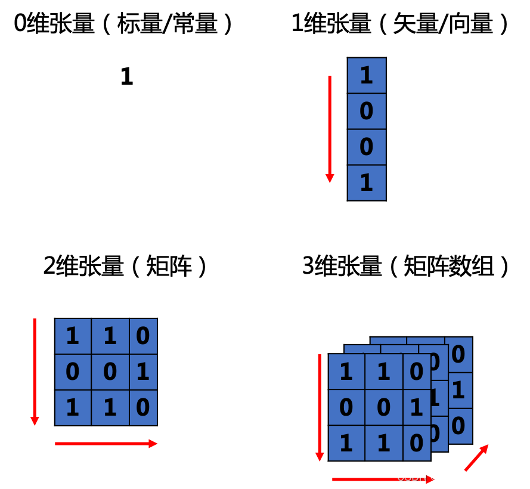

```
import torch
# 生成2维张量
a = torch.tensor([[1,1,1],[0,0,1],[1,1,0]])
# 输出尺寸
print(a.shape) #torch.Size([3, 3])，表示一个二维张量，第一个维度有3个数据，第二个维度也有3个数据
```

#### 卷积计算

卷积是通过**一定大小的卷积核**作用于图像的局部区域，将局部图像区域的像素值与[卷积核](https://so.csdn.net/so/search?q=卷积核&spm=1001.2101.3001.7020)中的数据做**内积**运算。
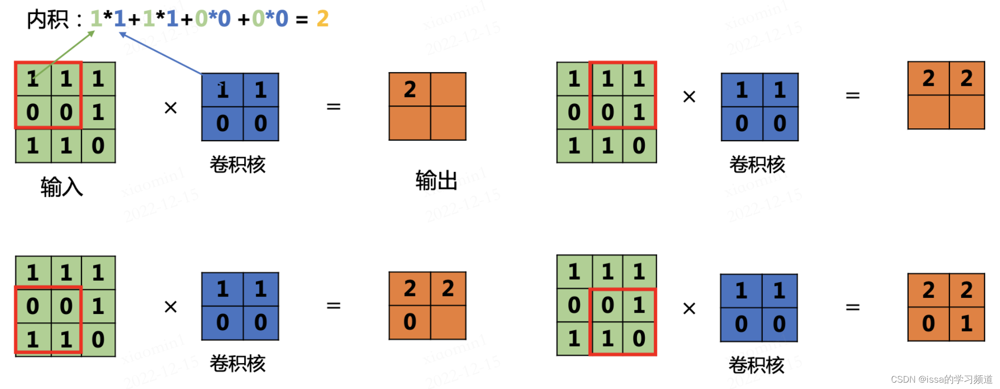

```python
# 卷积运算
import torch.nn.functional as F
def _conv2d(data,kernel,stride = 1,padding = 0):
    # 对数据进行尺寸变换
    data = torch.reshape(data,[1,1,data.shape[0],data.shape[1]])
    kernel = torch.reshape(kernel,[1,1,kernel.shape[0],kernel.shape[1]])
    # 卷积操作
    output = F.conv2d(data,kernel,stride = stride,padding = padding)
    return output
    
# 构建输入矩阵（tensor类型）
data = torch.tensor([[1,1,1],
                      [0,0,1],
                      [1,1,0]])
# 构建卷积核（tensor类型）
kernel = torch.tensor([[1,1],
                       [0,0]])
output = _conv2d(data,kernel)
```

1、首先需要对输入数据和卷积核尺寸变换，使用torch.reshape()进行维度转换
参数input(输入)的维度需包括（样本个数，输入图像的通道数，图像的高，图像的宽），目前我们只考虑单通道图像，也没有涉及多样本的情况，所以前2个维度均设置为1，只考虑图像的高和宽参数 weight(卷积核)的维度需包括（输出图像的通道数，输入图像的通道数/groups，卷积核的高，卷积核的宽），groups默认为1，在这里也只考虑卷积核的高和宽。最后，使用conv2d()进行卷积操作。

#### 步长与填充

**步长（stride）**：是指图像窗口每次移动的“间距”。

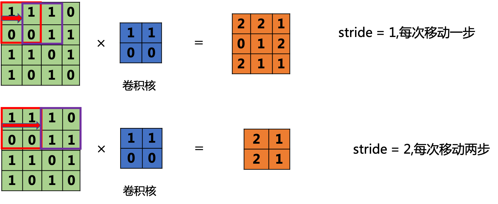同样大小的图像与卷积核，当stride发生变化时，输出图像的大小也会发生变化。

```
data = torch.tensor([[1,1,1,0],
                      [0,0,1,1],
                      [1,1,0,1],
                      [1,0,1,0]])

kernel = torch.tensor([[1,1],
                       [0,0]])
# 不同步长的输出结果
output1 = _conv2d(data,kernel,stride = 1)
output2 = _conv2d(data,kernel,stride = 2)
print(output1.shape)  # torch.Size([1, 1, 3, 3])
print(output2.shape)  #   torch.Size([1, 1, 2, 2])

```

**填充（padding）**：延伸矩阵的“边界”

下图为stride = 1，padding = “valid”（no padding,无填充）的卷积效果；
4*4的图像与3*3的卷积核进行卷积操作时，图像边缘的点只会被卷积核操作一次，但是图像中间的点会被“照顾”到很多遍，那么就会在一定程度上降低边缘信息。

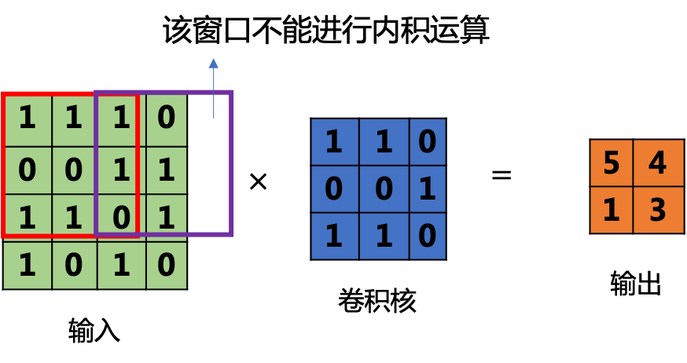

下图为stride = 1, padding=“same”，即对图像边缘填充像素点（一般使用0进行填充），填充之后可以保证在stride = 1的情况下，输出图像大小和输入图像大小是一致的。
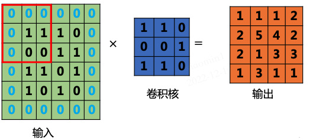

```
data = torch.tensor([[1,1,1,0],
                      [0,0,1,1],
                      [1,1,0,1],
                      [1,0,1,0]])

kernel = torch.tensor([[1,1,0],
                       [0,0,1],
                       [1,1,0]])
output1 = _conv2d(data,kernel,stride = 1,padding = 0) # padding = 0,即padding = “valid”
output2 = _conv2d(data,kernel,stride = 1,padding = 1) # padding = 1,即padding = “same”
print(output1)
print(output2)

```

经过卷积后输出矩阵/图像的大小计算公式为：
$$
N=\frac{W-F+2P}{S}+1
\\
$$
W：输入矩阵的大小
F：卷积核的大小
P：填充的大小
S：步长
N：输出矩阵的大小
如输入图像的大小是4x4，卷积核大小为3x3 ,填充为1，步长为1，输出图像的大小为（4-3+2*1）/1+1 = 4。
这里需要注意的是，如果图像的宽和高不一样，就需要单独计算卷积后的宽和高。

### 池化

 在卷积网络中， 通常会在卷积层之间增加池化（Pooling） 层， 以降低特征图的参数量， 提升计算速度， 增加感受野， 是一种降采样操作。 在物体检测中， 常用的池化有最大值池化（Max Pooling） 与平均值池化（Average Pooling） 。 池化层有两个主要的输入参数， 即核尺寸kernel_size与步长stride。

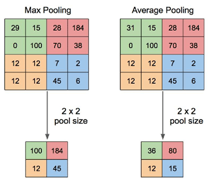

```python
# PyTorch对于池化层的实现
import torch
from torch import nn

max_pooling = nn.MaxPool2d(2, stride=2)
aver_pooling = nn.AvgPool2d(2, stride=2)

input = torch.randn(1, 1, 4, 4)
print(input)
>> tensor([[[[ 1.2237, -0.8173, -0.2594,  0.1698],
          [-0.1023,  0.6973, -0.6429,  0.8561],
          [-0.3660,  0.1269,  0.2488,  0.0576],
          [ 0.0859,  0.1622, -0.0725, -0.0237]]]])

# 池化主要需要两个参数， 第一个参数代表池化区域大小， 第二个参数表示步长
out_max = max_pooling(input)
print(out_max)
>> tensor([[[[1.2237, 0.8561],
          [0.1622, 0.2488]]]])

# 调用最大值池化与平均值池化， 可以看到size从[1, 1, 4, 4]变为了[1, 1, 2, 2]
out_aver = aver_pooling(input)
print(out_aver)
>> tensor([[[[0.2503, 0.0309],
          [0.0023, 0.0525]]]])
```

### Dropout层

当参数过多而训练样本又比较少时， 模型容易产生过拟合现象。 过拟合是很多深度学习乃至机器学算法的通病， 具体表现为在训练集上预测准确率高， 而在测试集上准确率大幅下降。 2012年， Hinton等人提出了Dropout算法， 可以比较有效地缓解过拟合现象的发生， 起到一定正则化的效果。

Dropout的基本思想： 在训练时， 每个神经元以概率p保留， 即以1-p的概率停止工作， 每次前向传播保留下来的神经元都不同， 这样可以使得模型不太依赖于某些局部特征， 泛化性能更强。 在测试时， 为了保证相同的输出期望值， 每个参数还要乘以p。 当然还有另外一种计算方式称为Inverted Dropout， 即在训练时将保留下的神经元乘以1/p， 这样测试时就不需要再改变权重。

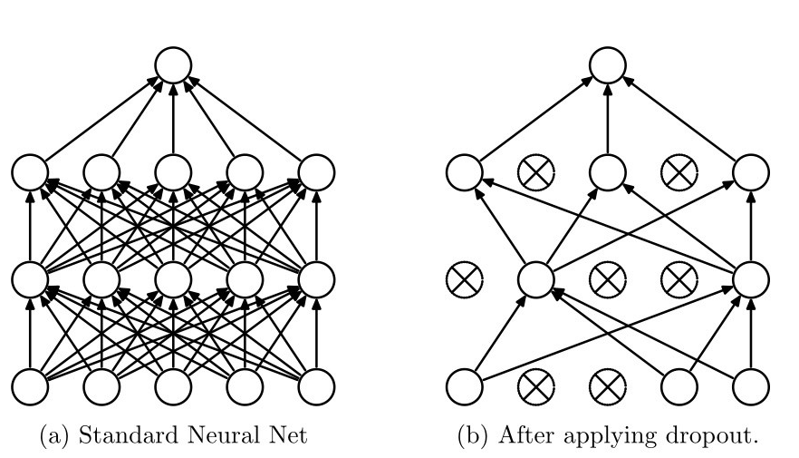

至于Dropout为什么可以防止过拟合， 可以从以下3个方面解释。

- 多模型的平均： 不同的固定神经网络会有不同的过拟合， 多个取平均则有可能让一些相反的拟合抵消掉， 而Dropout每次都是不同的神经元失活， 可以看做是多个模型的平均， 类似于多数投票取胜的策略。

- 减少神经元间的依赖： 由于两个神经元不一定同时有效， 因此减少了特征之间的依赖， 迫使网络学习有更为鲁棒的特征， 因为神经网络不应该对特定的特征敏感， 而应该从众多特征中学习更为共同的规律，这也起到了正则化的效果。

```
import torch
from torch import nn

# PyTorch将元素置0来实现Dropout层， 第一个参数为置0概率， 第二个为是否原地操作
dropout = nn.Dropout(0.5, inplace=False)
input = torch.randn(2, 64, 7, 7)
output = dropout(input)

print(output.shape)
```

### BN层

为了追求更高的性能， 卷积网络被设计得越来越深， 然而网络却变得难以训练收敛与调参。 原因在于， 浅层参数的微弱变化经过多层线性变换与激活函数后会被放大， 改变了每一层的输入分布， 造成深层的网络需要不断调整以适应这些分布变化， 最终导致模型难以训练收敛。

由于网络中参数变化导致的内部节点数据分布发生变化的现象被称做ICS（Internal Covariate Shift） 。 ICS现象容易使训练过程陷入饱和区， 减慢网络的收敛。 前面提到的ReLU从激活函数的角度出发， 在一定程度上解决了梯度饱和的现象。

```python
import torch
from torch import nn
# 使用BN层需要传入一个参数为num_features， 即特征的通道数
bn = nn.BatchNorm2d(64)
print(bn)
>> BatchNorm2d(64, eps=1e-05, momentum=0.1, affine=True, track_running_stats=True)

# eps为公式中的є， momentum为均值方差的动量， affine为添加可学习参数
input = torch.randn(4, 64, 224, 224)
output = bn(input)
# BN层不改变输入、 输出的特征大小
print(output.shape)
>>  torch.Size([4, 64, 224, 224])
```

### 全连接层

全连接层（Fully Connected Layers） 一般连接到卷积网络输出的特征图后边， 特点是每一个节点都与上下层的所有节点相连， 输入与输出都被延展成一维向量， 因此从参数量来看全连接层的参数量是最多的。

```
import torch
from torch import nn
# 第一维表示一共有4个样本
input = torch.randn(4, 1024)
linear = nn.Linear(1024, 4096)
output = linear(input)

print(input.shape)
>> torch.Size([4, 1024])
print(output.shape)
>> torch.Size([4, 4096])
```

### 总结

假设我们有一个输入图像，大小为28x28x3（高度x宽度x通道数），并且要构建一个具有两个卷积层、两个全连接层和一个输出层的神经网络。网络的结构如下：

输入层（28x28x3） -> 卷积层1（32个过滤器，大小为5x5，步长为2，填充为2） -> ReLU激活函数 -> 最大池化层（大小为2x2，步长为2） -> 卷积层2（64个过滤器，大小为3x3，步长为2，填充为1） -> ReLU激活函数 -> 最大池化层（大小为2x2，步长为2） -> Flatten层 -> 全连接层1（128个神经元） -> ReLU激活函数 -> Dropout层（保留率为0.5） -> Batch Normalization层 -> 全连接层2（10个神经元） -> Softmax输出层（10个类别）。

卷积计算方式如下：

- 输入层尺寸：10x28x28x3
- 卷积操作：使用32个5x5的过滤器，步长为1，填充为0
- 计算后尺寸：10x(28-5+1)/2x(28-5+1)/2x32 = 10x12x12x32

最大池化层计算方式如下：

- 池化大小：2x2
- 步长：2，填充：0
- 计算后的尺寸：10x(12/2)x(12/2)x32 = 10x12x12x32

第二层卷积层：

- 参数：32x3x3x64
- 步长：1，填充：0
- 计算后的尺寸：10x(6-3+1)/2x(6-3+1)/2x64 = 10x2x2x64

展平操作：

- 输入尺寸：10x1x1x64
- 输出尺寸：10x(1x1x64) = 10x64

| 输入层      | 参数                | 步长 | 输出层      |
| :---------- | :------------------ | :--- | :---------- |
| 10x28x28x3  | 卷积(3x5x5x32)      | 2    | 10x12x12x32 |
| 10x12x12x32 | ReLU激活函数        | -    | 10x12x12x32 |
| 10x12x12x32 | 最大池化(2x2)       | 2    | 10x6x6x32   |
| 10x6x6x32   | 卷积(32x3x3x64)     | 2    | 10x2x2x64   |
| 10x2x2x64   | ReLU激活函数        | -    | 10x2x2x64   |
| 10x2x2x64   | 最大池化(2x2)       | 2    | 10x1x1x64   |
| 10x1x1x64   | 展平操作            | -    | 10x64       |
| 10x64       | 全连接(64x128)      | -    | 10x128      |
| 10x128      | ReLU激活函数        | -    | 10x128      |
| 10x128      | Dropout(0.5)        | -    | 10x128      |
| 10x128      | Batch Normalization | -    | 10x128      |
| 10x128      | 全连接(128x10)      | -    | 10x10       |
| 10x10       | Softmax函数         | -    | 10x10       |

```python
import numpy as np

def relu(x):
    return np.maximum(0, x)

def softmax(x):
    exp_scores = np.exp(x - np.max(x, axis=1, keepdims=True))
    return exp_scores / np.sum(exp_scores, axis=1, keepdims=True)

def conv_forward(x, w, b, stride=1, padding=0):
    n, h, w, c = x.shape
    f_height, f_width, _, n_filters = w.shape
    out_h = int((h - f_height + 2 * padding) / stride) + 1
    out_w = int((w - f_width + 2 * padding) / stride) + 1

    if padding > 0:
        x = np.pad(x, [(0, 0), (padding, padding), (padding, padding), (0, 0)], mode='constant')

    out = np.zeros((n, out_h, out_w, n_filters))

    for i in range(out_h):
        for j in range(out_w):
            x_patch = x[:, i * stride:i * stride + f_height, j * stride:j * stride + f_width, :]
            out[:, i, j, :] = np.sum(x_patch * w, axis=(1, 2, 3)) + b

    return out

def max_pool_forward(x, size=2, stride=2):
    n, h, w, c = x.shape
    out_h = int((h - size) / stride) + 1
    out_w = int((w - size) / stride) + 1

    out = np.zeros((n, out_h, out_w, c))

    for i in range(out_h):
        for j in range(out_w):
            x_patch = x[:, i * stride:i * stride + size, j * stride:j * stride + size, :]
            out[:, i, j, :] = np.max(x_patch, axis=(1, 2))

    return out

def flatten(x):
    return np.reshape(x, (x.shape[0], -1))

def fully_connected_forward(x, w, b):
    return np.dot(x, w) + b

def dropout_forward(x, keep_prob):
    mask = np.random.rand(*x.shape) < keep_prob
    return x * mask / keep_prob, mask

def batch_norm_forward(x, gamma, beta, epsilon=1e-8):
    mean = np.mean(x, axis=0)
    var = np.var(x, axis=0)
    x_hat = (x - mean) / np.sqrt(var + epsilon)
    out = gamma * x_hat + beta
    return out, x_hat, mean, var

## 开始计算
# 输入数据
x = np.random.randn(10, 28, 28, 3)

# 第一个卷积层
w1 = np.random.randn(5, 5, 3, 32)
b1 = np.zeros((1, 1, 1, 32))
conv1 = conv_forward(x, w1, b1, stride=2, padding=2)
activation1 = relu(conv1)
pool1 = max_pool_forward(activation1, size=2, stride=2)
# conv1的计算结果是卷积操作后的输出，维度为(10, 12, 12, 32)
# activation1是经过ReLU激活函数后的输出，维度与conv1相同
# pool1是经过最大池化操作后的输出，维度为(10, 6, 6, 32)，尺寸减半

# 第二个卷积层
w2 = np.random.randn(3, 3, 32, 64)
b2 = np.zeros((1, 1, 1, 64))
conv2 = conv_forward(pool1, w2, b2, stride=2, padding=1)
activation2 = relu(conv2)
pool2 = max_pool_forward(activation2, size=2, stride=2)
# conv2的计算结果是卷积操作后的输出，维度为(10, 2, 2, 64)
# activation2是经过ReLU激活函数后的输出，维度与conv2相同
# pool2是经过最大池化操作后的输出，维度为(10, 1, 1, 64)，尺寸减半

# Flatten层
flatten_out = flatten(pool2)
# flatten_out是展平后的输出，维度为(10, 64)。

# 第一个全连接层
w3 = np.random.randn(flatten_out.shape[1], 128)
b3 = np.zeros((1, 128))
fc1 = fully_connected_forward(flatten_out, w3, b3)
activation3 = relu(fc1)
# fc1是经过全连接操作后的输出，维度为(10, 128)
# activation3是经过ReLU激活函数后的输出，维度与fc1相同

# Dropout层
dropout_out, dropout_mask = dropout_forward(activation3, keep_prob=0.5)
# dropout_out是经过Dropout操作后的输出，维度与activation3相同
# dropout_mask是Dropout层的掩码，用于反向传播时的梯度传递

# Batch Normalization层
gamma = np.ones((1, dropout_out.shape[1]))
beta = np.zeros((1, dropout_out.shape[1]))
bn_out, x_hat, mean, var = batch_norm_forward(dropout_out, gamma, beta)
# bn_out是经过Batch Normalization操作后的输出，维度与dropout_out相同
# x_hat是规范化后的输出
# mean是批量均值
# var是批量方差

# 第二个全连接层
w4 = np.random.randn(bn_out.shape[1], 10)
b4 = np.zeros((1, 10))
fc2 = fully_connected_forward(bn_out, w4, b4)
# fc2是经过全连接操作后的输出，维度为(10, 10)

# Softmax输出层
output = softmax(fc2)
# output是经过Softmax函数后的输出，维度与fc2相同，表示各类别的概率分布
```

## 理解卷积的深度

- 每个卷积核的深度==输入矩阵的深度。

- 输出矩阵的深度==卷积核的个数。
  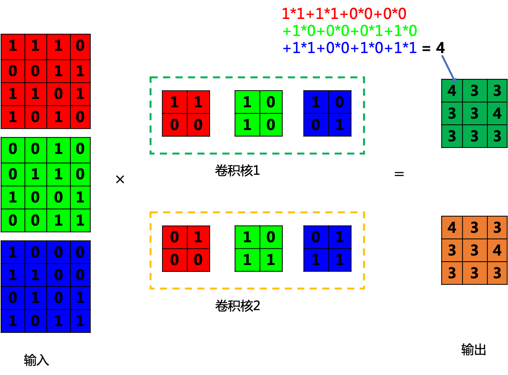

  

如图中输入矩阵数组的深度为3，每个矩阵都是4*4的大小，要进行卷积运算，卷积核的深度也需要是3（如图中的卷积核1和卷积核2），将输入矩阵数组与卷积核1做**内积**运算，获得一个输出矩阵；然后将输入矩阵继续与卷积核2做**内积**运算，获得另一个输出矩阵，因此输出矩阵数组的深度为2。

```python
# 生成一个维度为[3, 4, 4]的张量
data = torch.tensor([[[1,1,1,0],
                      [0,0,1,1],
                      [1,1,0,1],
                      [1,0,1,0]],
                     
                    [[0,0,1,0],
                      [0,1,1,0],
                      [1,0,0,1],
                      [0,0,1,1]],
                     
                    [[1,0,0,0],
                      [1,1,0,0],
                      [0,1,0,1],
                      [1,0,1,1]]]
                   )
# 生成一个维度[2，3, 2, 2]的张量
kernel = torch.tensor([[[[1,1],
                       [0,0]],
                       
                     [[1,0],
                       [1,0]],
                       
                     [[1,0],
                       [0,1]]],
                      
                      
                     [[[0,1],
                       [0,0]],
                       
                     [[1,0],
                       [1,1]],
                       
                     [[0,1],
                       [1,1]]]])
print(data.shape)
print(kernel.shape)
data = torch.reshape(data,[1,3,data.shape[1],data.shape[2]])

# 卷积操作
output = F.conv2d(data,kernel,stride = 1,padding = 0)
print(output)
```

## 扩展

### 卷积的作用

卷积通过卷积核在图像矩阵上滑动窗口，可以实现局部区域的感知，**提取图像的特征**。

```
import cv2
import matplotlib.pyplot as plt
# 读取图像并将其转换为灰度图像
img = cv2.imread("img/1.png")
img_gray = cv2.cvtColor(img,cv2.COLOR_BGR2GRAY)
plt.imshow(img_gray, cmap='gray')
plt.show()
```

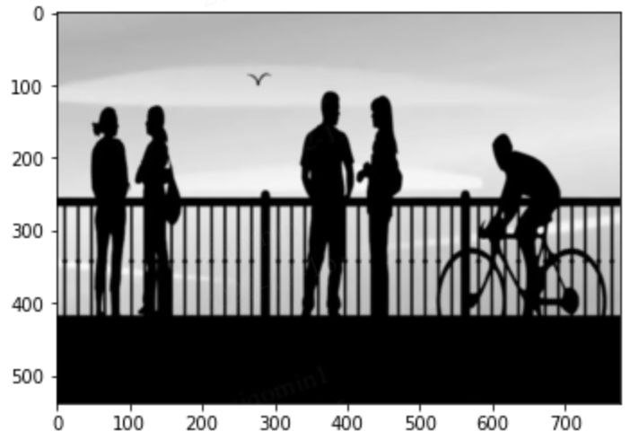

在下方案例中，可以使用不同的卷积核来提取图像的不同特征；
可以发现，(1)卷积核中参数是可变的;(2)卷积核的参数影响了特征提取；那么我们在训练一个卷积神经网络时，就是要去训练卷积核中参数。

```
# 将图像转换为tensor类型
inputimg = torch.FloatTensor(img_gray)
print(inputimg.shape)
# 指定卷积核，该卷积核可以获取垂直边界特征
kernel =torch.Tensor([[1,0,-1],
                      [1,0,-1],
                      [1,0,-1]])

#对数据进行尺寸变换
inputimg = torch.reshape(inputimg,[1,1,inputimg.shape[0],inputimg.shape[1]]) 
kernel = torch.reshape(kernel,[1,1,3,3])
# 卷积运算
output = F.conv2d(inputimg,kernel)

plt.imshow(output[0].permute(1, 2, 0), cmap='gray')
plt.show()
```

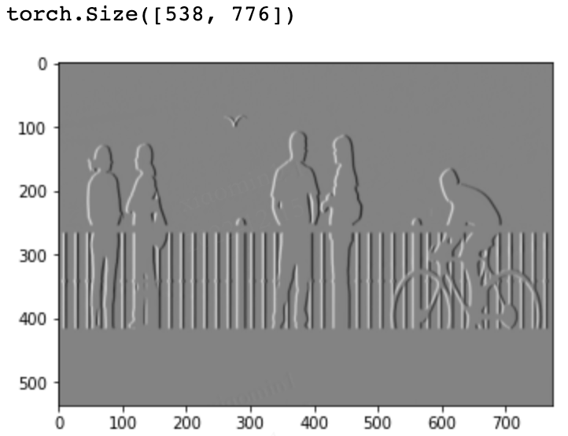

```
inputimg = torch.FloatTensor(img_gray)
# 指定卷积核，该卷积核可以获取水平边界特征
kernel =torch.Tensor([[1,1,1],
                      [0,0,0],
                      [-1,-1,-1]])    
#对数据进行尺寸变换
inputimg = torch.reshape(inputimg,[1,1,img.shape[0],img.shape[1]]) 
kernel = torch.reshape(kernel,[1,1,3,3])
# 卷积运算
output = F.conv2d(inputimg,kernel)
plt.imshow(output[0].permute(1, 2, 0), cmap='gray')
plt.show()
```

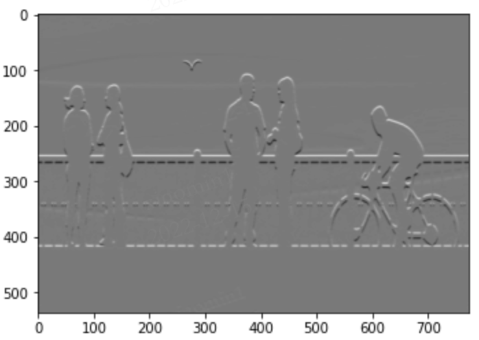

