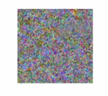

# 基本概念
# 深度学习基础

## 一个简单的神经网络的搭建

前向传播、反向传播、梯度下降、参数更新

## 机器学习常用工具（框架）

### numpy
### pandas
### pytorch

## CNN大串烧

### yolov系列

特点：检测速度快

就是一个大的卷积神经网络

输出是一个7x7x30，也就是将一个图划分成7x7，每个格都有一个预测结果，对应一个30（5+5+20）的向量，对应这个格子检测的特征。

5+5+20：每一个小区域的预测结果。每个小格子都预测两个锚框，每个锚框由中心点坐标+宽高，还有一个参数表示到底是否框住物体的置信度，20代表训练数据中20个类别的预测概率。

损失函数：五个部分

1、纠正中心点xy

2、纠正宽高wh

3、纠正置信度C，有物体还是没物体

4、背景的时候，希望置信度为0，有物体希望是1

5、对20个分类的概率纠正

### RCNN

解决目标检测问题，希望有几个物体就画几个框。two-stage

1、根据某种策略，划分出两千多个小图，弄成大小一样的图片

2、AlexNet--->4096--->SVM

### ResNet

通常的理解是模型越复杂，深度越大效果应该越好，但是实际上确不是。目的是解决模型在变深的过程中，性能不会变差。

加入一个恒等映射F(x)+x。

### VGG

1、证明了深的模型在图像处理上有更好

2、采用kernal=3x3，padding=1，stride=1,使得卷积层不改变图像大小。也是个卷积神经网络。在AlexNet的基础上，按块叠加。

3、池化窗口大小为2x2，stride=2，让图片减半

4、提出块概念（VGG块），可以定制深度。

## GAN

现在有扩散网络模型，但是生成对抗网络去内容进行生成，主要用于生成图片。

G：生成器，全连接神经网络。最开始的时候是一个随机的输出，

D：辨别器。

先用G生成很多没有规律的假图片（类别0），然后真实世界的图片（类别1），拿这两组图片来训练D。

然后再训练G，让D没法分辨真假，训练结果为G1。拿G1生成的图和真实的图片接着训练D,生成D1。然后就不断训练G1,D1,G2,D2....。

目标函数，目的是让它为0，即D(x)=1,D(G(z))=0

## 注意力机制

设计的是模型的结构，结果是从学习得到的。Transformer模型是纯注意力的模型。

X：原始输入

V：value输入，把原本的内容(图片或文本)，文本通过embedding进行编码，变成词向量，经过全连接层转为维V。

K：key关注程度

Q：querry条件

V+Q--->最终结果B

自注意力：QKV都是从X中得出的，通过同样的输入得出来的。有一个编码技术，比如one-hot（汉字-->向量），不包括语义，经过全连接做了一个转换变成了V。

有三个全连接层，一个转换之后获得V1，一个获得K1，一个获得Q1

当看到一幅画的时候，什么也不说，也会知道里面有哪些元素，这些就是X，关注的量就是K，现在要解决一个问题，带着某个条件再去关注这副图，这里的条件就是Q的作用了，V就是这副画里面每一个元素的数字表示。拿到Q和K得到一个注意力分数，拿这个注意力分数再作用于原来的V上，就可以得到一个结果。

循环神经网络每次只处理一个元素，有很多个时刻，每个时刻只初一个元素。

注意力机制一次性处理全部元素。

多头注意力：

每一个输入有多组QKV。

## Transformer

位置编码：注意力跟位置是没有关系的，对于一段话，对于循环神经网络而言，这段话中的字的先后顺序是有非常的的影响的。但是对于注意力而言，这段话的每个字是同时输入模型的，所以它们之间的位置关系是不重要的。但是有些情况下我们认为这个位置信息还是要有的，所以加了位置编码。把位置信息也放入X1的表示里。

层归一化：如果每一层都进行加或者乘，有可能数字变得很大或者偏离，所以每一个阶段都进行归一化。

每个blocke重复Nx=6次。

左边叫做编码器，右边叫做编码。

掩码注意力：后面都设为0 

## SAM

模型的设计、如何训练、

任务+模型+数据集

任务：prompt+images，prompt（在图像中点一个点，去画一个框，化成一个区域，文本提示）

图像经过一个编码处理，编码器所用的模型是基于元学习训练的一个vit。

对prompt进行编码（点、框、区域、文本）有不同的的编码方法。

如果画了个mask（区域），需要经过一个卷积，然后往后传递。

画box和points，经过一个位置编码，往后传递。

文本的画，经过一个clip，往后传递。

特点：（1）分割模型有prompt （2）具有基础能力的模型 （3）具有不同粒度的输出 （4）大数据集SA-1B

