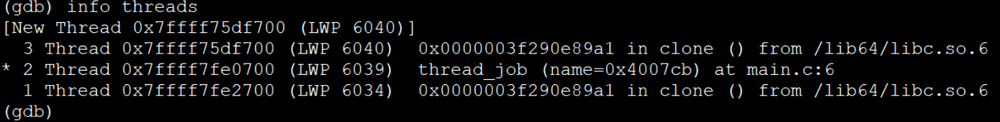

# GDB调试技巧

## 工具类型

- gdb：基础工具
- gdbtui：使用`gdbtui -q 程序名`，可以显示调试的代码，包括command窗口和source窗口。
- cgdb：既能够在调试的时候动态显示当前调试处代码，有不会花瓶。

## gdb 基础命令

```bash
gdb --args ./segformer_sail.pcie --input=../../datasets/test_car_person_1080P.mp4
1）gdb 直接进入调试模式，再输入file + xxx 跟踪； 或直接 gdb xxx
2）run (r) 运行
3）break（b） 断点，可以break mian 直接在函数处增加断点，也可以 break:10 在第几行增加断点
4）next (n) 继续执行下一步
5）step(s) 单步调试
6）continue （c） 继续执行
7）info（i）显示信息， i b 显示断点信息
8）delete （d）删除断点，删除单个断点添加断点号，删除全部断点直接d指令
9）print（p）显示变量的值或者数组的值，数组支持索引
10）quit（q）退出gdb
```

| 命令           | 缩写    | 说明                                       |
| -------------- | ------- | ------------------------------------------ |
| run            | r       | 启动程序                                   |
| start          | start   | 启动程序，并停在main                       |
| break          | b       | 添加断点                                   |
| tbreak         | tb      | 添加临时断点，触发一次                     |
| enable/disable | /       | 启用/禁用某个断点                          |
| delete         | d       | 删除断点                                   |
| continue       | c       | 继续运行                                   |
| next           | n       | 运行到下一行                               |
| step           | s       | 进入函数内部                               |
| finish         | fi      | 结束当前调用函数，返回到上层函数调用处     |
| return         | return  | 结束调用并返回指定值，返回上层函数调用处   |
| until          | u       | 运行到指定行                               |
| jump           | j       | 跳到指定行                                 |
| info           | i       | 查看断点（i b）、线程信息                  |
| list           | l       | 显示源码                                   |
| print          | p       | 打印变量或寄存器值                         |
| ptype          | ptype   | 查看变量类型                               |
| watch          | watch   | 监视某个变量或内存地址的值是否发生变化     |
| display        | display | 监视的变量或内存地址，在程序中断后自动输出 |
| set args       | /       | 设置程序启动参数                           |
| show args      | /       | 查看设置的启动参数                         |
| backtrace      | bt      | 查看当前线程调用的堆栈                     |
| frame          | f       | 切换到指定堆栈                             |
| thread         | thread  | 切换到指定线程                             |
| disassemble    | dis     | 查看汇编代码                               |
| dir            | dir     | 重定向源文件位置                           |

## 一些命令的说明

### 启动gdb的时候

在gdb后面加上--args，，就可以直接指定参数，否则需要在进入gdb后，使用set args指定参数。

### break

break后面可以直接接行号，它会在运行的文件中添加断点，如果需要指定文件名加行号。要能够进行调试需要保证两点，一是在CMakelist.txt中加上了set(CMAKE_BUILD_TYPE "Debug")命令，另外需要保证程序初始化了需要指定程序文件的头文件，否则就打不到断点，所以可能需要运行到特定的位置才能打断点。

### print

```
(gdb) p /x num
(gdb) print array[0]@2
$1 = {1, 2}
```

| /x   | 以十六进制的形式打印出整数。         |
| ---- | ------------------------------------ |
| /d   | 以有符号、十进制的形式打印出整数。   |
| /u   | 以无符号、十进制的形式打印出整数。   |
| /o   | 以八进制的形式打印出整数。           |
| /t   | 以二进制的形式打印出整数。           |
| /f   | 以浮点数的形式打印变量或表达式的值。 |
| /c   | 以字符形式打印变量或表达式的值。     |

### backtrace 和 frame

程序中每个被调用的函数在执行时，都会生成一些必要的信息，包括：

- 函数调用发生在程序中的具体位置；
- 调用函数时的参数；
- 函数体内部各局部变量的值等等。

这些信息会集中存储在一块称为“栈帧”的内存空间中。也就是说，程序执行时调用了多少个函数，就会相应产生多少个栈帧，其中每个栈帧自函数调用时生成，函数调用结束后自动销毁。

backtrace 命令用于打印当前调试环境中所有栈帧的信息，常用的语法格式如下：

```
(gdb) backtrace [-full] [n]
```

其中，用 [ ] 括起来的参数为可选项，它们的含义分别为：

- n：一个整数值，当为正整数时，表示打印最里层的 n 个栈帧的信息；n 为负整数时，那么表示打印最外层 n 个栈帧的信息；
- -full：打印栈帧信息的同时，打印出局部变量的值。

注意，当调试多线程程序时，该命令仅用于打印当前线程中所有栈帧的信息。如果想要打印所有线程的栈帧信息，应执行`thread apply all backtrace`命令。

### info

```text
(gdb) info　　thread　　  //列出线程
(gdb) info　　register　 //列出寄存器
(gdb) info all-registers //查看寄存器的情况（除了浮点寄存器）
(gdb) info　　frame　   //列出栈帧
(gdb) info　　files　　//列出当前文件
(gdb) info　　share　 //列出当前共享库
(gdb) info locals //当前函数中所有局部变量及其值
(gdb) info args //查看当前函数各个参数的值
(gdb) 
```

借助如下命令，我们可以查看当前栈帧中存储的信息：

```
(gdb) info frame
```

该命令会依次打印出当前栈帧的如下信息：

- 当前栈帧的编号，以及栈帧的地址；
- 当前栈帧对应函数的存储地址，以及该函数被调用时的代码存储的地址
- 当前函数的调用者，对应的栈帧的地址；
- 编写此栈帧所用的编程语言；
- 函数参数的存储地址以及值；
- 函数中局部变量的存储地址；
- 栈帧中存储的寄存器变量，例如指令寄存器（64位环境中用 rip 表示，32为环境中用 eip 表示）、堆栈基指针寄存器（64位环境用 rbp 表示，32位环境用 ebp 表示）等。

使用info line命令来查看源代码在内存中的地址。info line后面可以跟“行号”，“函
数名”，“文件名:行号”，“文件名:函数名”，这个命令会打印出所指定的源码在运行时的内
存地址，如：

```bash
(gdb) info line tst.c:func 
Line 5 of "tst.c" starts at address 0x8048456 and ends at 0x804845d .
```

### watch

watch 	为表达式(变量)expr设置一个观察点。一旦表达式值有变化时，马上停住程序。

```text
watch i != 10 
```

还有两个特殊的命令：

```
awatch <表达式>
```

<表达式>被访问，改变时暂停运行,<表达式>意思是常量或变量

```
rwatch <表达式>
```

<表达式>被访问时暂停运行

### x命令

x命令可以显示内存的内容
举例

```
(gdb) x $r12
   0x5555555545f0 <_start>:     xor    %ebp,%ebp
(gdb) x $r8
   0x7ffff7fe14c0:      rclb   $0xf7,(%rsi,%rdi,8)
(gdb)
```

x/i 可以显示汇编指令。一般用x命令时，格式为x/NFU ADDR。此处ADDR为希望显示的地址，N为重复次数。

下面显示从rsp开始的10条指令。

```
(gdb) x/10i $rsp
   0x7fffffffe2f0:      (bad)  
   0x7fffffffe2f1:      rex.W push %rbp
   0x7fffffffe2f3:      push   %rbp
   0x7fffffffe2f4:      push   %rbp
   0x7fffffffe2f5:      push   %rbp
   0x7fffffffe2f6:      add    %al,(%rax)
   0x7fffffffe2f8:      lock rex.RB push %r13
   0x7fffffffe2fb:      push   %rbp
   0x7fffffffe2fc:      or     (%rax),%al
   0x7fffffffe2fe:      add    %al,(%rax)
```


### thread

在ctrl+c程序中断后，可以使用info threads查看进程中当前的所有线程信息和这些线程分别中断在何处。



这里显示一共有3个线程，当前停在第二个线程上的thread_job函数这里，其余两个线程分别阻塞在clone()函数处。第一栏的序号并不是线程id的实际编号，实际的线程id是LWP（轻量级进程）。另外，标了星号只是表示停在当前线程，并不说明它是主线程。可以使用bt查看当前线程的堆栈，使用thread xx切换到指定线程上。

### set scheduler-locking off|on|step

off 不锁定任何线程，也就是所有线程都执行，这是默认值。
on 只有当前被调试程序会执行。
step 在单步的时候，除了next过一个函数的情况以外，只有当前线程会执行。

### disassemble

当程序停止在断点处时，使用 disassemble 命令来查看汇编代码：
查看当前函数的汇编代码：disassemble
查看某个地址的汇编代码：disassemble memory_address
查看当前函数某个范围内的汇编代码：disassemble start_address,end_address
查看当前函数的某个汇编指令的源代码位置：list *instruction_address

`stepi`命令逐行执行汇编指令并停止，而`nexti`命令跳过当前函数内部的指令一次执行完毕。

```
gdb) disassemble 
Dump of assembler code for function sum:
   0x0000555555554722 <+0>:     push   %rbp
   0x0000555555554723 <+1>:     mov    %rsp,%rbp
   0x0000555555554726 <+4>:     sub    $0x20,%rsp
   0x000055555555472a <+8>:     mov    %edi,-0x14(%rbp)
   0x000055555555472d <+11>:    mov    %esi,-0x18(%rbp)
   0x0000555555554730 <+14>:    lea    0x1bd(%rip),%rdi        # 0x5555555548f4
   0x0000555555554737 <+21>:    callq  0x5555555545b0 <puts@plt>
=> 0x000055555555473c <+26>:    mov    -0x14(%rbp),%edx
   0x000055555555473f <+29>:    mov    -0x18(%rbp),%eax
   0x0000555555554742 <+32>:    add    %edx,%eax
   0x0000555555554744 <+34>:    mov    %eax,-0x4(%rbp)
   0x0000555555554747 <+37>:    mov    -0x4(%rbp),%eax
   0x000055555555474a <+40>:    leaveq 
   0x000055555555474b <+41>:    retq   
End of assembler dump.
```

